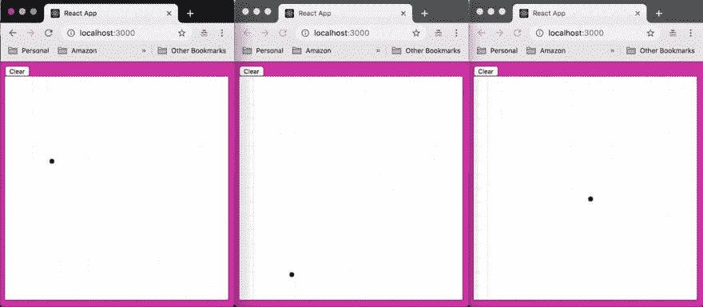
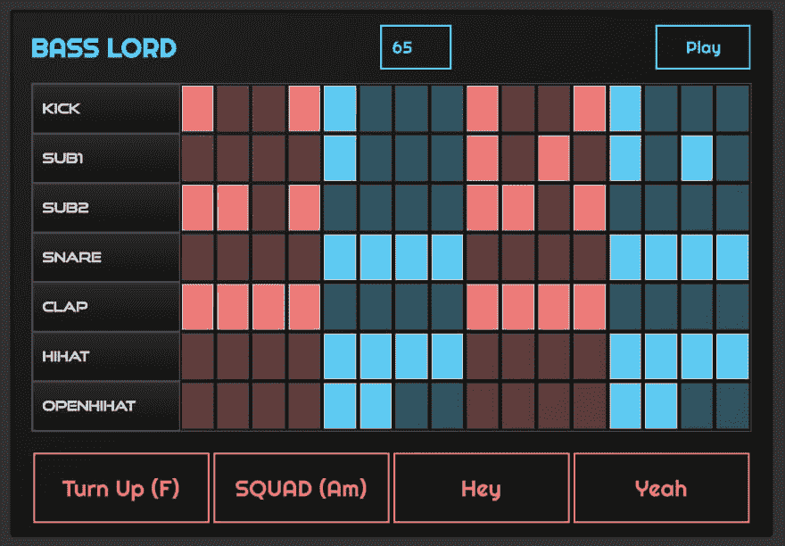
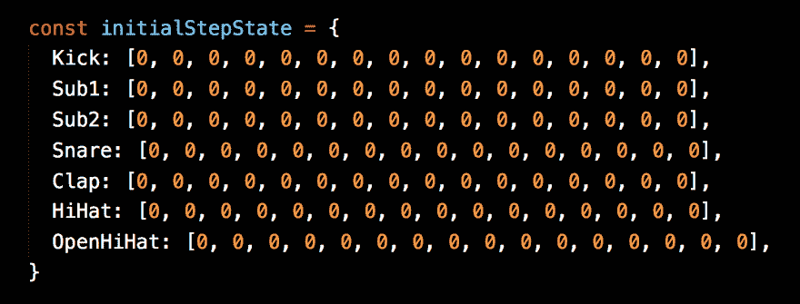

# 我如何构建 hype beats——一个使用 React 和 GraphQL 的实时协作 Beatbox

> 原文：<https://dev.to/dabit3/how-i-built-hypebeats---a-real-time-collaborative-beatbox-with-react-graphql-29i5>

[https://www.youtube.com/embed/nm2kt3h1--c](https://www.youtube.com/embed/nm2kt3h1--c)

> 要观看现场演示，请点击[此处](https://www.hypebeats.dev/#/)。
> 查看回购，点击[此处](https://github.com/dabit3/hype-beats)。

* * *

我最近一直在玩 GraphQL 订阅，给应用程序添加实时功能，使它们具有交互性。上周，我发布了一个使用 [react-canvas-draw](https://embiem.github.io/react-canvas-draw/) 的实时绘图应用:

> <video loop="" controls=""><source src="https://video.twimg.com/tweet_video/D1YQhJvWoAIJ1RC.mp4" type="video/mp4"></video>Nader Dabit[@ Dabit 3](https://dev.to/dabit3)我在 AWS AppSync 上用 GraphQL 订阅搭建了一个协同实时绘图 app！
> 
> 代码在[github.com/dabit3/appsync…](https://t.co/nmiR03Qaxm)
> 
> 我还写了一篇关于我如何在[dev.to/dabit3/real-ti…](https://t.co/DFYOdcgMxJ)
> 
> [#无服务器](https://twitter.com/hashtag/serverless)[# graph QL](https://twitter.com/hashtag/graphql)[# AWS](https://twitter.com/hashtag/aws)2019 年 3 月 11 日下午 12:54[](https://twitter.com/intent/tweet?in_reply_to=1105089664040554496)[](https://twitter.com/intent/retweet?tweet_id=1105089664040554496)

几周前，我在 React NYC 上看到了一个关于使用 React Hooks 构建 beatbox 的演讲。

[https://www.youtube.com/embed/7FRHuVNVCj4](https://www.youtube.com/embed/7FRHuVNVCj4)

看完之后我还挺炒作的。然后我找到了它的回购协议，克隆了它&开始思考我能做些什么让它变得更有趣。

##  [肯惠勒](https://github.com/kenwheeler) / [钩-鼓-机](https://github.com/kenwheeler/hooks-drum-machine)

### 反应日柏林演示

<article class="markdown-body entry-content p-5" itemprop="text">

# 吊钩-滚筒-机器

用 React 挂钩构建的简单步进序列器

## 如何 skrrt

*   运行`npm start`
*   被做

</article>

[View on GitHub](https://github.com/kenwheeler/hooks-drum-machine)

架子鼓基本上有各种各样的拍子(贝斯、拍子、小军鼓等)..)通过步进序列发生器运行:

[](https://res.cloudinary.com/practicaldev/image/fetch/s--JfxtqtIZ--/c_limit%2Cf_auto%2Cfl_progressive%2Cq_auto%2Cw_880/https://thepracticaldev.s3.amazonaws.com/i/4r1v7qjtmvsrtj2iz88t.png)

使用步进序列器，您可以从左到右依次移动，步进序列中的每个项目。如果该项突出显示，将播放相关的声音。

[](https://res.cloudinary.com/practicaldev/image/fetch/s--XNEPg3_u--/c_limit%2Cf_auto%2Cfl_progressive%2Cq_66%2Cw_880/https://thepracticaldev.s3.amazonaws.com/i/32w5xy90uv0fja6gzl9a.gif)

鼓机为我们提供了节拍的初始状态，音序器中为每个节拍设置了一个数组:

[](https://res.cloudinary.com/practicaldev/image/fetch/s--p0zKV3Wv--/c_limit%2Cf_auto%2Cfl_progressive%2Cq_auto%2Cw_880/https://thepracticaldev.s3.amazonaws.com/i/0wxsqf2i8abpy79es9y9.png)

如果节拍设置为 0，则不播放(不高亮显示)，如果设置为 1(高亮显示)，则播放，如果设置为 2(闪烁)，则播放三次。

> 要了解更多关于鼓机如何在引擎盖下工作的信息，请点击视频[这里](https://www.youtube.com/watch?v=7FRHuVNVCj4)。

## 通过 GraphQL 订阅实现实时协作&

我的想法是合作。为此，我需要添加创建和共享独特鼓机的功能。用户可以对机器进行实时更新/更改&音乐将随着更改在所有机器上更新。

为此，我需要做三件主要的事情:

1.  让鼓机充满活力
2.  添加路由
3.  添加实时功能，最好是 GraphQL 订阅

为了使鼓机动态并添加订阅，我创建了一个基本的 GraphQL 模式来保存我使用 AWS AppSync:
部署的鼓机

```
type  Beatbox  @model  {  id:  ID!  clientId:  ID!  beats:  String!  name:  String!  } 
```

因为鼓机的状态是一个基本的 JSON 对象，我想我们可以很容易地将数据存储在我们的数据库中。

我必须考虑的另一件事是路由。为此，我用 [React 路由器](https://github.com/ReactTraining/react-router) &想出了一个路由方案，看起来像这样:

```
/machine/:id/:name 
```

除了节拍数据，每台架子鼓都有一个唯一的`id` &一个`name`属性供我们用来识别它&查询它。

还有一个`clientId`用于处理订阅数据，为我们提供了一种在客户端过滤掉重复数据的方法。

当用户在路线上着陆时，例如:

```
/machine/d562581d-2a2d-4597-a6bb-2580deaf0254/BassLord 
```

我们解析 url 并检索机器名& id。

我们在 UI 中使用机器名&我们使用 id 来创建或查询机器。

当用户做出更改时，我们触发 API 的更新:

```
// DrumMachine.js
async function updateBeatbox(beats, machineId) {
  const beatbox = {
    id: machineId, clientId, beats: JSON.stringify(beats)
  }
  try {
    await API.graphql(graphqlOperation(UpdateBeatbox, { input: beatbox }))
    console.log('successfully updated beatbox...')
  } catch (err) {
    console.log('error updating beatbox...:', err)
  }
  return () => {}
} 
```

在 [Step.js](https://github.com/dabit3/hype-beats/blob/withroutes/src/Step.js) 中调用`updateBeatBox`方法。

我们还创建了一个订阅来监听 GraphQL API 中的更新:

```
// DrumMachine.js
useEffect(() => {
  const subscriber = API.graphql(graphqlOperation(onUpdateBeatbox)).subscribe({
    next: data => {
      const { value: { data: { onUpdateBeatbox: { clientId: ClientId, beats }}}} = data
      if (ClientId === clientId) return
      setSteps(JSON.parse(beats))
    }
  });
  return () => subscriber.unsubscribe()
}, []); 
```

除此之外，我基本上使用了鼓机的功能！

> 要观看现场演示，请点击[此处](https://www.hypebeats.dev/#/)。
> 查看回购，点击[此处](https://github.com/dabit3/hype-beats)。

## 投稿/后续步骤

接下来我想做的是添加更多的节拍！我还想增加一些声音。如果你想对此有所贡献，请随时[联系我](https://twitter.com/dabit3) &或[提交拉动请求](https://github.com/dabit3/hype-beats/pulls)！
如果您想自己部署这个应用程序，请查看 repo 中的文档以开始运行&。

* * *

> 我的名字是纳德·达比特。我是亚马逊网络服务的一名开发者倡导者，负责像 [AWS AppSync](https://aws.amazon.com/appsync/) 和 [AWS Amplify](https://aws-amplify.github.io/) 这样的项目。我专门从事跨平台&云应用开发。