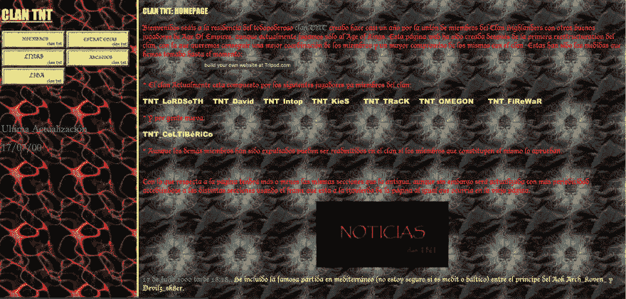

# 上周前 5 名开发者评论

> 原文：<https://dev.to/devteam/top-5-dev-comments-from-the-past-week-1fd8>

这是你可能已经错过的令人敬畏的开发者评论的每周综述。欢迎并鼓励你使用 **[#bestofdev](https://dev.to/t/bestofdev)** 标签来发表帖子和评论。

**[你的办公桌是怎么设置的？](https://dev.to/desi/whats-your-desk-setup-3306)** 的帖子包含了大量深受喜爱的回复，但没有比[@ tvanantwep](https://dev.to/tvanantwerp)的超级酷的设置更受欢迎的了。监控几英里内的房地产...

 [ Tom VanAntwerp ](/tvanantwerp) • [<time datetime="2019-03-15T19:26:48Z" class="date-short-year"> Mar 15 '19 </time>](https://dev.to/tvanantwerp/comment/9e19) 

这是我的桌子！我有一台 27 英寸的 iMac，两边各有两个 27 英寸的显示器，都在一个 48 英寸宽的 Varidesk 上。虽然不尽如人意，但我对屏幕上的所有东西都很满意。

[@失谐](https://dev.to/detunized)提供了一个幽默而有见地的笑话回应 **[如果像程序员](https://dev.to/alexjitbit/what-if-drivers-were-hired-like-programmers-9hh)** :
一样雇佣司机会怎么样

 [ Dmitry Yakimenko ](/detunized) • [<time datetime="2019-03-14T21:35:19Z" class="date-short-year"> Mar 14 '19 </time>](https://dev.to/detunized/comment/9de1) 

老掉牙但很好吃。它可以在网上很多地方找到，我认为原作者不详。

面试官:那么，你是个木匠，是吗？
**木匠:**没错，我就是干这个的。

面试官:你做了多久了？
**木匠:**十年。

面试官:太好了，那很好。现在，我有几个技术性问题要问你，看看你是否适合我们的团队。好吗？
**木匠:**当然，那好。

面试官:首先，我们在一个小区工作，建了很多棕色的房子。你以前建过很多棕色的房子吗？
**木匠:**嗯，我是个木匠，所以我盖房子，人们通常会把房子漆成他们想要的样子。

面试官:是的，我明白，但是你能告诉我你和布朗有多少经验吗？大致如此。
**木匠:**天哪，我真的不知道。一旦建成，我不在乎它们被漆成什么颜色。也许六个月？

**面试官:**六个月？嗯，我们在找一个有更多棕色皮肤经验的人，但是让我再问你一些问题。
**木匠:**嗯，好吧，但是油漆就是油漆，你懂的。

面试官:是的，嗯。核桃呢？
**木匠:**那又怎么样？

面试官:你和核桃打交道多吗？
**木匠:**当然，胡桃木、松木、橡木、十字形木——应有尽有。

**面试官:**但是你有多少年的核桃？
**木匠:**天哪，我真的不知道——我是不是应该数核桃？

**面试官:**嗯，给我估计一下。
**木匠:**好吧，我会说我有一年半的核桃。

面试官:你认为自己是初级核桃师还是核桃大师？
**木匠:**一个核桃大师？核桃大师是什么？当然，我用过胡桃木。

面试官:但你不是核桃专家？
**木匠:**嗯，我是个木匠，所以我接触过各种各样的木材，你知道，有一些不同，但是我认为如果你是个好木匠...

面试官:是的，是的，但是我们用的是胡桃木，可以吗？
**木匠:**核桃就好！无论你想要什么。我是个木匠。

**面试官:**黑胡桃呢？
**木匠:**那又怎么样？

采访者:我们这里有一些胡桃木木匠，但后来发现他们不是黑胡桃木木匠。你有黑胡桃的经验吗？
**木匠:**确定，一点点。我想，在我的简历上多写点东西会更好。

面试官:好的。等一下，让我检查一下盒子...
**木匠:**往前走。

面试官:好的，今天还有一件事。我们用摇滚 5.1 敲钉子。你用过摇滚 5.1 吗？
**木匠:**【翻白】...[英语背诵文选嗯，我知道自从工匠买下采石场后，许多木匠开始用石头敲钉子，但你知道，老实说，我的钉枪运气更好。或者一把锤子。我发现我的手指被石头砸得太厉害了，我的另一只手也受伤了，因为石头太大了。

面试官:但是其他公司都在用石头。你是说石头没用吗？
**木匠:**不，我不是说石头不行，确切的说，只是我觉得钉枪更好用。

采访者:嗯，我们的建筑师都开始使用岩石，他们喜欢这样。
**木匠:**嗯，当然有，但是我整天敲钉子，而且——嗯，你看，我需要这份工作，所以如果你需要的话，我绝对愿意用石头。我试着保持开放的心态。

面试官:好的，我们还有一些其他的候选人，所以我们会通知你的。
**木匠:**好了，谢谢你的时间。我很高兴见到你。

第二天:

戒指...

**面试官:**你好？
**木匠:**您好。记住我，我是你面试过的那个黑胡桃木的木匠。只是想了解一下你是否已经做了决定。

面试官:事实上，我们有。总的来说，我们喜欢你的经历，但是我们决定找一个和布朗一起做过很多工作的人。
**木匠:**真的，是吗？所以我丢了工作，因为我没有足够的棕色？

采访者:嗯，部分原因是这样，但部分原因是我们比另一个人便宜得多。
**木匠:**真的——他有多少经验？

采访者:嗯，他不是真正的木匠，他是一名汽车销售员——但他卖过很多棕色的车，也做过胡桃木内饰。
**木匠:**【点击】

沿着记忆的小路漫步，人们被要求 **[展示你的第一个应用程序！](https://dev.to/aspittel/show-off-your-first-app-30jb)** 。 [@vintharas](https://dev.to/vintharas) 对这个美丽的地方进行了一次伟大的回归，从而激起了怀旧之情:

 [ Jaime 🔥🧙‍♂️🔥 ](/vintharas) • [<time datetime="2019-03-18T13:06:55Z" class="date-short-year"> Mar 18 '19 </time>](https://dev.to/vintharas/comment/9f80) 

看哪！我建立的第一个网站是在我 12 岁的时候，当时我管理着一个帝国时代/王者部落。我不敢相信 20 多年后它还在那里:

(振作精神)

(不是真的。振作起来)

[tnt-lord.tripod.com/mainpage1.htm](http://tnt-lord.tripod.com/mainpage1.htm)

奇怪的是，我下一次做网络开发是在 15 年后的 xD

在 **[打住，你知道 2019 年可以用 C#构建独立的、跨平台的应用吗？](https://dev.to/sergio/hold-up-did-you-know-you-can-build-standalone-cross-platform-application-using-c-in-2019-1gf7)** 线程，[@押韵](https://dev.to/rhymes)谈电子的弊端:

 [ rhymes ](/rhymes) • [<time datetime="2019-03-17T21:52:41Z" class="date-short-year"> Mar 17 '19 </time> • Edited on <time datetime="2019-03-17T21:55:09Z" class="hidden m:inline-block date-no-year">Mar 17</time>](https://dev.to/rhymes/comment/9f0d) 

对于最终用户来说，电子产品并不是没有缺点的(尽管这里我们谈论的更多的是开发人员的体验，而不是其他任何东西):

*   每个应用程序都有一个网络浏览器(大尺寸)
*   大量内存使用

我们一直把 VS Code 作为一个典型的例子，来展示它对电子产品的巨大用途，但这并不是一个面向“普通”用户的应用程序(背后有微软的预算支持)。

大多数桌面应用程序不是由成千上万的工程师编写的，大多数用户没有 16 GB 的内存。

我不是说“坏电子，坏”，但我认为在上下文中，我们应该认真考虑这两个方面。Slack 是一款众所周知的资源猪，它是非开发者可能会使用和抱怨的应用。

我没有这方面的确切数字，但我认为很可能不关心降低资源占用也推动了硬件行业(至少对于那些有能力升级电脑的人来说，因为软件开发商放弃了优化)。

从某种意义上说，这就像网络编程:我们在拥有高速网络的闪亮电脑上创建应用程序，然后那些处于不利地位的普通用户会诅咒我们，因为他们有一台网速很慢的 700 美元的电脑。

我认为，我们一直使用我们最喜欢的工具，而没有考虑它们的影响，这对每个人都是一种伤害。

另一方面，开发者的速度和上市时间也很重要。我只是说凡事都要权衡。

我们将以对写作本身的评论来结束。在 **[中，初级开发人员应该在其职业生涯的早期创建一个技术博客](https://dev.to/rachelsoderberg/junior-developers-should-start-a-technical-blog-early-in-their-career-19bg)** ， [@marek](https://dev.to/marek) 讲述了在公共场合落笔的基本原理和积极成果:

 [ Marek Zaluski ](/marek) • [<time datetime="2019-03-16T17:01:48Z" class="date-short-year"> Mar 16 '19 </time> • Edited on <time datetime="2019-03-16T17:02:07Z" class="hidden m:inline-block date-no-year">Mar 16</time>](https://dev.to/marek/comment/9edh) 

虽然你可能没有在你的行业中见过，但我见过很多人被雇佣来写博客的例子。

作为一种职业策略，或者至少作为你职业工具箱中的一个工具，我怎么推荐博客都不为过。

更准确地说，这与博客本身无关。这是关于展示主动性、专业知识和沟通能力。这让你遥遥领先。

博客不一定要“好”，它可以只是一个随机的想法集合，这仍然是对你的在线存在的一个有价值和强大的补充。

下周见，更多精彩评论，✌