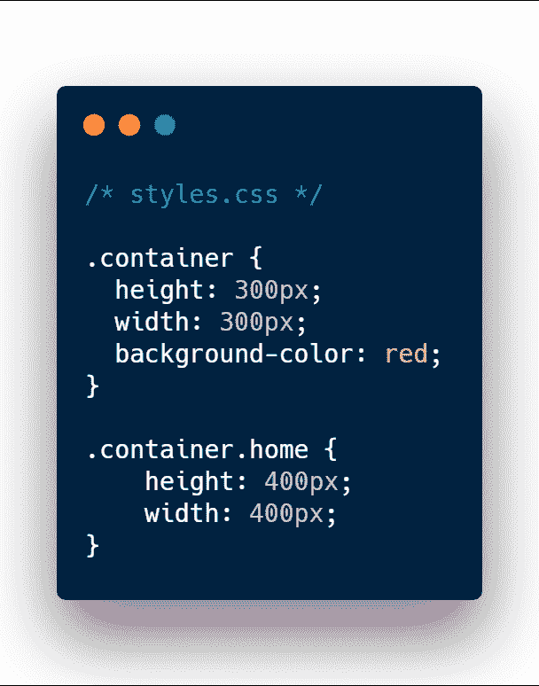
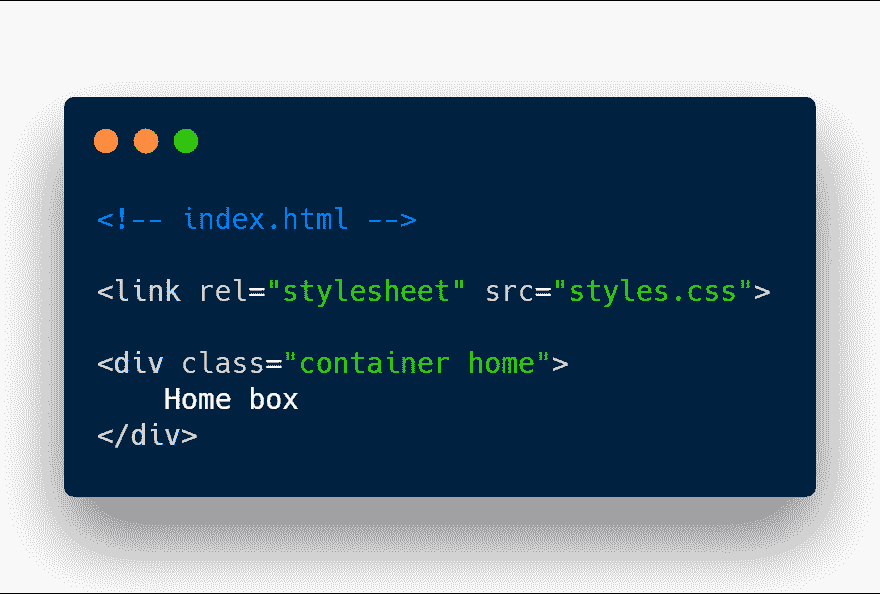
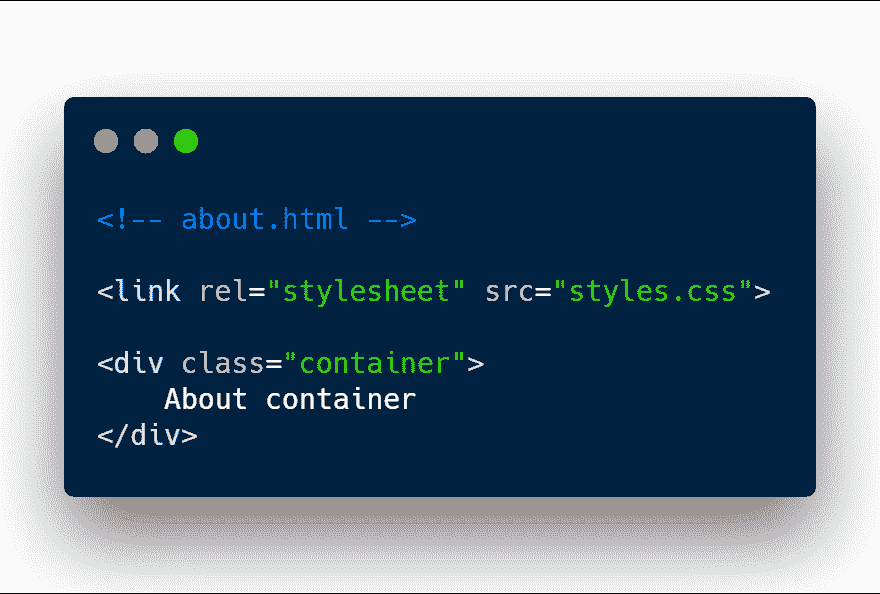
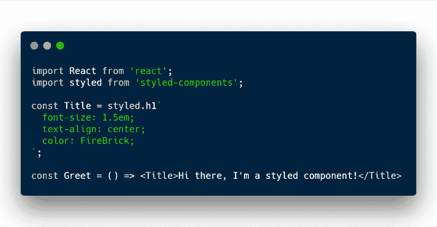
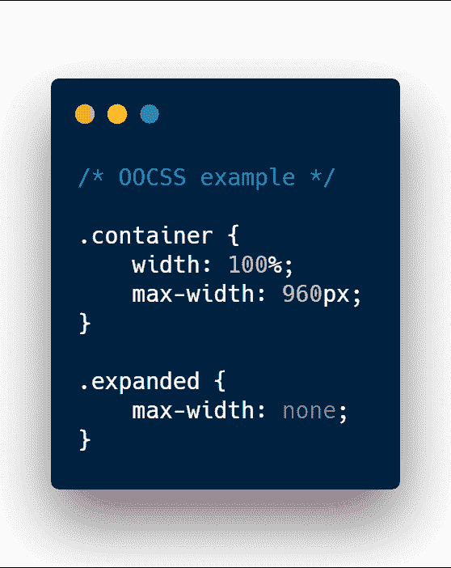
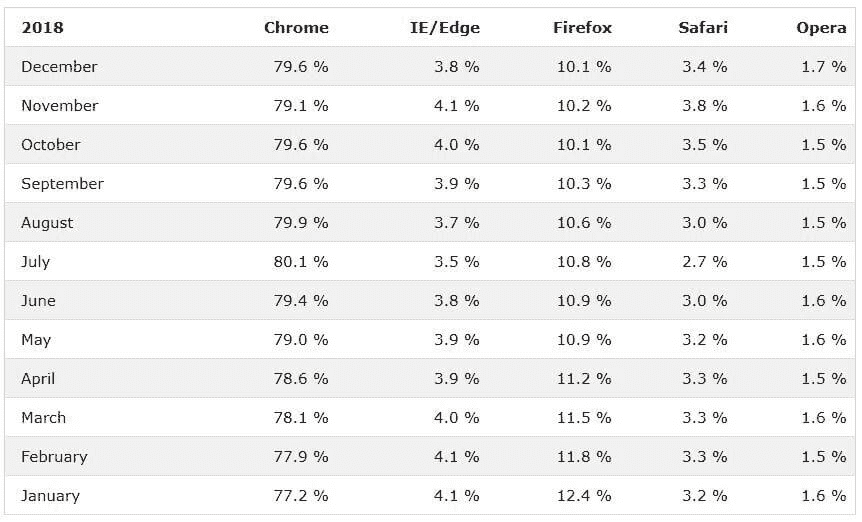
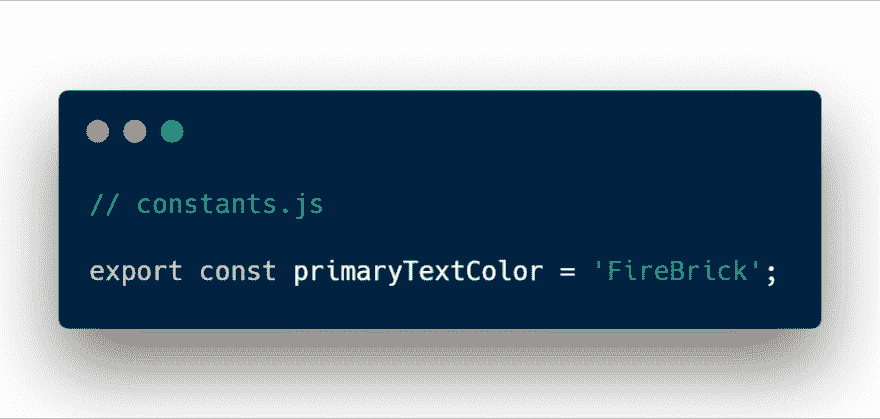
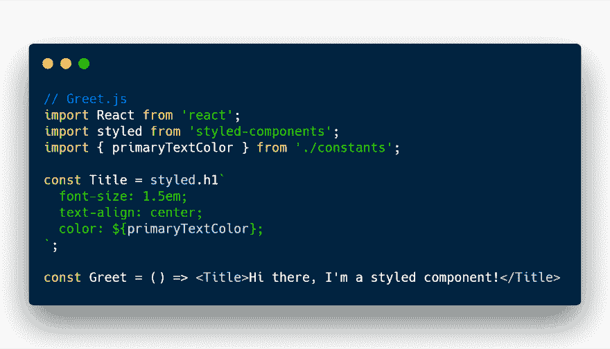
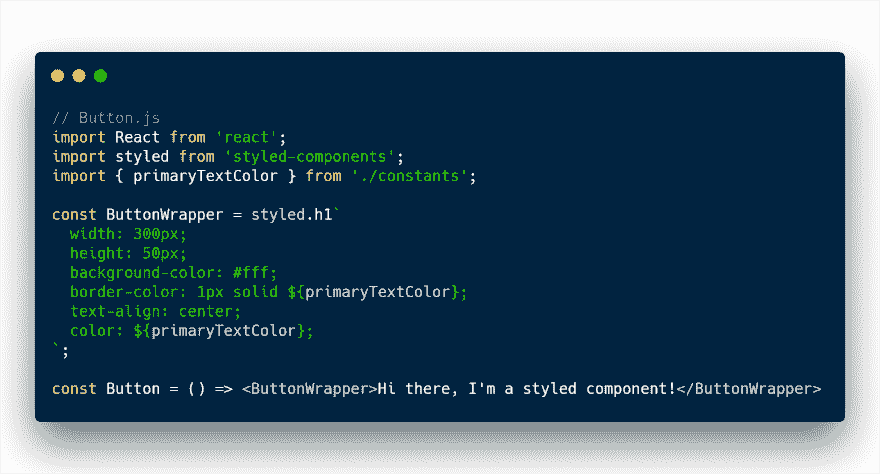

# 在下一个应用程序中使用 JS 中的 CSS 的 5 个理由

> 原文：<https://dev.to/rleija_/5-reasons-to-go-with-css-in-js-for-your-next-application-43m>

*原帖@ [Linguine 博客](https://linguinecode.com/post/get-started-with-react)T3】*

CSS 很牛逼，也很容易上手。

但前端应用程序一直在以巨大而复杂的速度扩展，我不认为当前的 CSS 架构是为这一工作而设计的。

我仍然相信当前的 CSS 架构在这个疯狂的小网站，甚至小应用程序的世界里有一席之地。

我将列出我在 9 年的网络开发中遇到的 CSS 问题。

而我相信 JS 中的 CSS 解决了这些问题。

我将演示 JS 中的 CSS 如何通过使用两个库样式的组件和 React 来解决这些问题。

## CSS 问题#1:全局命名空间

我创建了一个样式表，包含一个*容器*元素的 CSS 代码。

如果包含类名 *home* ，那么*容器*样式的大小将会增加。

<figure>

<figcaption></figcaption>

</figure>

现在，我已经创建了主页 HTML，导入了样式表，并向 HTML 元素添加了类名。

但是等等，我需要一个关于页面！让我们现在就创建它。

现在，我已经创建了 about HTML 页面，导入了样式表，并创建了一个新的容器元素。

很好，对吧？

不完全是。我导入的样式表包含主页中的样式。

没有什么可以阻止我使用为主页设计的类名。

随着时间的推移，这个简单的网站将增长到拥有数千行 CSS 和 HTML 代码。

过去定义的 CSS 规则将在整个站点中重用。当工程师试图改变班级规则时，问题就出现了。

它很有可能破坏或改变网站的其他部分，而这些部分是不应该被修改的。

JS 中的 CSS 允许我们将样式封装到一个 React 元素中。

我在这里创建了两个组件。

第一个组件被命名为， **Title** 。

**头衔**只负责造型。，第二个组成部分是**迎接**。

**Greet** 负责使用我创建的样式化组件，并向用户显示问候消息。

**标题**被定义为地方风格。没有其他 React 组件或 HTML 元素能够访问这些样式。安全！

## CSS 问题#2:隐式依赖

这叫文风 SASS/CSS 叫 BEM。听说过吗？

大概不会。

边界元法是众多 CSS 方法之一。CSS 方法的目标是减少内置范围确定机制的缺乏。

OOCSS 是一种用 CSS“对象”分隔容器和内容的方法。

我们还有:

*   SMACSS
*   SUITCSS
*   原子的

尽管如此，这些解决方案中的每一个都只是快速修补解决方案。

## CSS 问题#3:死代码消除

为什么要下载不会用到的 CSS 代码？

JS 中的 CSS 可以动态清理不在使用的 CSS 代码。

## CSS 问题#4:缩小

现成的 CSS 没有缩减代码的特性。

对于大型应用程序，未统一的 CSS 代码可能会变得相当大，特别是当我们在样式表中添加大量空白(缩进)时。

要缩减 CSS 代码，你必须使用第三方在线服务或设置开发任务来缩减你的代码。

这就产生了 CSS 的另一个依赖。

## CSS 问题 5:共享常量

CSS 支持一个与它们内置的名为 <mark>var()</mark> 的函数共享常量。

但是不支持 IE。而且勉强支持 Edge 15。

我们可以说，“微软停止支持这些浏览器。”

但是根据 W3Schools 的数据，他们每月有 5000 万的访问量。

他们说 4%来自 IE 和 Edge。

总共有 200 万用户使用 IE 和 Edge。不是我们可以忽略的数字。

在威瑞森媒体最近的一个项目中，应用程序仍然需要支持 IE 9。

所以 <mark>var()</mark> ，直接出门。暂时的。

另一个缺点是 CSS 变量也不能在服务器端访问。

让我们以上面的 React 例子为例，稍微修改一下，看看如何在我们的应用程序中使用常量。

我创建了一个名为 constants.js 的新文件，在该文件中，它包含了主要文本颜色 FireBrick 的值。

然后，我更新了 Greet 组件，以使用我创建的新常量。

首先，我将新的常量导入 Greet.js 文件。然后我在**标题**组件中使用一种叫做插值的技术。

硬编码的颜色值被替换为常量。

同时，我将创建一个名为 Button 的新组件，它将使用相同的常量。

唯一的区别是 <mark>primaryTextColor</mark> 现在被用于按钮组件的 2 个 css 属性中。

组件现在将保持一致。

## CSS 在 JS 中的好处

除了解决上述 5 个问题，它还有一些额外的好处。

*   生成最低 CSS 要求
*   良好的运行时性能
*   支持动态样式
*   易于预渲染重要的 CSS

## 结论

归根结底，我们并没有摆脱 CSS。我们只是添加 JavaScript 来增强 CSS。

旧的 CSS 架构非常适合小型网站和小型应用程序。

但在 2019 年，它可能不是中大型应用的合适选择。

当然，我们可以添加 SASS、方法论，甚至 CSS 模块，但是这些都是需要严格规则和工具的小补丁。

这些都不是未来的解决方案。

我想说，JS 中的 CSS 不是最终的解决方案，但它是我们迄今为止最好的解决方案。

请在 [Twitter](https://twitter.com/intent/tweet?text=%3Center%20thoughts%20here%3E%20https%3A%2F%2Fblog.linguinecode.com%2Fpost%2F5-reasons-css-in-js%20%40rleija_) 上告诉我您的想法和评论。