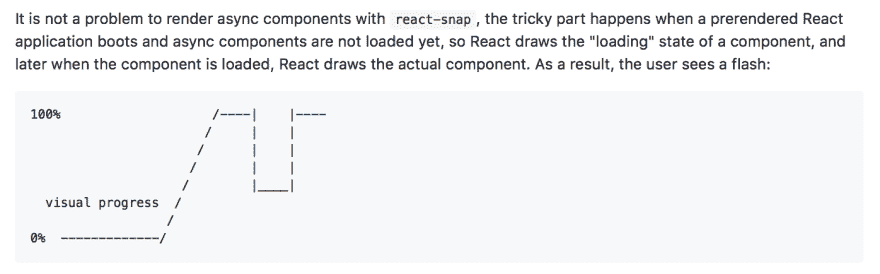

# 💡2019 年反应代码拆分

> 原文：<https://dev.to/thekashey/react-code-splitting-in2019-3cmg>

都 2019 年了！每个人都认为他们知道代码分解。所以-让我们仔细检查一下！
[T3】](https://res.cloudinary.com/practicaldev/image/fetch/s--e9igJiqb--/c_limit%2Cf_auto%2Cfl_progressive%2Cq_auto%2Cw_880/https://habrastorage.org/webt/da/lx/0b/dalx0bnbenxiqebdymmcrp8in68.png)

## 代码分裂代表什么？

简而言之——代码分割就是不加载整个东西。然后你正在阅读这个页面，你不必加载整个网站。当您从数据库中选择一行时，您不必选择所有行。
明显？代码分割也很明显，只是不是关于你的数据，而是你的代码。

## 是谁在搞代码分裂？

`React.lazy`？不–它只使用它。代码分割是在捆绑级别上工作的——web pack、package，或者在“本地”的情况下仅仅是您的文件系统。代码分割只是文件，你可以“以后”在某个地方加载的文件。

## 谁在用代码拆分？

`React.lazy`正在使用。只是用你的捆绑器的代码分割。只是在渲染时调用导入。仅此而已。

## 什么叫 React-loadable？

取代了它。并且提供了更多的功能，像`Suspense`来控制加载状态。所以——用`React.Lazy`代替。

> 是的，就这些。感谢您的阅读，祝您愉快。

## 为什么这篇文章没有写完？

好吧。关于`React.lazy`和代码分割，有一些*灰色地带*，我忘了说了。

### 灰色区域 1–测试

测试`React.lazy`并不容易，因为它的*异步*。只要它还没有被加载(即使它被加载了)，它就只是“空的”——`Promises`和`import`返回，并且 lazy 接受，**承诺**，它总是在**的下一个时钟周期**被执行。

测试`React.lazy`并不容易，因为它是异步的。`mount(MyLazyComponent)`的结果只会是“空”，只要【真实】`Component`、 `MyLazy`后面的*，还没有加载。即使是这样——`import`返回，`lazy`接受，**承诺**，总是在**下一个滴答**执行。所以——你永远不会在**当前节拍**中得到分量。这是法律！* 

```
const LazyComponent = lazy(() => import('/path/to/dynamic/component'));
const Fallback = () => <div />;
const SuspenseComponent = () => (
    <Suspense fallback={<Fallback />}>
      <LazyComponent />
    </Suspense> );
const wrapper = mount(<SuspenseComponent />)
expect(wrapper.find('Fallback')).to.have.lengthOf(1)
expect(wrapper.find('DynamicComponent')).to.have.lengthOf(0)
// ^ not loaded

await wrapper.waitUntilLazyLoaded()
// ^ Oh god, why!?

expect(wrapper.find('Fallback')).to.have.lengthOf(0)
expect(wrapper.find('DynamicComponent')).to.have.lengthOf(1)
// ^ loaded! 
```

建议的解决方案？你可能不相信，但是建议的解决方案是使用同步*标签*。

# [ 支持 sync# 14626](https://github.com/facebook/react/pull/14626)

[ ](https://github.com/gaearon)  **[gaearon](https://github.com/gaearon)** commented on [Jan 18, 2019](https://github.com/facebook/react/pull/14626)

为什么不呢？目前，由于竞争条件(状态被设置为已解决，但结果被下一行覆盖)，它们失败并出现令人困惑的错误。这应该能解决问题。

我想这可能对测试有用。见[https://github . com/Airbnb/enzyme/issues/1917 # issue comment-454208642](https://github.com/airbnb/enzyme/issues/1917#issuecomment-454208642)。人们在同步环境中寻找类似`waitForLazyLoaded`的变通办法是很尴尬的。支持同步标签可能是一个很好的解决方案。

[View on GitHub](https://github.com/facebook/react/pull/14626)

那么——让我们来制定导入同步吧！！
T3】

```
const LazyText = lazy(() => ({
   then(cb) {   
      cb({default: Text});
      // this is "sync" thenable
   },
}));     
const root = ReactTestRenderer.create(
  <Suspense fallback={<Text text="Loading..." />}>          
     <LazyText text="Hi" /> // this lazy is not very lazy
  </Suspense>, ); 
```

将导入函数转换成记忆的同步表并不难。

```
const syncImport = (importFn) => {
   let preloaded = undefined;
   const promise = importFn().then(module => preloaded = module);
   // ^ "auto" import and "cache" promise 
   return () => preloaded ? { then: () => preloaded } : promise;
   // ^ return sync thenable then possible
}
const lazyImport = isNode ? syncImport : a => a; 
// ^ sync for node, async for browser
const LazyComponent = React.lazy(lazyImport(() => import('./file')); 
```

### 灰色区域 2–SSR

> 如果你不需要 SSR 请继续阅读文章！

`React.lazy`是 SSR 友好的。但它需要`Suspense`才能工作，悬念是**对服务器端不友好**。

有两种解决方案:

*   用片段代替悬念，比如通过嘲讽。然后，使用带有同步`then`的`import`的修改版本，使 lazy 也同步运行。

```
import React from 'react';
const realLazy = React.lazy;
React.lazy = importer => realLazy(syncImport(importer));
React.Suspense = React.Fragment; // :P
// ^ React SSR just got fixed :D 
```

这是一个很好的选择，但是它对客户端不太友好。为什么？让我们定义第二种可能的解决方案:

*   使用一个**专用库**来跟踪使用过的脚本、块和样式，并将它们加载到客户端(尤其是样式！)在进行水合反应之前。否则——你将呈现空洞而不是你的代码分割组件。再一次，你没有加载你刚才分割的代码，所以你不能渲染任何你将要渲染的东西。

### 看代码分解库

*   通用组件(Universal-component)-最古老的、仍可维护的库。它“发明”了代码分割，并教会了 Webpack 代码分割。
*   非常流行，但是无人维护的库。让代码吐槽成为一件流行的事情。问题是封闭的，所以周围没有社区。
*   可加载组件(Loadable-components)–一个功能完整的库，使用起来很愉快，拥有最活跃的社区。
*   [导入组件](https://www.npmjs.com/package/react-imported-component)–单个库，不绑定到 Webpack，即能够处理包裹或 esm。
*   React-async-component–已经死了的库(但很流行)，它对代码分割、自定义 React 树遍历和 SSR 产生了重大影响。
*   另一个库——有很多库，其中很多没有通过 Webpack evolution 或 React 16——我没有在这里列出它们，但是如果你知道一个好的候选库——就给我发邮件。

### 挑哪个库？

这很简单—**不可反应加载**——它很难维护，而且已经过时，即使它仍然非常流行。(再次感谢您普及代码分割)

可加载组件–可能是一个非常好的选择。它写得非常好，积极维护并支持开箱即用的一切。支持“完全动态导入”，允许你根据给定的属性导入文件，但是不可类型化。支持悬念，所以可以替换 React.lazy。

*通用组件*——实际上是完全动态导入的“发明者”——他们在 Webpack 中实现了它。以及其他许多低级别的事情——他们做到了。我会说——这个库有点硬，有点不太用户友好。可加载组件文档是无与伦比的。如果不使用这个库，那么阅读文档是值得的——有很多细节你应该知道…

*React-imported-component*–有点奇怪。它是独立于 bundler 的，所以它永远不会中断(没有什么可以中断)，可以与 Webpack 5 和 55 一起工作，但这是有代价的。虽然 SSR 期间以前的库会将所有使用的脚本添加到页面主体，并且您将能够并行加载所有脚本——导入不知道文件名，并且将调用原始的“导入”(这就是为什么独立于 bundle)来加载使用的块，但是只能从主 bundle 内部进行调用——因此所有附加脚本将仅在主 bundle 下载并执行后加载。不支持完全动态导入，如 React.lazy，因此也不支持 typeable。也支持悬疑。在 SSR 上使用同步*标签*。它还有一个完全不同的 CSS 方法，以及完美的流呈现支持。

列出的图书馆在质量或受欢迎程度上没有区别，我们都是好朋友——所以用心挑选吧。

##  [平滑码](https://github.com/smooth-code) / [可加载组件](https://github.com/smooth-code/loadable-components)

### 反应代码分裂使✂️✨变得容易

<article class="markdown-body entry-content p-5" itemprop="text">

# [](https://raw.githubusercontent.com/smooth-code/loadable-components/master/resources/loadable-components.png)

React 代码分割变得简单。毫无压力地减少你的包裹尺寸<g-emoji class="g-emoji" alias="scissors" fallback-src="https://github.githubassets.cimg/icons/emoji/unicode/2702.png">✂️</g-emoji>T2】✨。

[](https://github.com/smooth-code/loadable-components/blob/master/LICENSE)[](https://opencollective.com/loadable/donate)[](https://www.npmjs.com/package/@loadable/component)[](https://www.npmjs.com/package/@loadable/component)[](https://travis-ci.org/smooth-code/loadable-components)[](https://camo.githubusercontent.com/c83b8df34339bd302b7fd3fbb631f99ba25f87f8/68747470733a2f2f696d672e736869656c64732e696f2f62616467652f636f64655f7374796c652d70726574746965722d6666363962342e737667)[](https://david-dm.org/smooth-code/loadable-components?path=packages/component)[](https://david-dm.org/smooth-code/loadable-components?type=dev)[T25】](https://unpkg.com/@loadable/component/dist/loadable.min.js)

```
npm install @loadable/component
```

## [文档](https://www.smooth-code.com/open-source/loadable-components)

关于使用可加载组件的更多信息，参见[smooth-code.com/open-source/loadable-components](https://www.smooth-code.com/open-source/loadable-components)T3 的文档！

快速链接到一些最常访问的页面:

*   [**入门**T3】](https://www.smooth-code.com/open-source/loadable-components/docs/getting-started/)
*   [与 React.lazy 的比较](https://www.smooth-code.com/open-source/loadable-components/docs/loadable-vs-react-lazy/)
*   [服务器端渲染](https://www.smooth-code.com/open-source/loadable-components/docs/server-side-rendering/)

## 例子

```
import loadable from '@loadable/component'
const OtherComponent = loadable(() => import('./OtherComponent'))
function MyComponent() {
  return (
    <div>
      <OtherComponent />
    </div>
  )
}
```

## 支持可加载组件

可加载组件是一个麻省理工学院许可的开源项目。这是一个独立的项目，由于这些令人敬畏的[支持者](https://raw.githubusercontent.com/smooth-code/loadable-components/master//BACKERS.md)的支持，正在进行的开发才成为可能。如果你想加入他们，请考虑:

*   [成为 OpenCollective](https://opencollective.com/loadable) 的支持者或赞助商。

### 金牌赞助商

金牌赞助商是那些承诺每月 100 美元或更多的人。

[](https://camo.githubusercontent.com/db285608ed1b7de56900dbbb8179948af4886415/68747470733a2f2f6f70656e636f6c6c6563746976652e636f6d2f6c6f616461626c652f74696572732f676f6c642d73706f6e736f72732e7376673f6176617461724865696768743d3132302677696474683d363030)

## 许可证

根据麻省理工学院许可证授权，版权所有…

</article>

[View on GitHub](https://github.com/smooth-code/loadable-components)

##  [卡西](https://github.com/theKashey) / [反应-进口-组件](https://github.com/theKashey/react-imported-component)

### ✂️📦SSR 友好代码拆分的独立于 Bundler 的解决方案

<article class="markdown-body entry-content p-5" itemprop="text">

# 进口组件✂

## 始终有效的代码拆分 <sup>*</sup>

[](https://raw.githubusercontent.com/theKashey/react-imported-component/master/./assets/imported-logo.png)

SSR-friendly code splitting compatible with any platform
Deliver a better experience within a single import

[ ](https://www.npmjs.com/package/react-imported-component) [  ](https://circleci.com/gh/theKashey/react-imported-component/tree/master) [  ](https://www.npmjs.com/package/react-imported-component) [  ](https://bundlephobia.com/result?p=react-imported-component) [](https://camo.githubusercontent.com/ca8f583465c5a251169737a84d9725d17732945b/68747470733a2f2f6261646765732e677265656e6b65657065722e696f2f7468654b61736865792f72656163742d696d706f727465642d636f6d706f6e656e742e737667)

> <sup>*</sup> 它真的永远不会让你失望。一切都归功于你的 bundler。

<g-emoji class="g-emoji" alias="point_right" fallback-src="https://github.githubassets.cimg/icons/emoji/unicode/1f449.png">👉</g-emoji> [用法](https://raw.githubusercontent.com/theKashey/react-imported-component/master/#usage) | [API](https://raw.githubusercontent.com/theKashey/react-imported-component/master/#api) | [设置](https://raw.githubusercontent.com/theKashey/react-imported-component/master/#setup)|[SSR](https://raw.githubusercontent.com/theKashey/react-imported-component/master/#ssr)|[CCS](https://raw.githubusercontent.com/theKashey/react-imported-component/master/#css)[并发加载](https://raw.githubusercontent.com/theKashey/react-imported-component/master/#concurrent-loading)|[web pack/package](https://raw.githubusercontent.com/theKashey/react-imported-component/master/#bundler-integration)

| 图书馆 | 焦虑 | 苏维埃社会主义共和国 | 钩住 | 图书馆 | 非模块 | 导入(`./${value}`) | 巴别塔宏 | 仅 webpack |
| --- | :-: | :-: | :-: | :-: | :-: | :-: | :-: | :-: |
| 反应.懒惰 | <g-emoji class="g-emoji" alias="white_check_mark" fallback-src="https://github.githubassets.cimg/icons/emoji/unicode/2705.png">✅</g-emoji> | <g-emoji class="g-emoji" alias="x" fallback-src="https://github.githubassets.cimg/icons/emoji/unicode/274c.png">❌</g-emoji> | <g-emoji class="g-emoji" alias="x" fallback-src="https://github.githubassets.cimg/icons/emoji/unicode/274c.png">❌</g-emoji> | <g-emoji class="g-emoji" alias="x" fallback-src="https://github.githubassets.cimg/icons/emoji/unicode/274c.png">❌</g-emoji> | <g-emoji class="g-emoji" alias="x" fallback-src="https://github.githubassets.cimg/icons/emoji/unicode/274c.png">❌</g-emoji> | <g-emoji class="g-emoji" alias="x" fallback-src="https://github.githubassets.cimg/icons/emoji/unicode/274c.png">❌</g-emoji> | <g-emoji class="g-emoji" alias="joy_cat" fallback-src="https://github.githubassets.cimg/icons/emoji/unicode/1f639.png">😹</g-emoji> |
| 可反作用加载 | <g-emoji class="g-emoji" alias="white_check_mark" fallback-src="https://github.githubassets.cimg/icons/emoji/unicode/2705.png">✅</g-emoji> | <g-emoji class="g-emoji" alias="white_check_mark" fallback-src="https://github.githubassets.cimg/icons/emoji/unicode/2705.png">✅</g-emoji> | <g-emoji class="g-emoji" alias="x" fallback-src="https://github.githubassets.cimg/icons/emoji/unicode/274c.png">❌</g-emoji> | <g-emoji class="g-emoji" alias="x" fallback-src="https://github.githubassets.cimg/icons/emoji/unicode/274c.png">❌</g-emoji> | <g-emoji class="g-emoji" alias="white_check_mark" fallback-src="https://github.githubassets.cimg/icons/emoji/unicode/2705.png">✅</g-emoji> | <g-emoji class="g-emoji" alias="x" fallback-src="https://github.githubassets.cimg/icons/emoji/unicode/274c.png">❌</g-emoji> | <g-emoji class="g-emoji" alias="x" fallback-src="https://github.githubassets.cimg/icons/emoji/unicode/274c.png">❌</g-emoji> | <g-emoji class="g-emoji" alias="crying_cat_face" fallback-src="https://github.githubassets.cimg/icons/emoji/unicode/1f63f.png">😿</g-emoji> |
| @可加载/组件 | <g-emoji class="g-emoji" alias="white_check_mark" fallback-src="https://github.githubassets.cimg/icons/emoji/unicode/2705.png">✅</g-emoji> | <g-emoji class="g-emoji" alias="white_check_mark" fallback-src="https://github.githubassets.cimg/icons/emoji/unicode/2705.png">✅</g-emoji> | <g-emoji class="g-emoji" alias="x" fallback-src="https://github.githubassets.cimg/icons/emoji/unicode/274c.png">❌</g-emoji> | <g-emoji class="g-emoji" alias="white_check_mark" fallback-src="https://github.githubassets.cimg/icons/emoji/unicode/2705.png">✅</g-emoji> | <g-emoji class="g-emoji" alias="x" fallback-src="https://github.githubassets.cimg/icons/emoji/unicode/274c.png">❌</g-emoji> | <g-emoji class="g-emoji" alias="white_check_mark" fallback-src="https://github.githubassets.cimg/icons/emoji/unicode/2705.png">✅</g-emoji> | <g-emoji class="g-emoji" alias="x" fallback-src="https://github.githubassets.cimg/icons/emoji/unicode/274c.png">❌</g-emoji> | <g-emoji class="g-emoji" alias="crying_cat_face" fallback-src="https://github.githubassets.cimg/icons/emoji/unicode/1f63f.png">😿</g-emoji> |
| 进口组件 | <g-emoji class="g-emoji" alias="white_check_mark" fallback-src="https://github.githubassets.cimg/icons/emoji/unicode/2705.png">✅</g-emoji> | <g-emoji class="g-emoji" alias="white_check_mark" fallback-src="https://github.githubassets.cimg/icons/emoji/unicode/2705.png">✅</g-emoji> | <g-emoji class="g-emoji" alias="white_check_mark" fallback-src="https://github.githubassets.cimg/icons/emoji/unicode/2705.png">✅</g-emoji> | <g-emoji class="g-emoji" alias="white_check_mark" fallback-src="https://github.githubassets.cimg/icons/emoji/unicode/2705.png">✅</g-emoji> | <g-emoji class="g-emoji" alias="white_check_mark" fallback-src="https://github.githubassets.cimg/icons/emoji/unicode/2705.png">✅</g-emoji> | <g-emoji class="g-emoji" alias="x" fallback-src="https://github.githubassets.cimg/icons/emoji/unicode/274c.png">❌</g-emoji> | <g-emoji class="g-emoji" alias="white_check_mark" fallback-src="https://github.githubassets.cimg/icons/emoji/unicode/2705.png">✅</g-emoji> | <g-emoji class="g-emoji" alias="smile_cat" fallback-src="https://github.githubassets.cimg/icons/emoji/unicode/1f638.png">😸</g-emoji> |

> 阅读更多关于[该表显示的内容](https://raw.githubusercontent.com/theKashey/react-imported-component/master/#comparisonLegend)

主要特点:

*   <g-emoji class="g-emoji" alias="one" fallback-src="https://github.githubassets.cimg/icons/emoji/unicode/0031-20e3.png">1️⃣</g-emoji> 真相的唯一来源——你的**捆绑者驱动**一切
*   <g-emoji class="g-emoji" alias="book" fallback-src="https://github.githubassets.cimg/icons/emoji/unicode/1f4d6.png">📖</g-emoji> **库**级代码**拆分**
*   🧙️混合动力车与**预渲染**兼容
*   <g-emoji class="g-emoji" alias="bulb" fallback-src="https://github.githubassets.cimg/icons/emoji/unicode/1f4a1.png">💡</g-emoji> **打字稿**装订
*   <g-emoji class="g-emoji" alias="atom_symbol" fallback-src="https://github.githubassets.cimg/icons/emoji/unicode/269b.png">**反应过来。底层的惰性**(如果热模块更新被禁用)</g-emoji>
*   <g-emoji class="g-emoji" alias="star2" fallback-src="https://github.githubassets.cimg/icons/emoji/unicode/1f31f.png">🌟</g-emoji>客户端异步，服务器同步。支持**悬念**(连上…

</article>

[View on GitHub](https://github.com/theKashey/react-imported-component)

## [faceyspacey](https://github.com/faceyspacey)/[react-universal-component](https://github.com/faceyspacey/react-universal-component)

### 🚀React 通用组件的最终答案:同步 SSR +代码拆分

<article class="markdown-body entry-content p-5" itemprop="text">[ ](https://gitter.im/Reactlandia/Lobby) [  ](https://stackblitz.com/edit/react-pnzphy) [](https://codesandbox.io/s/github/faceyspacey/redux-first-router-codesandbox/tree/master/?module=r1oVP5YEUZ) 

# 反应通用组件

[](https://www.npmjs.com/package/react-universal-component)[](https://travis-ci.org/faceyspacey/react-universal-component)[](https://lima.codeclimate.com/github/faceyspacey/react-universal-component/coverage)[](https://www.npmjs.com/package/react-universal-component)[](https://www.npmjs.com/package/react-universal-component)

[](https://camo.githubusercontent.com/20394442136fc23def46fef4750555939814f80b/68747470733a2f2f63646e2e72656163746c616e6469612e636f6d2f756e6976657273616c2d636f6d706f6e656e742d62616e6e65722e706e67)

<g-emoji class="g-emoji" alias="champagne" fallback-src="https://github.githubassets.cimg/icons/emoji/unicode/1f37e.png">🍾</g-emoji> <g-emoji class="g-emoji" alias="champagne" fallback-src="https://github.githubassets.cimg/icons/emoji/unicode/1f37e.png">🍾</g-emoji> <g-emoji class="g-emoji" alias="champagne" fallback-src="https://github.githubassets.cimg/icons/emoji/unicode/1f37e.png">🍾</g-emoji> [GIT 克隆 3.0 本地演示](https://github.com/faceyspacey/universal-demo) <g-emoji class="g-emoji" alias="rocket" fallback-src="https://github.githubassets.cimg/icons/emoji/unicode/1f680.png">🚀</g-emoji> <g-emoji class="g-emoji" alias="rocket" fallback-src="https://github.githubassets.cimg/icons/emoji/unicode/1f680.png">🚀</g-emoji>T12】🚀

*   [反应通用组件](https://raw.githubusercontent.com/faceyspacey/react-universal-component/master/#react-universal-component)
    *   [简介](https://raw.githubusercontent.com/faceyspacey/react-universal-component/master/#intro)
    *   [是什么让通用渲染如此痛苦](https://raw.githubusercontent.com/faceyspacey/react-universal-component/master/#what-makes-universal-rendering-so-painful)
    *   [安装](https://raw.githubusercontent.com/faceyspacey/react-universal-component/master/#installation)
    *   [您将需要或想要的其他包装](https://raw.githubusercontent.com/faceyspacey/react-universal-component/master/#other-packages-you-will-need-or-want)
    *   [API 和选项](https://raw.githubusercontent.com/faceyspacey/react-universal-component/master/#api-and-options)
    *   [SSR 的冲洗](https://raw.githubusercontent.com/faceyspacey/react-universal-component/master/#flushing-for-ssr)
    *   [预载](https://raw.githubusercontent.com/faceyspacey/react-universal-component/master/#preload)
    *   [静态吊装](https://raw.githubusercontent.com/faceyspacey/react-universal-component/master/#static-hoisting)
    *   [道具 API](https://raw.githubusercontent.com/faceyspacey/react-universal-component/master/#props-api)
    *   [自定义渲染](https://raw.githubusercontent.com/faceyspacey/react-universal-component/master/#custom-rendering)
    *   [与 CSS-in-JS 库一起使用](https://raw.githubusercontent.com/faceyspacey/react-universal-component/master/#usage-with-css-in-js-libraries)
    *   [使用两阶段渲染](https://raw.githubusercontent.com/faceyspacey/react-universal-component/master/#usage-with-two-stage-rendering)
    *   [通用演示](https://raw.githubusercontent.com/faceyspacey/react-universal-component/master/#universal-demo)
    *   [投稿](https://raw.githubusercontent.com/faceyspacey/react-universal-component/master/#contributing)
    *   [测试](https://raw.githubusercontent.com/faceyspacey/react-universal-component/master/#tests)
    *   [更多来自 FaceySpacey](https://raw.githubusercontent.com/faceyspacey/react-universal-component/master/#more-from-faceyspacey-in-reactlandia)

## 介绍

对于“超级用户”来说，传统的水疗已经死了。如果你没有在服务器上全面渲染，你就有窒息搜索引擎可见性的风险。就目前情况来看，SEO 和客户端渲染都不是 SSR 的对手。即使许多搜索引擎声称更好的 SPA 索引，也有许多警告。**服务器端渲染至关重要: [JavaScript & SEO 适得其反——Hulu.com 案例研究](https://www.elephate.com/blog/javascript-seo-backfire-hulu-com-case-study/)**

真正的问题是**同步 SSR +分裂**。如果你曾经尝试过这样的话，*你知道*。这里有一个独一无二的解决方案，它能带来这一切…

</article>

[View on GitHub](https://github.com/faceyspacey/react-universal-component)

## 灰色区域 3–混合渲染

SSR 是个好东西，但是，你知道，很难。小项目可能想要有一个 SSR——有很多理由需要它——但是他们可能不想设置和维护它。

> SSR 可能会非常非常难。如果你想快速取胜，试试`razzle`或选择`Next.js`。

因此，对于 SSR，尤其是对于简单的 SPA，最简单的解决方案是预渲染。比如在浏览器中打开你的水疗中心，点击“保存”按钮。比如:

*   使用[木偶师](https://github.com/GoogleChrome/puppeteer)(又名无头浏览器)在“浏览器”中渲染你的页面，并将结果保存为静态 HTML 页面。
*   Rendertron -做同样的事情，但是以不同的方式(*云*)。

预渲染是没有“服务器”的“SSR”。是 SSR 使用客户端。神奇！开箱即用… …但不是为了代码分解。所以——你只需在浏览器中呈现你的页面，保存 HTML，并要求加载同样的内容。但是服务器端的特定代码(收集所有使用过的块)没有被使用，因为没有服务器！

[](https://res.cloudinary.com/practicaldev/image/fetch/s--e558xCgt--/c_limit%2Cf_auto%2Cfl_progressive%2Cq_auto%2Cw_880/https://habrastorage.org/webt/tr/sz/9i/trsz9i4ct8jc7cnwxtm-ljnepuq.png)

在前一部分中，我已经指出了在收集关于使用的块的信息方面绑定到 webpack 的库——它们根本不能处理混合渲染。

> react-snap 部分支持可加载组件版本 2(与当前版本 5 不兼容)。支持没有了。

React-imported-component 可以处理这种情况，只要它没有绑定到 bundler/side，所以对于 SSR 或 Hybrid 没有区别，只是对于`react-snap`，只要它支持“状态水合”，而`rendertron`不支持。

> react-imported-component 的这种能力是在撰写本文时发现的，以前并不知道——参见[示例](https://github.com/theKashey/react-imported-component/tree/master/examples/hybrid/react-snap)。这很容易。

这里你不得不使用另一种解决方案，它与所有其他库都是垂直的。

### 反应-预渲染-组件

这个库是为部分水合而创建的，可以部分水合你的应用程序，保持其余部分仍然脱水。它适用于 SSR 和混合渲染器，没有任何区别。这个想法很简单:

*   在 SSR - render 组件期间，用
*   在客户端——找到 div，使用 innerHTML，直到组件准备好替换死 HTML。
*   你不必加载，并等待一个带有分割组件的块*不呈现一个白洞来代替它*——只需使用预先呈现的 HTML，它绝对等于一个真实组件将呈现的*，并且它已经存在——它带有一个服务器(或混合)响应。*

> 这就是为什么我们必须在 hydrate - to **匹配**服务器呈现的 HTML 之前等待所有的块加载。这就是为什么我们可以使用服务器渲染的 HTML 片段，直到客户端没有准备好——它相当于我们只准备生产的一个。

```
import {PrerenderedComponent} from 'react-prerendered-component';
const importer = memoizeOne(() => import('./Component'));
// ^ it's very important to keep the "one" promise
const Component = React.lazy(importer); 
// or use any other library with ".prefetch" support
// all libraries has it (more or less)
const App = () => (
  <PrerenderedComponent live={importer()}> 
   {/* ^ shall return the same promise */ }
      <Component /> 
   {/* ^ would be rendered when component goes "live" */ }
  </PrerenderedComponent> ); 
```

##  [卡西](https://github.com/theKashey) / [反应-预渲染-组件](https://github.com/theKashey/react-prerendered-component)

### 🤔悬疑前时代的部分水合和缓存

<article class="markdown-body entry-content p-5" itemprop="text">

# 反应预渲染组件

Partial Hydration and Component-Level Caching

[](https://www.npmjs.com/package/react-prerendered-component) 

## 想法

简而言之:不要试图**运行** js 代码，并生成一个匹配预渲染的 react 树，而是**使用**预渲染的 html，直到 js 代码准备好替换它。让它活起来。

在 HTML 级别上还能做什么？缓存，*模板化*，还有其他好东西给<g-emoji class="g-emoji" alias="rocket" fallback-src="https://github.githubassets.cimg/icons/emoji/unicode/1f680.png">🚀</g-emoji>，就在一个 3kb*里。

#### 预渲染组件

> 在服务器上渲染一些东西，在客户端上作为 HTML 使用

*   服务器端渲染数据
    *   调用`thisIsServer`来设置环境。
    *   React-prerendered-component `will leave trails`，用已知 id 的 div 包装每个块。
*   水合客户端
    *   React-prerendered-component 将搜索已知的 id*，并从页面返回`read rendered HTML`。*
*   你的网站准备好了
    *   react-预渲染-组件准备就绪。他们正在呈现你从服务器发送的预先存在的 HTML。
*   一旦任何组件准备好被替换-水合物
    *   但之前没有。那是…

</article>

[View on GitHub](https://github.com/theKashey/react-prerendered-component)

### TLDR？

*   不要使用 react-loadable，它不会增加任何有价值的价值
*   懒惰是好的，但是太简单了。
*   SSR 是一件很难的事情，你应该知道
*   混合木偶师驱动的渲染是一件事。有时甚至更难的事情。