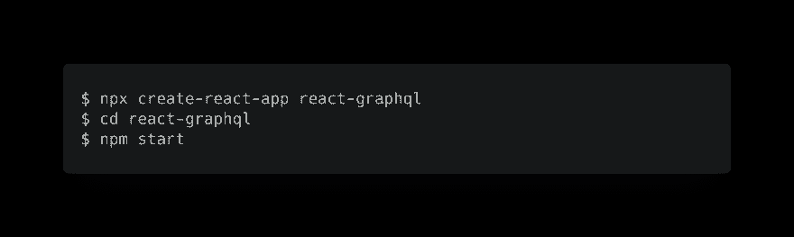
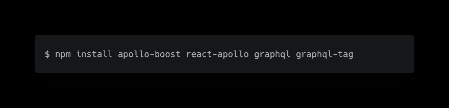
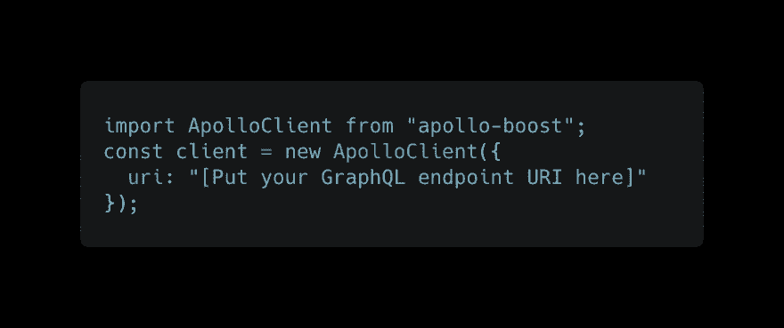
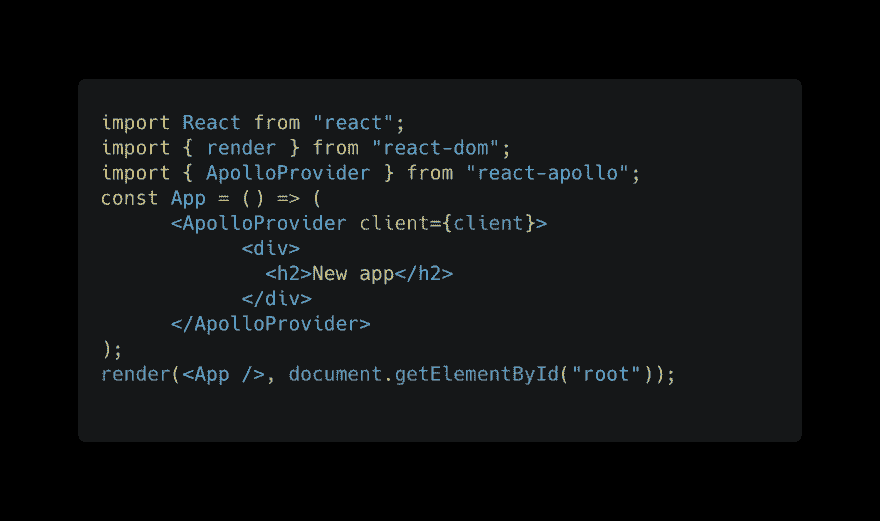

# React + GraphQL 入门

> 原文：<https://dev.to/graphqleditor/getting-started-with-react--graphql-1ik7>

如何在 React app 中实现 GraphQL？让我们用[反应阿波罗](https://github.com/apollographql/react-apollo)。这个库将允许你从 GraphQL 服务器获取数据，并在 [React](https://reactjs.org/) 框架中使用它。

## 设置一个项目

在开始之前，请确保已经安装了 Node.js。首先，我们需要建立一个新的 React 项目。最简单的方法是使用 [create-react-app](https://github.com/facebook/create-react-app) ，它允许您使用零构建配置创建一个新的 react 项目。

## 安装依赖项

一旦你完成以上步骤，下一步将是安装依赖关系。您可以使用一个 NPM 命令来安装以下软件包:

*   `apollo-boost`:一个包含所有必要的 Apollo 客户端组件的包
*   `react-apollo`:React 的视图层
*   `graphql` & `graphql-tag`:解析 GraphQL 查询都需要

## 创建客户端

现在您需要创建一个[阿波罗客户端](https://github.com/apollographql/apollo-client)的实例。您可以通过添加以下代码来完成`App.js`:

## 创建 GraphlQL 端点

首先，您真正需要的是 GraphQL 服务器的端点。让我们假设您已经创建了 GraphQL 模式(您可以在这里[看到如何快速完成](https://dev.to/tomekponiat/visual-graphql-programming-38jn))。您可以在`uri`中定义它，或者默认情况下，它将是与您的应用程序在同一主机上的`/graphql`端点。

## 将你的 React 应用与 Apollo 连接

使用从`react-apollo`导出的`ApolloProvider`组件来连接 Apollo 客户端以作出反应。`ApolloProvider`的工作方式类似于 React 的上下文提供者:

*   它包装了你的 React 应用，
*   将客户端放在上下文中，

使您可以在组件树中的任何位置访问它。

## 你做到了！

您的第一个使用 GraphQL 的 React 应用程序已经启动并运行，您可以开始使用 graph QL 查询获取一些数据了！