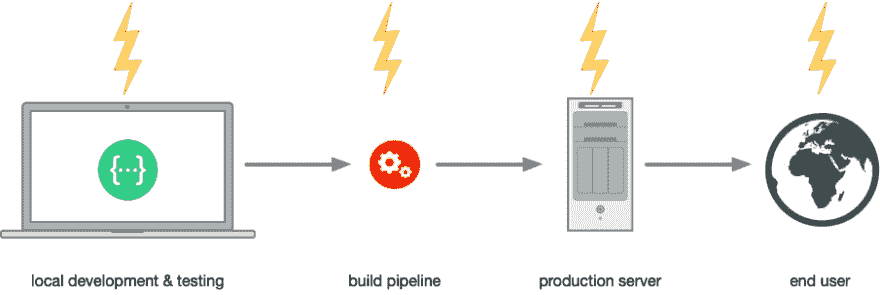
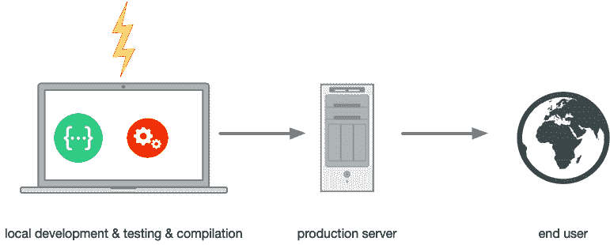
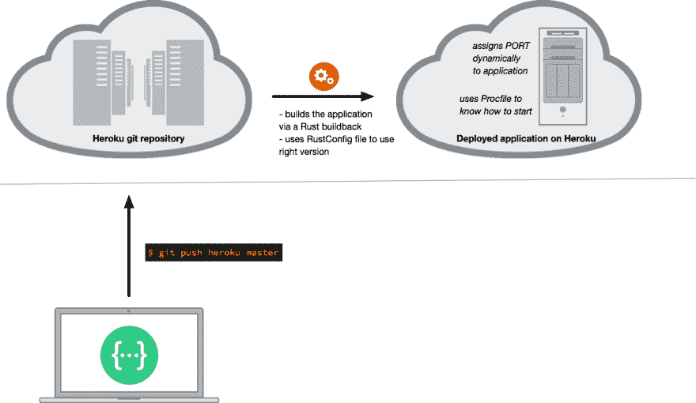
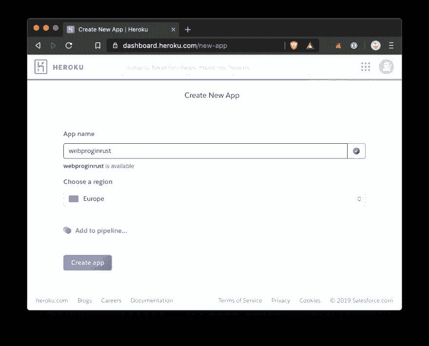
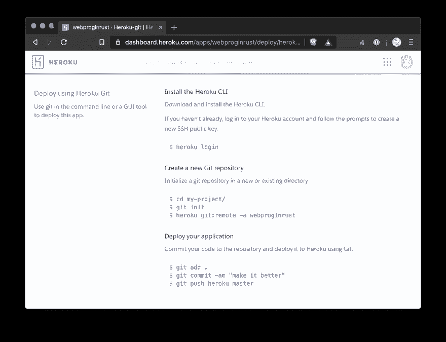
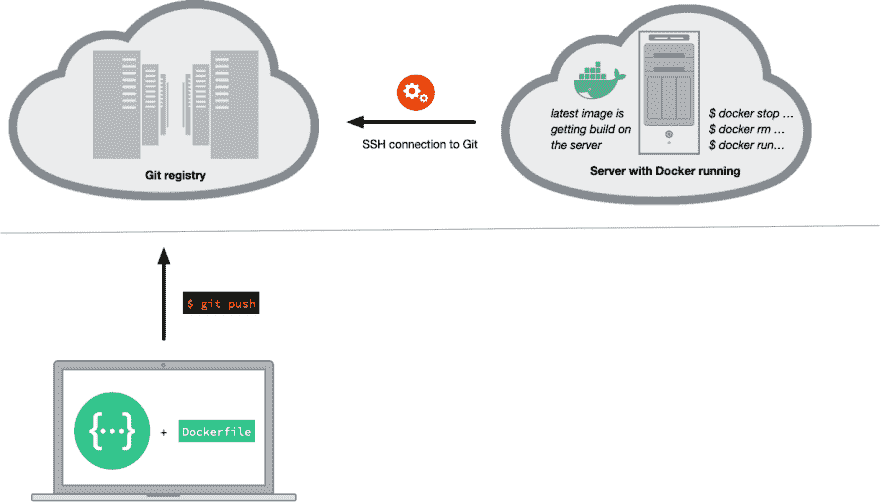
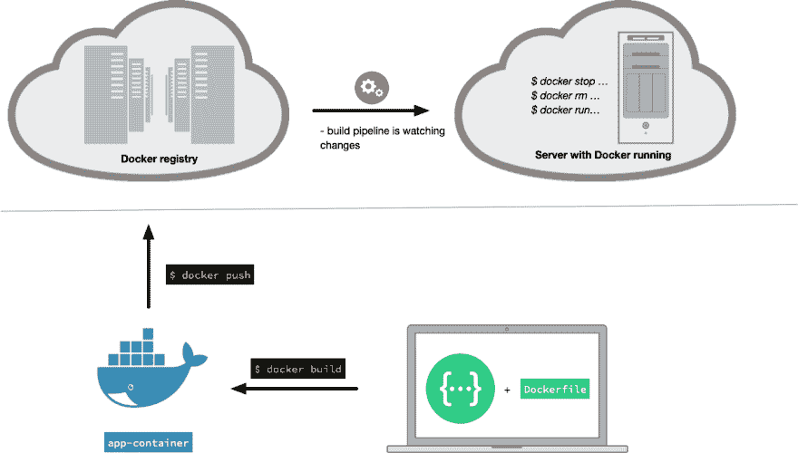
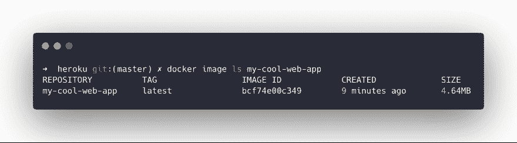
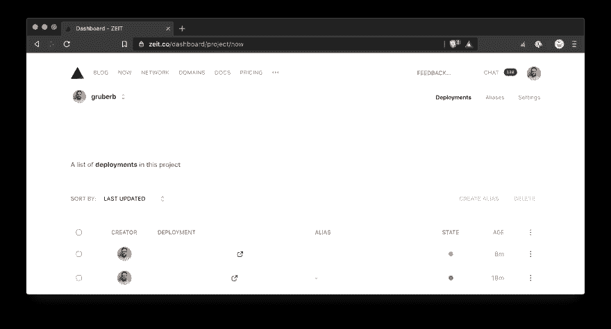

# 使用 Rust 进行 Web 开发— 02/x:部署您的第一个应用

> 原文：<https://dev.to/gruberb/web-programming-in-rust-02x-deploy-your-first-app-1k05>

> 你可以在 Rust 中找到关于 web 编程的[介绍。在](https://dev.to/gruberb/intro-to-web-programming-in-rust-for-nodejs-developers-lp) [twitter](https://twitter.com/byteadventures) 上关注我，总是能获得关于 Rust 网站开发的最新信息。也检查一下 [GitHub 库](https://github.com/gruberb/web-programming-in-rust)到他的系列。

* * *

*更新 08.07.2019:潮汐 0.2.0*

## 这个系列有 3 个目标

1.  展示新开发人员在使用 Rust 编程时将面临的障碍，以及它在特定主题(这次是部署)方面的优势。
2.  在 Rust 中显示不同的 web 开发选项。
3.  之后，在生产中始终保持更新的应用程序。

第三对我来说非常重要。这就是为什么我们在第 02/x 部分开始时提出了一些关于你能构建什么的想法，以及为什么本教程看起来会像现在这样。每当你学习新的东西时，采取这种思维模式:

> 永远不要为了事情本身而做事

也就是说:永远不要因为你想学生锈而去学生锈。这是为什么你会学不到一门新语言或者基本上学不到生活中任何东西的最大因素。你必须有一个目标，一个做某事的理由。

## “那我该怎么学铁锈呢？”

1.  在脑海中有一个你想在生产中看到的应用或想法。这可以是一个计算质数的服务，一个追踪你编程目标的网络应用，一个获取你在 GitHub 上的最新喜好并追踪他们活动的服务等等。你决定你想要建造什么。
2.  让自己对它负责。告诉你的朋友、同事或你的伴侣，你承诺他们在 6 个月内，他们将能够使用这项服务。每隔几天或几周，你会让他们了解你的最新状态。

它不需要成为一个完美的想法或服务来与其他应用竞争。它必须是你想要的东西。它将帮助你度过开始时的艰难，以及蜜月期结束后的阶段，你会发现铁锈有时会很硬。

#### 我也会公开我的:

在接下来的 6 个月结束时，我有了一个与 frontend 一起运行的 web 服务，用于我的 MeetUp“Rust and Tell Berlin ”,这样演讲者可以提交建议，可以观看以前活动中举行的讲座的幻灯片和视频。

通过这一系列教程，我将对自己负责。

* * *

让我们继续。在本系列的这一部分中，我们想要部署我们的第一个应用程序。如果您来自 NodeJS，部署生命周期如下所示:

[](https://res.cloudinary.com/practicaldev/image/fetch/s--ldAAOr8X--/c_limit%2Cf_auto%2Cfl_progressive%2Cq_auto%2Cw_880/https://raw.githubusercontent.com/gruberb/web-programming-in-rust/master/assets/nodejs_dev.png)

使用 NodeJS，您可以将任何代码推送到生产服务器。你必须有好的测试、ESLint 和其他工具来捕捉未定义和类型错误。

在一个理想的世界中，我们有一个类似这样的开发周期:

[](https://res.cloudinary.com/practicaldev/image/fetch/s--IgnR5_1x--/c_limit%2Cf_auto%2Cfl_progressive%2Cq_auto%2Cw_880/https://raw.githubusercontent.com/gruberb/web-programming-in-rust/master/assets/rust_dev.png)

所以我们希望尽可能早地在接近代码(您的本地机器)的地方解决问题。一旦我们找到了一个可行的代码库，我们将会把这个可行的解决方案带到服务器上。由于 Rusts 类型系统和强大的编译器，我们将能够打包一个可工作的二进制文件并将其转移到生产中。测试将覆盖其余的错误。

### Rust 将可能的错误移近编码环境

Rust 编译器会捕捉到很多问题，几乎全部。

b)您可以通过良好的测试(在我们的例子中:当接收到错误的参数时的错误处理)来抓住其余的部分。

c)编译好 Rust 代码后，你就有了一个可以用多种不同方式发布的二进制文件。

### 本地代码和生产就绪代码的区别

当我们谈论部署时，我们必须确保我们的代码能够:

*   根据端口运行的环境随机分配端口
*   优雅地处理错误
*   用正确的返回代码和消息响应非预期的输入
*   通过适当的测试设置，在部署管道的早期阶段失败
*   记录事件，以便跟踪错误

在本文中，我们将讨论第一个必须具备的条件(随机分配一个端口)。本系列的每一篇文章都将涵盖其余的需求。

### 四种不同的部署选项

我们通常有不同的部署和托管选项。有些更适合大规模的应用，有些更适合私人项目，让一个项目没有太多的复杂性。我们的选择是:

*   托管部署/托管(Heroku)
*   通过 Docker 和 Docker 注册表进行自我管理
*   通过 Docker 和 Git 注册表进行自我管理
*   托管无服务器 Lambda 函数(AWS Lambda，ZEIT now)

我们将在本文中讨论这些选项，并了解它们的优点、缺点以及如何准备 Rust 代码，以便可以部署它(以尽可能好的方式)。

## 构建你的应用的第一个版本

正如我们在开始所说的，我们需要一个想法和我们想要建立的东西。即使我们在下一篇文章(03/x)中描绘出应用程序的更大图景，我们也可以开始选择一个我们想要用来构建它的框架:

*   [火箭](https://rocket.rs/)
*   [actix](https://actix.rs/)
*   [哥谭市](https://gotham.rs/)
*   [潮汐](https://github.com/rustasync/tide)(工作进行中)

正如在[第一篇文章](https://dev.to/gruberb/intro-to-web-programming-in-rust-for-nodejs-developers-lp)中看到的，如果你愿意，你可以去更低的级别:

*   [超级](https://hyper.rs/)
*   [请求西部](https://docs.rs/reqwest/0.9.11/reqwest/)
*   [h2](https://github.com/carllerche/h2)

我们将为这篇文章的书面版本选择一个框架。我将选择 [tide](https://github.com/rustasync/tide) ，因为我打算在未来为它做出更多贡献。我将在本系列的 [GitHub 资源库](https://github.com/gruberb/web-programming-in-rust)中为 rocket 和 actix 制定解决方案。

### 设置我们的 app

我们想确保使用异步代码，它还不稳定。因此我们需要安装并设置 Rust:
的[夜间版本](https://doc.rust-lang.org/book/appendix-07-nightly-rust.html)

```
$ rustup install nightly-2019-02-25
$ rustup default nightly 
```

Enter fullscreen mode Exit fullscreen mode

这将生成我们的第一个文件夹结构。使用 tide 运行 web 应用程序的基本框架如下所示:

**Cargo.toml**

```
[package]
name = "my-cool-web-app"
version = "0.1.0"
authors = ["YOUR NAME + EMAIL"]
edition = "2018"

[dependencies]
tide = "0.2.0" 
```

Enter fullscreen mode Exit fullscreen mode

**main . RS**T2】

```
#![feature(async_await)]

fn main() {
    let mut app = tide::App::new(());
    app.at("/").get(async move |_| "Hello, world!");

    app.serve();
} 
```

Enter fullscreen mode Exit fullscreen mode

正如我们前面所说的，我们需要给宿主环境一个机会来为我们的应用程序分配一个端口。

我们的 **main.rs** 必须伴随这些要求:

```
#![feature(async_await)]

extern crate tide;

use tide::App;
use std::{env, net::SocketAddr};

fn main() {
    let mut app = App::new(());
    let address = SocketAddr::from(([127, 0, 0, 1], get_server_port()));

    app.at("/").get(async move |_| "hello world");
    app.serve(address).expect("Start server");
}

fn get_server_port() -> u16 {
    env::var("PORT")
        .ok()
        .and_then(|port| port.parse().ok())
        .unwrap_or_else(|| 8186)
} 
```

Enter fullscreen mode Exit fullscreen mode

设置就绪后，我们可以检查每个部署选项。

## 通过 Heroku 管理部署

> 托管环境在很大程度上只是一个抽象概念。它们在内部做的事情与您自己的管道一样:将代码推送到 git 存储库。一个“钩子”正在监视这个库，一旦有变化，它将开始编译最新版本并运行它。然而对你来说，这只是一个`git push heroku master`。

[](https://res.cloudinary.com/practicaldev/image/fetch/s--JTg43RMS--/c_limit%2Cf_auto%2Cfl_progressive%2Cq_auto%2Cw_880/https://raw.githubusercontent.com/gruberb/web-programming-in-rust/master/assets/heroku.png)

要开始，你需要一个 [Heroku 账号](https://signup.heroku.com/)(免费)。使用您的新帐户登录并创建一个新应用程序:

[](https://res.cloudinary.com/practicaldev/image/fetch/s--CAVwlIQo--/c_limit%2Cf_auto%2Cfl_progressive%2Cq_auto%2Cw_880/https://raw.githubusercontent.com/gruberb/web-programming-in-rust/master/assets/Bildschirmfoto%25202019-03-17%2520um%252011.35.50.png)

点击“创建应用”后，Heroku 在“部署”选项卡下解释了如何将您的代码推送到他们的服务器:

[](https://res.cloudinary.com/practicaldev/image/fetch/s--1YQ6fbaw--/c_limit%2Cf_auto%2Cfl_progressive%2Cq_auto%2Cw_880/https://raw.githubusercontent.com/gruberb/web-programming-in-rust/master/assets/Bildschirmfoto%25202019-03-17%2520um%252011.36.13.png)

#### 准备你的代码

首先，我们需要能够将我们的代码库推到远程位置(Heroku)。因此，请安装 [Heroku 工具链](https://devcenter.heroku.com/articles/heroku-cli)。之后，我们可以将远程位置添加到我们的 GIT 存储库中:

```
$ cd my-cool-web-app
$ heroku login
$ heroku git:remote -a my-cool-web-app 
```

Enter fullscreen mode Exit fullscreen mode

接下来，我们需要告诉 Heroku 如何在应用程序构建完成后运行它。Heroku 需要一个名为 **Procfile** 的文件，其中包含启动命令:

```
$ touch Procfile 
```

Enter fullscreen mode Exit fullscreen mode

并把下面一行字写出来:

```
web ./target/release/my-cool-web-app 
```

Enter fullscreen mode Exit fullscreen mode

我们还必须告诉 Heroku 我们使用的是哪个版本的 Rust。因为我们想使用 nightly，所以我们在根目录
中创建了一个名为 **RustConfig** 的文件

```
$ touch RustConfig 
```

Enter fullscreen mode Exit fullscreen mode

用下面一行:

```
VERSION=nightly 
```

Enter fullscreen mode Exit fullscreen mode

#### 告诫

Rust 太新了，Heroku 不支持开箱即用。我们需要安装并激活一个针对 Rust 的“构建包”。因此，在应用程序的根目录中，执行以下命令:

```
$ heroku create --buildpack emk/rust
$ heroku buildbpacks:set emk/rust 
```

Enter fullscreen mode Exit fullscreen mode

这将激活 Rust 的语言支持。

现在我们可以:

```
$ git add .
$ git commit -m "Init"
$ git push heroku master 
```

Enter fullscreen mode Exit fullscreen mode

成功后，我们返回到浏览器中的 Heroku 仪表板，并单击生成的域(在“设置”下)。浏览器 windiw 应该会打开并显示“Hello，World！”。

### 总结

*   Heroku 使部署你的应用程序变得容易
*   在不到 5 分钟的时间里，你就有了一个应用程序的运行版本
*   你可以分配自己的域名并激活 HTTPS(如果你付费的话)
*   Heroku 是学习本教程和启动辅助项目的最佳选择:便宜，易于使用，消除了部署的开销，尤其是在开始阶段

## 码头工人

> 使用 Docker 的巨大优势是可以自由选择管道和环境。您可以在本地构建映像，然后按原样将其推送到 Docker 注册中心。从那里，服务器可以下载并执行它。或者您创建一个蓝图(Dockerfile ),其他服务可以使用它来构建它们服务器。

如果您使用 Docker 进行部署，您有两种选择。第一种是将您的代码(使用 Dockerfile)推送到 Git 注册中心(如 GitHub 或 Bitbucket ),然后配置一个部署服务器来监听更改，ssh 到 Git 注册中心，获取代码，部署并运行它。

[](https://res.cloudinary.com/practicaldev/image/fetch/s--vbZP3Qnb--/c_limit%2Cf_auto%2Cfl_progressive%2Cq_auto%2Cw_880/https://raw.githubusercontent.com/gruberb/web-programming-in-rust/master/assets/git_docker.png)

第二种选择是使用 Docker 注册表。在那里，你有优势预先构建你的容器，并按原样运送它。这使得有时运行部署更快，并且您必须交付更少的代码(特别是在 Rust 的情况下)。

[](https://res.cloudinary.com/practicaldev/image/fetch/s--gCyxPorg--/c_limit%2Cf_auto%2Cfl_progressive%2Cq_auto%2Cw_880/https://raw.githubusercontent.com/gruberb/web-programming-in-rust/master/assets/docker_registry.png)

我们可以利用 Rusts 能够被编译成二进制文件的特性。我们甚至可以更进一步，编译一个没有外部依赖的静态 Rust 二进制文件。为此我们需要的是:

*   构建 Rust 二进制文件
*   将所需的 C 库静态链接到它，这样它就可以自己运行了

结果将是一个甚至不需要 Rust 就能运行的二进制文件。感谢开源社区和 Erik Kidd，已经有了一个解决方案来帮助我们。

结果是一个没有外部依赖性的超小型 Docker 映像。认识一下 [rust-musl-builder](https://github.com/emk/rust-musl-builder) 这是一个 Docker 镜像，可以帮助你构建静态 Rust 二进制文件。它将在第一次执行后下载整个图像。

我们输入和创建的一切都发生在应用程序的根目录下。

```
$ cd my-cool-web-app 
```

Enter fullscreen mode Exit fullscreen mode

在我们创建 docker 文件之前，让我们看看我们实际上想要做什么。我们使用 rust-musl-builder 将 musl-libc 库静态链接到我们的二进制文件中。

```
$ docker run --rm -it -v "$(pwd)":/home/rust/src ekidd/rust-musl-builder cargo build --release 
```

Enter fullscreen mode Exit fullscreen mode

这将创建我们的超级小二进制。你可以这样检查:

```
$ ls -lh target/x86_64-unknown-linux-musl/release/my-cool-web-app 
```

Enter fullscreen mode Exit fullscreen mode

它只是小了几 MB(在我的例子中:4，4MB)。为了能够一遍又一遍地重新创建这个过程，不仅在本地机器上，而且在不同服务器上的部署管道中，我们创建了一个多阶段 Dockerfile。

```
FROM ekidd/rust-musl-builder:nightly AS build
COPY . ./
RUN sudo chown -R rust:rust .
RUN cargo build --release

FROM scratch
COPY --from=build /home/rust/src/target/x86_64-unknown-linux-musl/release/my-cool-web-app /
ENV PORT 8181
EXPOSE ${PORT}
CMD ["/my-cool-web-app"] 
```

Enter fullscreen mode Exit fullscreen mode

您现在可以通过
构建映像

```
$ docker build -t my-cool-web-app:latest . 
```

Enter fullscreen mode Exit fullscreen mode

并使用
运行它

```
$ docker run -d --rm -P --name heroku heroku:latest 
```

Enter fullscreen mode Exit fullscreen mode

现在，您可以通过
打开您的浏览器(在 macOS 中)

```
$ open http://$(docker container port my-cool-web-app 8181) 
```

Enter fullscreen mode Exit fullscreen mode

我们刚刚创建了一个超级最小的 Docker 映像，它包含我们的二进制文件，没有外部依赖性。您可以通过
检查您刚刚创建的图像

```
$ docker image ls my-cool-web-app 
```

Enter fullscreen mode Exit fullscreen mode

[](https://res.cloudinary.com/practicaldev/image/fetch/s--Ngq8CMTP--/c_limit%2Cf_auto%2Cfl_progressive%2Cq_auto%2Cw_880/https://raw.githubusercontent.com/gruberb/web-programming-in-rust/master/assets/carbon.png)

### 总结

*   Docker 是一头野兽，但如果使用得当，它会很有帮助
*   尤其是使用 Rust:你可以创建静态链接的二进制文件，它们非常小，甚至不需要在 Rust 环境中运行
*   选择 Docker 时，您还可以有更多的选择来托管和运行您的应用程序
*   然而，像 Heroku 这样的托管环境不允许将 Docker 映像推送到他们的环境中

## 无服务器运行时— ZEIT/now

> 无服务器是一种不同于前两种选择的思维模式。无服务器也意味着无状态，所以你不是在构建 web 应用，而是在构建函数。您的应用程序中没有内置 API 端点，基本上只有这些 API 端点(用无服务器术语来说:处理程序)。我们的 web 框架，比如 rocket 和 actix，在这里可能有点过头了。目前，ZEIT 不支持在他们新的无服务器环境中进行 Rust 夜间构建。

因此，我们没有创建二进制文件(用`cargo new web-app`)，而是创建了一个库:

```
$ cargo new now-service --lib
$ cd now-service 
```

Enter fullscreen mode Exit fullscreen mode

这里我们要创建一个名为`now.json`
的文件

```
{
  "name": "now-service",
  "version": 2,
  "builds": [
    {
      "src": "src/index.rs",
      "use": "@now/rust"
    }
  ]
} 
```

Enter fullscreen mode Exit fullscreen mode

我们的`src/lib.rs`例子是这样的:

```
use http::{Request, Response, StatusCode, header};

fn handler(request: Request<()>) -> http::Result<Response<String>> {
    let response = Response::builder()
        .status(StatusCode::OK)
        .header(header::CONTENT_TYPE, "text/html")
        .body("<!doctype html><html><head>A simple deployment with Now!</head><body><h1>Welcome to Rust on Now</h1></body></html>".to_string())
        .expect("failed to render response");

    Ok(response)
} 
```

Enter fullscreen mode Exit fullscreen mode

和 Heroku 一样，你需要安装 [ZEIT 工具链](https://zeit.co/docs/v2/getting-started/installation/)，这个工具链叫做“now”。有几种选择。如果你在 macOS 上，你可以通过:

```
$ brew cask install now 
```

Enter fullscreen mode Exit fullscreen mode

它安装 Now 应用程序。在您的/Applications 文件夹中找到并打开它。您可以通过键入您的电子邮件地址来完成安装。这也将安装命令行工具链。

基本就是这样。您可以键入:

```
$ now 
```

Enter fullscreen mode Exit fullscreen mode

然后回车。这将开始上传您的应用程序。登录到您的 [ZEIT dashboard](https://zeit.co/dashboard) 并点击提供的链接。

[](https://res.cloudinary.com/practicaldev/image/fetch/s--YonmEatX--/c_limit%2Cf_auto%2Cfl_progressive%2Cq_auto%2Cw_880/https://raw.githubusercontent.com/gruberb/web-programming-in-rust/master/assets/zeit_dashboard.png)

### 总结

*   无服务器让您节省成本:该服务仅在请求时运行
*   这导致了需要考虑的更长的启动时间
*   无服务器的思维让你重新思考状态，如果你真的需要一个完全成熟的网络应用程序
*   现在使用 AWS Lambda 或 ZEITs 时，部署可能需要更长的时间

> 在 twitter 上关注我，总是能获得关于 Rust 网站开发的最新信息。还检查了 [GitHub 库](https://github.com/gruberb/web-programming-in-rust)到他的系列。