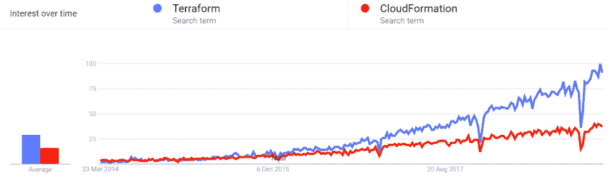

# 什么是作为代码的基础设施，为什么是 Terraform？

> 原文：<https://dev.to/pavanbelagatti/what-is-infrastructure-as-code-and-why-terraform--2pc3>

本文部分内容原贴于[中](https://medium.com/devopslinks/why-should-terraform-be-one-of-your-devops-tools-29ae15861b1f)
在去核心部分之前，先说说 IaC。

## 基础设施为代码:

传统上，基础架构设置需要花费很长时间，并且需要大量手动流程，但随着 Terraform、Chef、Ansible、Puppet、SaltStack 等工具的引入，管理、配置和调配基础架构设置变得简单了。

IaC 为开发和运营团队提供了通过软件自动管理和配置技术堆栈的翅膀。

IaC 支持 DevOps，因为你可以自动化一切。在这里，您可以将一切都视为软件，即使它们是服务器、数据库或网络组件，并且您可以编写软件来管理所有这些，实现自动化并持续交付。

IaC 有时被称为可编程或软件定义的基础设施。

但是等等，

当我们说基础设施是代码时，我们会被另外三个词困扰。那些是什么？

**配置管理**、**配置编排**和**配置**。

那么他们都一样吗？不一样？迷惑？让我知道我对它们的定义是否正确。

Chef、Puppet、Ansible、SaltStack 等配置管理工具旨在安装和管理现有服务器上的软件。它可以是安装软件包、启动服务、在实例上放置脚本或配置文件等。

因此，配置管理基本上是资源调配的一部分。“准备”通常意味着这是你第一次做。配置管理通常会重复进行。

Terraform、CloudFormation 等配置编排工具旨在自行配置服务器。它是指自动任务的安排和协调，从而形成统一的流程或工作流。

**现在，我们有兴趣了解更多关于 Terraform 的知识，**

看看谷歌上关于“地形”一词的趋势。这张图片清楚地描绘了这种工具在全球的流行程度。自 2016 年以来，该工具取得了良好的进展，许多人已经将其作为 DevOps 工具链中的重要工具之一。

Terraform 是一款安全高效地开发、更改和版本化基础设施的工具。Terraform 可以管理现有的和受欢迎的服务提供商以及定制的内部解决方案。Terraform 是第一个由 HashiCorp 向世界推出的多云不可变基础设施工具，三年前发布，用 go 编写。
DevOps 是关于旨在联合开发过程的文化和实践。Terraform 是一个工具，它变得越来越受欢迎，因为它有一个简单的语法，允许轻松的模块化，并针对多云工作。人们考虑 Terraform 的一个重要原因是将他们的基础设施作为代码来管理。

基础设施作为代码也是 DevOps 实践的关键和基础，例如版本控制、代码审查、持续集成和持续部署。如果你尝试在谷歌上搜索“基础设施即代码”，你会得到一个工具列表，任何人看到这么多选项都会感到困惑。但是 Terraform 是一个值得考虑的工具，因为与其他类似的工具相比，它具有出色的特性和特殊的原因(我们在本文中进一步列出了这些)。

# 考虑开发平台地形的理由

正如我们所知，DevOps 的目标是更有效地执行软件交付，我们需要一些工具来快速有效地进行交付，这就是 Terraform 等工具帮助公司实现代码和自动化等基础设施的地方。Terraform 通过改变基础设施的管理方式，使开发运维变得更快、更高效，从而彻底改变了开发运维的世界。您可能已经使用了 Ansible、Chef 或 Puppet 等技术来自动化和供应软件，Terraform 从与代码相同的法律、基础架构开始，但侧重于基础架构本身的自动化。您的整个云基础架构(实例、卷、网络、IPs)可以在 terraform 中轻松定义。

**让我们看看将 Terraform 作为您的开发运维工具之一的理由，**

1.  **Terraform** 允许您在配置/代码中定义基础设施，并使您能够轻松地重建/更改和跟踪基础设施的更改。Terraform 提供了基础设施的高级描述。

2.  Terraform 是唯一一款完全不受平台限制的复杂工具，虽然有几个备选方案，但它们都专注于一个云提供商，并且支持其他服务。

3.  Terraform 使你能够实现各种各样的编码原则，比如让你的代码处于源代码控制中，编写自动化测试的能力，等等

4.  **Terraform** 是基础设施管理的正确工具，因为许多其他工具在试图与一个旨在配置管理以控制基础设施环境的 API 进行争论时，存在严重的阻抗不匹配。相反，Terraform 与您想要做的事情相匹配 API 符合您对基础设施的思考方式。

5.  **Terraform** 有一个热闹的社区，并且是开源的；围绕这个工具有一个庞大的社区正在发展。很多人已经在用了，更容易找到知道怎么用的人，插件，扩展，专业支持等等。这也意味着地球正在以更快的速度进化。他们经常发布。

6.  Terraform 的速度和操作都非常出色。关于 Terraform 的一个很酷的事情是，它的计划命令让你在应用它们之前看到你将要应用的改变。代码重用特性和 Terraform 往往比 CloudFormation 等类似工具更快地做出大多数更改。

由于上面提到的原因，Terraform 是 DevOps 的一个很好的工具，因此这个工具最近得到了很多关注。你对这个工具有什么看法？如果你有任何我在列表中没有提到的使用 Terraform 的理由，请告诉我。

延伸阅读，
[Terraform CLI 备忘单](http://bit.ly/terraformcheatsheet)

[基础设施与地形代码](http://jo.my/youweb)

[为什么我们使用 Terraform 而不是 Chef、Puppet、Ansible、SaltStack 或 CloudFormation](http://bit.ly/usingterraform)