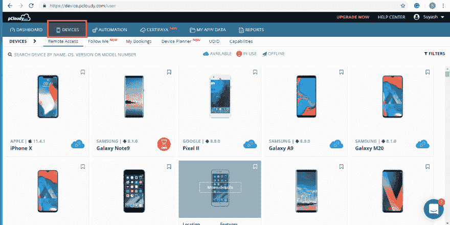
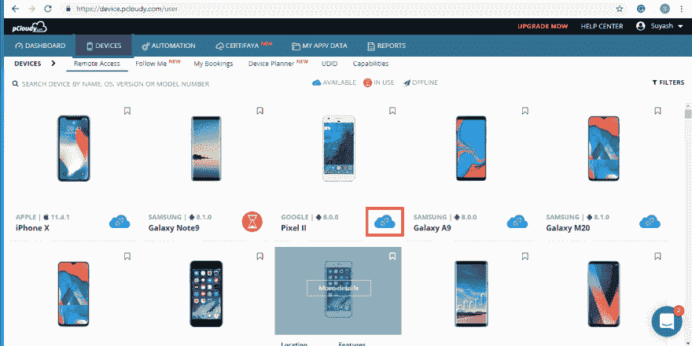
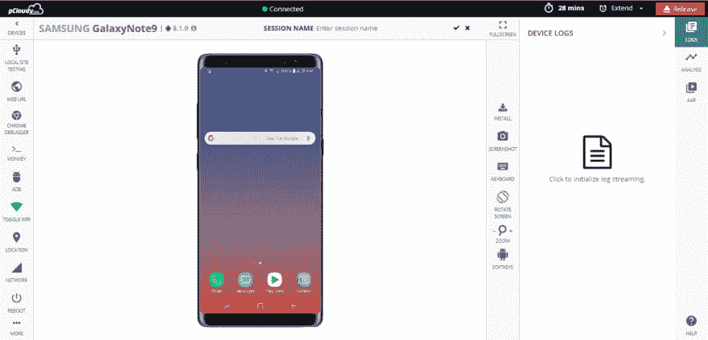
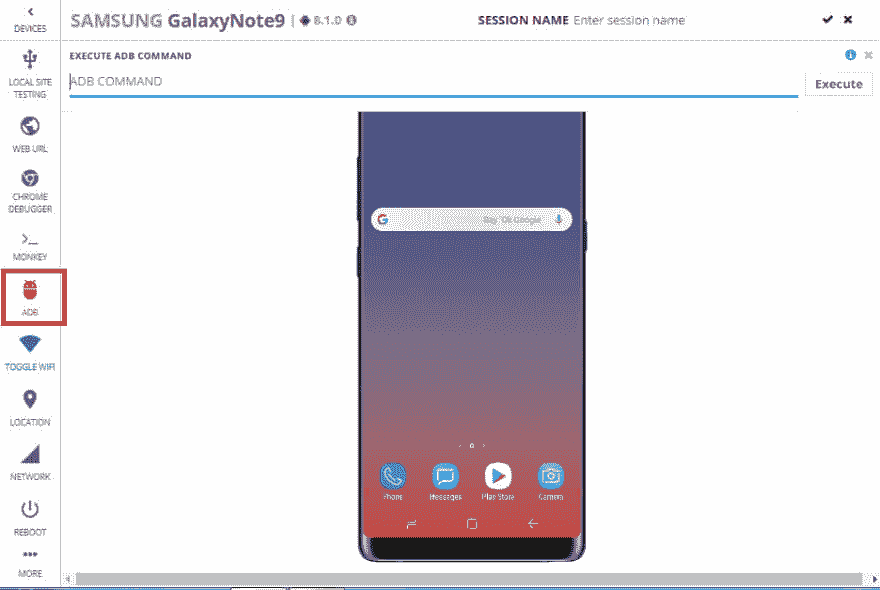
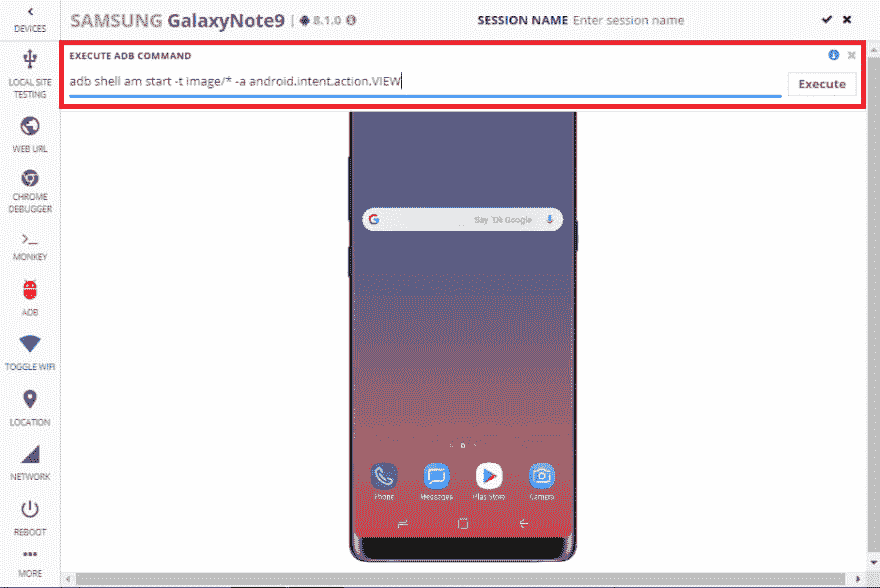
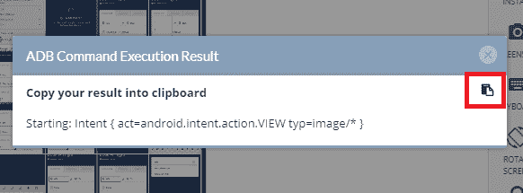
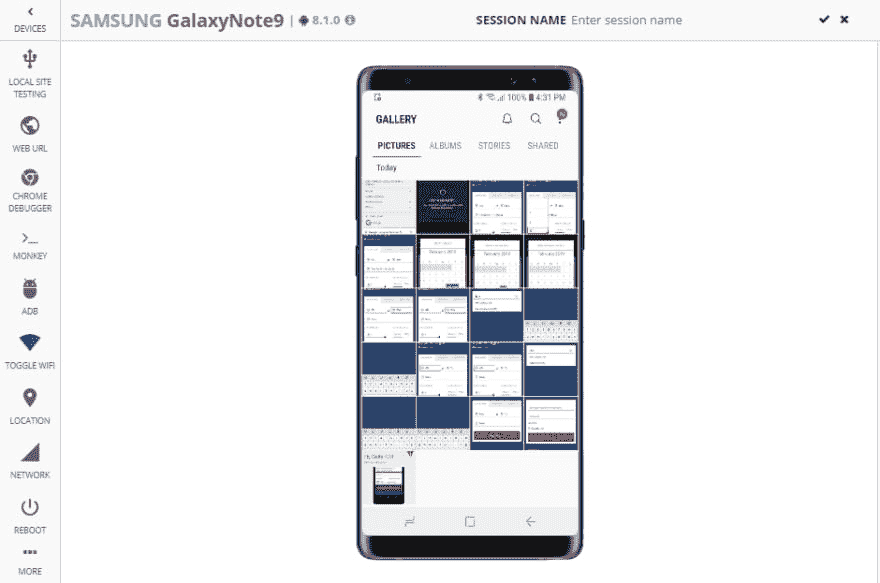
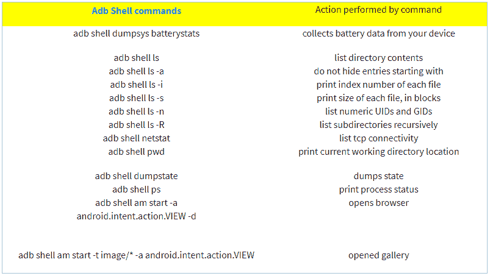

# 执行 ADB Shell 命令

> 原文：<https://dev.to/pcloudy/executing-adb-shell-commands-2af7>

你可以通过把你的安卓手机和你的电脑连接起来，写一些简单的命令来解决这些问题。为此，你需要一些命令行工具，你可以从 Android 开发者网站下载。如果您使用的是 Windows，那么您需要访问设备制造商的页面，并下载 Windows 的 ADB 和 fastboot 驱动程序。但首先，让我们了解一下什么是 Android shell 命令。

**Android Shell 命令**
ADB 是 Android Debug Bridge，是 Google 的 Android SDK 附带的命令行实用程序。它提供了一个终端界面来控制你的 Android 设备连接到一台电脑使用 USB。ADB 可用于运行 shell 命令、传输文件、安装/卸载应用程序、重启等。您还可以使用这些命令备份和恢复您的 android 设备。

[pCloudy](https://www.pcloudy.com) 还允许您在连接的设备上执行 ADB Shell 命令。

从列表中选择所需的设备并连接。

点击“执行 ADB”图标。

在尝试执行 ADB Shell 命令时，您只需遵循下面给出的几个简单步骤:

**1。从显示的列表中选择一个设备**

**2。确认您选择的设备**的连接

**3。连接的设备准备好测试**

**4。在给定的文本框**中输入 ADB shell 命令

**5。执行给定的 ADB shell 命令**

**6。ADB shell 命令执行结果**

[T6】](https://res.cloudinary.com/practicaldev/image/fetch/s--jUX_IIEa--/c_limit%2Cf_auto%2Cfl_progressive%2Cq_auto%2Cw_880/https://www.pcloudy.com/wp-content/uploads/2019/02/ADB-7.png)

**有用的安卓终端命令:**

1.  ADB 重新启动-启动加载程序和重新启动恢复命令:

此命令将让您可以在引导加载程序中重新启动您的设备。如果由于一些恶意软件，你的设备卡住了，或者如果你的设备没有重新启动，那么你可以把你的设备连接到计算机上，运行这个命令来重新启动。要运行该命令，只需在命令行中键入 adb reboot-bootloader，要在 recovery 中启动设备，只需键入 adb reboot recovery。

**2。快速启动设备命令:**

Fastboot 是一个诊断和工程协议，您可以将您的 Android 设备引导到其中。ADB 在引导程序中不工作。如果你必须引导进入 Android 并且调试工具没有激活来通信，那么你可以使用 fastboot 命令。在提示符下键入 fastboot devices，您将获得序列号。

**3。快速启动解锁命令**

快速启动闪烁解锁命令解锁您的引导加载程序。许多支持快速启动的手机不支持此命令，但您可以检查您的手机是否支持它。只需在命令提示符下键入 fastboot flashing unlock，然后按回车键。

**4。ADB 侧向加载命令:**

您可以在手机中下载更新 zip 文件，而不是等待更新被推送到手机中。为此，只需将更新下载到您的计算机上，并将您的设备连接到计算机。现在重新启动进入手机恢复，并使用音量按钮选择应用 ADB 的更新。然后打开命令行，键入 ADB side load Full-Path-to-the-file . zip 并按 enter 键。

许多用户不顾安全，在设备中创建 android shell 命令。adb reboot-bootloader 命令允许您直接引导到手机的引导程序。一旦你进入了引导程序，ADB shell 命令就不再起作用了。这就是 Android ADB fastboot 命令的用武之地。快速启动允许你发送命令到你的手机，而在启动加载程序。

**ADB 参考命令**

欲了解更多信息，请观看此视频:

[https://www.youtube.com/watch?v=L5U5dgojNzo](https://www.youtube.com/watch?v=L5U5dgojNzo)