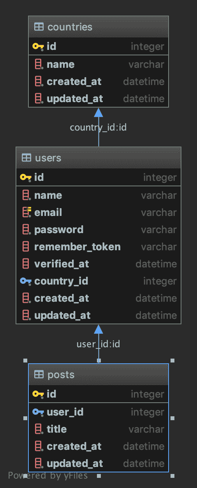

# 演说家有许多经历

> 原文：<https://dev.to/kentaro0919/orator-has-many-through-220c>

# 关系[有-多-通](https://orator-orm.com/docs/0.9/orm.html#has-many-through)

演讲者围绕关系有许多功能。在当前

*   一对一
*   一对多
*   多对多
*   有许多通过*<——我写的就是这个*
*   多态关系
*   多对多多态关系

模特都是这样的。

```
#app.Country """Countrie Model"""

from config.database import Model
from orator.orm import has_many_through, has_many

class Country(Model):
    """Countrie Model"""

    __table__ = "countries"
    __fillable__ = ['name']
    from app.User import User

    @has_many("country_id", "id")
    def users(self):
        from app.User import User
        return User

    @has_many_through(User, 'country_id', 'user_id')
    def posts(self):
        from app.Post import Post
        return Post 
```

```
# app.User 
"""User Model."""

from config.database import Model
from orator.orm import belongs_to_many, has_many

class User(Model):
    """User Model."""

    __fillable__ = ['name', 'email', 'password', 'country_id']

    __auth__ = 'email'

    @has_many
    def posts(self):
        from app.Post import Post
        return Post 
```

```
# app.Post """Post Model"""

from config.database import Model
from orator.orm import belongs_to

class Post(Model):
    """Post Model"""
    __fillable__ = ['user_id', 'title']

    @belongs_to
    def user(self):
        from app.User import User
        return User 
```

[](https://res.cloudinary.com/practicaldev/image/fetch/s--9e6Qdl7X--/c_limit%2Cf_auto%2Cfl_progressive%2Cq_auto%2Cw_880/https://thepracticaldev.s3.amazonaws.com/i/hycqdwdns3c536fzt1jv.png)

控制器很简单，只是所有的()

```
""" A testController Module """
from app.Country import Country
from masonite.view import View

class testController:

    def index(self, view: View):
        """Show several resource listings
        ex. Model.all()
            Get().route("/index", testController
        """

        countrys = Country.all()
        return view.render("index", {"countrys": countrys}) 
```

现在可以在视图中使用和发布。

```
<ul>
    
        <li>{{ country.id }} {{ country.name }}
            <ul>
            This comes from Country.users has_many
                
                    <li>{{ user.name }}
                        <ul>
                            
                            <li>{{ post.title }}</li>
                                
                        </ul>
                    </li>
                
            </ul>
            <ul>
            This comes from Country.posts has_many_through User
                

                    <li>{{ post.title }} {{ post.user.name }}</li>
                
            </ul>
        </li>
    
</ul> 
```