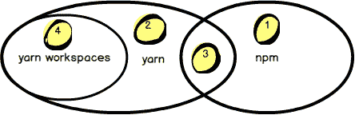
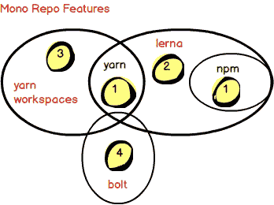
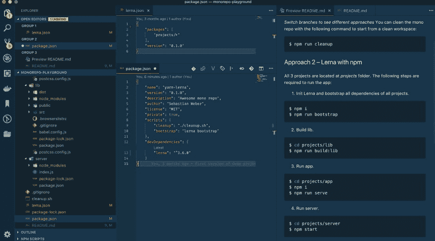
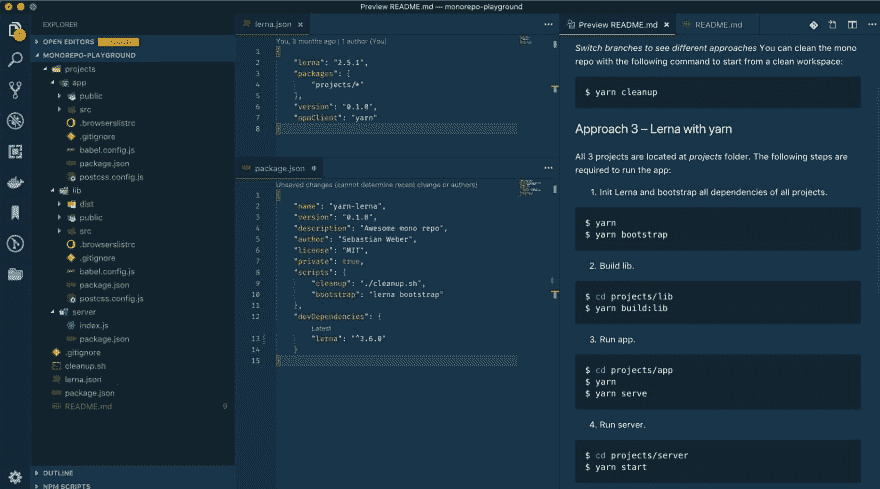
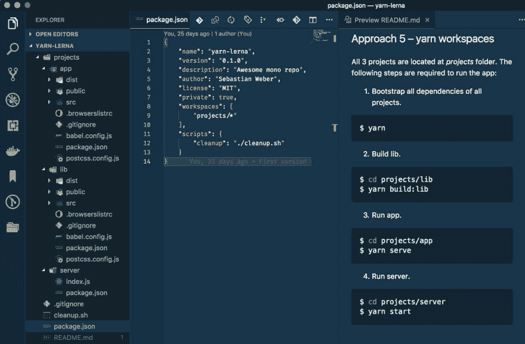
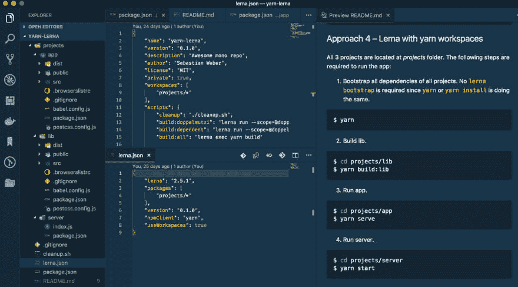
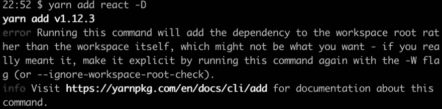

# 为什么 Lerna 和 Yarn 工作空间是构建 Mono-Repos 的完美匹配:仔细看看功能和性能

> 原文：<https://dev.to/doppelmutzi/why-lerna-and-yarn-workspaces-is-a-perfect-match-for-building-mono-repos-a-close-look-at-features-and-performance--1me0>

这篇文章是我对单一回购话题的看法。在简单介绍了*单回购*并与*多回购*进行比较后，我进入建立*单回购*的工具。

我不想详细评估哪种存储库类型在哪种情况下更好。然而，这篇文章的目标是关于 *Mono-Repos* 以及 [lerna](https://lernajs.io/) 、 [npm](https://www.npmjs.com/) 和 [yarn](https://yarnpkg.com) ( [workspaces](https://yarnpkg.com/en/package/workspaces) )如何能有所帮助。结合使用这些工具也是有意义的。特别是 *lerna* 和 *yarn workspaces* 可以在一个项目中和平共处。怎么会？我们马上就会知道了。

# 什么是单一回购？它与多重回购相比如何？

像 *lerna* 和 *yarn workspaces* 这样的工具已经成为一个决定性的因素，其结果是在一个单一回购(又名 *Mono-Repo* )中管理你的代码库已经获得了一些牵引力，持续了大约一两年。关于这个话题，人们写了很多文章，也进行了很多会议讨论。

简而言之，所谓的 *Mono-Repo* 是一个包含多个项目的(git)存储库。这样的项目被称为工作区或包。相反，使用多个存储库，每个存储库只包含一个项目，这被称为*多回购*方法。当然，两种方法的组合也是可能的。在我目前的工作中，我们组成了多个团队，每个团队都有自己的存储库。有些团队追求*单一回购*方法，有些团队信奉*多重回购*准则。此外，存在利用这两种方法的团队，因为作为存储库一部分的技术也是决策制定时需要考虑的一个因素(例如，每个 Java 微服务都是自己的 git repo 的一部分)。

为了找出*单回购*和*多回购*的区别和利弊，我推荐马库斯·奥伯勒纳关于[野生单回购](https://medium.com/@maoberlehner/monorepos-in-the-wild-33c6eb246cb9)的文章。

# 单幅回购的工具景观

一个*单一回购*托管一个或多个项目或包。这些包是“迷你回购”，可以独立地进行版本控制、构建和发布。因此，每个包都包含自己的 *package.json* 文件，因为每个包本身就是一个成熟的项目。
包之间可能有依赖关系。管理这些依赖关系是通过符号链接实现的。

正如我们稍后看到的， *lerna* 和 *yarn workspaces* 让我们能够在单个 repo 中构建库和应用，而无需强迫我们发布到 npm 或其他注册表。这些技术背后的美妙之处在于，它们可以通过分析位于每个项目的根文件夹中的 *package.json* 文件来找到包的依赖关系。因此，这些工具使得手动创建符号链接或直接使用“低级” *npm 链接*变得过时。

通过在本地共享组件，这导致了更快的代码测试调试周期。lerna 和 *yarn workspaces* 一起改善了开发者在*单一回购*中管理多个包的体验。

## *NPM*、*纱线*、*纱线工作区*、 *lerna* 之间的关联

我想解释一下 *npm* 、 *yarn* 、 *yarn workspaces* 和 *lerna* 是如何参与到*单声道转述*这个话题中的。看一下下面的“设置图”。

[](https://res.cloudinary.com/practicaldev/image/fetch/s--UfAHgoNF--/c_limit%2Cf_auto%2Cfl_progressive%2Cq_auto%2Cw_880/https://thepracticaldev.s3.amazonaws.com/i/4em4gmf4sv1fn8snb0dj.png)

它描述了三个主要角色以及它们之间的相互关系。顺便说一句，不要把比例看得太重。这个图表的目的只是给人一个事物是如何联系的印象。

npm (标记为 1)和 *yarn* (2)都是本地包管理器，它们有许多共同的特性(3)。举个例子，两者都利用了 *package.json* 的概念作为依赖管理的容器，这是由 *npm* 早些时候引入的。更多的共享概念和特性是依赖项管理、发布或使用锁文件来“冻结”依赖项版本。还有更多源自 *npm* 的特性也被 *yarn* 所利用，比如发布到 npm registry。

最初创建 *yarn* 的原因之一是性能——用 *npm* 在大型项目中安装依赖项需要太长时间。另一个方面是缺少一些特性，比如冻结版本的复杂概念、离线能力或者依赖关系解析方面的确定性行为。然而，随着时间的推移， *npm* 的许多这些差距已经消失，如今这两种技术越来越符合特性。

仍然只属于 *npm* (1)或者 *yarn* (2)的东西分别是 *package-lock.json* 文件或者 *yarn.lock* 文件。然而，对于我们这些应用程序开发人员来说，锁文件的不同实现并不重要。实际上， *npm* 和 *yarn* 在如何处理版本管理上是一致的。

*yarn* 独有的一大特色是大约一年前添加到 *yarn* 的 *yarn 工作空间* (4)。它通过原生的*单回购*功能来扩展*纱线*。下一节将更深入地介绍*单一回购*的特点。

## 单一回购——什么是原生？什么是用户土地？

考虑下一张图，它描述了单一回购环境中的技术是如何相互联系的。

[](https://res.cloudinary.com/practicaldev/image/fetch/s--v8AqJU0B--/c_limit%2Cf_auto%2Cfl_progressive%2Cq_auto%2Cw_880/https://thepracticaldev.s3.amazonaws.com/i/zlf96bhxo4whpu8i6f6p.png)

红色标记的是提供单一回购功能的技术。都是基于 *npm* 或者*纱*的。除了 *npm 链接*或*纱线链接*之外，后者不提供用于构建单卧的高级特征。

[yarn workspaces](https://yarnpkg.com/lang/en/docs/workspaces/) 是唯一一个本地公开单一回购功能的代表。 [lerna](https://lernajs.io) 已经存在了一段时间，甚至在*纱线工作室*存在之前就已经出现了。 *lerna* 在 *npm* 或 *yarn* 作为依赖管理工具的帮助下，在用户层提供单一回购功能。

为此，lerna 利用了语义链接。它还允许使用 *yarn 工作空间*，然后将整个单一回购方面完全留给了 *yarn 工作空间*的本地实现特性。此外， *lerna* 提供了复杂的发布和版本管理特性，甚至可以相互独立地发布项目。简而言之，lerna 提供了单一回购管理之外的许多功能。另一方面， *yarn workspaces* 的唯一目的是简化单一回购工作流程。所以，你不必为他们中的任何一方做出决定。将 *lerna* 与*纱线工作空间*一起使用完全有意义。

[bolt](https://github.com/boltpkg/bolt) 是基于*纱线工作空间*的一个比较新的项目。受 *lerna* 的启发，它的目标是在此基础上增加更多有用的命令。然而，我对此没有任何经验，因为我还没有完成让 *bolt* 在我的游乐场项目中运行起来。此外，我意识到最近提交相对较少。因此，我在这篇文章中不再深入探讨。

# 配置*单回购*的不同变体

本节的目标是快速概述如何在不同的变体中设置不同的工具。你可以把截图理解为一种“小抄”。重点是不同方法的配置部分以及它们之间的区别。

我创建了一个小型存储库来演示不同的变体。只需[克隆演示项目 repo](https://github.com/doppelmutzi/monorepo-playground) 并为不同的变量切换分支。 *README.md* 文件描述了如何引导和使用(即构建和运行虚拟应用)特定的变体。本节和演示项目的另一个目标是提供一个简单的平台，从不同的角度来看不同的变体:需要哪些配置步骤，构建和使用子项目(即包)需要哪些步骤，依赖管理是如何工作的，或者引导的时间含义是什么。

## 1。自己做

我跳过这一部分，但可以随意查看分支*1-DIY*。基本上你与 *npm 链接*一起工作，并且必须手动创建语义链接和安装所有子项目。我希望您能想象这种场景对于现实世界的项目来说是多么乏味和不切实际。

## 2。带 npm 的 lerna

为了获得对方法 1 的这种手动任务自动化的支持，引入了 *lerna* 。你需要在根文件夹中有一个 *lerna.json* 文件。按照惯例， *lerna* 默认使用 *npm* 。

正如你在下一张截图中看到的，你基本上需要编辑两个文件来启动和运行*lerna*:*lerna . JSON*和 *package.json* 。在 *lerna.json* 中，你需要指定 *lerna* 在哪里寻找包。

要引导所有子项目，您需要通过调用以下 npm 脚本来执行*lerna bootstrap*:

```
$ npm run bootstrap 
```

这个命令主要做的是进入所有包的根文件夹并执行 *npm install* 。看一下这三个包，你会发现 *lerna* 让 npm 为每个包创建了一个 *node_modules* 文件夹。

[](https://res.cloudinary.com/practicaldev/image/fetch/s--MnouVE9R--/c_limit%2Cf_auto%2Cfl_progressive%2Cq_auto%2Cw_880/https://thepracticaldev.s3.amazonaws.com/i/ovmdxh3pn7l1yvutc3e0.jpg)

## 3。带纱线的 lerna

这与方法 2 的设置相同。唯一的区别是，你必须用 *lerna.json* 文件中的“npmClient”属性指定 *yarn* 为客户端。自举也由*勒纳*执行。

与方法 1 相比有什么不同？几乎没有。这主要是一个品味问题，因为唯一的区别是 *lerna* 是利用 *npm* 还是 *yarn* 作为依赖管理器。选择哪一个这个问题的答案可以归结为以下几个问题:

*   我更喜欢哪种语法？ *npm 运行<命令>* vs *纱线<命令>*
*   我应该坚持准标准还是喜欢脸书的努力
*   我真的在乎自举时间吗？如果是这样，请看下一章，它提供了一些性能基准。

[](https://res.cloudinary.com/practicaldev/image/fetch/s--7COh7H5u--/c_limit%2Cf_auto%2Cfl_progressive%2Cq_auto%2Cw_880/https://thepracticaldev.s3.amazonaws.com/i/wdpps0e2q43vuslaw4x9.jpg)

## 4。纱线工作空间

对于这种方法，您不需要 *lerna* 。 *yarn workspaces* 带有内置的*单一回购*功能。要使用 *yarn workspaces* 您需要 *yarn* 版本 1.0 或更高版本。正如您在下面的屏幕截图中看到的，您不需要专用的配置文件。根文件夹中的 *package.json* 文件需要是私有的，并且必须有一个 *"workspaces"* 属性来告诉 *yarn* 在哪里可以找到子项目(或者在 *yarn* 演讲中的 workspaces)。

要引导项目及其所有工作区，您只需使用 *yarn* ，因为 *yarn workspaces* 本身就提供了这个特性:

```
$ yarn install 
```

或者简称:

```
$ yarn 
```

这结合了方法 1 和 2 的两个步骤:安装根文件夹的依赖项并引导所有包的依赖项。

[](https://res.cloudinary.com/practicaldev/image/fetch/s--w3ubOF5N--/c_limit%2Cf_auto%2Cfl_progressive%2Cq_auto%2Cw_880/https://thepracticaldev.s3.amazonaws.com/i/c78rsjpnt1zijj7m924f.jpg)

与方法 1 和 2 相比，一个很大的区别是 *yarn 工作空间*只创建一个 *node_modules* 文件夹。所有依赖项都被提升到根文件夹。备注:同时，通过使用 *-提升*标志，这种行为在 *lerna* (没有*纱线工作空间*)中也是可能的。

## 5。带纱线工作空间的 lerna

要用*纱线工作空间*配置 *lerna* ，你必须在根的*包. json* 中有相同的配置，如方法 4 所述。然而，您还需要在根文件夹中提供一个 *lerna.json* 文件。在那里，你需要告诉 *lerna* 使用*纱线工作空间*。不幸的是，您必须在 *lerna.json* 中冗余地指定子项目的位置。要引导项目，不需要 *lerna 引导*，您只需使用方法 4 中描述的*纱线安装*。调用 *lerna 引导*没有多大意义，因为它只是调用*纱线安装*本身。

[](https://res.cloudinary.com/practicaldev/image/fetch/s--zjIvzony--/c_limit%2Cf_auto%2Cfl_progressive%2Cq_auto%2Cw_880/https://thepracticaldev.s3.amazonaws.com/i/o4ryatl17uhe6r0f0i8o.jpg)

有了这个设置， *lerna* 完全将依赖和引导工作流交给 *yarn 工作空间*。因此，您需要进行更多的配置，以实现与前一种方法相同的效果。那么，为什么要使用这种方式而不是方法 4 呢？嗯，想想这个——同时使用 *lerna* 和 *yarn 工作空间*是完全有意义的。他们在一个单一回购项目中和平共处。

在这种情况下:

*   您仅使用*纱线工作空间*用于*单一回购*工作流程。
*   您可以使用 *lerna* 的实用程序命令来优化多个包的管理，例如，有选择地执行 *npm* 脚本进行测试。
*   您使用 *lerna* 来发布包，因为 *lerna* 提供了其版本和发布命令的复杂特性。

# lerna 和 yarn 工作区

最后一节简要介绍了如何通过不同的配置设置*单声道回购*。本节重点介绍 *lerna* 和 *yarn workspaces* 的特点。

## 纱线工作区

到目前为止， *yarn workspaces* 是唯一一种自带*单反*功能的技术。与 *lerna* 不同，你不需要执行一个单独的步骤来引导包的依赖关系。yarn install 通过安装根文件夹的依赖项，然后为每个包安装。

与*lerna*,*yarn work spaces*相比，除了多项目设置的依赖性管理之外，它没有额外的特性。由于它的基础是*纱线*，你手头上就有了*纱线*的所有特性。

为了使用 *yarn workspaces* ，脸书引入了几个额外的命令，这些命令只在 *Mono-Repos* 的上下文中有意义。

以下命令将显示您当前项目的工作区依赖树:

```
$ yarn workspaces info 
```

下一张收据使您能够在所选的工作区(即包)中运行所选的*纱线*命令:

```
$ yarn workspace <package-name> <command> 
```

举个例子，使用下面的命令 *react* 被添加到名为“awesome-package”的包/工作空间中作为开发依赖项(代替 *- dev* ，你也可以使用*-D*:

```
$ yarn workspace awesome-package add react --dev 
```

接下来是一个从特定包中移除依赖项的例子:

```
$ yarn workspace web-project remove some-package --save 
```

如果你想给所有的包添加一个公共的依赖项，进入项目的根文件夹，使用 *-W* (或者*-ignore-workspace-root-check*标志:

```
$ yarn add some-package -W 
```

否则，你通过*纱*得到一个错误。

[](https://res.cloudinary.com/practicaldev/image/fetch/s--orFcLcGi--/c_limit%2Cf_auto%2Cfl_progressive%2Cq_auto%2Cw_880/https://thepracticaldev.s3.amazonaws.com/i/6n1kjzlvw41w9bihrwfa.jpg)

使用下面的命令，我将自己的一个包(“awesome-components”)添加到另一个包(“awesome-app”)中作为依赖项。我发现添加本地包应该通过指定一个版本号来完成，否则 *yarn* 会试图在注册表中找到依赖关系。

```
$ yarn workspace @doppelmutzi/awesome-app add @doppelmutzi/awesome-components@0.1.0 -D 
```

使用工作区特性， *yarn* 不会将依赖项添加到您的任何一个包中的 *node_modules* 目录中——仅在根级别，即， *yarn* 将所有依赖项提升到根级别。纱线利用符号链接指向不同的包。因此， *yarn* 在项目中只包含一次依赖项。

你必须利用*yarn work spaces*'[no huit](https://yarnpkg.com/blog/2018/02/15/nohoist/)特性来使用在 *Mono-Repo* 环境中工作的不兼容的第三方依赖。您必须在项目根 *package.json* 中指定这一点，如下例所示。

```
//  package.json  {  ...  "workspaces":  {  "packages":  ["packages/*"],  "nohoist":  [  "**/react-native"  ]  }  ...  } 
```

更多信息请看一下 [ConnectDotz](https://github.com/connectdotz) 的[演示项目](https://github.com/connectdotz/yarn-nohoist-examples)。

## [上的 T1](#lerna)

与 *yarn workspaces* 一样， *lerna* 为前端项目增加了 *Mono-Rep* 功能。然而，如上所述， *lerna* 在“用户土地”上运行，不能本地添加这样的功能。

如果你配置 *lerna* 使用*纱线工作空间*，那么 *lerna* 将整个依赖关系管理交给*纱线工作空间*。如果您用 *npm* 或*纱线*配置 *lerna* ，那么 *lerna* 通过利用符号链接自行提供*单一回购*功能。在这种情况下，你必须使用 *lerna bootstrap* 来初始化所有包的依赖关系。

约翰·塔克写了一篇关于使用 *lerna* 的[命令来初始化项目和管理依赖关系](https://codeburst.io/monorepos-by-example-part-1-3a883b49047e)的文章。

要将 *react* 作为依赖项安装到所有包中，可以使用下面的命令:

```
$ lerna add react 
```

如果你想安装 *react* 作为一个特定包的依赖，执行下面的命令:

```
$ lerna add react --scope my-package 
```

如果你已经为每个软件包安装了 *react* 但是想升级/降级到一个特定的版本，那么你可以这样做:

```
$ lerna add react@16.0.0 --scope my-package 
```

lerna 带有一对[旗帜](https://github.com/lerna/lerna/tree/master/core/filter-options)。它们构成了需要过滤的 *lerna* 子命令的选项。

考虑以下名为“test”的 npm 脚本。下面的两个 shell 命令展示了如何通过使用 *- scope* 标志和 globs 来只对特定的包执行测试。 *lerna* 尝试对每个匹配的筒子执行*纱线测试*。

```
//  package.json  {  ...  "scripts":  {  "test":  "lerna exec yarn test“
  }
  ...
} 
```

```
$ yarn test --scope @my-company-services/* 
```

```
$ yarn test --scope @my-company/web-* 
```

根据[文档](https://github.com/lerna/lerna/blob/master/doc/hoist.md) , *lerna* 也提供提升共享依赖到根文件夹，就像 *yarn 工作区*的默认行为。因此，你必须使用 *-升起*旗。

```
$ lerna add react -D --hoist 
```

如果用 *lerna* ，一个问题就是选择 *npm* 还是*纱*。正如您在上一节的“备忘单”中所看到的，您可以根据自己的喜好在不同的包管理器之间轻松切换。

## 高级前端工作流功能和命令

即使您选择 *yarn 工作空间*进行依赖管理，使用 *lerna* 也是一个好主意。原因是 *lerna* 提供了[实用命令](https://github.com/lerna/lerna/tree/master/commands)来优化多个包的管理。例如，用一个 *lerna* 命令你可以遍历所有或者特定的包，在每个包上运行一系列操作(比如林挺、测试和构建)。因此，它补充了接管依赖性管理过程的 *yarn 工作空间*。

从根文件夹中使用 *lerna* 进行测试或林挺比从每个包文件夹中手动调用所有操作要快。约翰·塔克的博客文章非常详细地讨论了[和*勒纳*和](https://codeburst.io/monorepos-by-example-part-2-4153712cfa31)的测试。

版本和发布是重要的开发主题，lerna 也在其中大放异彩。 *lerna* 允许你使用两种版本控制模式:

*   *固定/锁定模式*:可以单点管理每个包的版本(在 *lerna.json* 文件中)。如果自上一次发布以来软件包已经更新，它将被更新到新版本。因此，任何包中的主要更改都会导致所有包都有一个新的主要版本。

*   *独立模式*:包版本可以相互独立递增。因此 *lerna.json* 里面的“版本”键需要设置为“独立”。这种方法提供了更大的灵活性，对于具有松散耦合组件的项目尤其有用。

您可以发布自上一次发布以来已经更改的包:

```
$ lerna publish 
```

在独立模式下，存在不同的选项来影响 publish 命令的版本碰撞。除了使用一个 *semver* 关键字之外，你还可以使用下面的一个版本标记: [from-git](https://github.com/lerna/lerna/tree/master/commands/publish#bump-from-git) 或者 [from-package](https://github.com/lerna/lerna/tree/master/commands/publish#bump-from-package) 。

以下命令发布到 npm 注册表，同时使用[传统提交标准](https://www.conventionalcommits.org/en/v1.0.0-beta.2/)。

```
$ lerna publish --conventional-commits --yes 
```

上述命令还会生成更改日志文件。根据 [lerna 的 docu](https://github.com/conventional-changelog/conventional-changelog/tree/master/packages/conventional-changelog-angular#angular-convention) ，存在不同的变化日志预置，如*角度*或*位桶*。顺便说一下， [yes 标志](https://github.com/lerna/lerna/tree/master/commands/version#--yes)跳过所有确认提示。

在 *lerna.json* 中，您可以全局定义必须使用常规提交而不使用标志:

```
//  lerna.json  ...  "command":  {  "publish":  {  "conventionalCommits":  true,  "yes":  true  }  }  ... 
```

[@jsilvax](https://dev.tojsilvax) 解释了[如何使用 *lerna* 进行常规提交](https://medium.com/@jsilvax/a-workflow-guide-for-lerna-with-yarn-workspaces-60f97481149d)以及如何使用*commit list*执行。

由于版本控制和发布是复杂的话题，上一节只展示了一小部分 lerna 的可能性。我没有更详细地讨论，因为这超出了本文的范围。

# 定时比较

人们坚持使用 *yarn* 而不是 *npm* 的一个主要原因是在安装依赖项的时间方面的性能。最初， *yarn* 的开发是由于 *npm* 安装依赖项的时间太长(此外还有 *npm* 缺少一些重要的特性)。与此同时， *npm* 在版本 6 中可用，并为消除这一差距付出了很大努力。

因为你可以通过多种方式实现*单一回购*，让我们来看看这些不同的方式是如何表现的。在本节的剩余部分，我将展示我的性能实验的结果。我克隆了[巴别塔项目](https://github.com/babel/babel)(大约在 2018 年 10 月)，因为它代表了现实生活中的*单一回购*和许多软件包(准确地说是 142 个)。有趣的是， *Babel* 的初始设置利用了 *lerna* ，其配置将 *yarn* 指定为 *npmClient* (没有 *yarn workspaces* )并停用 *yarn* 的锁文件生成。

对于每种方法(2–5)，我都做了以下工作:

*   我更改了相应方法所需的配置(即，如果需要，修改 *package.json* 和 *lerna.json* )。
*   我测量了安装依赖项和专用引导步骤(如果需要)所用的时间。
*   我测量了 3 个不同用例的时间。对于每个用例，我执行了 3 次测量。

上述使用案例(UC)包括:

1)我清空 npm 或 yarn 缓存，我移除所有 *node_modules* 文件夹，我移除所有 *package-lock.json* 或 *yarn.lock* 文件。
2)缓存存在，我移除所有 *node_modules* 文件夹，我移除所有 *package-lock.json* 或 *yarn.lock* 文件。
3)缓存存在， *package-lock.json* 或 *yarn.lock* 文件存在，我移除所有 *node_modules* 文件夹。

为了清空缓存，我根据所使用的 *npm* 客户端执行了以下命令之一:

```
$ npm cache clean --force 
```

或者

```
$ yarn cache clean 
```

作为移除锁文件和 *node_modules* 文件夹的助手，我给 Babel 的根文件夹添加了一个名为 *cleanup.sh* :
的脚本

```
find . -type f -name 'yarn.lock' -exec rm {} +
find . -type f -name 'package-lock.json' -exec rm {} +
find . -name "node_modules" -type d -prune -exec rm -rf '{}' + 
```

根据用例的不同，我最终注释掉了前两行。

为了测量安装和引导依赖项的执行时间，我使用了 [gnomon](https://www.npmjs.com/package/gnomon) 。下面的命令构成了方法 2 ( *lerna* 和 *npm* )和 UC 1(空缓存，没有 *node_modules* 文件夹，没有锁文件作为前提条件)的示例，说明我是如何测量运行时间的:

```
$ npm cache clean --force && ./cleanup.sh && npm i | gnomon && npm run bootstrap | gnomon 
```

下面，你会发现不同的测量。我随着时间的推移执行这些测量，所以我尝试了不同的*节点*、 *npm* 、*纱线*和 *lerna* 版本，以了解不同版本是否有不同的性能影响。

为了切换*节点*和 *npm* 版本，我使用了 [nvm](https://github.com/creationix/nvm) 。以下示例首先安装并使用*节点*的 *v9* ，然后安装 *npm* 的 *v5.7.1* 。

```
$ nvm install v9
$ nvm use v9
$ npm i -g npm@5.7.1 
```

## 方法 2(带 npm 的 lerna)–节点 v10.12.0 / npm v6.4.1 / lerna 2.11.0

| 大学学院 | 安装 | 引导程序 | 全部的 |
| --- | --- | --- | --- |
| one | 39.1680 秒 | 64.7168s | 103.8848s |
| one | 40.8052 秒 | 78.0730 秒 | 118.8782s |
| one | 39.8729 秒 | 64.0626s | 103.9355 秒 |
| Two | 23.9931s | 34.8695 秒 | 58.8626 秒 |
| Two | 23.8788 秒 | 38.7979 秒 | 62.6767s |
| Two | 25.4764s | 37.5166 秒 | 62.993 秒 |
| three | 16.7291s | 35.8081s | 52.5372 秒 |
| three | 29.4270s | 72.3721s | 101.7991s |
| three | 39.4265 秒 | 85.0043 秒 | 124.4308s |

备注:老实说，我不知道为什么最后两个条目的偏差如此之大——也许是我的 Macbook 的工作量太大了？！

## 方法 2(带 npm 的 lerna)–节点 v9.10.0 / npm v5.6.0 / lerna 2.11.0

| 大学学院 | 安装 | 引导程序 | 全部的 |
| --- | --- | --- | --- |
| one | 38.1641s | 52.7642 秒 | 90.9283 秒 |
| one | 33.3413 秒 | 57.4676 秒 | 90.8089 |
| one | 32.3160s | 52.4869s | 84.8029s |
| Two | 24.3268 秒 | 41.6709s | 65.9977s |
| Two | 26.4843 秒 | 41.6038s | 68.0881s |
| Two | 29.8368 秒 | 43.3759 秒 | 73.2127s |
| three | 18.2647s | 33.7095 秒 | 51.9742 秒 |
| three | 15.2864s | 33.4166 秒 | 48.7030 秒 |
| three | 15.9295 秒 | 34.6834s | 50.6129 秒 |

## 接近 3(带纱线的 lerna)–节点 v10.12.0 /纱线 1.10.1 / lerna 2.11.0

| 大学学院 | 安装 | 引导程序 | 全部的 |
| --- | --- | --- | --- |
| one | 36.5181s | 58.5693 秒 | 95.0874s |
| one | 29.9026s | 53.8042 秒 | 83.7068s |
| one | 30.8910 秒 | 60.2566 秒 | 91.1476s |
| Two | 15.6954s | 34.9247s | 50.6201s |
| Two | 24.4038 秒 | 36.8669 秒 | 61.2707s |
| Two | 16.1917s | 36.4996 秒 | 52.6913 秒 |
| three | 9.2134s | 29.0799 秒 | 38.2933 秒 |
| three | 10.1278s | 27.1641s | 37.2919 秒 |
| three | 10.2387s | 28.1842 秒 | 38.4229 秒 |

## 接近 3(带纱线的 lerna)–节点 v9.10.0 /纱线 1.10.1 / lerna 2.11.0

| 大学学院 | 安装 | 引导程序 | 全部的 |
| --- | --- | --- | --- |
| one | 52.3567s | 69.5431s | 121.8998s |
| one | 45.3363 秒 | 56.1238s | 101.4601s |
| one | 40.0621s | 54.2408s | 94.3029s |
| Two | 23.2312 秒 | 40.1567s | 63.3879s |
| Two | 22.7905 秒 | 39.2331s | 62.0236s |
| Two | 21.3754s | 37.9659 | 59.3413 秒 |
| three | 13.4165 秒 | 28.6476 秒 | 42.0641s |
| three | 13.2283 秒 | 27.9781s | 41.2064s |
| three | 12.6465 秒 | 29.3560 秒 | 42.0025 秒 |

## 接近 4(纱线工作区)–节点 v10.12.0 /纱线 1.10.1

不需要“引导”步骤，因为*纱线安装*在罩下进行。

| 大学学院 | 安装 | 引导程序 | 全部的 |
| --- | --- | --- | --- |
| one | 34.9199 年 |  | 34.9199 年 |
| one | 31.8336 秒 |  | 31.8336 秒 |
| one | 32.6647 秒 |  | 32.6647 秒 |
| Two | 17.9583 秒 |  | 17.9583 秒 |
| Two | 17.7032s |  | 17.7032s |
| Two | 17.9703 秒 |  | 17.9703 秒 |
| three | 12.6103s |  | 12.6103s |
| three | 13.4137s |  | 13.4137s |
| three | 12.8213s |  | 12.8213s |

## 接近 4(纱线工作区)–节点 v11.2.0 /纱线 1.10.1

| 大学学院 | 安装 | 引导程序 | 全部的 |
| --- | --- | --- | --- |
| one | 65.1631s |  | 65.1631s |
| one | 69.0633 秒 |  | 69.0633 秒 |
| one | 63.1915 秒 |  | 63.1915 秒 |
| Two | 25.6090s |  | 25.6090s |
| Two | 22.4050s |  | 22.4050s |
| Two | 24.7715 秒 |  | 24.7715 秒 |
| three | 18.0540s |  | 18.0540s |
| three | 18.8891s |  | 18.8891s |
| three | 17.0438 秒 |  | 17.0438 秒 |

## 方法 5(带 yarn 工作空间的 Lena)–节点 v 11 . 6 . 0(NPM v 6 . 5 . 0-next . 0)/yarn 1 . 12 . 3/lerna 3 . 8 . 0

通过这种方法，我试图找出使用*纱线工作空间*作为 *lerna* 配置的一部分是否对方法 4 有任何影响。因为不需要 *lerna 引导*，所以相应的列是空的。

但是正如我所料，方法 4 没有什么不同，因为 *lerna* 不参与依赖安装/引导过程。

| 大学学院 | 安装 | 引导程序 | 全部的 |
| --- | --- | --- | --- |
| one | 60.4779s |  | 60.4779s |
| one | 63.3936s |  | 63.3936s |
| one | 58.1888 秒 |  | 58.1888 秒 |
| Two | 32.7976 秒 |  | 32.7976 秒 |
| Two | 30.8835 秒 |  | 30.8835 秒 |
| Two | 28.9111s |  | 28.9111s |
| three | 16.4637s |  | 16.4637s |
| three | 17.8068 秒 |  | 17.8068 秒 |
| three | 16.3400s |  | 16.3400s |

## 方法 6(lerna+NPM ci+Audit)–节点 v10.12.0 / npm v6.4.1 / lerna 3.4.3

在这种方法中，我将 *lerna* 与 [npm ci](https://blog.npmjs.org/post/171556855892/introducing-npm-ci-for-faster-more-reliable) 一起使用，这构成了在持续集成环境中 *npm install* 的替代方案。从版本 3 的 *lerna* 开始， *npm ci* 是安装命令的默认设置。然而，你可以选择退出。

对于这种方法， *package-lock.json* 文件必须存在。 *node_modules* 文件夹应该已经被删除，否则你得到的警告会打印到终端上。因此，UC 3 是不可能的。

| 大学学院 | 安装 | 引导程序 | 全部的 |
| --- | --- | --- | --- |
| one | 7.9733 秒 | 34.1282 秒 | 42.1015 秒 |
| one | 9.3572 秒 | 35.0904s | 44.4476s |
| one | 8.9436s | 36.3684s | 45.31200s |
| Two | 10.8888 秒 | 49.3526 秒 | 60.2414s |
| Two | 10.9077s | 44.9243 秒 | 55.8320 秒 |
| Two | 11.5785 秒 | 43.6369s | 55.2154s |

## a 路径 6(lerna+NPM ci)–节点 v9 / npm v5.7.1 / lerna 3.4.3

使用这个精确的 *npm* 版本， *npm ci* 命令是可用的，但是没有[审计特性](https://blog.npmjs.org/post/173719309445/npm-audit-identify-and-fix-insecure)。我想在不审计依赖关系的情况下测试这个设置，看看是否有任何性能影响。同样，UC 3 在这种情况下是不可能的。

| 大学学院 | 安装 | 引导程序 | 全部的 |
| --- | --- | --- | --- |
| one | 9.0732 秒 | 29.8326 秒 | 38.9058 秒 |
| one | 9.3738 秒 | 30.0418 秒 | 39.4156 秒 |
| one | 8.8552 秒 | 29.1426s | 37.9978 秒 |
| Two | 11.7469 秒 | 39.9573 秒 | 51.7042 秒 |
| Two | 13.3401s | 44.6026s | 57.9427s |
| Two | 13.3603s | 39.9416 秒 | 53.3019s |

# 结论

根据我的测量，我看不出 *npm* 和 *yarn(工作区)】*在性能方面有任何显著的差异。从特征上看，两者也不区分。对我来说，使用哪个包管理器是个人喜好的问题。此外，它们可以随时交换或结合使用。

目前，我更喜欢使用 *yarn workspaces* 作为 *Mono-Repo* 技术，因为我喜欢它的提升能力。另一方面，这也可以用*的 lerna* 和它的*升降旗*来实现。在我看来， *yarn workspaces* 与 *lerna* 是一个很好的匹配:配置 *lerna* 将依赖管理留给 *yarn workspaces* 并使用其实用程序命令。

最初发布于 [doppelmutzi.github.io](https://doppelmutzi.github.io/monorepo-lerna-yarn-workspaces/) 。