# 第六部分。上下班打卡系统:基本前端-角度

> 原文：<https://dev.to/carlillo/part-6-clock-inout-system-basic-frontend---angular-28pg>

这篇文章是我正在描述的一个上下班打卡系统的系列文章的一部分
如果你想了解更多，你可以阅读下面的文章:

*   第一部分。上下班打卡系统:图表。
*   第二部分。上下班打卡系统:基本后端— AuthModule。
*   第三部分。上下班打卡系统:基本后端—用户模块。
*   第四部分。上下班打卡系统:基本后端应用模块。
*   第五部分。打卡系统:种子数据库和迁移数据
*   第六部分。上下班打卡系统:基本前端。
*   第七部分。打卡/下班系统:使用 docker/docker-compose 部署后端(nestJS)。
*   第八部分。上下班打卡系统:使用环境部署前端(角度 2+)。
*   第九部分。测试:后端测试—单元测试—服务
*   第十部分。测试:后端测试—单元测试—控制器
*   第十一部分。测试:后端测试— E2E 测试
*   第十二部分。测试:前端测试—单元测试
*   第十三部分。测试:前端测试—集成测试

这是第一篇关于我们上下班打卡系统前端的文章，这个系统已经有了一个基本的、功能性的后端。前端将使用 JS 框架 [Angular](https://www.angular.io/) 开发
，因为从软件架构的角度来看，它是
最好的框架，(我的意图不是
发动一场关于哪个是最好/最差的 JavaScript 框架的战争)。这是一个关于我的系统的
帖子，我确信有更好的解决方案来开发
我的软件的这一层:-)。

**结果如下图所示**

[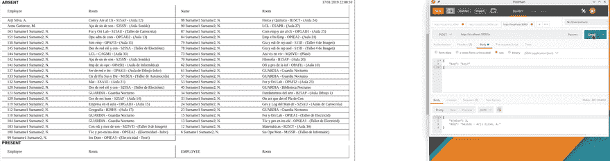](https://res.cloudinary.com/practicaldev/image/fetch/s--05UN6cJg--/c_limit%2Cf_auto%2Cfl_progressive%2Cq_66%2Cw_880/https://cdn-images-1.medium.com/max/1000/0%2AbYID6EW0MszXitX4.gif)

### 嗯……我们走吧！

第一步是使用 [angular-cli](https://cli.angular.io/) 创建一个新项目:

[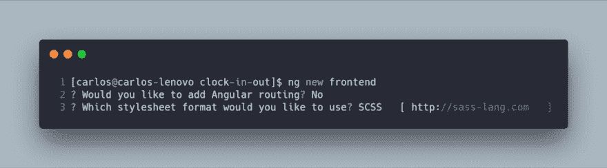](https://res.cloudinary.com/practicaldev/image/fetch/s--VKA1N34P--/c_limit%2Cf_auto%2Cfl_progressive%2Cq_auto%2Cw_880/https://cdn-images-1.medium.com/max/1000/1%2AgBL-sUzQ0-tSXo2xSUPYDA.png)

在我们的上下文中，不需要路由，因为我们的前端不是一个 [SPA](https://en.wikipedia.org/wiki/Single-page_application) (OMG！那你为什么用 Angular？因为这是一个简单的教程，展示如何整合 [NestJS](https://nestjs.com/) + [Angular](https://www.angular.io/) 。

下一步是安装几个依赖于我们代码的库( [Angular Material](https://material.angular.io/) ):

我们的项目有三个要点:

1.  **AppModule** :这是主模块，负责启动其他模块。
2.  **UserComponent** :这个组件用于添加新用户和他们的密钥(这只是出于管理目的，尽管没有任何安全性)。
3.  TicketingComponent :这是最重要的组件，因为这是用应该在建筑物中工作的用户的信息刷新屏幕的组件。

现在，我将展示并解释每个模块。

### [应用模块](#appmodule)

这是用于启动其他模块的模块。在下面的代码中，我正在加载模块:

1.  **角状物质**:
    1.  **MatTableModule** :显示建筑物内用户列表的表格。
    2.  **MatInputModule** :表单的输入，将用于添加用户-键对。
2.  **RouterModule** :这个模块将用于加载打卡/下班和管理页面。
3.  **FormsModule** :这个模块需要在我们的项目中使用模板驱动的表单。
4.  **浏览器模块**和**浏览器模块**:这些是在浏览器中使用 Angular(和动画)所需的模块。
5.  **HttpClientModule** :这个模块将用于使用 HTTP 协议进行前端和后端的通信。

`Route[]`是加载组件的路径。在我们的例子中很简单，
，因为默认路径将加载`TicketingComponent`，路径`/user`
将加载我们的管理页面(`UserComponent`)。

最后，我们必须在`AppModule` : `AppComponent`，
，`UserComponent`和`TicketingComponent`中声明我们的组件

[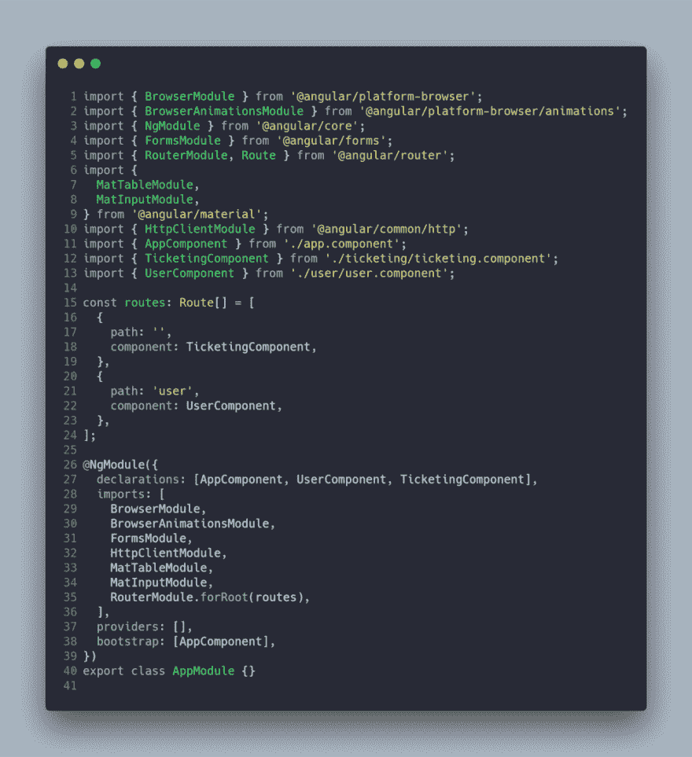](https://res.cloudinary.com/practicaldev/image/fetch/s--9VPn3YTr--/c_limit%2Cf_auto%2Cfl_progressive%2Cq_auto%2Cw_880/https://cdn-images-1.medium.com/max/1000/1%2ATlKbBS3AaldYZhX9BcaPSg.png)

`AppComponent`是我们应用的引导程序。这个组件只运行
`router-outlet`。

[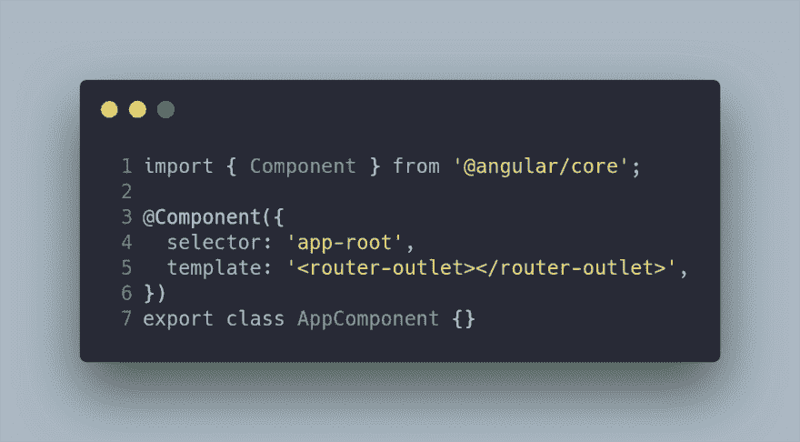](https://res.cloudinary.com/practicaldev/image/fetch/s--pkDX067q--/c_limit%2Cf_auto%2Cfl_progressive%2Cq_auto%2Cw_880/https://cdn-images-1.medium.com/max/1000/1%2AxCXDW11BLAG1R6gIbT0vlw.png)

### 常量和环境

在我们开发的任何软件中，我们都需要不同的常量和环境变量，即 [http://localhost:4200](http://localhost:4200/) 是开发 Angular app 的传统 URI，尽管你在部署 app 时需要改变域或端口。为此，Angular 为我们提供了在不同环境之间变化的配置。

所以，文件`AppSettings`可以定义我们的每一个常量。最重要的
常量是从文件`environment`中提供的 APIENDPOINT。

在开发 Angular
应用程序时，默认情况下会加载`environment`文件:

[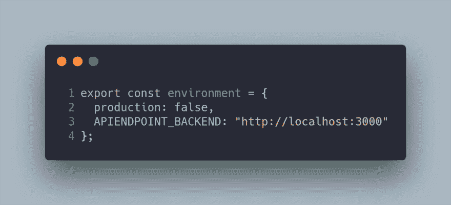](https://res.cloudinary.com/practicaldev/image/fetch/s--YL7wFDcM--/c_limit%2Cf_auto%2Cfl_progressive%2Cq_auto%2Cw_880/https://cdn-images-1.medium.com/max/1000/1%2A6ySFg0s64E9RCm6TljD1wQ.png)

`environment.production.ts`文件中唯一的不同是`APIENDPOINT_BACKEND`常量，它包含部署我们的应用程序的机器的名称(在我们的例子中，是一个 docker 容器)。

[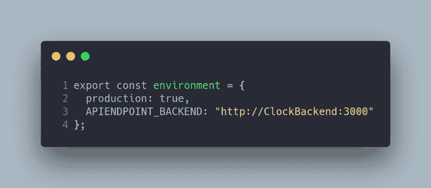](https://res.cloudinary.com/practicaldev/image/fetch/s--hKIMxAVm--/c_limit%2Cf_auto%2Cfl_progressive%2Cq_auto%2Cw_880/https://cdn-images-1.medium.com/max/1000/1%2ASGtW7sr7hmhHAZOKX0kDNQ.png)

### 票务组件

票务组件是这个项目中最有趣的一段代码，
因为它是使用 [RxJS](https://rxjs-dev.firebaseapp.com/) 开发的，使系统接近实时。这个例子没有使用 redux，所以从逻辑部分使用双重数据绑定来刷新模板。该组件的模板如下。

[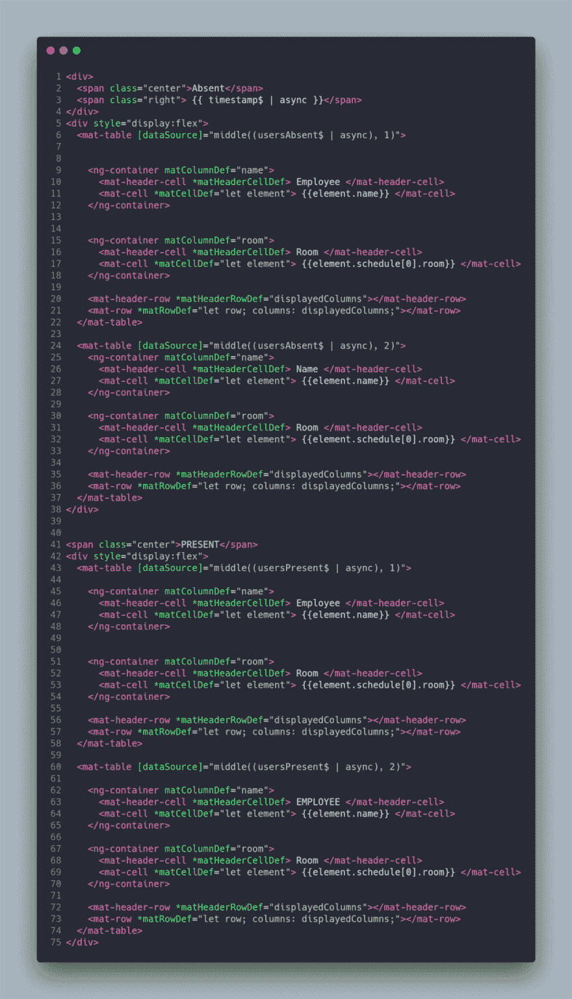](https://res.cloudinary.com/practicaldev/image/fetch/s--KtTqmz1E--/c_limit%2Cf_auto%2Cfl_progressive%2Cq_auto%2Cw_880/https://cdn-images-1.medium.com/max/1000/1%2AhOglaVPJSlisE-cC6km0eg.png)

您可能注意到模板有几个`Observable$`，它们是使用管道`async`呈现的。例如，在下面的代码中，`span`标签重新定义了可观察对象`timestamp$`的订阅结果。这个管道是传统的`subscribe`方法的语法糖。你可以在[官方文档中读到更多关于这个管道的信息。](https://angular.io/api/common/AsyncPipe)

模板的另一个有趣的地方是组件`Material Datatable`的使用，它可以使用输入`[source]`接收一组要在表格或可观察对象中呈现的数据，但是在我们的例子中`Datatable`将接收一组数据(之后管道`async`将完成它的工作)。此外，数据显示在两个不同的表格中，因此使用`middle`方法将数据分成两组。

CSS 非常简单，如以下代码所示:

[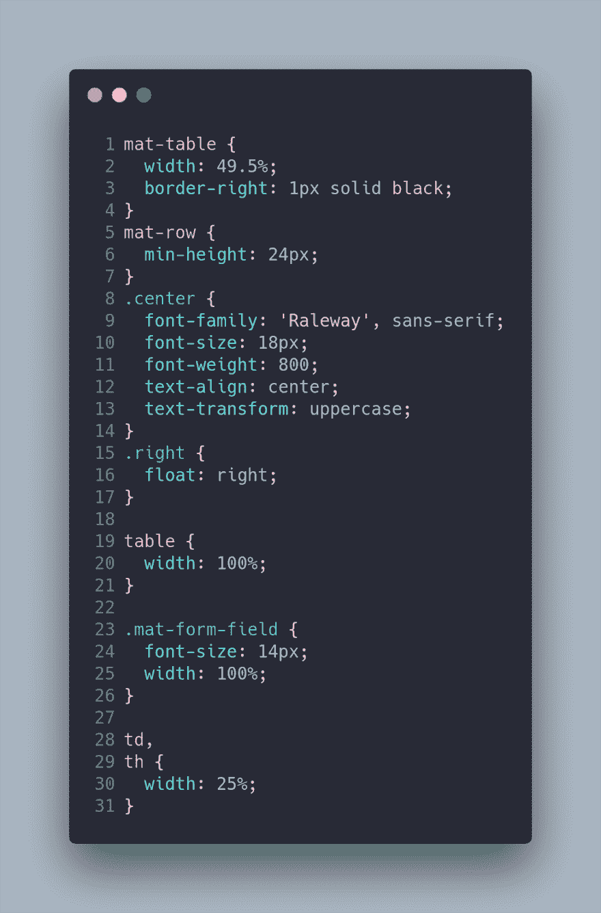](https://res.cloudinary.com/practicaldev/image/fetch/s--GtqRUV_D--/c_limit%2Cf_auto%2Cfl_progressive%2Cq_auto%2Cw_880/https://cdn-images-1.medium.com/max/1000/1%2AZTCSM2Ghf2FOSyZ7cMuNag.png)

虽然这篇文章不是关于 CSS 的，但是你必须知道永远不要使用`id`来设计你的网站(你可以在[开发到](https://dev.to/claireparker/reasons-not-to-use-ids-in-css-4ni4)、 [CSSWizard](https://csswizardry.com/2011/09/when-using-ids-can-be-a-pain-in-the-class/) 、T5[开发设计](https://www.developingdesigns.com/stop-using-ids-in-your-css/)中读到更多关于这个事实的内容)。

我们的 CSS 文件很简单，因为它只是设计了我们的表格(必须有 49.50%的`width`和不同的字体大小调整)。

我现在将揭示这篇文章中最有趣的一段代码,`TicketingComponent`,它具有以下属性:

[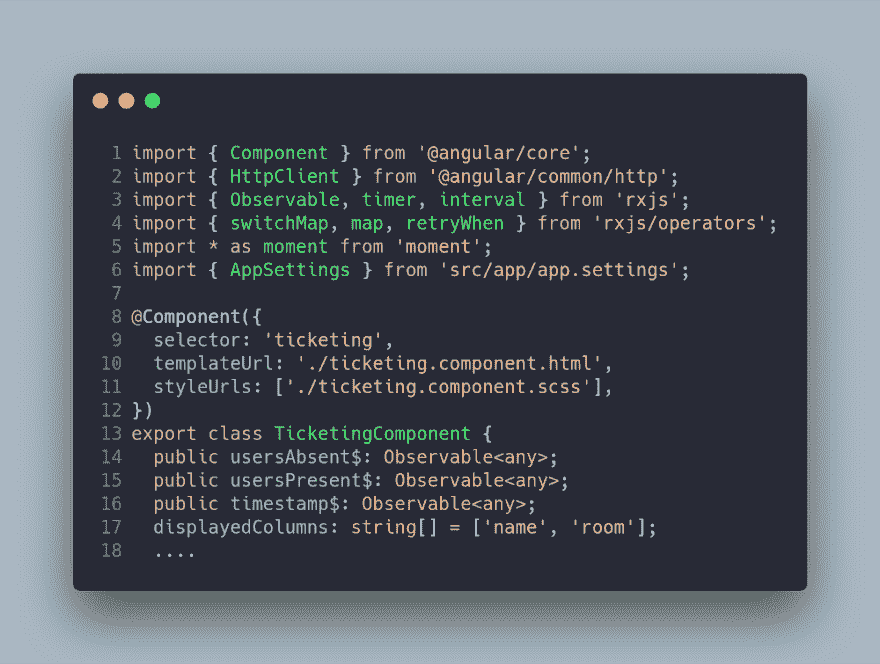](https://res.cloudinary.com/practicaldev/image/fetch/s--Z0rNmv1T--/c_limit%2Cf_auto%2Cfl_progressive%2Cq_auto%2Cw_880/https://cdn-images-1.medium.com/max/1000/1%2ARqzp4ihwKATBfUsZ_tz-DA.png)

我们每个属性的描述是:

*   `usersAbsent$`:这是包含不在建筑中的`User`列表的可观察对象。
*   `usersPresent$`:这是一个可观察对象，包含了建筑中的`User`列表。
*   `timestamp$`:这是包含来自服务器的时间戳的可观察对象。
*   `displayedColumns`:将在表格中显示的列的数组。

重要的是要记住，我们在代码中使用可观察对象，通过使用 [RxJS](https://rxjs-dev.firebaseapp.com/) 操作符为我们提供流操作的能力。这些观察值是使用模板中的管道`async`订阅的。

我们的下一步是组件构造函数，真正的魔力出现了！您
必须理解 [RxJS](https://rxjs-dev.firebaseapp.com/) 中的流，以便
能够理解以下代码:

[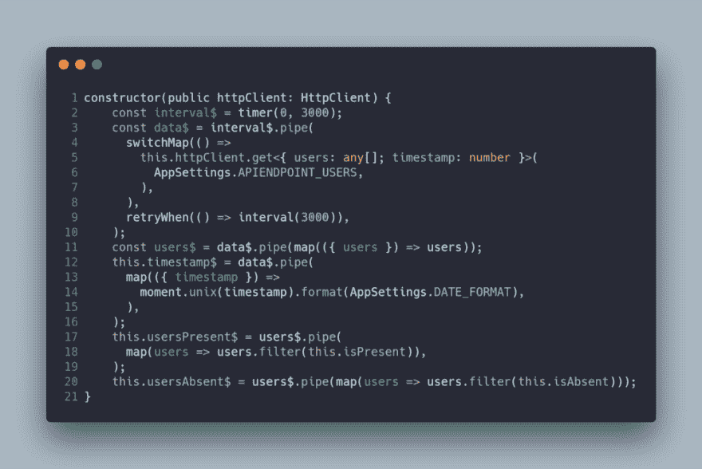](https://res.cloudinary.com/practicaldev/image/fetch/s--f_rFPFpI--/c_limit%2Cf_auto%2Cfl_progressive%2Cq_auto%2Cw_880/https://cdn-images-1.medium.com/max/1000/1%2ADQjwroGQrG_ciP2YAv7yMg.png)

该代码执行以下操作:

使用`timer`操作符创建可观察对象`interval$`，反过来
每 3000 毫秒触发一次调用。在接下来的代码行中，您可以看到
如何从可观察对象`interval$`创建可观察对象`data$`，可观察对象`interval$`使用`httpClient`服务运行
http 请求。

然后，`get`请求返回一个包含用户列表和时间戳的对象(来自服务器)。这段代码片段的两个部分与
特别相关:

1.  操作符`switchMap`用于在发出新请求时取消未完成的请求(以避免同时发出多个请求)。
2.  操作符`retryWhen`用于处理服务器错误。例如，如果客户端或服务器中的连接丢失，您将需要再次重试请求。因此，当代码出错时，将在 3000 毫秒内重试请求。

好了，现在可观察对象`data$`有了一个包含用户列表和时间戳信息的流。可观察对象`users$`由可观察对象`data$`创建，后者在每个数据流中进行析构(这就是`map`操作符存在的原因)。如果你已经理解了前面的代码，你可以想象可观测的`timestamp$`是如何产生的。这个时间戳是 unix 格式的，我们需要将其转换为 DATE_FORMAT (DD/MM/YYYY)。

或许你现在可以想象`usersPresent$`和`usersAbsent$`可观察量是如何从`users$`可观察量中产生的。对于这些可观测量，你必须使用 [RxJS](https://rxjs-dev.firebaseapp.com/) `map`操作符来创建一个新的可观测量，使用 Array.prototype `filter`方法。最后一步是创建私有的`isPresent`和`isAbsent`方法，如下所示:

[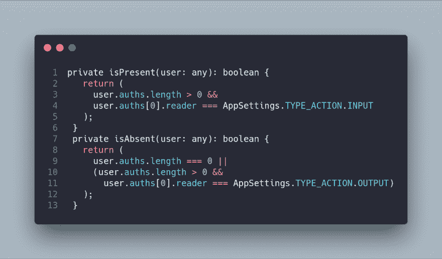](https://res.cloudinary.com/practicaldev/image/fetch/s--LDUXNSaT--/c_limit%2Cf_auto%2Cfl_progressive%2Cq_auto%2Cw_880/https://cdn-images-1.medium.com/max/1000/1%2ACHP7nzhXFbvYPmv2c6fH-g.png)

这些方法基本上都是检查用户是否得到了系统的授权，动作是`INPUT`还是`OUTPUT`。

因此，完整的控制器代码如下:

[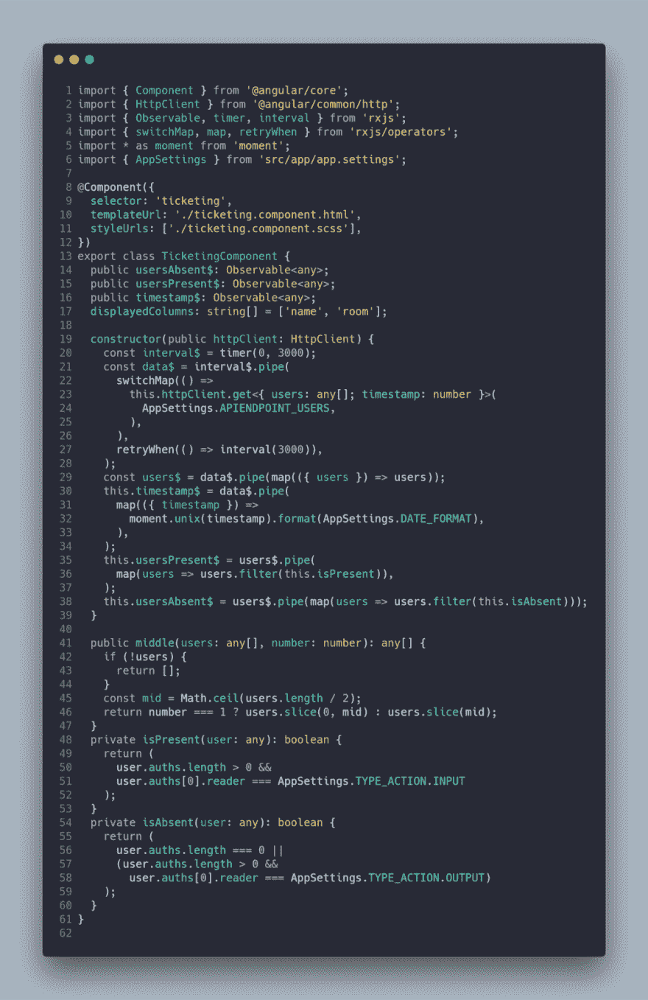](https://res.cloudinary.com/practicaldev/image/fetch/s--yT8m3Me4--/c_limit%2Cf_auto%2Cfl_progressive%2Cq_auto%2Cw_880/https://cdn-images-1.medium.com/max/1000/1%2ARkuV3mZfGSaqFZ0raQbsxw.png)

### 用户组件

我们基本前端的最后一个组件是`UserComponent`，它是一个简单的表单，用于向我们的数据库添加用户和密钥。构建这个组件的想法与在`TicketingComponent`中使用的相同。因此，模板使用`async`管来做操作`subscribe`。

[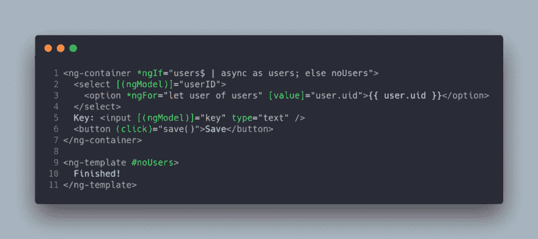](https://res.cloudinary.com/practicaldev/image/fetch/s--3U1BLxle--/c_limit%2Cf_auto%2Cfl_progressive%2Cq_auto%2Cw_880/https://cdn-images-1.medium.com/max/1000/1%2A9C6F5I9TLcYyQogFRVc4gQ.png)

该模板使用`ng-container`的 if-else 在无人拥有密钥时显示一条消息。

`UserComponent`代码如下:

[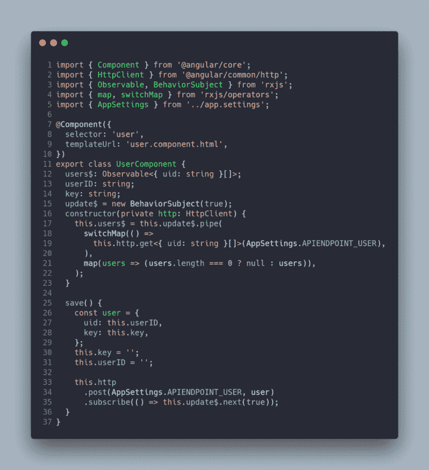](https://res.cloudinary.com/practicaldev/image/fetch/s--CBdlsCy5--/c_limit%2Cf_auto%2Cfl_progressive%2Cq_auto%2Cw_880/https://cdn-images-1.medium.com/max/1000/1%2ACcbadFxtpTQecdv7ytDSTw.png) 
为图像键入标题(可选)

在本例中，我们定义了四个相关属性:

1.  Observable `users$`包含用户的 UID 列表。
2.  包含从模板中选择的用户 ID 的字符串`userID`。
3.  字符串`key`是将分配给用户的键。
4.  可观察对象/主题`update$`,它让我们知道更新的操作已成功完成。

该构造函数与`TicketingComponent`中的构造函数非常相似，因为它通过使用`switchMap`和`map`操作符从后端恢复用户的 UID 列表。

最后，`save`方法向后端发出一个请求`POST`,请求对象是后端保存信息所需的对象。

### 结论

‌In 在这篇文章中，我解释了我的**基本前端**，它是用 Angular 和 RxJS 开发的，以确保一个接近实时的系统(使用轮询作为与服务器连接的技术)。

GitHub 项目是[https://github.com/Caballerog/clock-in-out](https://github.com/Caballerog/clock-in-out)。

这个帖子的 GitHub 分支是[https://GitHub . com/Caballerog/clock-in-out/tree/part 6-basic-frontend](https://github.com/Caballerog/clock-in-out/tree/part6-basic-frontend)。

* * *

最初发布于[www . carloscaballero . io](https://carloscaballero.io/part-6-clock-in-out-system-basic-frontend/)2019 . 1 . 18。