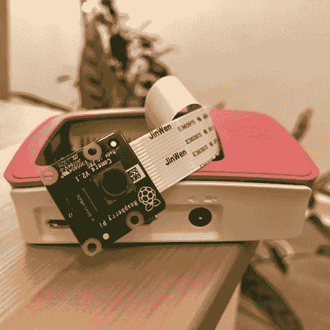

# 用 Python 为 Raspberry Pi 编写实时摄像机代码(教程)

> 原文：<https://dev.to/healeycodes/coding-a-live-cam-for-the-raspberry-pi-in-python-tutorial-268k>

注意到我说的*直播镜头*而不是*直播流*了吗？因为我们将会处理正常的图像。回到 15 年前，这项技术令人兴奋。实时天气摄像机和自然摄像机非常酷。当我们的 Raspberry Pi 和 web 服务器之间的连接不可靠时(例如 WiFi)，基于图像的直播流也更加健壮。

[](https://res.cloudinary.com/practicaldev/image/fetch/s--t2mFilnU--/c_limit%2Cf_auto%2Cfl_progressive%2Cq_auto%2Cw_880/https://thepracticaldev.s3.amazonaws.com/i/w6vzvvyzhnajqjp257p5.png)

这种方法可以达到大约 5-10fps，具体取决于图像分辨率。在[库](https://github.com/healeycodes/Raspberry-Pi-Live-Cam)中有一个`benchcamera.py`脚本，你可以在你的 Pi 上运行来测试。这个项目的完整安装说明也可以在回购中找到。

让我们从 web 服务器开始，从后往前进行。我们将要编写的 Flask 应用程序可以在任何地方托管。它的工作是从 Pi 接收图像，存储最新的图像，并将该图像提供给客户端。临时存储这个图像是这个项目中最棘手的部分。我们希望我们的应用程序可以扩展到几百个客户端。Flask 应用程序通常由 uWSGI 或 Gunicorn 等服务器托管，它们部分通过使用线程来处理负载。

为每个用户创建不同的应用线程。这些实例不能在应用程序级别共享状态。我们通过将图像数据存储在名为`global.db`的本地 SQLite 数据库中来解决这个问题。对于数据库来说，处理多个读取器和写入器很容易。他们通过使用*锁*来处理它。这确保了我们的 Flask 应用程序不会在写入数据库的中途请求图像，然后将损坏的数据发送给客户端。

#### 烧瓶 App

```
# app.py 
import os
import sqlite3
from flask import Flask, request, g
app = Flask(__name__)

DATABASE = 'global.db'

# helper method, allows database access within a controller def get_db():
    db = getattr(g, '_database', None)
    if db is None:
        db = g._database = sqlite3.connect(DATABASE)
    return db

# create our database structure, which is akin to a dict with one key def init_db():
    db = sqlite3.connect(DATABASE)
    cur = db.cursor()
    cur.execute('''CREATE TABLE IF NOT EXISTS store
                (id INTEGER PRIMARY KEY, image BLOB)''')
    cur.execute("INSERT OR IGNORE INTO store (id, image) VALUES (1, '')")
    db.commit()
    db.close()

# initialize db init_db()

# close the database connection after every request ends @app.teardown_appcontext
def close_connection(exception):
    db = getattr(g, '_database', None)
    if db is not None:
        db.close() 
```

当我们启动我们的应用程序时，我们需要确保有一个表格，并且在表格中有一个存储图像的槽。同时，我们不想覆盖现有的图像。因此，我们只创建一个不存在的表`CREATE TABLE IF NOT EXISTS`，然后创建一行，我们将使用类似的逻辑`INSERT OR IGNORE`。

上传控制器(也称为*处理器*)位于根路径上，只接受 POST 请求。它还检查名为`PASSWORD`的环境值。(在 HTTP 上查询参数是不安全的，但是在 HTTPS 上[更安全](https://stackoverflow.com/questions/2629222/are-querystring-parameters-secure-in-https-http-ssl))。

```
# recieve images and write to db as BLOB if the password is correct @app.route('/', methods=['POST'])
def update_image():
    db = get_db()
    cur = db.cursor()
    if request.args.get('password') != os.environ['PASSWORD']:
        return '', 400
    else:
        image = [request.data]
        cur.execute(
            "UPDATE store SET image=? WHERE id=1", image)
        db.commit()
        return '', 200 
```

我们现在可以接收图像了！我们将只存储一个图像:最新的图像。将该图像提供给任何发出请求的客户机都很简单。

```
# share images naively and let browsers interpret the BLOB as jpeg @app.route('/live.jpeg')
def get_image():
    cur = get_db().cursor()
    image = cur.execute("SELECT image FROM store WHERE id=1").fetchone()[0]
    return image, 200 
```

如果我们将此图片的链接设为``，我们的客户将会看到一张静态图片。他们在页面上停留的时间越长，这张图片就越过时。他们可以随时刷新以强制更新，但这是浪费。一个简单的解决方案是使用 JavaScript 通过`setInterval`强制刷新图像。我们可以使用这个逻辑来构建一个 live cam 小部件。我们的测试路线使用这个，所以我们可以确保我们的图像被接收。

```
# test route that mimics having a live cam @app.route('/test')
def test_image():
    return '''<script>setInterval(() =>
        document.querySelector(\'img\').src = \'/live.jpeg?\' + Date.now(), 150)</script>''' 
```

我们缓存以确保浏览器不会认为它的缓存中已经有了图像源。缓存溢出的一种方法是在请求的末尾添加一个惟一的查询字符串(最终什么也不做)，比如以毫秒为单位的当前日期:`?1552907804662`。

```
$ PASSWORD='123'
$ FLASK_APP=app.py flask run
 * Running on http://localhost:5000/ 
```

有关 Flask 的安装和运行问题，请参见他们的[文档](http://flask.pocoo.org/)。

#### 树莓派脚本

运行在 Pi 上的脚本将捕获图像并通过 POST 请求发送它们。我们用`pip install requests picamera`安装我们的模块。脚本通过`python camera.py`或`python3 camera.py`运行。

```
# camera.py 
import io
import time
import requests
import picamera

# change this line to your Flask app's address! url = 'http://192.168.1.100:5000/?password=123'

framerate = 90
quality = 100
res = (1280, 720)
with picamera.PiCamera(framerate=framerate, resolution=res) as camera:
    time.sleep(2)  # camera warm-up time
    while True:
        try:
            image = io.BytesIO()
            camera.capture(image, 'jpeg', quality=quality, use_video_port=True)
            r = requests.post(url, data=image.getvalue())
            # place a `time.sleep` here if you want a slower live cam
        except:
            time.sleep(5)  # wait for WiFi/server to come back 
```

为了最大限度地延长正常运行时间，您可能希望将它作为一个[启动脚本](https://www.google.com/search?q=rc.local)运行。如果有网络问题，脚本将继续尝试张贴图像，直到它通过。如果您的 Pi 有问题，我们的 Flask 应用程序将继续提供它收到的最新图像。健壮！

#### 可能的改进

一些想法，以改善项目，但使它成为一个更差的教程。

*   向 SQLite 添加一个侦听器，并将最新的图像缓存在内存中。
*   通过 WebSocket 上传图像(节省带宽和延迟)。
*   当图像到达时，通过 WebSocket 向客户端提供图像(同上)。
*   使用 Flask 上传图像，通过 HTTP 服务器将图像作为静态文件提供(无限扩展)。
*   接收图像时，将其缩放至不同的分辨率(如`/live800x600.jpeg`)。

如果您在🛠️.遇到问题，请联系我们，或在 GitHub 上提出问题

* * *

加入我的关于编程和个人成长的[时事通讯](https://buttondown.email/healeycodes)的 150 多人注册！

我发关于科技的微博。