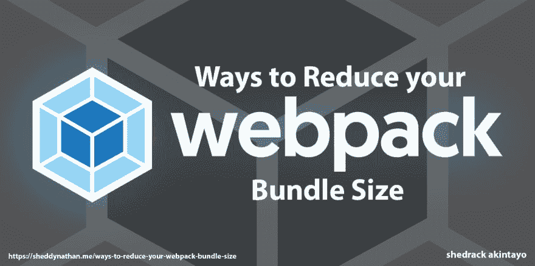

# 减少 webpack 捆绑包大小的可能方法| JS 秘密

> 原文：<https://dev.to/coder_blvck/possible-ways-to-reduce-your-webpack-bundle-size-js-secrets-550>

[](https://res.cloudinary.com/practicaldev/image/fetch/s--D_GSwpKK--/c_limit%2Cf_auto%2Cfl_progressive%2Cq_auto%2Cw_880/https://cdn-images-1.medium.com/proxy/1%2AmMApZzre4jYR5owWyF8Vug.jpeg)

原图片来源:[https://images . ctfassets . net/NJ 2 cais 7 hkjw/3 vofddtp 5 sowweskioagm/a 111 DDD 784928 b 61045 c8e 811 e 1769 be/web pack . png](https://images.ctfassets.net/nj2caiz7hkjw/3VoFdDTP5SowwESKIOAgm/a111ddd784928b61045c8e811e1769be/webpack.png)

据 [webpack 官网](https://webpack.js.org/concepts)介绍，webpack 是现代 JavaScript 应用的*静态模块捆绑器*。当 webpack 处理您的应用程序时，它会在内部构建一个[依赖图](https://webpack.js.org/concepts/dependency-graph/)，它会映射您的项目需要的每个模块，并生成一个或多个*包*。

Webpack 可以在一个单独的任务运行器旁边负责捆绑。然而，由于社区开发的 webpack 插件，bundler 和 task runner 之间的界限变得模糊了。有时这些插件被用来执行通常在 webpack 之外完成的任务，比如清理构建目录或部署构建。

它主要是 JavaScript 的一个模块捆绑器，但是它可以用来转换你所有的前端资产，比如 HTML，CSS，甚至图像。它可以让您更好地控制应用程序发出的 HTTP 请求的数量，并允许您使用这些资产的其他风格(例如，Pug、Sass 和 ES8)。Webpack 还允许您轻松地使用 npm 中的包。

Webpack 对于 javascript 应用程序来说是一个非常棒的静态捆绑器，但是当 webpack 的大小增加时，事情会变得有点混乱，这会大大降低 javascript 应用程序的加载时间。

这里有一些很酷的方法可以减少你的 webpack 包的大小:

### 范围吊装

范围提升使用一种更智能的方式将模块添加到包中。

范围提升可以做什么:

●使浏览器中的 JavaScript 执行速度更快

●可以减小包的大小

我该怎么做？

在 webpack.config.js 文件的 plugin 部分添加这一行:

```
​​ webpack.optimize.ModuleConcatenationPlugin() 
```

Enter fullscreen mode Exit fullscreen mode

虽然，它需要 webpack 3 或更高版本。

### 生产中使用 WEBPACK 4

这非常重要，因为在生产中使用 webpack 4 会自动删除所有不必要的空白、换行符等。它还可以告诉一些包不包括调试代码。

我该怎么做？

像这样创建您的产品包

```
webpack -p --mode=production 
```

Enter fullscreen mode Exit fullscreen mode

它做的事情:

●使用 UglifyJS

启用缩小功能●将 NODE_ENV 设置为生产

### 使用 lodash web pack 插件

如果您在 javascript 项目中使用 lodash，您可能想查看 lodash-webpack-plugin。它会删除您不使用的 lodash 功能。这将大大减少您的包大小。

我该怎么做？

使用命令
从 npm 安装依赖项

```
npm install lodash-webpack-plugin -save--dev 
```

Enter fullscreen mode Exit fullscreen mode

并且需要你的 webpack.config.js 顶部的模块:

```
​​ LodashModuleReplacementPlugin = ​require​(​’lodash-webpack-plugin’​); 
```

Enter fullscreen mode Exit fullscreen mode

将这一行添加到 webpack.config.js 的插件部分

```
new LodashModuleReplacementPlugin 
```

Enter fullscreen mode Exit fullscreen mode

### 使用捆绑包分析器工具

webpack 生成的包不能被人类读取。但是使用 bundle analyzer，人们可以在交互式树形图中可视化输出的 bundle 文件。

我该怎么做？

有许多 webpack 捆绑包分析工具。在我看来，这两个是最好的:

●[https://github.com/th0r/webpack-bundle-analyzer](https://github.com/th0r/webpack-bundle-analyzer)

●[https://github.com/danvk/source-map-explorer](https://github.com/danvk/source-map-explorer)

### 树摇晃

树抖动是从您的包中移除死代码的过程。死代码是指没有被导入到任何地方就被导出的代码。

我该怎么做？

**1)使用 ES6 模块语法**

确保使用 ES6 模块，并尽可能通过模块名导入。像这样:

```
import { connect } ​from ”react-redux”​; ​​ ​ 
```

Enter fullscreen mode Exit fullscreen mode

而不是:

```
​​ import reactRedux ​from ”react-redux”​; ​​ ​ 
```

Enter fullscreen mode Exit fullscreen mode

**2)更新. babel.rc**

添加模块:false 到你的巴别塔配置(通常在。babel.rc)。

如果您使用的是 es2015 预置，它应该是这样的:

```
presets: [[​”es2015"​, { ​”modules”​: ​false​ }] ] 
```

Enter fullscreen mode Exit fullscreen mode

如果你使用的是 babel-preset-env，那么它应该是这样的:

```
presets: [[​”env”​, { ​”modules”​: ​false​ }] ] 
```

Enter fullscreen mode Exit fullscreen mode

**3)确保您使用的是 webpack 2 或更高版本**

### 代码拆分

有了 webpack，你可以把你的包分成许多更小的包，只加载每个页面需要的包。您甚至可以异步加载包！

例如，如果您有一个模态，那么您可以通过仅在用户单击打开该模态的按钮时加载该模态的代码来执行代码拆分。这将增加加载时间，因为您在初始页面加载时没有加载任何模态代码

我该怎么做？

阅读有关代码拆分工作原理的更多信息:

● [代码分割](https://webpack.js.org/guides/code-splitting/)

### 参考文献

●[https://survivejs.com/webpack/what-is-webpack/](https://survivejs.com/webpack/what-is-webpack/)
T3】●[https://www . sitepoint . com/初学者-指南-web pack-模块-捆绑/](https://www.sitepoint.com/beginners-guide-webpack-module-bundling/)

●[https://webpack.js.org/concepts](https://webpack.js.org/concepts)

*最初发表于*[*sheddynathan . me*](https://sheddynathan.me/ways-to-reduce-your-webpack-bundle-size/)*。*