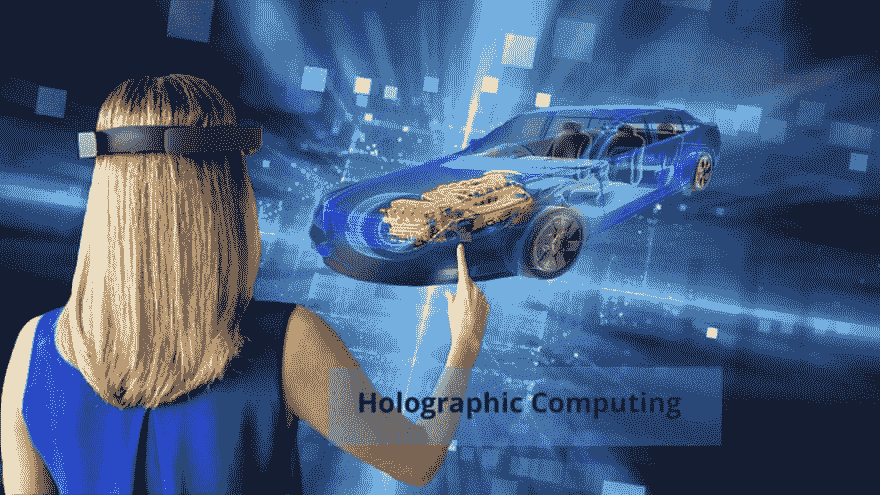

# Windows 混合现实应用开发的全息计算可能性

> 原文：<https://dev.to/decipherzonesoft/holographic-computing-possibilities-with-windows-mixed-reality-app-development-5a18>

进入 21 世纪劳动力市场的这一代人已经被全息计算的想法所迷惑。漫威的电影和 DC 漫画反复展示了像钢铁侠系列中的贾维斯这样的全息计算机，但没有人会想到它会在现实中与我们一起发生时成为现实。微软的 HoloLens 项目在传感器、神经科学、人工智能、虚拟现实耳机和增强现实的帮助下，将这种幻想塑造成了现实。

微软的 HoloLens 项目(一个全息计算项目)主要面向大规模公司，现已作为混合现实[软件开发](https://decipherzone.com)工具包提供给开发者，任何人都可以使用它来制作混合现实应用。在我们进一步讨论之前，有必要在虚拟现实、增强现实和混合现实之间划清界限。

**虚拟现实**

内容是以这样的方式制作的，它将用户置于参考点上，并且视图根据他/她看的方向而改变。这也是使用 360 度摄像头和 VR 头戴设备的原因。

**增强现实**

在增强现实中，用户可以与虚拟现实部分下创建的内容进行交互。我们可以触摸一只虚拟宠物，并期待它的回应。Pokémon Go 就是增强现实的一个例子。

**混合现实**

混合现实是虚拟世界映射现实世界的一个部分，行为反应会相应地改变。现在你可以有一只虚拟的猫，它知道现实世界中的老鼠在哪里，并且会追着它跑。

现在很明显，混合现实应用程序开发受到了人们的关注，因为它将创建现实和虚拟世界都能够相互交互的应用程序。具有愿景的全息计算应用正在开发中，用于部署到以下行业:

**汽车**

每当一家公司必须开发一款新车时，他们都会在 AutoCAD 中创建其 3d 设计，并创建其原型以在现实世界中进行测试。虽然 AutoCAD 提供了很多关于车辆部件应力的信息，并建议了应该使用的材料尺寸，但对于真实世界的情况来说还不够，这就是为什么要制作测试原型。由于制造原型的成本较高，公司受到测试次数的限制，因此产品通常达不到完美的水平。有了人工智能和混合现实，这些测试可以在虚拟世界中运行，这些测试的数据可以递归地馈入人工智能训练的模型，以获得产品的最大程度的完美。自第一代微软 HoloLens 诞生以来，大众汽车一直在使用混合现实应用程序来设计汽车。

**自动化**

自动化已经成为我们生活的一部分有一段时间了，它正在从大型工业机器转向微型机器。该行业正面临着与汽车行业几乎类似的问题，缺乏可以通过递归测试程序收集的数据。汽车和自动化行业的发展速度比软件行业慢，因此传统的真实世界递归测试方法不会在所有行业中带来并行的开发水平。因此，需要虚拟世界测试环境，从该环境中可以快速收集数据，以实现纳米尺寸机器的自动化。

**医学**

外科医生在进行手术时面临的问题是，很难找到血块和其他必须在手术过程中清除的东西。混合现实应用程序旨在帮助外科医生，他们将能够从 CT 扫描，MRI，超声波扫描等实时绘制三维视图，并可以放大或缩小以帮助他们进行手术。

**游戏**

想象一下你可以在家里玩游戏，而你却不得不去游乐园玩。游戏中的角色可以绘制现实世界的地图，并利用现实世界中你周围的植物、灌木丛和树木来隐藏在一个近距离格斗战游戏中。

全息计算的使用案例和可能性还有待探索。让我们拭目以待，看看开发者手中的这款混合现实应用开发套件会带来什么。