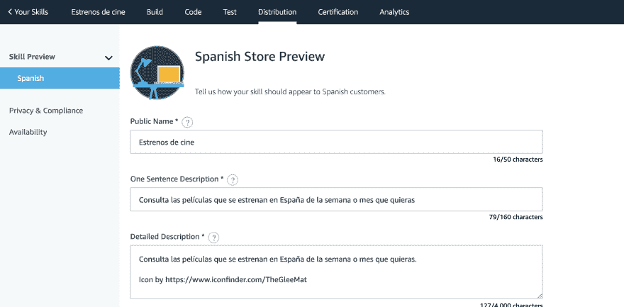
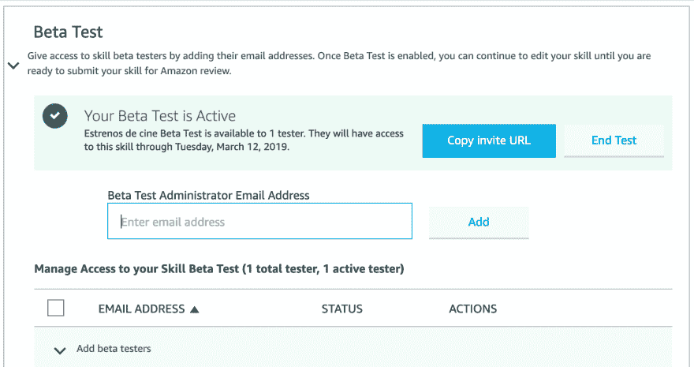
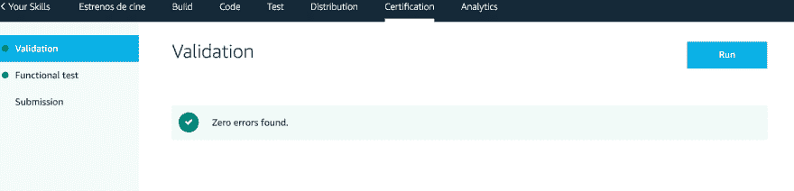
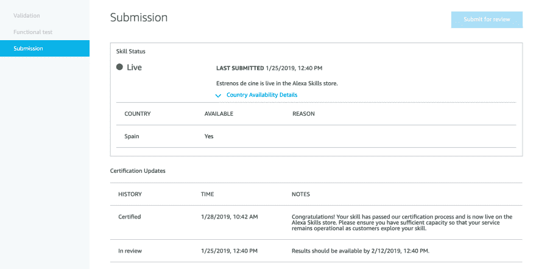

# 为 Alexa (VII)创建自定义技能:分发和认证

> [https://dev . to/kini/create-un-custom-skill-to-Alexa-VII-distribution-y-certification-a1 m](https://dev.to/kini/creando-un-custom-skill-para-alexa-vii-distribucion-y-certificacion-a1m)

有了我们看到的帖子，我们已经有了一个技能可以在认证过程中使用，并且可以在商店中发布。

## 分配

在将我们的技能发送到认证流程之前，我们必须填写亚马逊商店中相应的分发信息。为此，我们在 Alexa Developer Console 中有“*distribution”*选项卡。

填写亚马逊要求我们填写的表格很容易，这里没有什么可解释的，但我想强调一点:例句。我们在其中放置的内容将极大地影响认证过程以及用户第一次与技能交互的方式。

我把链接到[官方文件](https://developer.amazon.com/es/docs/devconsole/launch-your-skill.html)。

### 例句

仔细复习亚马逊在控制台本身给你的建议，在*例句 101* 的方框中。在我的认证过程中，我收到了有关这些句子的反馈，以便进行更改。我把我一开始的话和认证过程中给我的建议放在这里:

> 第一句:
> 目前:Alexa，开电影首映式，告诉我本周的电影
> 
> 预计:Alexa，请电影首映本周的电影。
> 
> 第二个例子句子:
> 
> 现在:Alexa，打开电影首映式，告诉我本月的首映式
> 
> 预计:Alexa，请电影首映本月的首映式。
> 
> 第三个例子句子:
> 
> 目前:Alexa，开电影首映式，告诉我下周的毛皮
> 
> 预期:Alexa，请电影明星下周的毛皮。

我从没想过这句话，当然比我的好。他非常帮助我阅读了一对给我的参考资料:[Alexa 开发者博客上的一篇文章](https://developer.amazon.com/es/blogs/alexa/post/74d0ed59-ad4f-470a-abcf-d37c10a1dfd6/crafting-great-example-phrases-that-meet-certification-requirements)和【alexa skill kit 的一份官方文件。

这些例句是认证过程中的一个关键点，我重复一遍，请大家注意。它们不仅必须具有逻辑结构，而且必须在使用时正常工作。

### 测试说明

在*隐私&合规*部分中，表格底部有一个区域，用于指示我们认为适合负责技能测试的团队的所有内容。

我的技能没什么特别的，但我认为很重要的是要清楚地说明技能的目的和一些基本使用案例。我还评论说，由于没有连接 API，我只能回答两三个月的问题。

我们在该框中预先解决的任何疑问都将有助于认证进程。

### Beta 测试

在 *Availability* 部分，我们可以控制我们的技能将在何处提供，并启用测试系统。

就我的情况而言，我使用 Beta 测试让一些我感兴趣的用户提前测试技能，而无需在商店中发布。在我看来，这种“应用程序”的开发与移动应用程序的开发一样重要。

beta 版来宾会收到电子邮件地址的通知，并可启用使用技能。这样我们就可以查看和收集其他人使用的信息。

就像任何介面设计一样，我认为从使用者互动中获得各种反馈是至关重要的。特别是，使用语音接口时，可能会有许多不同的请求，一些非常小的更改可能会产生非常大的影响。

## 认证

认证过程有两个启动前步骤:验证和功能测试。

在<u>验证过程</u>中，检查配线卡上的信息是否有遗漏。在<u>功能测试</u>中，我不清楚，因为他从来没有给过我错误，也没有发现多少关于它的信息。

为了准备认证的技能，我建议您去看看[官方医生](https://developer.amazon.com/es/docs/devconsole/test-and-submit-your-skill.html)。

### 投稿

这是亚马逊开始认证的最终过程。在这里，我要强调的是，在我和 Alexa 做爱的短短时间里，这种体验是如何得到改善的。

我第一次提交我的技能时，对这个过程没有太多反馈，只是我会在 5 个工作日内知道一些事情。但事实并非如此。由于西班牙语对技能的需求很高，所以提交过程需要几周时间，你不知道。

今年 1 月以来，这一进程得到了改进，我们掌握了更多的信息，从捕获中可以看出这一点。此外，我不知道这是否是偶然的，我第二次提交的结果比一开始告诉我的要慢得多。

* * *

不管是否通过认证过程，您都会收到亚马逊发送给您的电子邮件，通知您结果。如果过程失败，他们会向你解释故障点，并指导你如何解决这些问题。然后，您需要重新开始认证过程。一旦通过，你的技能就会在商店里可用，∞了！:)