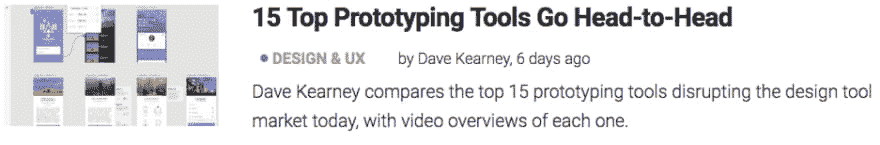
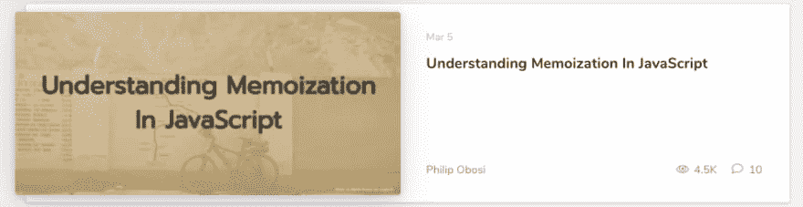

# 本周值得一读的 5 篇外星人文章👽📖

> 原文：<https://dev.to/xenoxdev/5-alien-articles-of-the-week-worth-reading--5e8>

大家好！我希望你喜欢我的上一篇文章。以下是本周最热门的外星人文章。这些是在 Dev.to 之外发布的文章，因此被称为“alien”。👽我希望你们喜欢它们！

# 1。如何用 JavaScript 操作 CSS 颜色

Javascript 无处不在，因为它可以做很多很酷的事情。无论你是否在从事这方面的工作，你都必然会被这种语言所包围。但是你有没有用它来操纵颜色呢？。如果没有，那么看看 Adam Giese 的这篇文章，他分享了一些用 javascript 操纵颜色的方法。

# 2。15 款顶级原型开发工具短兵相接

现在市场上有如此多的原型工具可用于线框和设计移交，这使得很难找出哪些工具满足什么需求。Dave Kearney 和 Daniel Schwarz 的这篇文章通过他们的视频概述解释了其中的一些工具，这将使您很容易选择满足您需求的最佳工具。

# 3。理解 JavaScript 中的记忆化

随着我们的应用程序的增长，我们有必要对它进行优化，使它运行得更快，占用的资源更少。这可以通过多种技术来实现。Philip Obosi 的这篇文章解释了这些技术中的一种，称为记忆化，它将加速应用程序。它通过存储那些需要更多时间和内存的函数的结果，当相同的输入应用于它们时，返回存储的结果。

# 4。创建一个自动化的记分牌，用树莓皮感知你的分数

你想过用 Raspberry Pi 创建自己的自动化记分牌吗？好吧，如果你有，那么你一定要看看帕特里克·卡坦扎里蒂的这篇文章，他会指导你完成整个过程。总的来说，Raspberry Pi 是一个非常有用的设备，因为它非常便宜，我建议每个工程师都拥有一台。你甚至可以用 Pi 以不到 50 美元的价格[创建你自己的 Linux 开发服务器。](https://dev.to/teamxenox/make-a-linux-dev-server-for-less-than-50life--3gc7)

# 5。JavaScript 开发人员必备的 10 个 VS 代码扩展

VS 代码无疑是最好的——如果不是最好的话——因为它为 javascript 开发人员提供了如此多的超酷和超级有用的扩展。Michael Wanyoike 分享了一些 VS 代码中的 Snippet、语法高亮、Linter 和浏览器的必备扩展，这些扩展将帮助您高效地编写和调试 js 代码。

# 让我知道你的想法！

在评论里告诉我你觉得哪篇文章最有用！另外，告诉我你最喜欢的 dev 博客，并分享你最近阅读的内容。祝你愉快！❤

