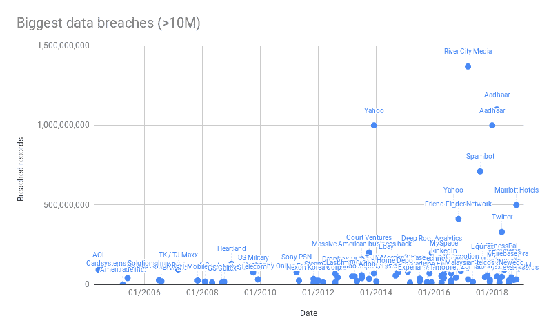

# 保护用户数据的 10 个最佳实践(以及为什么它们仍然不够)

> 原文：<https://dev.to/tanker/10-best-practices-to-protect-your-users-data-and-why-theyre-still-not-sufficient-45j1>

在过去十年中，数据泄露变得越来越具有破坏性和频繁性。大规模泄密事件经常成为头条新闻，黑客们瞄准了各个领域、各种规模的企业。正如前联邦调查局局长罗伯特·穆勒所说，“只有两种类型的公司:已经被黑客攻击的公司和将要被黑客攻击的公司”。

 

<figure>

<figcaption>数据来源:[https://informatiisbeautiful . net/visualizations/worlds-biggest-Data-breaks/](https://informationisbeautiful.net/visualizations/worlds-biggest-data-breaches-hacks/)</figcaption>

</figure>

如果你拥有任何类型的在线业务，你可能正在收集用户数据，这对你的公司和你的用户都很有价值。最简单的形式，只能是邮箱地址和密码，即使是这样的基本数据，如果泄露或被盗，也会造成重大影响。

然而，黑客不会止步于密码:信用卡号、个人信息、电子邮件地址、业务数据，一切都有一定的价值，此类违规行为的业务影响可能是灾难性的。为了保护您用户的数据，进而保护您的业务，以下是您应该遵循的十项最佳安全实践。

## 让数据窃取更加困难

**1-使用防火墙和 VPN 保护公司数据**

也许最明显的安全措施是:保护您的内部网络免受外部访问。设置防火墙以保护对您数据的访问，并设置 VPN 以保护远程访问。

**2-制定详细的密码策略**

高达 80%的人重复使用自己的密码，在工作中使用个人密码或使用非常糟糕的密码，其中“123456”和“password”仍然是 2018 年使用最多的密码 [1](#fn1) 。拥有完善的内部密码策略对于防止不必要的访问至关重要。

使用密码管理器 [2](#fn2) ，尽可能启用双因素认证 [3](#fn3) 。所有密码也应定期更改。

**3-定期备份您的数据以避免勒索软件攻击**

网络犯罪的最新趋势是获取您的业务数据，对其进行加密，并向您的公司勒索金钱以取回这些数据。这被称为勒索攻击 [4](#fn4) ，它可以通过频繁更新备份来轻松缓解。这些备份应该加密并存储在受保护的位置。

**4-建立网络安全文化**

随着远程工作和 BYOD 实践变得越来越普遍，员工的安全意识面临着前所未有的压力。就安全风险和问题对所有员工进行教育，并制定完善的安全政策供他们遵循，这一点至关重要。

网络钓鱼或社会工程是黑客获取数据或信息的常用方法。你的员工应该知道如何发现他们并做出反应。

## 保护您的网站或应用程序

**5-使用相关的开发实践**

发布一个包含安全漏洞的被窃听的网站或应用程序会导致灾难性的攻击:跨站点脚本、SQL 注入、账户盗窃 [5](#fn5) …

使用相关的开发实践可以降低出现此类漏洞的风险。您应该确保所有投入生产的代码都经过审查和测试。依赖关系应该保持最新，并检查漏洞。使用工具 [6](#fn6) 自动检测潜在漏洞。

**6-执行第三方安全审计**

虽然仍然有必要自己检查和测试应用程序的代码，但你不应该只依靠你的团队来确保你的应用程序是安全的。聘请外部安全公司定期(至少一年一次)对您的代码和基础设施进行安全审计。

## 限制未授权数据访问的影响

**7-不要存储纯文本密码**

存储用户密码不是一件容易的事情。太多的公司按原样存储密码，或者使用弱的/过时的散列算法。纯文本密码对任何黑客来说都是黄金，会严重影响用户的信任。

使用 Argon2 [7](#fn7) 等安全哈希算法对您存储的任何密码进行哈希处理，或者使用第三方认证提供商。

**8-管理员工权限**

虽然向每个员工授予所有访问权限可能很诱人，但这在您的安全性上造成了一个巨大的漏洞。允许员工访问他们不一定需要的敏感数据会增加内部威胁和外部黑客的风险。

员工只能访问完成工作所必需的信息和资源。这就是所谓的最小特权原则 [8](#fn8) 。

**9-监控网络和动作**

如果有人在窃取你的数据，你应该能够察觉。您应该监控您的网络流量并设置自动警报。

用户行动监控解决方案旨在记录员工采取的每一项行动，并立即检测和调查可疑的用户活动。

**10-使用静态加密**

您收集的任何数据都应该加密存储。任何云存储提供商都应该有一个自动加密所有数据的选项。检查它是否已打开。如果你有自己的数据库，使用密钥管理服务 [9](#fn9) 来保护你所有的数据。

这将防止任何获得这些数据的黑客在没有获得主密钥的情况下利用这些数据(希望这是非常困难的)。

## 更进一步

如果你已经实现了以上所有内容，那么恭喜你！在数据安全和隐私方面，你是班上的佼佼者。

然而，所有这些对策只会让违规和泄密更加难以得逞。内部工作和精心策划的黑客攻击仍然是可能的，攻击者获得正确的管理员帐户仍然可以窃取存储在您的数据库中的所有用户数据。

然而，并非所有的希望都落空了，因为有一种方法可以保证你的用户的安全和隐私:把他们数据的所有权还给他们。通过在每个用户的设备上直接使用端到端加密来保护数据，您可以保证除了其合法所有者之外，没有人能够访问它。这是应用内隐私。

在 Tanker，我们花了两年时间创建了一个开源隐私解决方案，集成到您的网络或移动应用程序中，并在源头保护用户数据。

*可以免费报名，在这里试试: [https://tanker.io](https://tanker.io/) 。*

* * *

PS:本文由[Alois Jobard](http://alois-jobard.fr/)原创，发表在[油轮的媒介](https://medium.com/tanker-blog/10-best-practices-to-protect-your-users-data-f8fb64d46f09)上。由于您自己可能不在 Medium 上，我们在这里复制了它，以便您有机会在您的通知源中看到它。

* * *

1.  [https://www . teams id . com/splashdatas-top-100-worst-of-2018](https://www.teamsid.com/splashdatas-top-100-worst-passwords-of-2018)[↩](#fnref1)

2.  [https://dashlane.com](https://www.dashlane.com)，[https://lastpass.com](https://www.lastpass.com)，[https://1password.com](https://1password.com/)[↩](#fnref2)

3.  [https://en.wikipedia.org/wiki/Multi-factor_authentication](https://en.wikipedia.org/wiki/Multi-factor_authentication)↩

4.  [https://en.wikipedia.org/wiki/WannaCry_ransomware_attack](https://en.wikipedia.org/wiki/WannaCry_ransomware_attack)↩

5.  [https://www.owasp.org/index.php/Top_10-2017_Top_10](https://www.owasp.org/index.php/Top_10-2017_Top_10)↩

6.  [https://www . sqreen . io](https://www.sqreen.io/)↩

7.  [https://en.wikipedia.org/wiki/Argon2](https://en.wikipedia.org/wiki/Argon2)↩

8.  [https://en.wikipedia.org/wiki/Principle_of_least_privilege](https://en.wikipedia.org/wiki/Principle_of_least_privilege)↩

9.  [https://cloud.google.com/kms,](https://cloud.google.com/kms,)https://aws.amazon.com/kmsT4】↩