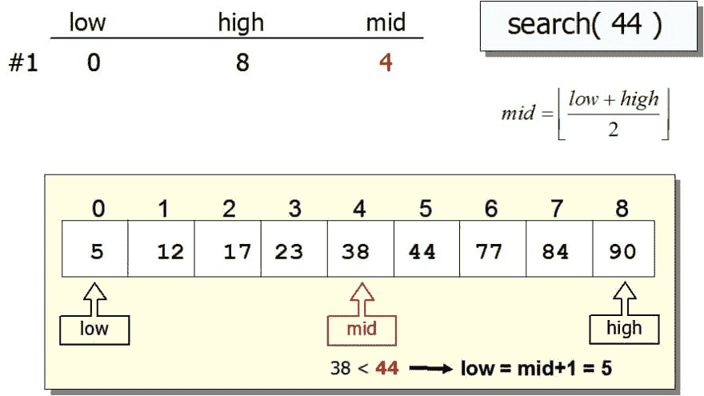
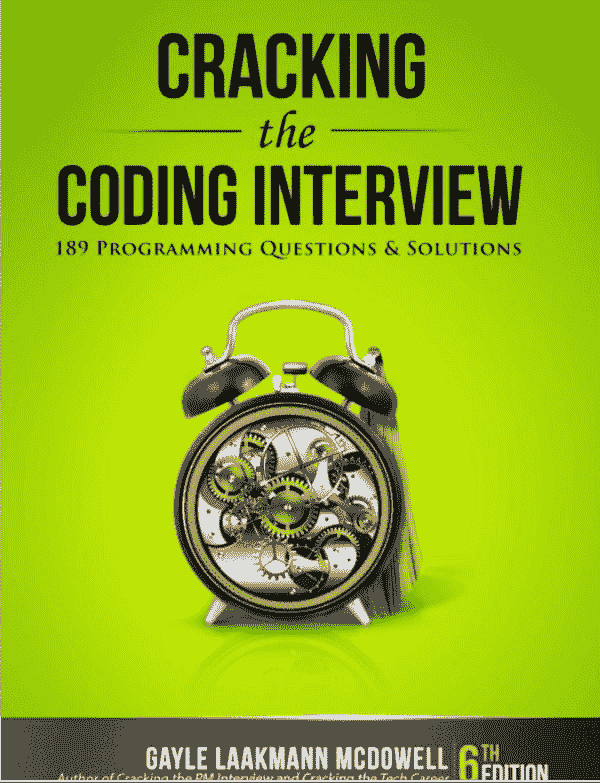
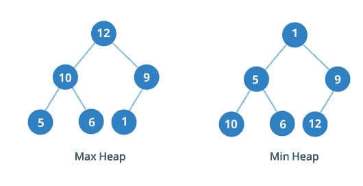
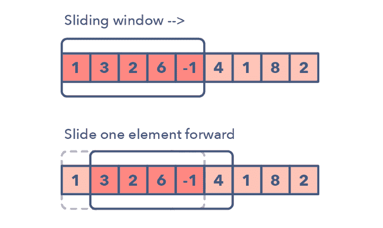
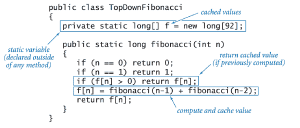
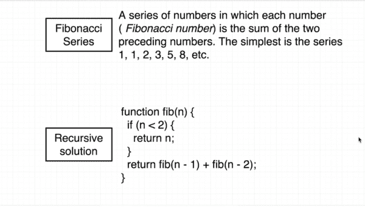
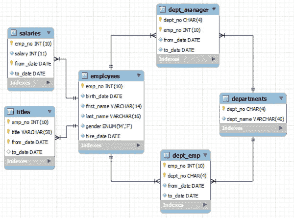
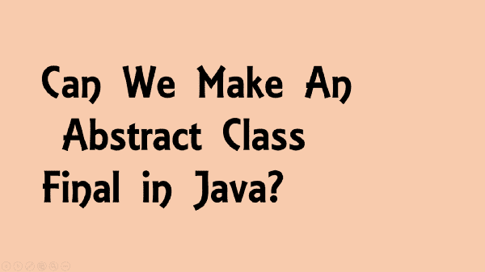

# 软件开发面试的 10 个最佳在线课程

> 原文：<https://dev.to/javinpaul/10-data-structure-algorithms-sql-and-java-courses-to-crack-any-programming-job-interview-11f6>

*披露:这篇文章包括附属链接；如果您从本文提供的不同链接购买产品或服务，我可能会收到报酬。*

许多初级开发人员梦想进入大型科技公司，但是，老实说，找到第一份工作从来都不容易。事实上，这是你一生中最难的事情之一，你需要尽最大努力在你梦想的公司找到一份工作。

大多数计算机科学毕业生梦想为谷歌、T2、脸书、T4、亚马逊、微软和苹果工作，但只有少数程序员能通过艰难的编码面试。

编码工作面试失败的一个最重要的原因是缺乏知识和实践。很明显，如果你不知道该学什么，那么你注定会失败，因此提前做好准备变得越来越重要。

不幸的是，在破坏了我在微软和亚马逊的机会之后，我知道这一点有点太晚了，但你不需要。你可以从我的经历中学习，为你的编程工作面试做更好的准备。

所以，最大的问题是，你如何准备编码/编程工作面试？你应该熟读哪些科目？你需要解决哪些问题？你如何处理编码和其他技术相关的问题？

当我寻找我的第一份工作时，没有多少帮助；我们完全依赖编程语言和数据结构的教科书来准备面试，但在过去的 10 年里情况发生了变化。

如今，你不仅有专门的书籍来准备编码面试，像 [*破解编码面试问题*](http://www.amazon.com/Cracking-Coding-Interview-6th-Edition/dp/0984782850/?tag=javamysqlanta-20)*，而且你还有[在线课程](https://click.linksynergy.com/fs-bin/click?id=JVFxdTr9V80&subid=0&offerid=562016.1&type=10&tmpid=14538&RD_PARM1=https%3A%2F%2Fwww.udemy.com%2Fdata-structure-and-algorithms-analysis%2F)和编码训练营来练习编码面试。*

 *

我真的很喜欢新兵训练营，因为他们的方法、专注和严格的实践，但他们有点贵，不是每个正在找工作的计算机科学毕业生都负担得起。

另一个选择是像[软件工程师面试释放](https://click.linksynergy.com/fs-bin/click?id=JVFxdTr9V80&subid=0&offerid=562016.1&type=10&tmpid=14538&RD_PARM1=https%3A%2F%2Fwww.udemy.com%2Fsoftware-engineer-interview-unleashed%2F)这样的在线课程，它们既便宜又能给你提供类似于你在编码训练营中得到的那种互动指导。

在热门的课程网站上有很多编码面试课程，比如 Udemy 和 T2，但是你需要选择正确的课程来帮助你实现你的目标。

## 破解编程面试的 10 门在线课程

在这篇文章中，我将分享一些为编码/编程工作面试做准备的[最佳在线课程](https://javarevisited.blogspot.com/2018/02/10-courses-to-prepare-for-programming-job-interviews.html)，根据你的经验和技能，你可以从这个列表中选择一到两门课程，为你的下一次工作面试做准备。

这些课程大多集中在[数据结构和算法](https://hackernoon.com/50-data-structure-and-algorithms-interview-questions-for-programmers-b4b1ac61f5b0)上，这对于任何编码面试来说都是最重要的话题，但它们也教你解决问题和工作面试的其他方面，例如来自编程语言的问题，如 [Java](http://www.java67.com/2018/08/top-10-free-java-courses-for-beginners-experienced-developers.html) 和 [C++](http://www.java67.com/2018/02/5-free-cpp-courses-to-learn-programming.html) 、[数据库](https://javarevisited.blogspot.com/2018/05/top-5-sql-and-database-courses-to-learn-online.html)和 [SQL](http://www.java67.com/2018/02/5-free-oracle-and-microsoft-sql-server-online-courses.html) 概念、 [Linux 命令](http://www.java67.com/2018/02/5-free-linux-unix-courses-for-programmers-learn-online.html)等。

一旦你完成了这些在线培训课程，你就有足够的知识去参加你的工作面试，也知道去哪里进一步提高。

### [1。数据结构与算法分析-面试](https://click.linksynergy.com/fs-bin/click?id=JVFxdTr9V80&subid=0&offerid=562016.1&type=10&tmpid=14538&RD_PARM1=https%3A%2F%2Fwww.udemy.com%2Fdata-structure-and-algorithms-analysis%2F)

这大概是 Java 程序员[最好的编码面试课程](https://click.linksynergy.com/fs-bin/click?id=JVFxdTr9V80&subid=0&offerid=562016.1&type=10&tmpid=14538&RD_PARM1=https%3A%2F%2Fwww.udemy.com%2Fdata-structure-and-algorithms-analysis%2F)了。虽然不需要编程语言，但如果你不懂 Java，作者会教你。

在本课程中，您将学习如何分析算法，如[搜索](https://javarevisited.blogspot.com/2017/04/recursive-binary-search-algorithm-in-java-example.html)、[排序](http://www.java67.com/2018/03/how-to-implement-radix-sort-in-java.html)以及其他算法。

你还将学习如何将代码复杂度从一个 Big-O 级别降低到另一个级别，这是给面试官留下深刻印象的重要技能。

此外，您将学习不同类型的数据结构以及如何选择正确的数据结构来解决问题。

记住，选择正确的数据结构可以极大地提高应用程序的 CPU 和内存性能。

例如，用一个集合来解决[重复元素问题](https://javarevisited.blogspot.com/2018/04/how-to-find-k-missing-numbers-in-array-java.html)就变得容易多了。您还将学习如何为每个数据结构找到 Big-O。

最终，您将能够编写运行速度更快、占用内存更少的代码。您还将学习如何使用许多程序员忘记准备的一种技术来分析问题。

这是所有级别程序员的理想课程，尤其是 Java 程序员。如果你正在寻找一个好的 Java 编程/编码面试课程，这就是你要找的。你可以用它从头开始或者只是在去面试前刷新一下你的知识。

### 2。[寻找编码面试:编码问题的模式](https://www.educative.io/collection/5668639101419520/5671464854355968?affiliate_id=5073518643380224)

这是来自[教育](https://www.educative.io/subscription?affiliate_id=5073518643380224)平台的另一门精彩课程，为编码面试做准备。与其他通过解决问题来准备编码面试的在线课程不同，本课程将教你如何找到*潜在的编码模式*，这样你就可以在编码面试中解决类似的问题。

如果你想在谷歌、T2、微软、T4、亚马逊、苹果、脸书、网飞或任何 FAANG 公司的编码面试中胜出，这种发现模式和培养编码意识的技巧是必须的。为什么？因为他们经常给你出一个你从来没见过的编码问题。如果你知道如何将问题分解成可识别的模式，你就能解决它们。

我向所有准备参加编码面试的人强烈推荐这门课程，但是就像前面的课程一样，即使你没有准备面试，你也可以参加这门课程来提高你的编码技能，成为一名更好的开发人员。

**这是加入本课程的链接** - [寻找编码面试:编码问题的模式](https://www.educative.io/collection/5668639101419520/5671464854355968?affiliate_id=5073518643380224)

而且，如果你发现教育平台很有用，那么你也可以考虑购买 [**教育订阅**](https://www.educative.io/subscription?affiliate_id=5073518643380224) ，这样你就可以只花**18 美元每月就能获得他们的 100 多门课程。**

 **有时你需要这种灵活性，加入你想要的课程，而不是购买它。如果你打算在一年内参加几门以上的教育课程，这也是一个更好的交易。

### [3。软件工程师面试释放](https://click.linksynergy.com/fs-bin/click?id=JVFxdTr9V80&subid=0&offerid=562016.1&type=10&tmpid=14538&RD_PARM1=https%3A%2F%2Fwww.udemy.com%2Fsoftware-engineer-interview-unleashed%2F)

这是一个伟大的[课程](https://click.linksynergy.com/fs-bin/click?id=JVFxdTr9V80&subid=0&offerid=562016.1&type=10&tmpid=14538&RD_PARM1=https%3A%2F%2Fwww.udemy.com%2Fsoftware-engineer-interview-unleashed%2F)为编码面试，创造了一个前谷歌面试官。如果你是一名软件工程师，并且正在大型科技巨头如[、谷歌](https://javarevisited.blogspot.com/2011/06/top-programming-interview-questions.html)、脸书、Snapchat 或 Airbnb 寻找工作，那么这是适合你的课程。

它是专门为大学毕业生和正在大的科技公司和创业公司找工作的初级开发人员设计的。

你不仅会学到[数据结构](https://javarevisited.blogspot.com/2018/01/top-5-free-data-structure-and-algorithm-courses-java--c-programmers.html)和[算法](https://javarevisited.blogspot.com/2017/10/grokking-algorithms-by-aditya-bhargava-best-beginner-book.html)以及面试所需的其他技术信息，你还将有机会看到电话面试和现场面试的实际例子，并看到它们是如何被评估的。

### [3。准备工作面试](http://pluralsight.pxf.io/c/1193463/424552/7490?u=https%3A%2F%2Fwww.pluralsight.com%2Fcourses%2Fdeveloper-job-interviews)

这是另一个为技术性工作面试做准备的好课程。在本课程中，讲师 John Sonmez，畅销书 [**软技能:软件开发人员生活手册**](http://www.amazon.com/Soft-Skills-software-developers-manual/dp/1617292397?tag=javamysqlanta-20) 的作者，解释了如何通过编码面试。

在[这门课程](http://pluralsight.pxf.io/c/1193463/424552/7490?u=https%3A%2F%2Fwww.pluralsight.com%2Fcourses%2Fdeveloper-job-interviews)中，你不仅将学习如何现场解决编码挑战，还将学习如何处理面试官提出的关于复杂性和改进的棘手问题。

该课程还包括一个针对计算机科学问题的快速入门营，这些问题涉及数据结构、T2 算法、位操作和并发性。总的来说，准备软件工作面试的一个完整的包。

### [4。编码面试训练营:算法+数据结构](https://click.linksynergy.com/fs-bin/click?id=JVFxdTr9V80&subid=0&offerid=562016.1&type=10&tmpid=14538&RD_PARM1=https%3A%2F%2Fwww.udemy.com%2Fcoding-interview-bootcamp-algorithms-and-data-structure%2F)

这是用 JavaScript 写的[编码面试指南。作者自己也花了很多时间来研究谷歌、脸书和亚马逊的面试问题，并分享了他以正确方式回答问题的经验。](https://click.linksynergy.com/fs-bin/click?id=JVFxdTr9V80&subid=0&offerid=562016.1&type=10&tmpid=14538&RD_PARM1=https%3A%2F%2Fwww.udemy.com%2Fcoding-interview-bootcamp-algorithms-and-data-structure%2F)

在本课程中，你会发现大量的常见算法问题，包括从“[反转一个字符串](http://www.java67.com/2012/12/how-to-reverse-string-in-java-stringbuffer-stringbuilder.html)”到“[寻找二叉树的叶节点](https://javarevisited.blogspot.com/2016/12/how-to-count-number-of-leaf-nodes-in-java-recursive-iterative-algorithm.html)”

本课程还概述了面试中最重要的数据结构，如[列表](http://javarevisited.blogspot.sg/2015/02/simple-junit-example-unit-tests-for-linked-list-java.html)、[集合](http://www.java67.com/2013/08/ata-structures-in-java-programming-array-linked-list-map-set-stack-queue.html)、[映射](http://www.java67.com/2017/08/top-10-java-hashmap-interview-questions.html)、[堆栈](http://javarevisited.blogspot.sg/2017/03/difference-between-stack-and-queue-data-structure-in-java.html#axzz56fRo1HGs)、[队列](http://javarevisited.blogspot.sg/2013/03/top-15-data-structures-algorithm-interview-questions-answers-java-programming.html#axzz56fRo1HGs)、[树、](http://javarevisited.blogspot.sg/2015/10/how-to-implement-binary-search-tree-in-java-example.html#axzz4wnEtnNB3)等。

它还提供了处理[系统设计面试](https://medium.com/javarevisited/10-best-system-design-courses-for-coding-interviews-949fd029ce65)的实用技巧，对于缺乏设计真实世界系统经验的初学者来说，这有时很难。

### [5。脱离:编程和编码面试](https://click.linksynergy.com/fs-bin/click?id=JVFxdTr9V80&subid=0&offerid=562016.1&type=10&tmpid=14538&RD_PARM1=https%3A%2F%2Fwww.udemy.com%2Fbreak-away-coding-interviews-1%2F)

这是 Java 和 C 程序员的另一个很好的面试复习课程。与前面的课程类似，它也涵盖了一些基本概念，如指针、[字符串](http://www.java67.com/2018/04/21-string-programming-and-coding-interview-questions-answers.html)、链表、[排序](http://www.java67.com/2014/07/quicksort-algorithm-in-java-in-place-example.html)、[位操作](https://javarevisited.blogspot.com/2014/06/how-to-count-number-of-set-bits-or-1s.html)、[数据结构](http://www.java67.com/2018/06/data-structure-and-algorithm-interview-questions-programmers.html)和[系统设计](http://www.java67.com/2018/05/top-20-system-design-interview-questions-answers-programming.html)。

大多数解决方案是用 C 编程语言给出的，有些是用 Java 给出的。

对于刚毕业的工程师和有经验的程序员来说，这是一门很好的课程，他们想在去面试之前温习一下他们的数据结构和算法概念。

### 6。[动态编程介绍——编码面试准备](https://click.linksynergy.com/fs-bin/click?id=JVFxdTr9V80&subid=0&offerid=562016.1&type=10&tmpid=14538&RD_PARM1=https%3A%2F%2Fwww.udemy.com%2Fdynamic-programming%2F)

如果你知道[动态编程](https://javarevisited.blogspot.com/2019/12/top-5-courses-to-learn-dynamic-programming-for-interivews.html)，许多编码问题可以很容易地解决，但是我发现许多开发者甚至不知道它，包括一些有经验的人。

[本课程](https://click.linksynergy.com/fs-bin/click?id=JVFxdTr9V80&subid=0&offerid=562016.1&type=10&tmpid=14538&RD_PARM1=https%3A%2F%2Fwww.udemy.com%2Fdynamic-programming%2F)将教你动态编程，提高你的算法知识，为软件工程编码面试做准备。

您还将学习几个 1 维和 2 维动态规划问题，以及如何推导递归关系并为其编写一个[递归解](https://javarevisited.blogspot.com/2017/04/recursive-binary-search-algorithm-in-java-example.html)，然后为问题编写一个并在几分钟内编写代码。

本课程中涉及的一些动态编程问题包括:

1.  爬楼梯
2.  买卖股票
3.  0/1 背包
4.  最长公共子串
5.  最长公共子序列

总体来说是一门[学习动态编程的好课程](https://medium.com/javarevisited/6-best-dynamic-programming-courses-for-coding-interviews-14744060923c)。即使你没有准备编码工作面试，你也可以参加这个课程，只是为了提高你的动态编程和算法知识。该课程同时使用了 [Java](https://javarevisited.blogspot.com/2018/08/top-5-free-java-8-and-9-courses-for-programmers.html) 和 [Python](http://javarevisited.blogspot.sg/2018/03/top-5-courses-to-learn-python-in-2018.html) ，因此对 Java 和 Python 开发者都很有用。

### 7。 [Python 用于数据结构、算法和面试！](https://click.linksynergy.com/fs-bin/click?id=JVFxdTr9V80&subid=0&offerid=562016.1&type=10&tmpid=14538&RD_PARM1=https%3A%2F%2Fwww.udemy.com%2Fpython-for-data-structures-algorithms-and-interviews%2F)

这是专门为 Python 开发者设计的数据结构、算法、[编码面试课程。这是一门现代课程，侧重于 Github 和 LinkedIn 个人资料之类的东西来打动新人。](https://click.linksynergy.com/fs-bin/click?id=JVFxdTr9V80&subid=0&offerid=562016.1&type=10&tmpid=14538&RD_PARM1=https%3A%2F%2Fwww.udemy.com%2Fpython-for-data-structures-algorithms-and-interviews%2F)

它还能帮助你创建一份优秀的简历，而这是许多程序员所忽略的。记住，是你的简历给了你一个面试的机会，如果它不好，你甚至不会得到面试电话。

在本课程中，您不仅将学习所有主要的数据结构和算法，而且在准备课程的模拟面试后，还将获得 ace [编码面试](http://www.java67.com/2018/05/top-75-programming-interview-questions-answers.html)。总的来说，Python 程序员最好的编码面试课程之一。

### 8。 [11 个必不可少的编码面试问题+编码练习！](https://click.linksynergy.com/fs-bin/click?id=JVFxdTr9V80&subid=0&offerid=562016.1&type=10&tmpid=14538&RD_PARM1=https%3A%2F%2Fwww.udemy.com%2F11-essential-coding-interview-questions%2F)

在你解决了工作面试中最常见的一些问题之前，面试准备工作是不会结束的。[本课程](https://click.linksynergy.com/fs-bin/click?id=JVFxdTr9V80&subid=0&offerid=562016.1&type=10&tmpid=14538&RD_PARM1=https%3A%2F%2Fwww.udemy.com%2F11-essential-coding-interview-questions%2F)提供了如何以循序渐进的方式解决 11 个这样的问题。

这是一个很短的课程，我建议你只学习另一门课程，但它有助于学习如何基于你现有的数据结构和算法知识来处理一个完全未知的问题。

### 9。 [200+ SQL 面试题](https://click.linksynergy.com/fs-bin/click?id=JVFxdTr9V80&subid=0&offerid=562016.1&type=10&tmpid=14538&RD_PARM1=https%3A%2F%2Fwww.udemy.com%2Fsql-interview-questions%2F)

SQL 查询和数据库相关的问题在编程工作面试中非常常见，因此对于计算机科学毕业生或程序员来说，提前准备 SQL 问题非常重要。SQL 和数据库的良好知识对破解编码面试以及作为开发人员工作大有帮助。

[本课程](https://click.linksynergy.com/fs-bin/click?id=JVFxdTr9V80&subid=0&offerid=562016.1&type=10&tmpid=14538&RD_PARM1=https%3A%2F%2Fwww.udemy.com%2Fsql-interview-questions%2F)为编程工作面试提供 200+ SQL 查询和问题。

我还讨论了一些问题，比如在我之前的帖子中找到第二高的工资和第 n 高的工资的[，你可能想检查一下。](https://javarevisited.blogspot.com/2016/01/4-ways-to-find-nth-highest-salary-in.html)

### 10。[初学者 200+ Java 面试问题](https://click.linksynergy.com/fs-bin/click?id=JVFxdTr9V80&subid=0&offerid=562016.1&type=10&tmpid=14538&RD_PARM1=https%3A%2F%2Fwww.udemy.com%2Fjava-interview-questions-and-answers%2F)

这门[课程](https://click.linksynergy.com/fs-bin/click?id=JVFxdTr9V80&subid=0&offerid=562016.1&type=10&tmpid=14538&RD_PARM1=https%3A%2F%2Fwww.udemy.com%2Fjava-interview-questions-and-answers%2F)是专门为申请 Java 开发工作的 Java 程序员或开发人员开设的。

由于 Java 非常庞大，不可能准备好所有的东西，尤其是在短时间内，这也是本课程的难点所在。

它提供了来自 Java 不同领域的 200 多个 Java 面试问题的范例。除此之外，你还可以看到我在过去 5 年中收集的 [140 多个 Java 问题，这些问题是我自己以及朋友和同事收集的。](http://javarevisited.blogspot.sg/2015/10/133-java-interview-questions-answers-from-last-5-years.html)

这组问题很好地代表了你在真实面试中可能遇到的 Java 问题。

如果你喜欢书，你也可以看看我的[关于 Java 面试的书](https://gumroad.com/l/QqjGH)。里面全是常见的 Java 概念面试问题。

以上就是为编码/编程工作面试准备的一些最好的课程。正如我所说的，在编码面试中成功的关键是实时思考问题和编码的能力。

你需要大量的练习才能做到。谢天谢地，有很多网站可以让你练习编码问题。一旦你完成了这些课程中的一门，你可以试着解决我列出的 50 个编码问题。

### 现在你已经为编码面试做好了准备

这些是准备编程面试的一些最好的课程。他们会教你数据结构和算法，帮助你在面试中表现出色。

我在自己的[博客](http://java67.com/)上也分享过很多编程面试问题，如果你真的感兴趣，可以随时去那里搜索。

这些**常见的编码、数据结构和算法问题**是你需要知道的，以成功面试任何公司，无论大小，任何级别的编程工作。

如果你想在 2018 年找一份编程或软件开发的工作，你可以从这份算法和工作面试课程清单开始准备。

良好的数据结构和算法知识对于成功编写面试代码非常重要，这也是你应该集中大部分注意力的地方。

其他**编程面试资源**你可能喜欢:
[50+数据结构与算法问题](https://hackernoon.com/50-data-structure-and-algorithms-interview-questions-for-programmers-b4b1ac61f5b0)
[30+编程面试中的链表问题](http://javarevisited.blogspot.sg/2017/07/top-10-linked-list-coding-questions-and.html#axzz4xXS86IVo)
[30+编码面试中的基于数组的问题](http://javarevisited.blogspot.sg/2015/06/top-20-array-interview-questions-and-answers.html#axzz4tUeeQOAU)
[10 编程面试中的 SQL 查询](http://www.java67.com/2013/04/10-frequently-asked-sql-query-interview-questions-answers-database.html)
[50+程序员电话面试问题](https://javarevisited.blogspot.com/2015/02/50-programmer-phone-interview-questions-answers.html#axzz5C5tt0mTL)
[数据结构与算法:深潜使用 Java](http://bit.ly/2F5V1uW)
[Java 开发人员结构与算法书籍](http://www.java67.com/2015/09/top-10-algorithm-books-every-programmer-read-learn.html)
[从 0 到 1:Java 中的数据结构&算法](https://click.linksynergy.com/fs-bin/click?id=JVFxdTr9V80&subid=0&offerid=323058.1&type=10&tmpid=14538&RD_PARM1=https%3A%2F%2Fwww.udemy.com%2Ffrom-0-to-1-data-structures%2F)

#### 期末备注

谢谢，你坚持到了文章的结尾...祝你编程面试好运！这当然不容易，但是通过学习这些课程，你比其他候选人领先一步。

如果你喜欢这篇文章，那么请分享给你的朋友和同事，别忘了在 Twitter 上关注 [javinpaul](https://twitter.com/javinpaul) ！

如果你喜欢书，你也可以看看我列出的 [10 本书，为编码面试做准备](http://www.java67.com/2017/06/10-books-to-prepare-technical-coding-job-interviews.html)。

**p . p . s .**——如果你不介意从一些免费的资源中学习，那么你也可以看看这个列表中的 [**免费数据结构和算法课程**](http://javarevisited.blogspot.com/2018/01/top-5-free-data-structure-and-algorithm-courses-java--c-programmers.html) 来开始你的准备。***