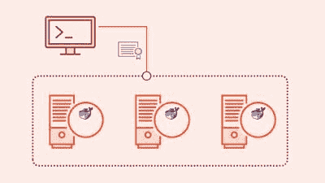
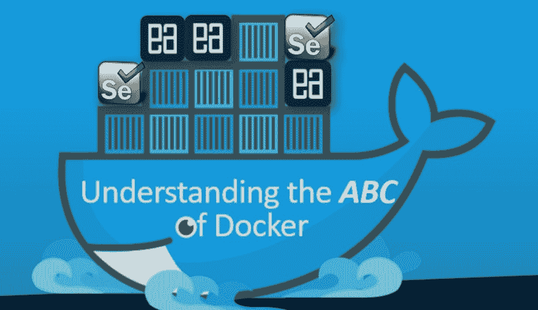
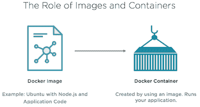
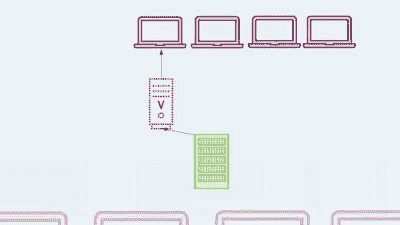
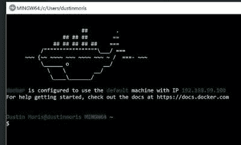
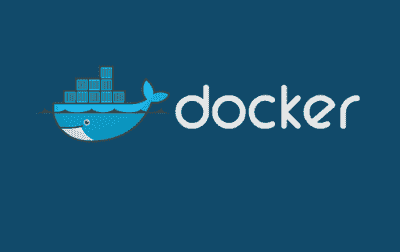
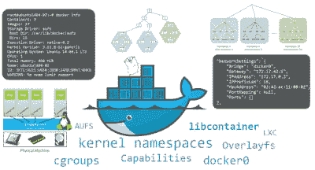
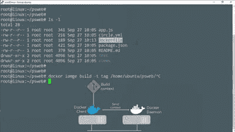

# 2022 年 10 大免费 Docker 课程教程

> 原文：<https://dev.to/javinpaul/10-free-courses-to-learn-docker-in-2019-56n0>

*披露:这篇文章包括附属链接；如果您从本文提供的不同链接购买产品或服务，我可能会收到报酬。*

随着软件开发走向自动化，关于码头工人的良好知识和经验对你的职业生涯非常有价值，尤其是在 2022 年。

最新的统计数据和数字显示了一些惊人的数字，比如需要这些技能的工作比美国公共就业论坛上发布的大多数工作工资都高，专业人士的年薪可能高达 10 万美元。

这就是为什么程序员应该在 2022 年学习 Docker 并让他们的职业生涯更上一层楼的主要原因之一，没有什么比从一些免费课程开始更好的了。

很长一段时间以来，我一直在分享一些免费的资源，比如书籍和课程，比如关于 [Java](http://javarevisited.blogspot.sg/2017/11/top-5-free-java-courses-for-beginners.html#axzz4zuIICRs9) 、 [Spring](http://www.java67.com/2017/11/top-5-free-core-spring-mvc-courses-learn-online.html) 、 [Kotlin](http://javarevisited.blogspot.sg/2018/02/5-courses-to-learn-kotlin-programming-java-android.html#axzz56R4AatoQ) 、 [DevOps](http://www.java67.com/2018/02/6-free-maven-and-jenkins-online-courses-for-java-developers.html) 、 [Eclipse](http://www.java67.com/2018/02/5-free-eclipse-and-junit-online-courses-java-developers.html) 、 [Jenkins](http://www.java67.com/2018/02/6-free-maven-and-jenkins-online-courses-for-java-developers.html) 、 [Rails](http://www.java67.com/2018/02/5-free-ruby-and-rails-courses-to-learn-online.html) 、 [PHP 和 MySQL](http://www.java67.com/2018/02/5-free-php-and-mysql-courses-for-web-developers.html) 、 [Oracle](http://www.java67.com/2018/02/5-free-oracle-and-microsoft-sql-server-online-courses.html) 、 [Linux](http://www.java67.com/2018/02/5-free-linux-unix-courses-for-programmers-learn-online.html) 等的免费在线课程/书籍

在这篇文章中，我将分享 **10 个免费的 Docker 在线课程**你可以用来学习 Docker 和应用程序的容器化，顺便说一句，如果你不介意花几块钱学习像 Docker 这样有价值的工具，那么我也推荐你去看看 Udemy 上 AcadMind 的 [Docker & Kubernetes:实用指南](https://click.linksynergy.com/deeplink?id=JVFxdTr9V80&mid=39197&murl=https%3A%2F%2Fwww.udemy.com%2Fcourse%2Fdocker-kubernetes-the-practical-guide%2F)课程。这是 2022 年学习 Docker 最好的和最新的课程之一。

正如我所说，Docker 和 containers 是开发和交付应用程序和 IT 基础设施的全新方式，这里是我列出的一些 Java 开发人员可以用来学习 Docker 的免费课程。

## 2022 年初学者学习 Docker 的 10 个最佳免费课程

以下是我列出的 2022 年学习 Docker 的一些最好的免费课程。对于初学者和有经验的开发人员来说，它们都是极好的资源。

### [1。码头工人必备](https://click.linksynergy.com/deeplink?id=JVFxdTr9V80&mid=39197&murl=https%3A%2F%2Fwww.udemy.com%2Fdocker-essentials%2F)

如果你听说过 Docker 和 containers，并且想知道它们是什么以及如何开始使用它们，那么这个课程就是为你准备的。

在本课程中，您将学习如何安装 Docker，将其配置为在您的本地系统上使用，克隆和使用 Docker 映像，实例化容器，装载主机卷，重定向端口，并了解如何管理映像和容器。

完成课程后，你应该能够在你的项目/环境中实现容器，同时对它们的用例有一个牢固的理解，包括支持和反对。

简而言之，对于想要学习基础知识的开发人员和 DevOps 工程师来说，这是最好的课程之一，比如 Docker 容器是什么以及如何在他们的环境中使用它们。

* * *

### 2。[了解 Docker 并将其用于 Selenium 自动化](https://click.linksynergy.com/fs-bin/click?id=JVFxdTr9V80&subid=0&offerid=323058.1&type=10&tmpid=14538&RD_PARM1=https%3A%2F%2Fwww.udemy.com%2Funderstanding-docker-performing-selenium-automation%2F)

这是在为您的项目自动化 Selenium 测试用例时学习和理解 Docker 基础知识的又一个好课程。

该课程是专门为开发工程师、自动化人员、测试人员和开发人员设计的。

本课程分为三个主要部分:Docker 简介、Docker 构成和带有 Docker 的 Selenium Grid。

这三个部分相互独立，您可以并行学习或来回切换。

* * *

### [3。面向初学者的 docker](https://click.linksynergy.com/deeplink?id=JVFxdTr9V80&mid=39197&murl=https%3A%2F%2Fwww.udemy.com%2Fdocker-for-beginners%2F)

这是了解码头工人和集装箱化的最佳来源之一。如果你对虚拟化、[联网](http://javarevisited.blogspot.sg/2010/10/basic-networking-commands-in-linuxunix.html)和[云计算](http://javarevisited.blogspot.sg/2014/05/top-5-cloud-service-providers-companies-Java-IT-professional-know.html#axzz5B9NXhuQw)有所了解，那么你可以加入这个课程。

它很好地介绍了当前的软件发展趋势以及 Docker 所解决的问题。

简而言之，这对于[软件](https://javarevisited.blogspot.com/2019/03/5-courses-programmers-can-join-to-learn.html)和 [IT 架构师](https://javarevisited.blogspot.com/2018/02/5-must-read-books-to-become-software-architect-solution.html)，程序员，IT 管理员和任何想了解 Docker 在当前世界应用程序开发中的角色的人来说都是一门很好的课程。

### 4。[集装箱 101](https://click.linksynergy.com/deeplink?id=JVFxdTr9V80&mid=39197&murl=https%3A%2F%2Fwww.udemy.com%2Fcontainers-101%2F)

Docker 和 containers 是开发和交付应用程序和 IT 基础设施的全新方式。

本课程将涵盖 [Docker 和容器](http://www.java67.com/2019/03/5-free-devops-courses-to-learn-jenkins.html)、容器注册、容器编排，了解这是否适用于企业，以及如何为此做好准备。

简而言之，这是一个很好的课程，适合任何想快速掌握集装箱和码头的人。

### 5。[码头工人群体:本地码头工人集群](https://click.linksynergy.com/fs-bin/click?id=JVFxdTr9V80&subid=0&offerid=323058.1&type=10&tmpid=14538&RD_PARM1=https%3A%2F%2Fwww.udemy.com%2Fdocker-swarm-from-beginner-to-advanced-with-docker-cluster-hosting%2F)

大规模管理 Docker 是 IT 面临的下一个挑战。本课程“Docker Swarm:原生 Docker 集群”将向您传授您需要了解的关于 Docker Swarm 的一切知识，Docker Swarm 是用于大规模管理 Docker 环境的原生解决方案。

对于开发人员、网络团队、 [DevOps 工程师](https://javarevisited.blogspot.com/2018/09/10-devops-courses-for-experienced-java-developers.html)和网络基础设施团队来说，这是一门很好的课程。

这是 Udemy 早期的付费课程，但在有限的时间内是免费的。在它再次变得有报酬之前加入这个课程。

### 6。[为开发者打造的 Docker 课程](https://click.linksynergy.com/fs-bin/click?id=JVFxdTr9V80&subid=0&offerid=323058.1&type=10&tmpid=14538&RD_PARM1=https%3A%2F%2Fwww.udemy.com%2Fdocker-for-developers%2F)

无论你是否是开发人员，任何从事代码或服务器工作的人都可以通过 Docker 的开放式应用构建平台提高他们的工作效率。

在本课程中，您将学习如何使用 Docker 产品，如 Docker Toolbox、 [Docker Client](https://dzone.com/articles/top-10-docker-course-for-java-developers) 、Docker Machine、Docker Compose、Kinematic 和 Docker Cloud。

除了其他重要的课程之外，您还将学习如何使用图像和容器，如何让您的项目运行，以及如何将它推到云上。

### 7。[Windows 10 和 Server 2016 上的 Docker](https://click.linksynergy.com/fs-bin/click?id=JVFxdTr9V80&subid=0&offerid=323058.1&type=10&tmpid=14538&RD_PARM1=https%3A%2F%2Fwww.udemy.com%2Fdocker-on-windows%2F)

如果你想学习如何在 Windows 10 和 Windows Server 2016 上使用 Docker，那么这是适合你的课程。

在本课程中，您将了解 Windows 上的 Docker 是什么，以及 Windows 上的 Docker 如何与 [Linux 容器](https://dev.to/javinpaul/5-free-courses-to-learn-linux-for-beginners-367f)相同。

您还将深入学习 Hyper-V、名称空间隔离和服务器容器。

### 8。[部署容器化应用技术概述](https://click.linksynergy.com/fs-bin/click?id=JVFxdTr9V80&subid=0&offerid=323058.1&type=10&tmpid=14538&RD_PARM1=https%3A%2F%2Fwww.udemy.com%2Fdeploying-containerized-applications-technical-overview%2F)

Docker 已经成为 Linux 操作系统中定义和运行容器的事实上的标准。Kubernetes 是 Red Hat 对容器编排的选择。

OpenShift 建立在 [Docker](https://javarevisited.blogspot.com/2018/02/10-free-docker-container-courses-for-Java-Developers.html) 、 [Kubernetes](https://javarevisited.blogspot.com/2019/01/top-5-free-kubernetes-courses-for-DevOps-Engineer.html) 和其他[开源软件项目的基础上，提供平台即服务(PaaS)来最终在容器内部署应用程序。](http://www.java67.com/2018/02/top-10-open-source-frameworks-and-libraries-java-web-developers.html)

这是一门关于使用 Docker 的容器的红帽官方课程，Docker 运行在[红帽企业 Linux](http://javarevisited.blogspot.sg/2018/02/5-courses-to-learn-shell-scripting-in-linux.html) 上。

在本课程中，Red Hat Training 的课程架构师 Jim Rigsbee 将使用运行在 Red Hat Enterprise Linux 上的 Docker 向您介绍容器技术

### 9。[码头工人深潜](http://pluralsight.pxf.io/c/1193463/424552/7490?u=https%3A%2F%2Fwww.pluralsight.com%2Fcourses%2Fdocker-deep-dive)

顾名思义，这是一门深入学习 Docker 的好课程。它为核心 Docker 技术提供了良好的体验，包括 Docker 引擎、图像、容器、注册表、网络、存储等等。

您还将学习理论，并且所有概念都在命令行上清楚地演示。

这个课程最好的部分是不需要任何关于 Docker 或 T2 Linux 的知识。

### 10。[码头工人和集装箱:大局](http://pluralsight.pxf.io/c/1193463/424552/7490?u=https%3A%2F%2Fwww.pluralsight.com%2Fcourses%2Fdocker-containers-big-picture)

在本课程中，您将了解这将如何影响您个人以及您工作的团队和组织。

本课程将涵盖 [Docker 和容器](https://dev.to/javinpaul/the-2019-devops-engineering-roadmap-2klc)、容器注册、容器编排、这些东西是否适合企业，以及如何为此做好准备。

这两门来自 Pluralsight 的课程并不是真正免费的；你需要一个 Pluralsight 会员才能参加这个课程，月会员费大约 29 美元，年会员费大约 299 美元。

我知道，我们都喜欢免费的东西，但是你不仅可以上这门课，还可以上 5000 多门课，所以这钱绝对花得值。

我有年度会员资格，因为我必须一直学习很多新东西。即使你不是会员，只要签一张[免费试用](http://pluralsight.pxf.io/c/1193463/424552/7490?u=https%3A%2F%2Fwww.pluralsight.com%2Flearn)就可以免费获得这门课程。Pluralsight 为**提供 10 天免费试用**，不承担任何义务。

以上是针对 Java 开发人员的一些免费 Docker 容器课程。如果你正在开发一个移动应用或网络应用，这是一个基本技能。因此，我建议每个应用开发者在 2022 年学习 Docker。鉴于对 Docker 专家和懂 Docker 的开发者的大量需求，你不仅会学到一项基本技能，还会让你的职业生涯更上一层楼。

其他**免费在线课程**你可能喜欢探索
[5 门免费课程学习 Git 和 Github](http://javarevisited.blogspot.sg/2018/01/5-free-git-courses-for-programmers-to-learn-online.html#axzz568Oo1Jao)
[2022 DevOps 开发者路线图](https://hackernoon.com/the-2018-devops-roadmap-31588d8670cb?gi=1490c6cb9f25)
[5 门课程学习 Jenkins](https://javarevisited.blogspot.com/2018/09/top-5-jenkins-courses-for-java-and-DevOps-Programmers.html)
[5 门免费 Eclipse 和 JUnit 课程面向 Java 开发者](http://www.java67.com/2018/02/5-free-eclipse-and-junit-online-courses-java-developers.html)
[10 门 devo PS 课程面向资深开发者](https://javarevisited.blogspot.com/2018/09/10-devops-courses-for-experienced-java-developers.html)
[5 门在线培训课程免费学习 Angular](http://www.java67.com/2018/01/top-5-free-angular-js-online-courses-for-web-developers.html)

> 附:如果你不介意花几块钱学一些值得学的东西，那么[Docker for the Absolute Beginner-Hands-On-devo PS](https://click.linksynergy.com/deeplink?id=JVFxdTr9V80&mid=39197&murl=https%3A%2F%2Fwww.udemy.com%2Flearn-docker%2F)是我推荐的另一门课程。这不是免费的，如果你是一个非免费的课程，我也会得到报酬，但这是我在学习 Docker 时遇到的最好的课程之一。