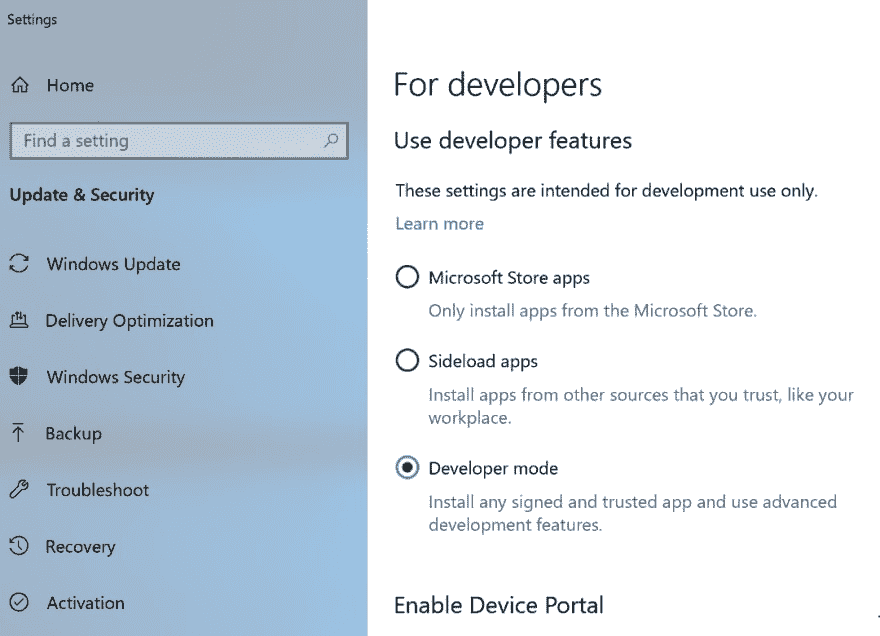
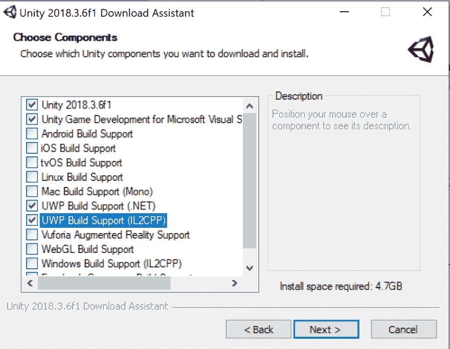

# 使用 Unity 开始混合现实开发的 10 个步骤

> 原文：<https://dev.to/cassieview/10-steps-to-get-started-with-mixed-reality-development-using-unity-and-build-a-hello-vr-world-app-33nd>

在本教程中，我将通过物理 Windows 混合现实耳机来设置您的环境，并创建一个 Hello VR World 应用程序。如果你没有耳机，你仍然可以按照步骤使用混合现实模拟器。此外，在本教程的底部有一个陷阱列表。如果你遇到困难或有问题，看看他们，你可能会找到你的答案。

1.  在 Windows 10 上启用**开发者模式**

    *   搜索**开发者设置**
    *   选择**开发者模式** 
2.  [安装 Visual Studio 2017](https://visualstudio.microsoft.com/downloads/)——确保 Windows 10 SDK 安装了这个。应该默认发生。

3.  [下载 Unity](https://store.unity.com/download?ref=personal)

4.  选择以下组件:
    (如果您错过了其中任何一项，您可以随时返回并在以后添加)
    

5.  一旦 Unity 安装完毕，请按照[这些说明](https://aka.ms/MRBasicsUnity?WT.mc_id=azuremedium-blog-casiljan)来配置您的环境并创建您的第一个 Hello VR World 应用程序。(我只完成了第 4 步)

6.  完成向场景添加长方体的初学者教程(通过步骤 4)。

7.  连接您的 Windows 混合现实耳机。

8.  打开混合现实门户。(如果您尚未设置您的耳机，请按照[步骤进行设置](https://docs.microsoft.com/en-us/windows/mixed-reality/enthusiast-guide/before-you-start)。如果你没有耳机，按照[这些步骤来设置模拟器](https://aka.ms/docsmrsimulator?WT.mc_id=azuremedium-blog-casiljan)

9.  点击 Unity 中 Hello VR World 应用上的播放按钮，戴上耳机。

10.  嘣！你在你的虚拟世界里！！
    [T3】](https://res.cloudinary.com/practicaldev/image/fetch/s--ygK0voCl--/c_limit%2Cf_auto%2Cfl_progressive%2Cq_auto%2Cw_880/https://cdn-images-1.medium.com/max/1080/1%2ADcaTGI9GaZTf4WX1kpKkGg.png)

* * *

**一些问题:**

1.  如果您尝试将播放器设置为 Windows，但没有显示:

    *   选择**文件** > **构建设置** …
    *   在平台列表中选择**通用 Windows 平台**，点击**切换平台**
    *   如果您在安装 unity 时错过了 UWP 安装选项，您将不会在播放器设置中看到 windows 选项。链接将显示在播放器设置窗口中，以安装选择 UWP 构建平台的先决条件。单击设置窗口中显示的链接并安装软件包。
2.  教程说选择**视窗全息**但是现在它被称为**视窗混合现实**而不是视窗全息。

3.  在 Unity 安装期间，我遇到了一些错误，但我要么重试，要么继续安装，我的安装没有任何问题。

4.  如果您已经安装了 Visual Studio 2017，请确保您已经安装了所有更新，并且。已安装. Net 4.7.1。如果你有最新的版本，那么你有 4.7.1。