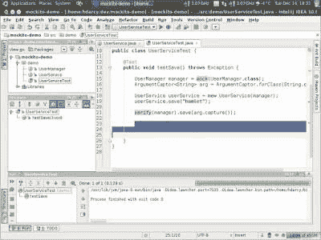
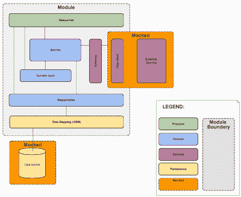
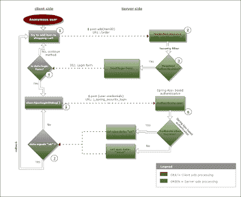
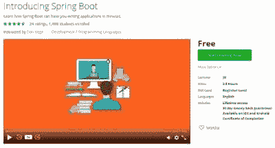
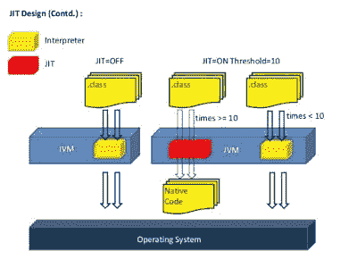
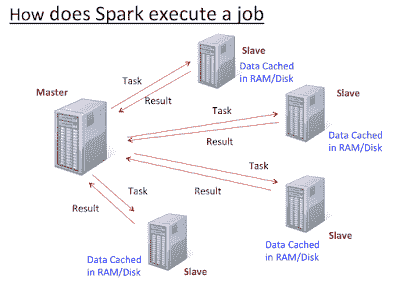

# 如何在 2022 年成为更好的 Java 开发者？[资源]

> 原文：<https://dev.to/javinpaul/10-things-java-developer-should-learn-1nil>

*披露:这篇文章包括附属链接；如果您从本文提供的不同链接购买产品或服务，我可能会收到报酬。*

大家好，又一年即将来临，这是一个很好的时间来回顾和反思你去年取得的成就和你可以做得更好的地方。

如果你还没有制定 2022 年的目标，这将帮助你。作为一名程序员，你最大的挑战是让自己跟上时代。技术变化非常快，你会看到你喜欢的编程语言和框架每年都会有新的版本。

对于 Java 开发人员来说，过去几年带来了大量的变化，并对每 6 个月更新一次新的 Java 版本提出了挑战，如 [Spring 5](https://javarevisited.blogspot.com/2018/06/top-6-spring-framework-online-courses-Java-programmers.html) 、 [Spring Security 5](https://javarevisited.blogspot.com/2017/06/3-best-spring-security-online-training-courses-java-programmers.html#axzz5ajt7Ig3L) 和 [Spring Boot 2](https://javarevisited.blogspot.com/2018/05/top-5-courses-to-learn-spring-boot-in.html) 等。

当我去年开始的时候，我认为 Java 11 是新的，在我完全学会 Java 11 之前，Java 13 和 Java 14 已经过时了。

所以，它们来的真的很快，但也带来了很多有趣的特性，比如带本地变量的 var、API 增强、GC 改进、线程本地握手等等。我在这里[记录了它们](https://javarevisited.blogspot.sg/2018/03/java-10-released-10-new-features-java.html#axzz5ALJyiIAt)，我真的很兴奋能在 2022 年使用它们。

Spring 框架和 Spring Security 也是如此，我不知道 Spring 4.0 和 T2 Spring Security 4.0 的所有变化，我的项目仍然使用 Spring Security 3.1，现在我们有了 Spring 和 Spring Security 的 5.0 版本。

在过去的几年里，我的学习速度有所放缓，我没有能够让自己跟上最新最棒的东西，比如我还没有适应的 [Git](https://javarevisited.blogspot.com/2018/01/5-free-git-courses-for-programmers-to-learn-online.html) ，JavaScript 框架，如 [Angular](https://javarevisited.blogspot.com/2018/06/5-best-courses-to-learn-angular.html) 和 [React](https://javarevisited.blogspot.com/2018/08/top-5-react-js-and-redux-courses-to-learn-online.html) ，单元和集成测试领域的最新变化，以及流行框架的新版本，如 Spring、Spring Security 和 Spring Boot。

我设法赶上了过去的许多年，因此，2022 年将完全是关于整合和让自己跟上技术方面最重要的事情，改进我的工具集链，并探索 [DevOps](https://javarevisited.blogspot.com/2018/09/10-devops-courses-for-experienced-java-developers.html) 景观

[
T3】](https://click.linksynergy.com/fs-bin/click?id=JVFxdTr9V80&subid=0&offerid=323058.1&type=10&tmpid=14538&RD_PARM1=https%3A%2F%2Fwww.udemy.com%2Fthe-complete-jenkins-course-for-developers-and-devops%2F)

## 2022 年 Java 程序员该学什么

下面是我列出的一个 Java 开发人员应该在 2022 年学习的事情，以成为一名更好的 Java 开发人员，并在他们的职业生涯中进入下一个阶段:\

### **1。DevOps**

随着越来越多的公司进入 DevOps 并采用持续集成和部署，这是我去年看到的一个很有吸引力的领域。

DevOps 非常庞大，你需要学习很多工具和原理，这是许多开发人员所不知的，但你不需要担心。我分享过一个 [**DevOps 路线图**](https://javarevisited.blogspot.com/2018/09/the-2018-devops-roadmap-your-guide-to-become-DevOps-Engineer.html) ，你可以按照自己的速度去学习和掌握 DevOps。

这意味着如果你是一个有经验的 Java 程序员，对管理环境、自动化和改进整体结构充满热情，你可以成为一名 DevOps 工程师。

如果你正在寻找一些令人敬畏的资源，那么 [*Jenkins，从零到英雄:成为 DevOps Jenkins 大师* *](https://click.linksynergy.com/deeplink?id=JVFxdTr9V80&mid=39197&murl=https%3A%2F%2Fwww.udemy.com%2Fjenkins-from-zero-to-hero%2F) 是一个很好的开始课程，特别是对于 Java 开发人员。

[
T3】](https://click.linksynergy.com/deeplink?id=JVFxdTr9V80&mid=39197&murl=https%3A%2F%2Fwww.udemy.com%2Fjenkins-from-zero-to-hero%2F)

### **2。去**

Git 和 Github 已经存在一段时间了，虽然我过去也在 Eclipse 中使用过 Git，但是我还没有成为命令行 Git 的大师。

为什么我至今没有掌握 Git？仅仅因为我还不需要它。我偶尔会从 Github 下载项目并从 Eclipse 运行，但我仍然不太擅长 Git 命令，尤其是恢复更改和处理错误。

由于现在大多数公司都在将他们的项目从 SVN、CVS 迁移到 Git，是时候学习和掌握 Git 了。我最近从 Udemy 上以 10 美元的价格购买了[**Git Complete:Git**](https://click.linksynergy.com/fs-bin/click?id=JVFxdTr9V80&subid=0&offerid=323058.1&type=10&tmpid=14538&RD_PARM1=https%3A%2F%2Fwww.udemy.com%2Fgit-complete%2F)的权威分步指南，这将是 2022 年完成的第一件物品。

如果你也有同样的情况，想在 2022 年学习或提高你的 Git 技能，一定要去看看 Udemy 的那个课程，非常方便。

[
T3】](https://click.linksynergy.com/fs-bin/click?id=JVFxdTr9V80&subid=0&offerid=323058.1&type=10&tmpid=14538&RD_PARM1=https%3A%2F%2Fwww.udemy.com%2Fgit-complete%2F)

## **3。Java 9 到 17 的新特性** \

正如我所说的，我仍然在学习 Java 11 和许多 Java 开发者。我还会花一些时间学习 2021 年的 [Java](https://javarevisited.blogspot.com/2018/08/top-5-free-java-8-and-9-courses-for-programmers.html) 9、 [Java 10](https://javarevisited.blogspot.sg/2018/03/java-10-released-10-new-features-java.html#axzz5ALJyiIAt) 、Java 17 的新特性但是对我来说，Java 17 还是优先考虑的，因为 Java 17 是另一个 LTS 版本。

JDK 9 在模块、Jigsaw、反应式[流](http://www.java67.com/2016/03/how-to-use-flatmap-in-java-8-stream.html)、流程 API、HTTP2 客户端、JShell 和 API 改进(如集合工厂方法)方面带来了很多好东西，我真的很期待尽早学习它们。

类似地，JDK 10 带来了 var，给你一种动态类型和一些 GC 改进的味道。

在最近的 Udemy 10 美元销售中，我购买了许多课程，其中之一是针对 Java 11 更新的****，**完整 Java 大师班，我期待以此开始我的 Java 11 之旅。**

 **顺便说一句，如果你还没有开始使用 JDK 8，那么这里是我最喜欢的 Java 8 教程和课程的列表，你可以免费获得: [10 个学习 Java 8 的最佳教程](http://www.java67.com/2014/09/top-10-java-8-tutorials-best-of-lot.html)。

[
T3】](https://click.linksynergy.com/fs-bin/click?id=JVFxdTr9V80&subid=0&offerid=323058.1&type=10&tmpid=14538&RD_PARM1=https%3A%2F%2Fwww.udemy.com%2Fjava-the-complete-java-developer-course%2F)

### **4。弹簧框架 5**

Spring Framework 的最新版本有一些优秀的新特性，比如 Spring 5 上的反应式编程模型、对最新 Java 特性的采用、一些单元测试改进，作为 Java 开发人员，您应该学习它们。

反正我已经跟着 [**Spring 5 开始学习 Spring 5.0 了。0:初学**](https://click.linksynergy.com/fs-bin/click?id=JVFxdTr9V80&subid=0&offerid=323058.1&type=10&tmpid=14538&RD_PARM1=https%3A%2F%2Fwww.udemy.com%2Fspring-framework-5-beginner-to-guru%2F) 并将在 2022 年保持势头。如果你用 Spring，大概是学习 Spring 5.0 的最好时机。

[
T3】](https://click.linksynergy.com/fs-bin/click?id=JVFxdTr9V80&subid=0&offerid=323058.1&type=10&tmpid=14538&RD_PARM1=https%3A%2F%2Fwww.udemy.com%2Fspring-framework-5-beginner-to-guru%2F)

如果你喜欢书，你也可以看看 Manning 和 Packt 出版公司为 Java 开发人员提供的这个[高级 Spring 书籍](https://javarevisited.blogspot.com/2018/04/5-spring-framework-books-experienced-Java-developers-2018.html)列表。

### 5。**单元测试**

另一个我想在来年改进的地方。有很多新的框架和工具可供 Java 程序员对他们的应用程序进行单元测试和集成测试，比如模仿对象的 [Mockito](https://medium.com/javarevisited/5-courses-to-learn-junit-and-mockito-in-2019-best-of-lot-f217d8b93688) 和 PowerMock、机器人框架和自动化集成测试的 Cucumber，当然还有新的闪亮的 JUnit 5 库。

在这方面有很多东西要学。如果你能花一些时间提升你的单元测试技能，不仅你的编码技能会提高，而且你会成为一个更专业的开发人员，这是每个公司都期待的。首先，你可以从 Udemy 查看一下 [**JUnit 和 Mockito 速成班**](https://click.linksynergy.com/fs-bin/click?id=JVFxdTr9V80&subid=0&offerid=323058.1&type=10&tmpid=14538&RD_PARM1=https%3A%2F%2Fwww.udemy.com%2Fjunitandmockitocrashcourse%2F) 。

[
T3】](https://click.linksynergy.com/fs-bin/click?id=JVFxdTr9V80&subid=0&offerid=323058.1&type=10&tmpid=14538&RD_PARM1=https%3A%2F%2Fwww.udemy.com%2Fjunitandmockitocrashcourse%2F)

### **6。RESTful Web 服务**

2022 年 Java 开发者应该学习的另一件事是关于使用 Spring 用 Java 编写 REST API 和实现安全可伸缩的 RESTful Web 服务的知识。

这是 Java 世界中非常需要的一项技能，但既懂 Java 又懂 REST 的人并不多。

如果你也在同一条船上，想学习如何使用 Spring 开发 RESTful Web 服务，那么来自欧根·帕拉斯基夫的 Spring MasterClass 的其余部分是一个很好的起点。

[
T3】](http://courses.baeldung.com/p/rest-with-spring-the-master-class?affcode=22136_bkwjs9xa)

### **7。春天安全 5.0**

这是春天生态系统的另一个主要框架。流行的安全框架的第五版有几个错误修复和一个主要的 OAuth 2 模块，你不能错过。

除了 Spring 5.0 框架之外，这应该是 2022 年任何 Java 开发人员的另一个优先事项。

令人欣慰的是，Eugen 已经更新了他最畅销的课程 [**学习 Spring Security**](https://courses.baeldung.com/p/learn-spring-security-the-master-class?utm_source=javarevisited&utm_medium=web&utm_campaign=lss&affcode=22136_bkwjs9xa) ，以包括 5.0 的功能，并为 OAuth 2.0 添加了一个单独的模块。，大概是此刻学习 Spring Security 5.0 最好的素材。

[
T3】](https://courses.baeldung.com/p/learn-spring-security-the-master-class?utm_source=javarevisited&utm_medium=web&utm_campaign=lss&affcode=22136_bkwjs9xa)

### **8。Spring Boot 2**

Spring Boot 框架是 Java 开发人员最重要的框架之一。如果你今年完成了所有这些目标，那么我会花些时间学习 Spring Boot 2。

如果你也想学习《Spring Boot 2 》,你可以看看 Udemy 提供的这个[免费春季入门课程](https://click.linksynergy.com/fs-bin/click?id=JVFxdTr9V80&subid=0&offerid=323058.1&type=10&tmpid=14537&RD_PARM1=https%3A%2F%2Fwww.udemy.com%2Fspring-boot-getting-started%2F%3FsiteID%3DJVFxdTr9V80-3gqihJuruthAeld__4bMQw%2526LSNPUBID%3DJVFxdTr9V80),快速入门。

[
T3】](https://click.linksynergy.com/fs-bin/click?id=JVFxdTr9V80&subid=0&offerid=323058.1&type=10&tmpid=14537&RD_PARM1=https%3A%2F%2Fwww.udemy.com%2Fspring-boot-getting-started%2F%3FsiteID%3DJVFxdTr9V80-3gqihJuruthAeld__4bMQw%2526LSNPUBID%3DJVFxdTr9V80)

如果你需要更多的选择，那么你也可以查看这份 2022 年 Java 开发人员需要学习的[春季入门课程](https://javarevisited.blogspot.com/2018/05/top-5-courses-to-learn-spring-boot-in.html)列表。

### **9。Angular 2+或 React.js**

这两个 JavaScript 框架完全改变了您开发 web 应用程序的方式。

作为一名 Java 开发人员，我在客户端用过 [Servlet](https://medium.com/javarevisited/6-free-courses-to-learn-servlet-jsp-and-java-fx-in-2020-best-of-lot-720201c84f63) 、 [JSP](https://javarevisited.blogspot.com/2020/08/top-5-courses-to-learn-servlet-and-jsp.html) 、 [jQuery](https://www.java67.com/2018/04/top-5-free-jquery-courses-for-web-developers.html) 但是还没有掌握 [Angular](https://medium.com/javarevisited/10-courses-to-learn-angular-for-web-development-6da1bd2856dc) 或者 [React](https://medium.com/javarevisited/top-10-free-courses-to-learn-react-js-c14edbd3b35f) 。

2022 年，我的目标之一是深入学习 Angular，我将从 Udemy 的 [**Angular -完整指南**](https://click.linksynergy.com/fs-bin/click?id=JVFxdTr9V80&subid=0&offerid=323058.1&type=10&tmpid=14538&RD_PARM1=https%3A%2F%2Fwww.udemy.com%2Fthe-complete-guide-to-angular-2%2F) 开始我的旅程。如果你也有同样的情况，那么你也可以看看那个课程，它非常方便。

[
T3】](https://click.linksynergy.com/fs-bin/click?id=JVFxdTr9V80&subid=0&offerid=323058.1&type=10&tmpid=14538&RD_PARM1=https%3A%2F%2Fwww.udemy.com%2Fthe-complete-guide-to-angular-2%2F)

### **10。安卓** \

如果你不知道如何在 2022 年编写 Android 应用程序，那么你就缺少了一些东西。移动设备和智能手机是接触大量用户的最佳平台之一，Android 平台可能是编写移动应用程序最受欢迎的平台。

尽管我知道 Android 的基本知识，但我还没有发布任何 Android 应用程序，也许 2022 年会改变这一点。如果你想在 2022 年学习 Android，可以查看[完整的 Android N 开发者课程](https://click.linksynergy.com/fs-bin/click?id=JVFxdTr9V80&subid=0&offerid=634352.1&type=10&tmpid=14538&RD_PARM1=https%3A%2F%2Fwww.udemy.com%2Fcomplete-android-n-developer-course%2F)，学习 Android 比较好的课程之一。

[
T3】](http://javarevisited.blogspot.sg/2017/12/top-5-android-online-training-courses-for-Java-developers.html)

如果你需要更多的选择，那么我也列出了一些 Android 在线课程来更新我的知识，进入下一个阶段。如果你也在同一条船上，那么你会发现它们也很有用。

### **11。阿帕奇火花和卡夫卡** \

我想在 2022 年继续深入探索的另一件事是大数据空间，特别是 [Apache Spark](http://www.java67.com/2018/04/5-free-apache-spark-course-for-java-scala-python-developers.html) 和 [Apache Kafka](https://javarevisited.blogspot.com/2018/04/top-5-apache-kafka-course-to-learn.html) 框架。

我不确定我是否会有时间看看其他大数据技术，但它确实是很好的东西，与 [DevOps](https://medium.com/javarevisited/13-best-courses-to-learn-devops-for-senior-developers-in-2020-a2997ff7c33c) 和[机器学习](https://medium.com/javarevisited/top-10-machine-learning-and-data-science-certifications-and-training-courses-for-beginners-and-a6308497b764)、[大数据](https://medium.com/javarevisited/top-10-courses-to-learn-big-data-and-hadoop-best-of-lot-23ef8691633f)一起，可能是目前最热门的技术。

如果你也想在 2022 年学习大数据，可以查看[终极动手 Hadoop——驯服你的大数据！](https://click.linksynergy.com/fs-bin/click?id=JVFxdTr9V80&subid=0&offerid=634352.1&type=10&tmpid=14538&RD_PARM1=https%3A%2F%2Fwww.udemy.com%2Fthe-ultimate-hands-on-hadoop-tame-your-big-data%2F)课程。

[
T3】](http://javarevisited.blogspot.sg/2017/12/top-5-courses-to-learn-big-data-and.html#axzz51uO7MlUG)

如果你需要更多的选择，你还可以查看我从 Udemy 和 Pluralsight 获得的用于 Java 开发人员的 Apache Spark 的入围课程列表。

这就是一个 Java 程序员在 2022 年成为更好的开发者应该学习的内容。正如我说过的，技术日新月异，程序员面临的最大挑战是保持自己与时俱进。

除了这个列表，还有很多其他的东西你可以在新的一年里查找，比如学习一门新的编程语言，比如 [Kotlin](https://medium.com/javarevisited/top-5-courses-to-learn-kotlin-in-2020-dfc3fa7706d8) 或者 [Golang](https://medium.com/javarevisited/7-online-courses-to-learn-golang-or-go-programming-languages-in-2020-f599a25cf14a) 但是对我来说，如果我能在 2022 年实现这些目标，我会非常高兴。

其他**编程资源和文章**你可能喜欢的
[10 本书每个程序员必读的](http://www.java67.com/2015/03/10-books-every-programmer-and-software-engineer-read.html)
[10 个提高编程技巧的小技巧](http://javarevisited.blogspot.sg/2014/01/10-tips-to-improve-programming-skill-become-better-programmer.html#axzz553pz1hYh)
[10 个面向对象的设计原则每个程序员应该知道的](http://javarevisited.blogspot.sg/2012/03/10-object-oriented-design-principles.html)
[10 篇文章每个程序员应该阅读的](http://javarevisited.blogspot.sg/2014/05/10-articles-every-programmer-must-read.html)
[10 个工具每个软件开发人员应该知道的](http://javarevisited.blogspot.sg/2018/01/10-tools-every-software-developer-know.html)
[10 个程序员数据结构和算法课程](https://hackernoon.com/10-data-structure-algorithms-and-programming-courses-to-crack-any-coding-interview-e1c50b30b927)
[5 Java](https://javarevisited.blogspot.com/2018/04/top-5-java-frameworks-to-learn-in-2018_27.html)

感谢您阅读本文。如果你喜欢这些工具，请与你在脸书的朋友和同事分享。如果您有任何问题或反馈，请留言。

万事如意。**