# 初级开发人员使用 Visual Studio 的 10 个提示和技巧

> 原文：<https://dev.to/syncfusion/10-tips-and-tricks-in-using-visual-studio-for-junior-developers-3379>

## 概述

如果您是 Visual Studio 的新手或者处于开发人员职业生涯的初级阶段，这里有 10 个技巧可以帮助您有效地使用 Visual Studio:

1.  [调试](#debugging)
2.  [断点](#breakpoints)
3.  [数据提示](#datatips)
4.  [观察窗口](#watchwindow)
5.  [即时窗口](#immediatewindow)
6.  [智能感知](#intellisense)
7.  [快速导航/转到](#goto)
8.  [书签](#bookmarks)
9.  [代码清理](#codecleanup)
10.  [自定义字体](#customizefonts)

## 

调试和执行程序的区别在于，调试可以在任何时刻保持程序的执行。要调试您的应用程序，请按 **F5** ，或者选择**调试** > **开始调试**，或者单击 Visual Studio 工具栏中的绿色箭头。

 

<figure>

<figcaption>启动 Visual Studio 中的调试选项</figcaption>

</figure>

注意:要在不调试的情况下运行应用程序，请按下 **CTRL** + **F5** 或选择**Debug**>**Start Without Debug**。这将通过跳过所有启用的断点来运行您的应用程序。

## 

断点是有意添加的检查点，用于暂停程序的执行，允许您调查代码。除了声明行之外，您可以在代码中的任何位置添加断点。在调试代码的经典方法中，我们应该从第 1 行开始调试，直到我们认为问题所在的地方。

Visual Studio 提供了几种在代码中包含断点的方法:

*   单击代码行的最左边距。
*   将光标放在要添加断点的行上，然后按
*   选择**调试** > **切换断点。**
*   右键选择**断点** > **插入断点** **。**

在下面的屏幕截图中，黄色突出显示的部分是程序执行因断点而停止的地方。

[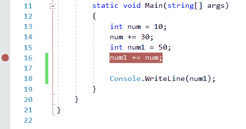](https://res.cloudinary.com/practicaldev/image/fetch/s--BzS6lA4g--/c_limit%2Cf_auto%2Cfl_progressive%2Cq_auto%2Cw_880/https://blog.syncfusion.com/wp-content/uploads/2019/05/Code-with-Breakpoint.png) 

<figure>

<figcaption>带断点的代码</figcaption>

</figure>

遍历代码

有两种方法可以遍历代码。它们是:

*   进入
*   跨过

单步执行遍历导航每一行代码。当定义一个对象或调用一个方法时，它会遍历到对象/方法定义中。使用**调试** > **步进**或按 **F11** 使用步进遍历。

跨越遍历绕过对象创建和方法定义。使用**调试** > **步进**或按 **F10** 使用步进穿越。

## [T1](#datatips)

当程序执行遇到断点时，可以在运行时看到数据提示。这可用于检查断点范围内的变量值。将鼠标放在范围内的变量上进行检查。如果变量是基本数据类型，如 int、float、string 等，您可以直接找到它的值。如果它是一个复杂的类型，比如列表、字典或类对象，那么您可以检查它的直接值以及其子代的值。

[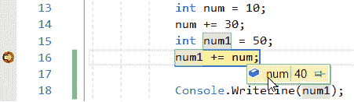](https://res.cloudinary.com/practicaldev/image/fetch/s--gUnp92QE--/c_limit%2Cf_auto%2Cfl_progressive%2Cq_auto%2Cw_880/https://blog.syncfusion.com/wp-content/uploads/2019/05/DataTip-with-a-Basic-Data-Type.png) 

<figure>

<figcaption>数据提示基本数据类型</figcaption>

</figure>

您可以通过选择**图钉到源**图钉图标来固定数据提示，使其保持打开。

[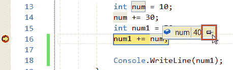](https://res.cloudinary.com/practicaldev/image/fetch/s--rpscvRc0--/c_limit%2Cf_auto%2Cfl_progressive%2Cq_auto%2Cw_880/https://blog.syncfusion.com/wp-content/uploads/2019/05/Pinned-DataTip.png) 

<figure>

<figcaption>钉住数据提示</figcaption>

</figure>

要取消固定或关闭固定的数据提示，分别点击**取消固定**或**关闭**图标。

[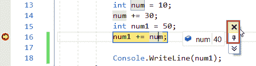](https://res.cloudinary.com/practicaldev/image/fetch/s--hdXwkhpq--/c_limit%2Cf_auto%2Cfl_progressive%2Cq_auto%2Cw_880/https://blog.syncfusion.com/wp-content/uploads/2019/05/Closing-a-Pinned-DataTip.png) 

<figure>

<figcaption>关闭一个锁定的数据提示</figcaption>

</figure>

## 

**观察**窗口提供了一种检查变量的高级方法。要在调试时观察变量，右击变量或数据提示并选择**添加观察**，将其添加到**观察**窗口。该变量将出现在**观察**窗口中。

**观察窗**主要用于检查复杂物体。

 

<figure>

<figcaption>观察窗口中的变量</figcaption>

</figure>

## 

您可以使用**即时**窗口来调试、评估表达式、执行语句和打印变量值。**即时**窗口通过构建和使用当前选择的项目来评估表达式。要显示**即时**窗口，选择**调试>窗口>即时**或按**CTRL**+**ALT**+**I**。**即时**窗口也支持智能感知。

例如，要显示变量* *num ** 的值，可以使用以下命令:

？数字

要显示计算表达式的值，可以使用如下命令:

？num + num1 到 50

？num =日期时间。现在。日+数字 1

[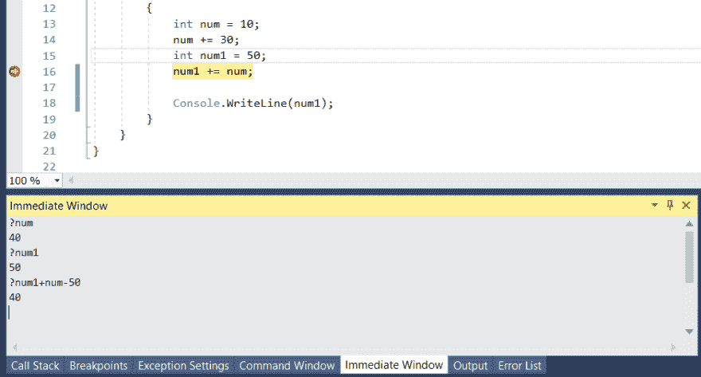](https://res.cloudinary.com/practicaldev/image/fetch/s--nt1j7m32--/c_limit%2Cf_auto%2Cfl_progressive%2Cq_auto%2Cw_880/https://blog.syncfusion.com/wp-content/uploads/2019/05/Immediate-Window-in-Visual-Studio.png)

<figure>
T5】Visual Studio 中的即时窗口</figure>

右键单击**即时**窗口，选择出现的上下文菜单中的相关选项，可以剪切、复制、粘贴和清除该窗口的内容。

[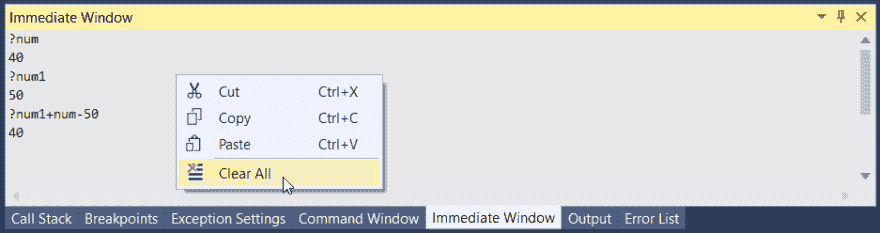](https://res.cloudinary.com/practicaldev/image/fetch/s--oadkqWcc--/c_limit%2Cf_auto%2Cfl_progressive%2Cq_auto%2Cw_880/https://blog.syncfusion.com/wp-content/uploads/2019/05/Immediate-Window-Context-Menu.png) 

<figure>

<figcaption>即时窗口上下文菜单</figcaption>

</figure>

## 

IntelliSense 是一个代码完成工具，可以帮助您完成一行代码。这不仅提供了完成单词的建议，还列出了与对象相关的所有属性、方法和事件。调用方法时，IntelliSense 将提供有关要传递的参数类型和方法返回类型的信息。

IntelliSense 搜索结果使用模糊匹配来提供建议。例如，列表成员的结果列表不仅包括以您输入的字符开头的条目，还包括名称中任意位置包含字符组合的条目。

[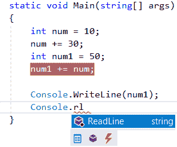](https://res.cloudinary.com/practicaldev/image/fetch/s--YkTCSdxm--/c_limit%2Cf_auto%2Cfl_progressive%2Cq_auto%2Cw_880/https://blog.syncfusion.com/wp-content/uploads/2019/05/IntelliSense-Suggestions.png) 

<figure>

<figcaption>智能感知建议</figcaption>

</figure>

## 

要打开**转到**窗口，按下 **CTRL** + **T** 或点击**编辑** > **转到**。 **Go to All** 使您能够快速跳转到任何文件、类型、成员或符号声明。

[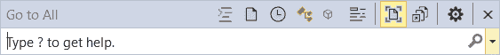](https://res.cloudinary.com/practicaldev/image/fetch/s--qL2D5tX6--/c_limit%2Cf_auto%2Cfl_progressive%2Cq_auto%2Cw_880/https://blog.syncfusion.com/wp-content/uploads/2019/05/Go-to-All-Option.png) 

<figure>

<figcaption>转到所有选项</figcaption>

</figure>

## 

您可以使用书签快速导航到文件中的特定代码行。

要设置书签，选择**编辑** > **书签** > **切换书签**或按 **CTRL+K，CTRL+K** 。您可以在**书签**窗口中查看解决方案的所有书签。要显示**书签**窗口，点击**查看** > **书签窗口**或按 **CTRL** + **K** ， **CTRL** + **W** 。

[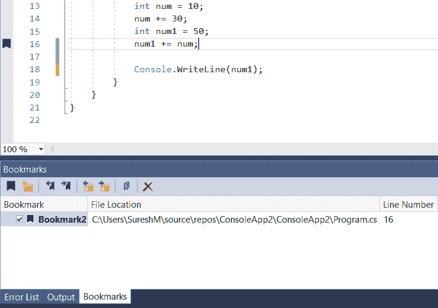](https://res.cloudinary.com/practicaldev/image/fetch/s--Syad6OpY--/c_limit%2Cf_auto%2Cfl_progressive%2Cq_auto%2Cw_880/https://blog.syncfusion.com/wp-content/uploads/2019/05/Bookmarks-Window.png) 

<figure>

<figcaption>书签窗口</figcaption>

</figure>

## 

Visual Studio 2019 通过代码清理功能提供代码文件的按需格式化，包括代码样式首选项。要运行代码清理，点击编辑器底部的**扫把图标**或按下 **CTRL** + **K** ， **CTRL** + **E** 。

[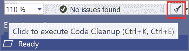](https://res.cloudinary.com/practicaldev/image/fetch/s--SU71GmOK--/c_limit%2Cf_auto%2Cfl_progressive%2Cq_auto%2Cw_880/https://blog.syncfusion.com/wp-content/uploads/2019/05/Code-Cleanup-Option.png) 

<figure>

<figcaption>代码清理选项</figcaption>

</figure>

## 

您可以更改 IDE 中用于文本的字体、大小和颜色。例如，您可以在编辑器中自定义特定代码元素的颜色，在工具窗口或整个 IDE 中自定义字体。

要更改字体，请进入**工具** > **选项** > **环境** > **字体和颜色**。

[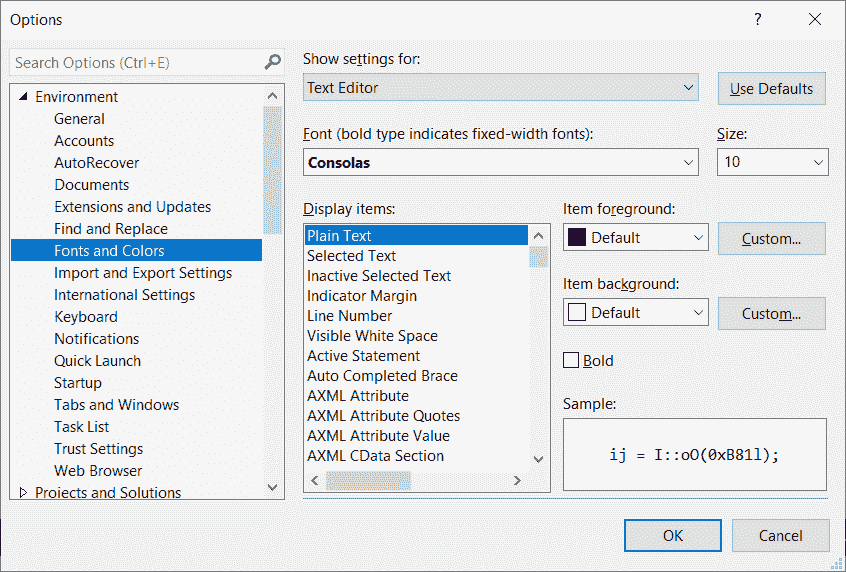](https://res.cloudinary.com/practicaldev/image/fetch/s--mhH8GZUe--/c_limit%2Cf_auto%2Cfl_progressive%2Cq_auto%2Cw_880/https://blog.syncfusion.com/wp-content/uploads/2019/05/Customizing-Fonts-in-Visual-Studio.png) 

<figure>

<figcaption>在 Visual Studio 中自定义字体</figcaption>

</figure>

## 结论

在这篇博客中，我们学习了在 Visual Studio 中使用各种技巧和窍门，我希望我在开始开发时就知道这些！希望这对您或 Visual Studio 中的任何新程序员有用。如果你认为有任何 Visual Studio 工具是基本的，但是在这个博客中没有提到，请在下面的评论中发表。我们将把它们汇编成另一个博客发布。

编码快乐！

帖子[初级开发人员使用 Visual Studio 的 10 个技巧和诀窍](https://blog.syncfusion.com/post/10-visual-studio-tips-for-junior-developer.aspx)首先出现在 [Syncfusion 博客](https://blog.syncfusion.com)上。