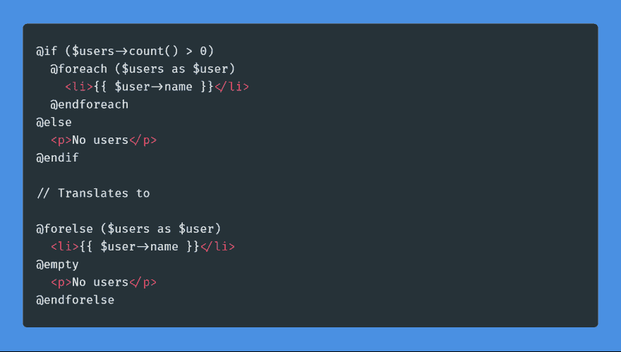
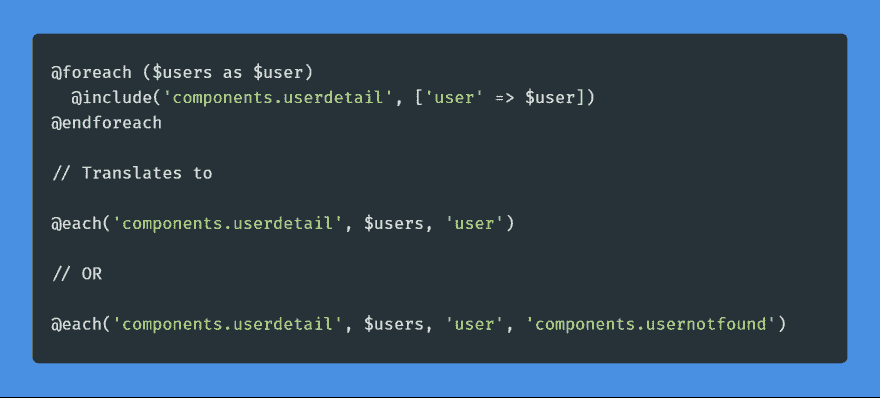
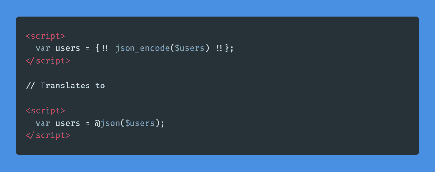
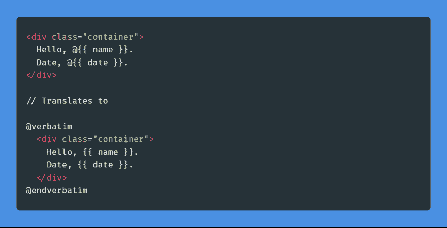
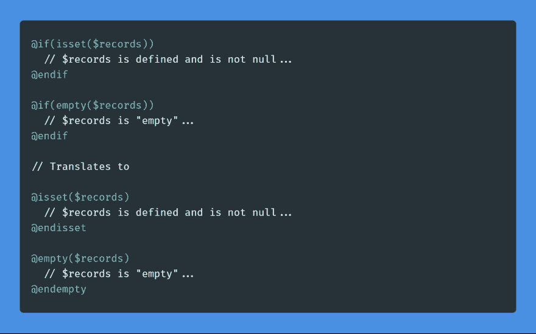
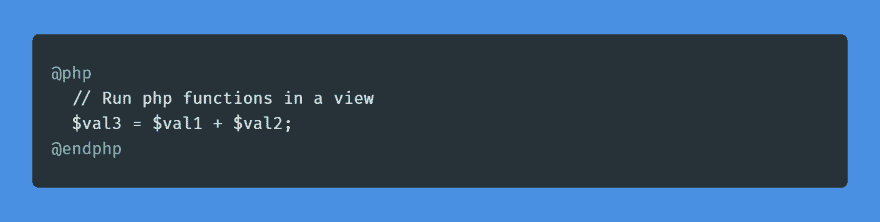
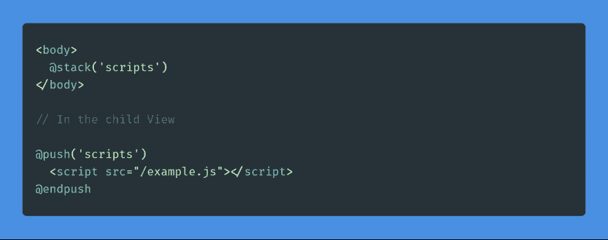
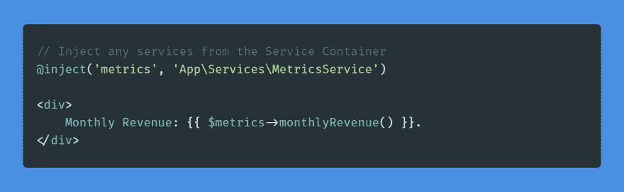
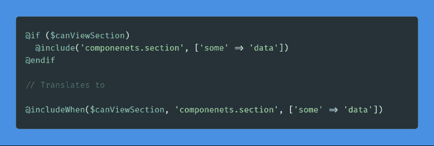
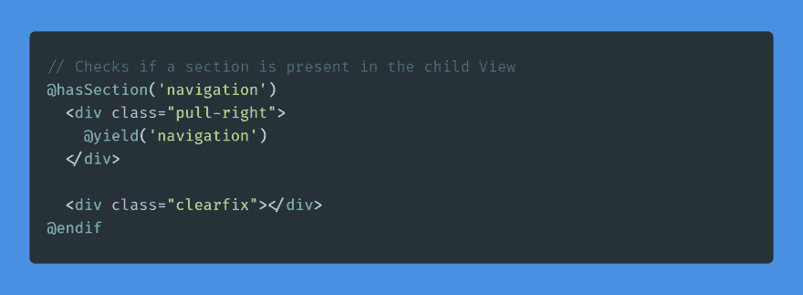

# 10 个未充分利用的 Laravel 刀片指令

> 原文：<https://dev.to/adi/10-underused-laravel-blade-directives-2e89>

Laravel Blade 是框架中内置的模板引擎。它使得使用 HTML 变得轻而易举。我和 Laravel 合作了一年多，但是从来没有意识到 Blade 的一些特性。我想与你分享 10 个未被充分利用的刀片指令，它们将清理你的代码并在这个过程中节省一些时间。我们走吧。

> 来看看 LaravelCollections.com 吧——一个不断增长的大型旅游资源的集合

### @每

### @json

### @逐字

### @isset & @空

### @php

### @推送&@堆栈

### @注入

### @包含何时

### @hasSection

### 结论

我希望这些技巧能帮助你写出更好的刀片视图。如果你有什么建议，请与我们分享。我已经链接了一些资源，它们将帮助你把你的语言技能提高到一个新的水平。

1.  [LaravelCollections.com](https://laravelcollections.com/?utm_campaign=10-blade-tips-article)
2.  [Laravel 刀片文档](https://laravel.com/docs/5.7/blade)
3.  [Scotch.io 教程](https://scotch.io/tutorials/all-about-writing-custom-blade-directives)
4.  [自定义刀片指令包](https://github.com/appstract/laravel-blade-directives)

感谢阅读，与可能感兴趣的人分享这篇文章。
**这已经是阿迪- [最简单的网](https://simplestweb.in/?utm_campaign=10-blade-tips-article)**