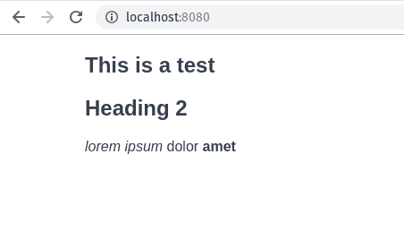
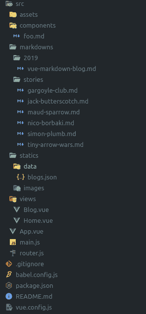
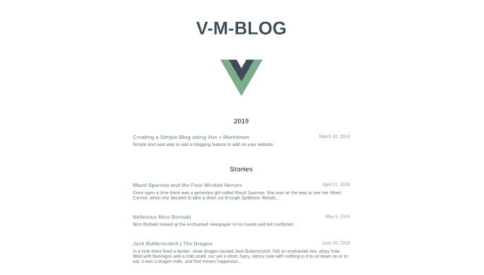

# 使用 Vue 和 Markdown 创建简单的博客

> 原文：<https://dev.to/vycoder/creating-a-simple-blog-using-vue-with-markdown-2omd>

我不是一个“天生的”前端开发人员，用我的 Java 知识学习 vue 和重新学习 Javascript 是一个挑战。更不用说所有那些捆绑器、构建器，比如 webpack、gulp、grunt 和其他奇怪的噪音，它们增加了学习现代 web 框架的整体复杂性。但是如果有一件事帮助我学习新技术的话，那就是直接投入并建立小项目。教学也是一种被广泛接受的技术，对你的学习有很大的帮助。这并不意味着你必须聚集大量的听众来听你讲课。有时候，你需要的观众只是你自己。写下你所学到的，并打算教给你过去(或未来)愚蠢的自己。我知道这有点奇怪和矛盾，但请跟我一起做。

带着这个想法，整整一年前，我决定在我的个人网站上增加一个博客版块，只是为了好玩。我刚刚把我以前的作品集移植到 Vue，我想知道给它添加博客功能最简单的方法是什么。我知道，有些人可能会反对首先使用前端框架来开发一个微不足道的投资组合网站。但是如果你的目标真的只是建立并运行一个框架，我认为用它来建立你的投资组合网站是一个好的开始。这是一个简单的项目，它将真正让你熟悉基础知识，并给你足够的动力去完成它。

所以我就这么做了。这篇文章讲述了我如何着手在我的 Vue 组合网站上添加博客功能的故事。我的思维过程、决策、方法和禁忌。

我从一开始就知道，我希望它非常简单。我知道 ButterCMS 很好，但尽可能我不想介绍太多的复杂性，它毕竟只是一个简单的个人网站。我真正想要的是像每次写新帖子时硬编码和提交新网页一样简单，但仍然足够简单，我不会担心用 HTML 标记编写。这就是 markdown 的用武之地。Markdown 是一种非常流行的轻量级标记语言，正好符合这个要求。

就这么决定了。在这一切的中心，我想完成的只是两件事:

*   能够在 markdown 中写我的博客
*   Vue 必须能够将这些标记显示为常规的 html 页面

本质上，要完成这两者，我只需要弄清楚 Vue 如何解释 markdown。现在，我不是 webpack 的专家，见鬼，当我几年前建立我的网站时，我甚至不知道如何配置 webpack，我把它放在一边，以利于学习我当时正在学习的任何框架。但是接触它一段时间后，我能够了解它的一些概念和背景。在这种情况下，我知道我需要的是一个可以解释 markdown 的 webpack loader。很像`.vue`的文件因为`vue-loader`通过 webpack 之后出来的很好。

## vista 降级加载器

实际上，在意识到这一点后，我做的第一件事就是谷歌搜索*“vue markdown loader”*。而[李](https://github.com/QingWei-Li)的 [vue-markdown-loader repo](https://github.com/QingWei-Li/vue-markdown-loader) 作为第一个结果回来了。文档非常简单，我在我的`vue.config.js` :
添加了这段代码

```
module.exports = {
  chainWebpack(config){
    config.module.rule('md')
      .test(/\.md/)
      .use('vue-loader')
      .loader('vue-loader')
      .end()
      .use('vue-markdown-loader')
      .loader('vue-markdown-loader/lib/markdown-compiler')
      .options({
        raw: true
      })
  }
} 
```

Enter fullscreen mode Exit fullscreen mode

就像`vue-loader`让`.vue`文件成为可能一样，`vue-markdown-loader`让`.md`在 Vue 中工作。实质上，降价现在可以被解释为 Vue 的一个组成部分。为了测试这一点，在我的`components/`目录中，我创建了下面的`foo.md` :

```
# This is a test
## Heading 2
_lorem ipsum_ dolor __amet__ 
```

Enter fullscreen mode Exit fullscreen mode

将其作为组件导入到`App.vue`并在模板中使用。

```
<template>
  <div id="app">
    <foo />
    ...
  </div>
</template>
<script>
  import Foo from '@/components/foo.md'
  export default {
    components: { Foo },
    ...
  }
</script> 
```

Enter fullscreen mode Exit fullscreen mode

做一个快速`yarn serve`和访问`localhost`，维奥拉！有用！

[](https://res.cloudinary.com/practicaldev/image/fetch/s--065mYvce--/c_limit%2Cf_auto%2Cfl_progressive%2Cq_auto%2Cw_880/https://www.josephharveyangeles.com/statiimg/blogs/2019/vue-markdown-blog/foo.png)

此时，我们已经验证了我们的 Vue 项目现在可以理解并呈现 markdown。我们现在可以用`.md`写博客，并在任何我们喜欢的地方引用它们。因为它是一个组件，所以没有什么可以阻止我们将它用作路由组件，比如在我们的`router.js` :
中

```
import Vue from 'vue'
import Router from 'vue-router'
import Home from './views/Home.vue'
import Foo from './components/foo.md'

Vue.use(Router)

export default new Router({
  mode: 'history',
  base: process.env.BASE_URL,
  routes: [
    { path: '/', name: 'home', component: Home },
    { path: '/foo', name: 'foo', component: Foo }
  ]
}) 
```

Enter fullscreen mode Exit fullscreen mode

现在，每次我们访问`/foo`时，它都会显示我们`foo.md`的降价内容。很漂亮，对吧？这是可行的，但是如果我们能简化添加一个新帖子的过程不是更好吗？我们可以创建一个单独的文件，把所有的博客条目放在那里，每当我们有新的博客文章时，我们就更新这个文件——好的间接方式。

```
[  "foo",  "another-post",  ] 
```

Enter fullscreen mode Exit fullscreen mode

我们将不得不稍微改变我们注册路由组件的方式。我们必须以编程方式构建这些路由，并使用动态导入
来利用[动态组件注册](https://vuejs.org/v2/guide/components-dynamic-async.html#Async-Components)

```
import Vue from 'vue'
import Router from 'vue-router'
import Home from './views/Home.vue'
import Blogs from './statics/blogs.json'

Vue.use(Router)

export default new Router({
  mode: 'history',
  base: process.env.BASE_URL,
  routes: [
    { path: '/', name: 'home', component: Home },
    ...Blogs.map(entry => ({
      path: `/${entry}`,
      name: entry,
      component: () => import(`./markdowns/${entry}.md`)
    }))
  ]
}) 
```

Enter fullscreen mode Exit fullscreen mode

注意，在上面的代码中，我们将 markdown 文件名分配给了`path`和`name`。为了更好的结构，我们把所有的降价都放在它自己的目录里。在这个设置中，每当我们添加一个新的博客帖子时，我们再也不用去打扰`router.js`了。现在，剩下唯一要做的事情就是创建指向它们的实际链接。

## 把所有的东西放在一起

利用我们所学的知识，我将所有的东西放在一起，并在这个[链接](https://vue-markdown-blog.netlify.com)上创建了一个工作演示。您也可以在这个[库](https://github.com/vycoder/vue-markdown-blog)中查看代码。与我们以前的实验相比，我们有一些小的变化。

首先，让我们看看目录结构:

[](https://res.cloudinary.com/practicaldev/image/fetch/s--5Ft5nFsv--/c_limit%2Cf_auto%2Cfl_progressive%2Cq_auto%2Cw_880/https://www.josephharveyangeles.com/statiimg/blogs/2019/vue-markdown-blog/filestruc.png)

注意，我已经创建了子目录`2019`和`stories`，它们指向博客的不同部分。这稍微改变了我们构建路线的方式，但是将极大地改进我们的整体 UI。

看着`statics/data/blogs.json` :

```
{  "2019":  [  {  "id":  "vue-markdown-blog",  "date":  "March 10, 2019",  "title":  "Creating a Simple Blog using Vue + Markdown",  "description":  "Simple and neat way to add a blogging feature to add on your website."  }  ],  "stories":  [  {  "id":  "maud-sparrow",  "date":  "April 21, 2018",  "title":  "Maud Sparrow and the Four Wicked Horses",  "description":  "Once upon a time there was a generous girl called Maud Sparrow. She was on the way to see her Albert Connor, when she decided to take a short cut through Spittleton Woods..."  },  {  "id":  "nico-borbaki",  "date":  "May 5, 2018",  "title":  "Nefarious Nico Borbaki",  "description":  "Nico Borbaki looked at the enchanted newspaper in his hands and felt conflicted..."  },  {  "id":  "jack-butterscotch",  "date":  "June 10, 2018",  "title":  "Jack Butterscotch | The Dragon",  "description":  "In a hole there lived a tender, silver dragon named Jack Butterscotch. Not an enchanted red, stripy hole, filled with flamingos and a cold smell, nor yet a short, hairy, skinny hole with nothing in it to sit down on or to eat: it was a dragon-hole, and that means happiness..."  },  {  "id":  "tiny-arrow-wars",  "date":  "July 27, 2018",  "title":  "Galactic Tiny Arrow Wars",  "description":  "A long, long time ago in a tiny, tiny galaxy..."  },  {  "id":  "gargoyle-club",  "date":  "August 7, 2018",  "title":  "Club of Gargoyle",  "description":  "Molly Thornhill suspected something was a little off when her creepy daddy tried to club her when she was just six years old. Nevertheless, she lived a relatively normal life among other humans."  },  {  "id":  "simon-plumb",  "date":  "September 20, 2018",  "title":  "Simon Plumb and the Two Kind Gerbils",  "description":  "Once upon a time there was a virtuous boy called Simon Plumb. He was on the way to see his Annie Superhalk, when he decided to take a short cut through Thetford Forest..."  }  ]  } 
```

Enter fullscreen mode Exit fullscreen mode

我把它转换成了一个对象，而不是一个字符串数组。每个键都指向与其子目录相匹配的博客部分。每个键下的对象数组指的是实际的博客条目。我们将在 UI 中使用像`date`这样的附加属性，但重要的是引用实际降价组件的`id`。

(此外，您可以将所有内容放在一个`js`文件中，而不是`json`。这是个人喜好的问题。把它放在一个`js`文件中可能会让你的产品在 webpack 完成它之后变得更小。但是将它保存在`statics`下的一个`json`文件中，将作为一个简单的 REST 端点，我可以从这里发出`GET`请求，如果将来我最终将它集成到其他 UI 中，这将非常有用。)

我已经实现了所有这些额外的更改，以便能够显示这样的 UI:

[](https://res.cloudinary.com/practicaldev/image/fetch/s--HJc01hUW--/c_limit%2Cf_auto%2Cfl_progressive%2Cq_auto%2Cw_880/https://www.josephharveyangeles.com/statiimg/blogs/2019/vue-markdown-blog/home.png)

我们需要做的最后一件事就是调整`router.js`。它所做的基本上只是将这些博客部分映射到路由对象中。每个部分下的条目成为其各自路由对象的子对象。基本上，我们将能够使用以下格式的路径访问我们的博客条目:`${section}/${blog entry}`，例如:`2019/vue-markdown-blog`。

```
import Vue from 'vue'
import Router from 'vue-router'
import Home from './views/Home.vue'

Vue.use(Router)

import BlogEntries from './statics/data/blogs.json';

const blogRoutes = Object.keys(BlogEntries).map(section => {
  const children = BlogEntries[section].map(child => ({
    path: child.id,
    name: child.id,
    component: () => import(`./markdowns/${section}/${child.id}.md`)
  }))
  return {
    path: `/${section}`,
    name: section,
    component: () => import('./views/Blog.vue'),
    children
  }
})

export default new Router({
  mode: 'history',
  base: process.env.BASE_URL,
  routes: [
    {
      path: '/',
      name: 'home',
      component: Home
    },
    ...blogRoutes
  ]
}) 
```

Enter fullscreen mode Exit fullscreen mode

这个设置为我们的博客引入了另一个关键的改进:改变样式。注意，`Blog.vue`充当我们博客条目的包装布局组件。它包含以下代码:

```
<template>
  <div class="blog">
    <router-view />
    <router-link to="/" tag="a" class="back">&laquo; Back</router-link>
  </div> </template> 
```

Enter fullscreen mode Exit fullscreen mode

### 造型

我们现在有机会随心所欲地设计渲染后的减价。这里的关键是使用一个`/deep/`选择器来定位最终将在`<router-view />`中显示的内容。请看下面:

```
<template>
  <div class="blog">
    <router-view />
    <router-link to="/" tag="a" class="back">&laquo; Back</router-link>
  </div> </template> <style lang="scss" scoped>
.blog {
  max-width: 50vw;
  margin: 10rem auto;
  /deep/ {
    h1 {
      font-size: 3rem;
      margin-bottom: .2rem;
      color: #42b883;
    }
    h4 {
      margin-bottom: 3rem;
      color: #35495e;
    }
  }
}
</style> 
```

Enter fullscreen mode Exit fullscreen mode

查看[markedstyle.com](http://markedstyle.com/styles)了解更多降价造型创意。你甚至可以导入一个外部的 markdown 样式，只是不要忘记在一个`.blog /deep/`选择器中正确地包装它。即:

```
/** external style **/
.blog /deep/ {
 /** paste external markdown style here **/
} 
```

Enter fullscreen mode Exit fullscreen mode

不过有点警告，人们应该尽可能避免使用`/deep/`，因为它不知何故违背了`scoped`的目的，而且它已经被 Chrome 否决了。Vue-loader 仍然支持它，这就是它工作的原因。但是我认为这是一个有用的例子。我们不想污染全球 css 范围，所以我们希望将样式包含在`Blog.vue`的*子*中，所以我们一起使用`scoped`和`/deep/`。(不过，如果有更有见识的人对此有更好的解决方案，我会很乐意接受。)

就是这样！一个简单的博客功能，无需使用任何其他第三方服务。只是简单明了。

## 进一步改进

如果您想更进一步，您可以使用博客条目中的所有附加字段添加页面元，`date`、`title`、`description`等。如果你也实现了某种社交分享，这将会很好。你可以看看我的网站，看看这是怎么回事:[www.josephharveyangeles.com](https://www.josephharveyangeles.com)

## 有用的链接

*   [演示](https://vue-markdown-blog.netlify.com)
*   [项目库](https://github.com/vycoder/vue-markdown-blog)
*   [动态组件](https://vuejs.org/v2/guide/components-dynamic-async.html#Async-Components)
*   vista-CLI 网页包指南
*   [vista-markdown 加载机](https://github.com/QingWei-Li/vue-markdown-loader)
*   [使用 CSS 模块](https://cli.vuejs.org/guide/css.html#postcss)
*   [降价风格](http://markedstyle.com/styles)