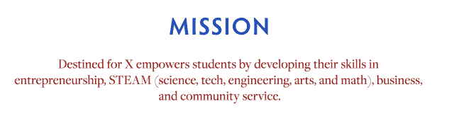
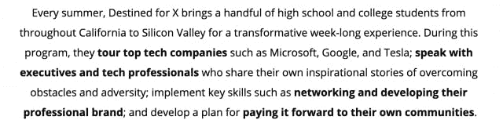
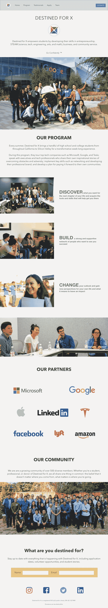

# 重构用户界面:试图为我们的非营利组织主页创造一个更好的第一印象

> 原文：<https://dev.to/jasonbasuil/refactoring-a-homepage-a-first-taste-of-ui-design-1i88>

在过去的两年里，我有幸为 X 建立了一个名为[的非盈利教育机构。我们通过硅谷沉浸式项目将贫困/代表性不足的高中学生联系起来，让他们拥有发展个人和职业生涯的工具和技能。我们教授诸如有效的目标设定、人际交往和公开演讲等技能。此外，学生们可以参观微软、脸书和谷歌等大型科技公司，同时有机会与高管、工程师和企业家会面。](https://www.destinedforx.com/)

这个博客的目的不是讲述我们如何成为今天这个组织的故事。如果你想了解更多关于我们在过去两年中如何成长以及我们做了些什么的故事，请随时访问我在 LinkedIn 上的反思文章:[从想法到现实:建立我们注定的 X 社区&赋予我们的年轻人](https://www.linkedin.com/pulse/from-idea-reality-building-our-destined-x-community-youth-basuil/)。

由于我们正处于学生申请季节，我们的目标是今年资助的学生人数翻一番，我想再看看我们的网站，看看我们给访问者或未来的学生留下了什么样的第一印象。

在仔细查看了我们的主页后，我惊讶地注意到一些没有意义的设计决策。我没有设计师的正式经验，但你不应该真的需要成为一名专业人士才能注意到什么好看，什么不好看。也许我的眼睛正在捕捉新的细节，因为我开始越来越关心用户体验的视觉方面。

**为什么我们首先使用 Squarespace**

*   两年前，这是我们启动网站最简单的方法。

*   不需要接触 HTML、CSS 或 JS。刚刚成功了。

*   提供了模板。

*   可以有一个网站托管并准备使用快！当时我们是一个三人团队，我们试图快速构建这个程序。我们在争取最有价值球员。

**方形空间的限制**

*   HTML 和 CSS 编辑非常困难。甚至劝阻不要弄乱他们的模板。

*   模板选择不多。

*   实际上可以做事情的适应性模板的可用性。

*   无法添加自定义功能。

为了更有条理、更快地完成工作，并且不要太纠结于细节，Squarespace 工作得很好。然而，随着我们作为一个组织为自己设定的目标的实现，很明显我们需要对我们的网站有更多的灵活性和控制力。第一印象很重要，大多数人会通过我们的网站了解我们更多。主页上显示的内容以及信息在滚动的最初几秒钟内是如何传递的非常重要。

我们主页上的第一印象有多有效？

鉴于我在组织中的角色——领导学生体验和课程——我还没有机会真正仔细看看我们的网站以及它是如何建立的。目前，作为一名@FlatironSchool 的全栈软件工程学生，我意识到我被某样东西的外观以及它如何呈现给用户所吸引。

以下是我注意到的一些事情:

**Fonts**

*   蓝色、红色、黑色、灰色(只要两种左右占主导地位)
*   4 种不同的字体系列(太多)
*   衬线和无衬线的组合(想要对比，但是有冲突)

**间距**

*   间距是关闭的，并且通常太大或与其他元素不一致

**内容流**

*   按照元素/内容的顺序呈现它们是否有逻辑意义？
*   第一眼看到这个网站，它看起来专业合法吗？如何改进？

以下是该网站当前主页的一些片段。直接看[可能更容易。](https://www.destinedforx.com/)

**用 Adobe XD 重新设计主页**

我在一个周日下午花时间用 Adobe XD 制作了一个重新设计的主页模型。我以前没有使用过 UX/UI 设计工具，在我的研究中，这个工具是最好使用的工具之一。另外，它是免费的。

链接到高分辨率样机重新设计页面可以找到[这里](https://xd.adobe.com/view/27afe80f-289d-4855-5432-719011ed334c-519e/?fullscreen&hints=off)

**我从重新设计过程中学到的东西:**

*   我真的很喜欢这个过程。使用 Adobe XD 很简单，但我确信该软件还有很多我不熟悉的功能。

*   其他开发者为 Adobe XD 开发了许多优秀的插件来增强设计工作流程。

*   拥有项目的资产，并且能够将它们拖放到项目中，这无疑是有帮助的。

*   我喜欢思考内容的流动，事物的大小，间距，粗体，措辞等等。这涉及到我一直感兴趣的人类心理学的一些方面。

*   我有兴趣从整体上学习更多关于线框和 UX/UI 设计的知识。希望它能补充我在 Flatiron 已经学到的东西，也能告诉我想成为什么样的开发人员的大致方向。也许我想专注于 UI 前端开发。对 HTML、CSS、JS 和整体 UI 设计经验有很好的理解。

**旁注:需要品牌指南**

什么是品牌指南？

品牌指南，也称为品牌风格指南，管理公司品牌的构成、设计和总体外观。品牌指南可以规定徽标、博客、网站、广告和类似营销材料的内容。

随着我们作为一个组织的成长，我们需要我们的品牌有一些一致性。这不仅关系到我们的网站，也关系到我们的社交媒体推广。当创建了品牌指导方针后，创建内容就容易多了，而且在创建过程中不需要猜测，尤其是当你让非设计人员参与某个项目时。

**未来工作**

*   为组织创建品牌指南。

*   在我们 2019 年夏季项目的繁忙结束后，我们将在即将到来的一年中从 Squarespace 转移出去。这将是一个很好的机会来确定我的 HTML，CSS 和 JS 技能，当从头开始构建这个。

*   我可能会考虑在团队中成立一个设计/web 开发部门，来处理我们未来想要开发的任何产品，因为这与我们的学生项目有关。也许我们甚至可以建立自己的 LMS。我们目前使用 Canvas Instructure LMS 来托管教育内容。