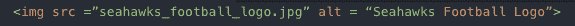
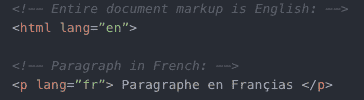
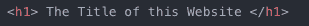
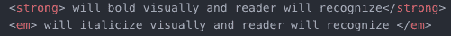
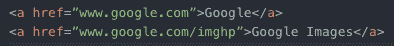
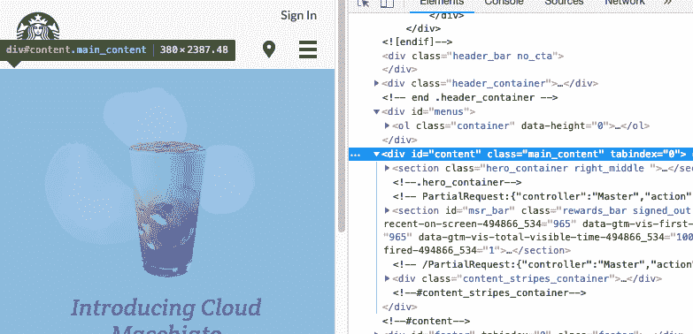

# HTML 代码影响屏幕阅读器的 5 种方式

> 原文：<https://dev.to/mollynem/5-ways-your-html-code-affects-a-screen-reader-2cn1>

屏幕阅读器很重要，因为它们使互联网成为一个包容的地方。屏幕阅读器是一种向用户大声朗读网页内容的软件，对于视力受损/失明、有认知障碍或不识字的人来说最有帮助。屏幕阅读器负责识别网页上的数据，解释数据，然后将数据传达给用户。这可以通过计算机的声音或通过盲文终端输出(如下图)。

重申一下，屏幕阅读器对那些使用它们的人来说起着非常重要的作用，因为对于那些不能自己访问互联网的人来说，它们是通往互联网的门户。如果没有屏幕阅读器的帮助，可能无法完成日常任务，如发电子邮件、支付在线账单或预订机票。

由于屏幕阅读器的重要性，软件工程师在构建和塑造互联网的过程中，保持对屏幕阅读器的了解和关注是非常必要的。我希望通过这篇文章，我可以帮助提醒开发者社区，我们有责任让互联网成为一个对每个人都包容和可访问的环境。请注意，我并没有涵盖 HTML 代码影响屏幕阅读器的所有方式，这篇文章只是对这个主题的一个介绍。

## HTML 代码影响屏幕阅读器的 5 种方式:

### 图片的替代文字

屏幕阅读器不能“阅读”图像。相反，他们读取通过 HTML 标记提供的替代文本。这个替换文本应该给出图像内容的准确和清晰的描述。如果没有提供替代文本，屏幕阅读器将显示“图形”。不太方便使用是吗？请务必对网页中包含的每个图像进行有意义的描述。

### 语言

HTML 允许你指定你的页面所使用的语言。当您的页面在另一个国家或由具有不同语言设置的用户访问时，这允许无缝翻译。如果您的页面包含来自其他语言的文本片段，您需要添加另一个语言标签来包围该外国片段。这样，当屏幕阅读器解析您的页面时，它可以读取文本并将其翻译成适当的语言。

### 语义结构

屏幕阅读器将显示标签中包含的文本，如 title 或 h1。因此，重要的是要有战略眼光，注意你所识别的标题。确保页面上的每一个标题都是有效的，值得重点阅读。重要的是要注意，应该总是使用标题标签——不要调整字体大小或粗体来代替标题标签。一个屏幕阅读器寻找具体的 HTML 指示符来宣布一些东西作为标题，所以一定要提供。

这同样适用于段落正文中的文本。虽然屏幕阅读器会拾取强(strong)和强调(em)标签，但是粗体(bold)和斜体(I)标签不会传达给用户，因为它们只具有视觉含义。

### 链接

链接会被完整地宣布并大声朗读。这意味着包含长文本的链接——不仅仅是一个短语或单词——经常会让用户感到困惑，并可能导致他们跳过所有链接。此外，太短的链接可能很难让用户点击。身体有残疾的人可能会使用屏幕阅读器作为辅助，但自己使用鼠标。如果链接是单个字符，他们可能很难将鼠标准确地对准链接来点击。在决定用作链接的文本时，请记住这一点。

### 页面结构

当人们第一次浏览网页时，他们能够从视觉上评估网页:总体布局、配色方案、上下文和导航路线。一个屏幕阅读器没有这种奢侈。相反，页面的每一部分都是按照从上到下的顺序逐步阅读的。因此，重要的是你的页面布局要有意义。问问你自己——如果用户只能从上到下阅读，那么所有的内容都是有序的吗？

现在，考虑用户可以告诉屏幕阅读器跳到页面的不同部分。假设我告诉我的屏幕阅读器跳到主上下文部分，这里的上下文有意义吗？它实际上是页面的主要部分吗？此外，页面上的导航选项卡是否被识别为导航？当我让我的读者去那里的时候，我能理解在网站上跳来跳去的各种链接吗？记住这些问题，确保你的页面以一种对任何用户都有直观意义的方式组织。

我写这篇文章的灵感来自于我在 [Fast Company](https://www.fastcompany.com/40555815/what-its-like-to-be-a-blind-software-engineer-at-amazon) 上找到的一篇文章。这篇文章讲述了一个关于迈克尔·福尔扎诺的非凡故事，他自 2013 年以来一直在亚马逊担任软件工程师。迈克尔生来就患有诺里病，从出生起就双目失明。无论在家还是在办公室，他每天都依赖屏幕阅读器。他的故事令人难以置信地鼓舞人心，令人印象深刻。我鼓励你阅读并与你的同事分享这个故事。

我希望我们都能花点时间思考一下软件工程师在这个每天越来越依赖互联网的世界中所扮演的不可或缺的角色。因为我们塑造了用户的网络体验，所以我们保持这些最佳实践以保持较低的准入门槛是至关重要的，这样任何人都可以参与进来。通过将屏幕阅读器放在我们的脑海中，我们可以确保每个人都能从互联网中受益。

资源:
[美国盲人基金会](http://www.afb.org/prodBrowseCatResults.aspx?CatID=49)
[WebAIM](https://webaim.org/techniques/screenreader/)
[快公司](https://www.fastcompany.com/40555815/what-its-like-to-be-a-blind-software-engineer-at-amazon)