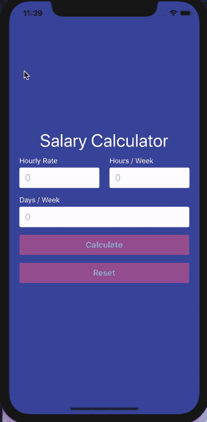

# 在 React Native 中创建一个 FormBuilder 组件(第 5 部分)

> 原文：<https://dev.to/dev_nope/create-a-formbuilder-component-in-react-native-part-5-535h>

本系列内容:

*   [第 1 部分:创建新的 React 原生应用](https://dev.to/dev_nope/create-a-formbuilder-component-in-react-native-intro--part-1-1m84)
*   [第 2 部分:创建一个简单的工资计算器表单](https://dev.to/dev_nope/create-a-formbuilder-component-in-react-native-part-2-2dec)
*   [第 3 部分:创建自定义表单输入和按钮组件](https://dev.to/dev_nope/create-a-formbuilder-component-in-react-native-part-3-1aib)
*   [第四部分:关于`FormBuilder`组件的工作](https://dev.to/dev_nope/create-a-formbuilder-component-in-react-native-part-4-5gc3)
*   第 5 部分:动态启用/禁用表单按钮(当前)
*   [第 6 部分:创建注册表单](https://dev.to/dev_nope/create-a-formbuilder-component-in-react-native-part-6-2ohd)
*   第 7 部分:增加对布尔字段类型的支持

# 第 5 部分:动态启用/禁用表单按钮

让我们的表单按钮只在我们需要的时候才启用不是很好吗？例如:

*   默认禁用`Calculate`按钮，只有填写完所有表单字段后才启用；
*   默认情况下也禁用`Reset`按钮，只有在至少填写了一个表单字段时才启用它。

### 修改我们的`FormButton`组件

我们来处理一下。首先，我们需要修改我们的`FormButton`组件，并允许它接受一个布尔`disabled`属性，该属性将用于启用或禁用我们的按钮。修改后的版本如下所示:

```
import React from 'react';
import PropTypes from 'prop-types';
import { TouchableOpacity, Text, StyleSheet } from 'react-native';

/**
 * A stateless function component which renders a button.
 *
 * @param {obj} props
 */
const FormButton = (props) => {
    const { children, onPress, disabled } = props;

    return (
        <TouchableOpacity
            style={[styles.button, disabled && styles.buttonDisabled]}
            onPress={onPress}
            disabled={disabled}
        >
            <Text style={styles.buttonText}>{children}</Text>
        </TouchableOpacity>
    );
};

FormButton.propTypes = {
    onPress: PropTypes.func,
    children: PropTypes.string.isRequired,
    disabled: PropTypes.bool,
};

FormButton.defaultProps = {
    onPress: f => f,
    disabled: false,
};

const styles = StyleSheet.create({
    button: {
        backgroundColor: '#FD6592',
        borderRadius: 3,
        height: 40,
        marginHorizontal: 10,
        marginBottom: 15,
        justifyContent: 'center',
        alignItems: 'center',
    },
    buttonText: {
        color: '#FFF',
        fontWeight: 'bold',
        fontSize: 16,
    },
    buttonDisabled: {
        opacity: 0.5,
    },
});

export default FormButton; 
```

`TouchableOpacity`接受一个布尔`disabled`属性，当它为`true`时，它禁用该组件的所有交互。这正是我们所需要的，只有一个小小的例外:在视觉上，按钮在启用和禁用状态下看起来是一样的。当`disabled`道具像这样是`true`时，我们可以通过有条件地添加一些样式来解决这个问题(请注意，我已经用注释替换了一些现有的代码，只是为了突出我们所做的更改):

```
<TouchableOpacity
   style={[styles.button, disabled && styles.buttonDisabled]}
   {/* ... */}

const styles = StyleSheet.create({
    // ...
    buttonDisabled: {
        opacity: 0.5,
    },
}); 
```

### 启用/禁用`Calculate`按钮

正如我们上面提到的，我们希望我们的`Calculate`按钮只有在所有的表单字段都被填写后才被激活。嗯，我们已经有了`hasValidFormData`助手函数，它可以准确地告诉我们这一点。我们可以这样使用它:

```
<FormButton
    onPress={this.attemptFormSubmission}
    disabled={!this.hasValidFormData()}
>
    {submitBtnTitle}
</FormButton> 
```

### 启用/禁用`Reset`按钮

当至少填写了一个表单域时，需要启用此按钮。让我们写一个小的帮助函数来帮助我们检测:

```
/**
 * Check if at least one field has been filled out.
 */
hasDirtyFormData = () => {
    const formFields = this.getFormFields();
    const isDirty = formFields.some(field => !!this.state[field.name]);
    return isDirty;
}; 
```

注意我们是如何使用 JavaScript 数组 [some()](https://developer.mozilla.org/en-US/docs/Web/JavaScript/Reference/Global_Objects/Array/some) 方法的——这对我们的用例来说非常方便。

现在我们准备像这样动态地启用和禁用`Reset`按钮:

```
<FormButton onPress={this.resetForm} disabled={!this.hasDirtyFormData()}>
    Reset
</FormButton> 
```

就是这样！让我们看看表单在这一点上是如何工作的:

[](https://res.cloudinary.com/practicaldev/image/fetch/s--8EpQ4JSD--/c_limit%2Cf_auto%2Cfl_progressive%2Cq_66%2Cw_880/https://thepracticaldev.s3.amazonaws.com/i/6avr8hw11r6a3l9yxyci.gif)

要查看完整的变更列表，请查看 GitHub 上的这个[提交。](https://github.com/vasilestefirta/react-native-form-builder/commit/c3fbd83a6d0946d2d880b10f5e7b9fcba3e1036f)

* * *

如果你到目前为止做得很好！👏但是为什么要在这里停下来呢？🤓让我们再一次尝试我们的组件，并在本系列的第 6 部分中使用它创建一个注册表单👉。