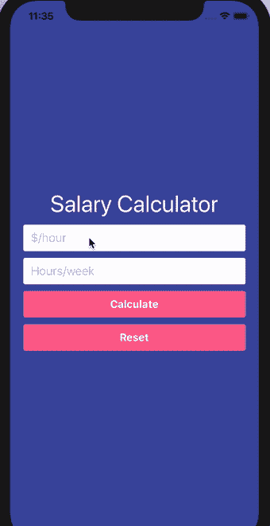

# 在 React Native 中创建一个 FormBuilder 组件(第 2 部分)

> 原文：<https://dev.to/dev_nope/create-a-formbuilder-component-in-react-native-part-2-2dec>

本系列内容:

*   [第 1 部分:创建新的 React 原生应用](https://dev.to/dev_nope/create-a-formbuilder-component-in-react-native-intro--part-1-1m84)
*   第 2 部分:创建一个简单的工资计算器表单(当前)
*   [第 3 部分:创建自定义表单输入和按钮组件](https://dev.to/dev_nope/create-a-formbuilder-component-in-react-native-part-3-1aib)
*   [第四部分:关于`FormBuilder`组件的工作](https://dev.to/dev_nope/create-a-formbuilder-component-in-react-native-part-4-5gc3)
*   [第 5 部分:即时启用/禁用表单按钮](https://dev.to/dev_nope/create-a-formbuilder-component-in-react-native-part-5-535h)
*   [第 6 部分:创建注册表单](https://dev.to/dev_nope/create-a-formbuilder-component-in-react-native-part-6-2ohd)
*   第 7 部分:增加对布尔字段类型的支持

# 第 2 部分:创建一个简单的工资计算器表单

我们首先创建一个非常基本的表单，有两个文本输入和两个按钮。更新后的`App.js`文件应该如下所示:

```
import React, { Component } from 'react';
import {
    StyleSheet,
    KeyboardAvoidingView,
    Text,
    Keyboard,
    TextInput,
    TouchableOpacity,
    Alert,
} from 'react-native';

export default class App extends Component {
    constructor(props) {
        super(props);

        // define the initial state, so we can use it later
        // when we'll need to reset the form
        this.initialState = { hourlyRate: '', hoursPerWeek: '' };

        this.state = this.initialState;
    }

    /**
     * Grab user's input data and do the math.
     */
    handleSubmit = () => {
        // using Javascript object destructuring to
        // get user's input data from the state.
        const { hourlyRate, hoursPerWeek } = this.state;

        // hide the keyboard
        // NOTE: the keyboard seems to show up after being dismissed
        //       when using the Alert react native component.
        //       Not a big deal at the moment (this is fine 😜).
        Keyboard.dismiss();

        // make sure we have some numeric values to work with
        if (!parseFloat(hourlyRate) || !parseFloat(hoursPerWeek)) {
            Alert.alert('Input error', 'Please input some positive numeric values.');
            return;
        }

        // do the Math
        const annualIncome = Math.abs(parseFloat(hourlyRate) * parseFloat(hoursPerWeek) * 52);

        // show results
        Alert.alert(
            'Your input and result',
            `$/hour: ${hourlyRate},\n Hours/week: ${hoursPerWeek}, \n Annual Income: $${annualIncome}`,
        );
    };

    /**
     * Reset the form and hide the keyboard.
     */
    resetForm = () => {
        Keyboard.dismiss();
        this.setState(this.initialState);
    };

    render() {
        const { hourlyRate, hoursPerWeek } = this.state;

        return (
            <KeyboardAvoidingView behavior="padding" style={styles.container}>
                <Text style={styles.screenTitle}>Salary Calculator</Text>
                <TextInput
                    style={styles.textInput}
                    placeholder="$/hour"
                    keyboardType="numeric"
                    returnKeyType="done"
                    blurOnSubmit
                    onChangeText={text => this.setState({ hourlyRate: text })}
                    value={hourlyRate}
                />
                <TextInput
                    style={styles.textInput}
                    placeholder="Hours/week"
                    keyboardType="numeric"
                    returnKeyType="done"
                    blurOnSubmit
                    onChangeText={text => this.setState({ hoursPerWeek: text })}
                    value={hoursPerWeek}
                /> 
                <TouchableOpacity style={styles.button} onPress={this.handleSubmit}>
                    <Text style={styles.buttonText}>Calculate</Text>
                </TouchableOpacity> 
                <TouchableOpacity style={styles.button} onPress={this.resetForm}>
                    <Text style={styles.buttonText}>Reset</Text>
                </TouchableOpacity>
            </KeyboardAvoidingView>
        );
    }
}

const styles = StyleSheet.create({
    container: {
        flex: 1,
        justifyContent: 'center',
        paddingHorizontal: 20,
        backgroundColor: '#3F4EA5',
    },
    screenTitle: {
        fontSize: 35,
        textAlign: 'center',
        margin: 10,
        color: '#FFF',
    },
    textInput: {
        height: 40,
        borderColor: '#FFF',
        borderWidth: 1,
        borderRadius: 3,
        backgroundColor: '#FFF',
        paddingHorizontal: 10,
        marginBottom: 10,
        fontSize: 18,
        color: '#3F4EA5',
    },
    button: {
        backgroundColor: '#FD6592',
        borderRadius: 3,
        height: 40,
        marginBottom: 10,
        justifyContent: 'center',
        alignItems: 'center',
    },
    buttonText: {
        color: '#FFF',
        fontWeight: 'bold',
        fontSize: 16,
    },
}); 
```

因此，我们最终会得到一个计算器屏幕，其外观和工作方式如下:

[](https://res.cloudinary.com/practicaldev/image/fetch/s--VdKNwj8o--/c_limit%2Cf_auto%2Cfl_progressive%2Cq_66%2Cw_880/https://thepracticaldev.s3.amazonaws.com/i/8nspn2h41xzlrdyokuux.gif)

那么我们这里有什么？

*   使用 [KeyboardAvoidingView](https://facebook.github.io/react-native/docs/keyboardavoidingview) 组件创建的主容器。你通常可以使用简单的[视图](https://facebook.github.io/react-native/docs/view)组件来创建容器，但是当你处理显示/隐藏虚拟键盘时，那么建议使用`KeyboardAvoidingView`到[来改善用户体验](https://facebook.github.io/react-native/docs/improvingux)。

*   通过[文本](https://facebook.github.io/react-native/docs/text)组件创建的表单标题

*   两个文本输入询问用户它的`hourlyRate`是什么和多少`hoursPerWeek`是可收费的。为此我们使用了[文本输入](https://facebook.github.io/react-native/docs/textinput)。这个组件有一个`onChangeText`属性，每次文本改变时，它都会调用一个函数。我们使用 prop 将用户输入存储到`state`中。这样，我们可以在组件中的任何地方轻松地访问和操作该值。

*   使用 [TouchableOpacity](https://facebook.github.io/react-native/docs/touchableopacity) 创建的提交按钮。我们也可以使用默认的[按钮](https://facebook.github.io/react-native/docs/button)组件来创建一个按钮，但是这个组件不允许对 UI 进行太多的定制。`TouchableOpacity`和`Button`组件都接受一个`onPress`道具，该道具接受一个当用户点击按钮时被调用的函数。

*   一个重置按钮，当点击时重置文本输入并隐藏虚拟键盘。

要查看完整的变更列表，请查看 GitHub 上的这个[提交。](https://github.com/vasilestefirta/react-native-form-builder/commit/634e4641945486a59e0bed399c67aa95d6ae94eb)

* * *

现在我们已经准备好了这个简单的表单，让我们继续本系列的第 3 部分,我们将为我们的文本输入和按钮创建一些包装器组件。