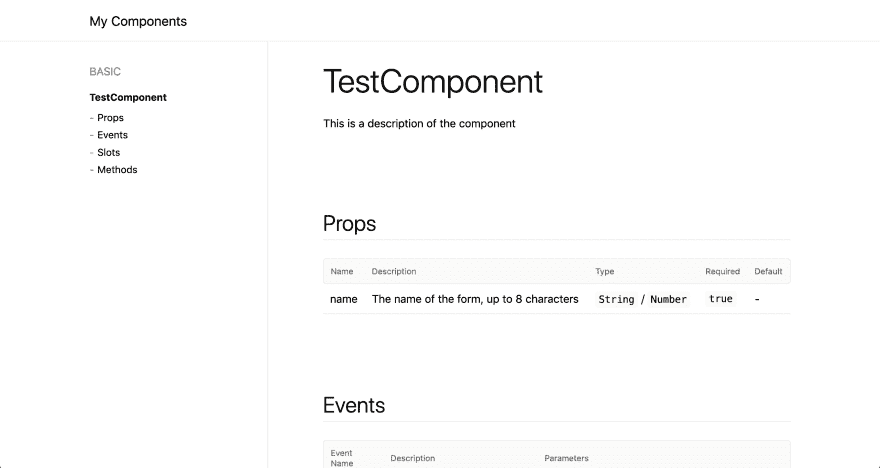

# 快速轻松地为 Vue.js 组件生成文档

> 原文：<https://dev.to/berniwittmann/quick--easy-documentation-generation-for-vuejs-components-7k6>

您是否曾经忽略过 Vue 应用程序的组件？

[](https://i.giphy.com/media/l41lFw057lAJQMwg0/giphy.gif)

如果是这样的话，你肯定应该关心你的组件的文档。所以这里的第一个想法是什么:在维基中打开一个页面，写下每个组件的功能。然而，这可能不是最好的方法，因为人们往往会忘记更新文档(或者只是不想更新，就像我一样)。

[](https://i.giphy.com/media/56ikf9jD4ZK6s/giphy.gif)

那么，为什么不直接从代码中自动生成一个漂亮的文档页面呢？但是怎么做呢？

[](https://i.giphy.com/media/12NUbkX6p4xOO4/giphy.gif)

放心吧！vuese 支持你。它可以为您的组件自动生成文档，并将其呈现为一个简洁的 html 页面。

##  [ vuese ](https://github.com/vuese) / [ vuese](https://github.com/vuese/vuese)

### 🤗vue 组件文档的一站式解决方案。原始组织:https://github.com/vuese

<article class="markdown-body entry-content container-lg" itemprop="text">

# 武塞

[](https://user-images.githubusercontent.com/14146560/51301277-9712f100-1a69-11e9-8e3b-fec861c2f31c.png)

vue 组件文档的一站式解决方案

这个项目得到了我们的[支持者](https://github.com/vuese/vuese./BACKERS.md)的支持

[](https://github.com/vuese/vuese/actions)[](https://github.com/vue-contrib/vuese/blob/monorepo/LICENSE)[](https://github.com/vue-contrib/vuese/pull/new)[](http://commitizen.github.io/cz-cli/)[](https://github.com/prettier/prettier)[](https://www.patreon.com/HcySunYang)

# 文件

详细文档:[vuese.org](http://vuese.org)

## 概观

[Vuese](http://vuese.org) 自动为您的`vue`组件生成文档，并提供多种组件文档生成解决方案，满足您的不同需求。

## @vuese/cli

[ ](https://www.npmjs.com/package/@vuese/cli) [ ](https://www.npmjs.com/package/@vuese/cli)

[@vuese/cli](http://vuese.org/cli/) 是一个非常简单易用的命令行工具。如果您想为您的`vue`组件快速构建一个文档站点，或者只是想为您的`vue`组件生成`markdown`文档，那么这个工具可能是一个不错的选择。详情请看: [@vuese/cli](http://vuese.org/cli/)

## @vuese/parser

[ ](https://www.npmjs.com/package/@vuese/parser) [ ](https://www.npmjs.com/package/@vuese/parser)

[@vuese/parser](http://vuese.org/parser/) 模块是`vue`组件的解析器， [@vuese/cli](http://vuese.org/cli/) 通过 [@vuese/parser](http://vuese.org/parser/) 模块在内部解析`vue`组件并提取我们想要的信息。你可以用 [@vuese/parser](http://vuese.org/parser/) 模块提供的接口做任何更高级的事情。对于`API`文档，请访问 [@vuese/parser](http://vuese.org/parser/)

### 在线体验

访问以下<g-emoji class="g-emoji" alias="point_down" fallback-src="https://github.githubassets.cimg/icons/emoji/unicode/1f447.png">👇</g-emoji> …

</article>

[View on GitHub](https://github.com/vuese/vuese)

您现在就可以将它添加到您的 Vue 项目中，方法是安装:

```
npm install -g @vuese/cli 
```

Enter fullscreen mode Exit fullscreen mode

然后运行 vuese 来生成文档

```
vuese gen 
```

Enter fullscreen mode Exit fullscreen mode

仅此而已，我发誓🙌🏻

* * *

现在让我们来看看它是如何工作的

假设我们有以下组件:

```
<template>
  <div>
    <!-- Form header -->
    <slot name="header">
      <!-- `<th>title</th>` -->
      <th>title</th>
    </slot>
  </div>
</template>

<script>
// This is a description of the component
export default {
  name: 'TestComponent',
  props: {
    // The name of the form, up to 8 characters
    name: {
      type: [String, Number],
      required: true,
      validator () {}
    }
  },
  methods: {
    // @vuese
    // Used to manually clear the form
    clear () {
      // Fire when the form is cleared
      // @arg The argument is a boolean value representing xxx
      this.$emit('onclear', true)
    }
  }
}
</script> 
```

Enter fullscreen mode Exit fullscreen mode

这产生了这个简洁的 html 页面:

[](https://res.cloudinary.com/practicaldev/image/fetch/s--MOmFBAZ3--/c_limit%2Cf_auto%2Cfl_progressive%2Cq_auto%2Cw_880/https://i.imgur.com/Mb6aTyP.png)

vuese 从插槽、道具、方法和事件中检索数据和注释，并直接从代码中检索组件本身的数据和注释。如您所见，它甚至从`name`属性中提取了类型和所需的状态。

你可以在这里查看结果:[https://berniwittmann.github.io/vuese-demo/index.html](https://berniwittmann.github.io/vuese-demo/index.html#/components/TestComponent)

我还创建了一个小的 repo，您可以在其中玩注释，感受一下它有多简单。

##  [伯尼威特曼](https://github.com/BerniWittmann) / [ vuese-demo](https://github.com/BerniWittmann/vuese-demo)

### Vue 组件的 Vuese 文档生成的简短演示

<article class="markdown-body entry-content container-lg" itemprop="text">

[](https://github.com/BerniWittmann/vuese-demoassets/header_image_demo_vuese.png)

# 使用 vuese - Demo 快速轻松地生成 Vue 组件的文档

这个报告是工具 [vuese](https://github.com/vuese/vuese) 为 Vue.js 组件创建组件文档的简短演示。

> 随附的博文可在 [dev.to](https://dev.to/berniwittmann/quick--easy-documentation-generation-for-vuejs-components-7k6) 上找到

**结果**

[](https://github.com/BerniWittmann/vuese-demoassets/result.png)

## 设置

安装依赖项

```
npm install 
```

## 生成文档

通过运行以下命令生成文档

```
npm run docs 
```

</article>

[View on GitHub](https://github.com/BerniWittmann/vuese-demo)

所以，享受创建你的组件文档的乐趣吧，一定要查看[vuese.org](https://vuese.org)了解更多信息。

感谢阅读，我很高兴得到一些反馈，因为这是我的第一篇博文💪🏻

[](https://i.giphy.com/media/l2R0eYcNq9rJUsVAA/giphy.gif)