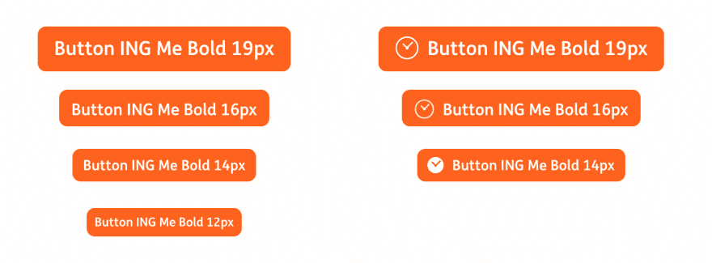
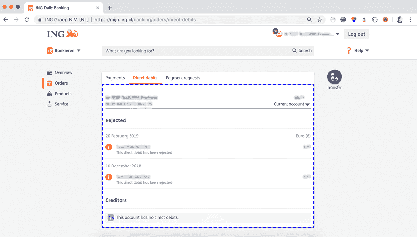
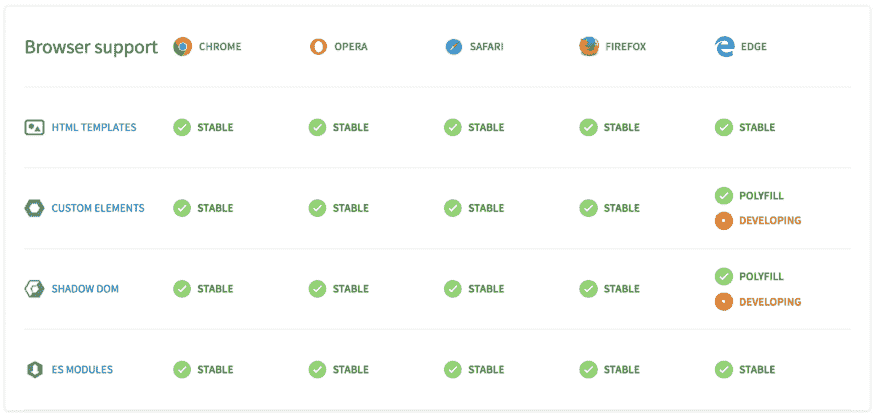
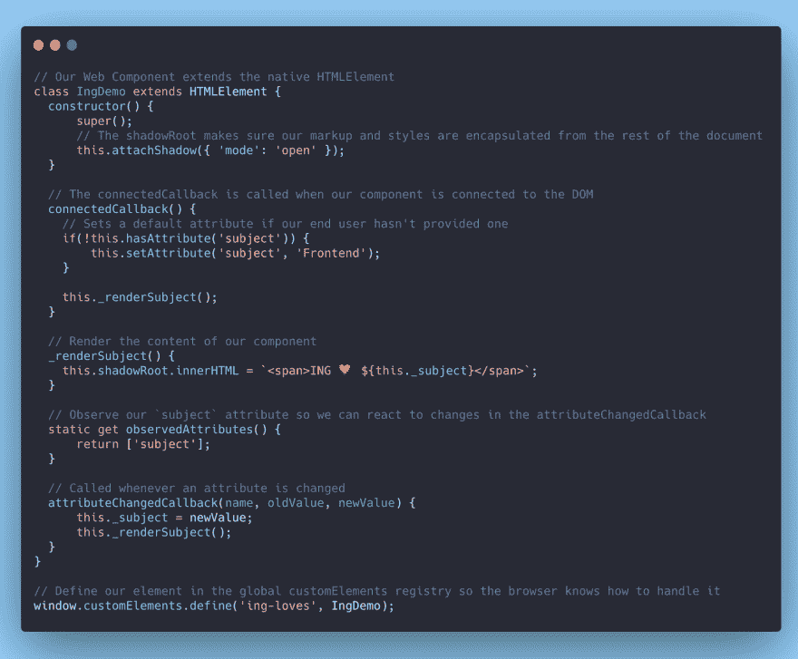
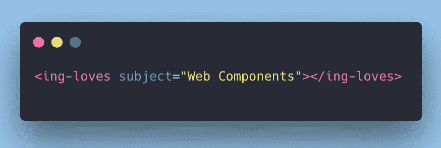
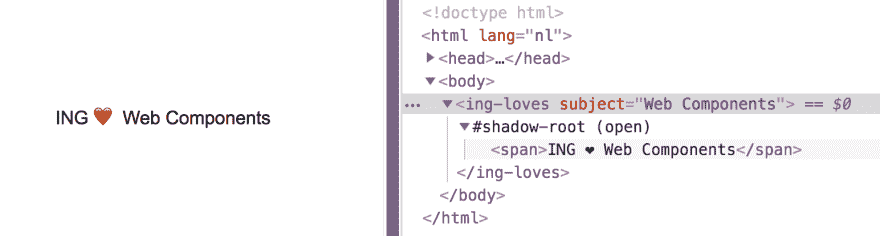
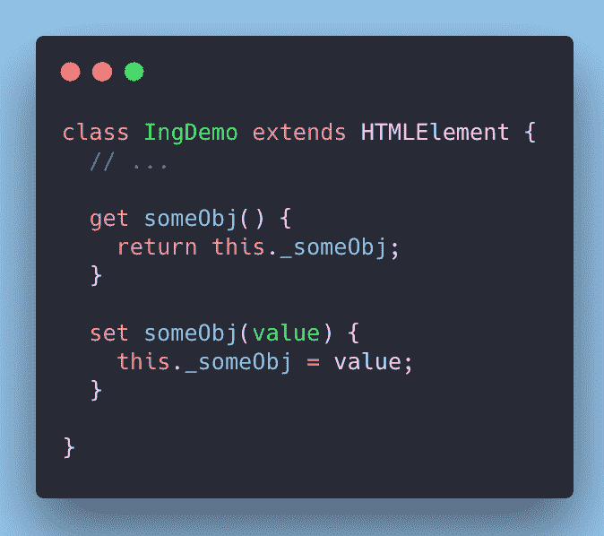
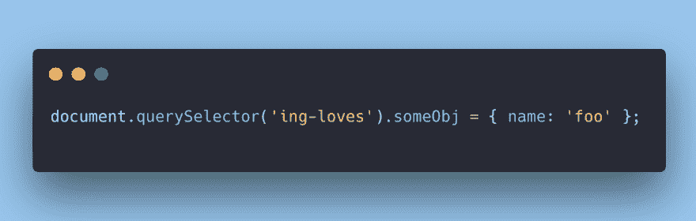
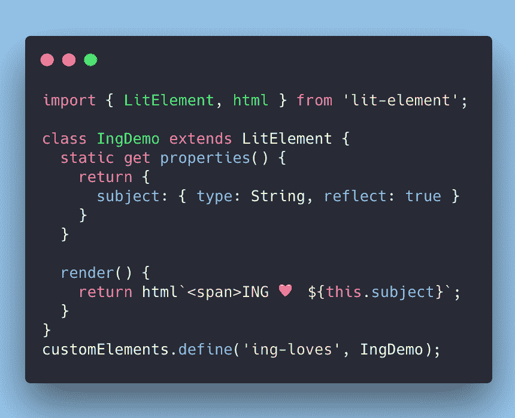

# ING ❤️网络组件

> 原文：<https://dev.to/thepassle/ing--web-components-aef>

# ING ❤️网页组件

> 最初发布在科技博客上。

在过去的几年中，基于组件的 web 开发架构越来越流行，这极大地改变了开发人员构建用户界面的方式。这种模型通过将界面分成(你猜对了)**组件**，摆脱了更传统的[MVC](https://www.wikiwand.com/en/Model-view-controller)UI 开发方法！

### 基于组件的架构

CBA(基于组件的架构)的工作方式是将你界面的各个部分分离成独立的组件，强调可重用性和单一责任。界面可以由不同类型的组件组成:从简单的“叶子”组件，如按钮或输入，到更复杂的复合组件，如登录表单，它本身由许多其他组件组成。

> 一个简单的 UI 按钮组件，用作:`<ing-button>`

通过这种方式，像应用程序视图这样的全部功能可以被定义为它们自己的组件，同时消费和重用更简单的组件。

> 一个直接借记功能组件，用作:`<ing-orange-direct-debits>`

那么 Web 组件到底是如何参与其中的呢？web 组件是一套统一的 Web 标准，它允许我们以一种可以跨浏览器和框架工作的方式编写我们已经讨论过的组件。

从历史上看，过去有一些标准化组件模型的尝试，比如 1998 年微软的 HTML 组件(HTC)和 2001 年 Mozilla 的 XML 绑定语言(XBL)。第一份名为《现代 Web 组件标准 Web 组件 v0》的公开草案于 2012 年发布。2014 年，Chrome 和 Opera 增加了对 v0 规范的支持。2016 年，v1 规范发布，反映了浏览器厂商对 web 组件的功能和 API 达成的共识。

尽管浏览器标准化过程需要一些时间，但一旦被接受，浏览器标准往往会确保长久性。

## ING ❤️浏览器标准

所以让我们来看看允许我们编写 Web 组件的标准:

*   **自定义元素:**

自定义元素规范使我们能够在文档中定义和使用新类型的 DOM 元素。我们基本上是在告诉浏览器，“你好，浏览器👋，这里有一种新的 HTML 元素，下面是如何使用它的！”。

*   **ES 模块:**

v0 web 组件规范提供了 [HTML 导入](https://developer.mozilla.org/en-US/docs/Web/Web_Components/HTML_Imports)作为发布组件并将它们导入我们项目的标准方式。遗憾的是，该规范未能在浏览器供应商中获得支持，因此被弃用。

同时， [JavaScript 模块](https://hacks.mozilla.org/2018/03/es-modules-a-cartoon-deep-dive/)被标准化并跨浏览器实现。因为它们提供了浏览器本地的共享可重用的和自包含的代码，所以它自然适合 web 组件。
T3】

*   **HTML 模板:**

HTML 模板规范允许我们编写可重用的 DOM 块。HTML 模板是一个*内容片段*，它的内容不会被解析器处理，直到我们告诉它这样做。
T3】

*   **暗影 DOM:**

Shadow DOM 允许我们封装 Web 组件中的标记和样式；一个 *shadowRoot* 里面的任何东西都不会被外部的样式影响或覆盖，我们的样式也不会泄露到组件之外。

## ING ❤️浏览器支持

随着 Edge 宣布他们打算采用 Chromium 引擎，很快所有主流浏览器都将支持 Web 组件🎉。

幸运的是，Web 组件是完全可填充的，这使得我们可以向后兼容那些不支持 Web 组件的旧浏览器，比如 Internet Explorer。但是，这可能会降低多填充浏览器的性能。

## ING ❤️实用演示！

好了，关于标准和规范的讨论已经够多了，是时候动手看看代码了！

下面是一个我们如何编写一个非常简单的 Web 组件的例子:

我们现在可以像这样简单地使用我们的组件:

它将在 DOM 中显示为:

关于 Web 组件的一个常见的误解是它们只能接受字符串属性来传递数据。虽然由于 HTML 规范的限制，属性只能是字符串，但幸运的是，如果我们想传递一些丰富的数据，如对象和数组，我们可以简单地实现 getters 和 setters，如下所示:

然后我们可以使用 javascript 设置该属性:

太好了，我们现在有了一个全功能的 Web 组件！最棒的是，这段代码可以在任何*现代浏览器中运行，你可以将这段代码复制并粘贴到浏览器的控制台中，将`<ing-demo>`标签添加到你的 HTML 中，它就可以运行了！更重要的是，我们现在可以在所有的应用程序中一致地使用相同的组件。

> *一旦他们转用 chromium，预计将于 2019 年初推出

不太好的是，编写这样的代码将很快变得乏味、难以阅读和维护。想象一下，如果我们有一个有 10 种可能属性的组件。我们必须编写 10 个 getters，10 个 setters，如果我们想把我们的属性映射到属性呢？那将是一堆工作，和一大堆锅炉板代码。Web 组件在设计上是低级的*，旨在作为标准的集合，完成平台还不允许的非常具体的事情。这意味着我们可能需要某种类型的抽象来简化这一切，这就是为什么:*

 *## ING ❤️聚合物项目

Google 不仅是 Web 组件的主要驱动力之一，他们还提供了优秀的库来帮助我们创建它们。在很长一段时间里，聚合物库是 Web 组件的同义词，并且在 Web 组件使用的调整中发挥了重要作用。

现在标准已经成熟，开发 Web 组件变得更加容易，许多库和框架现在都支持 Web 组件的创建和使用，例如:

*   视图
*   [角度](https://angular.io/guide/elements)
*   [苗条的](https://svelte.technology/)
*   [溜冰](https://github.com/skatejs/skatejs)
*   [模板](https://stenciljs.com/)

如果你对在你最喜欢的框架中使用 Web 组件感兴趣，你可以访问[custom-elements-everywhere](https://custom-elements-everywhere.com/)。大多数框架*都支持 Web 组件的消费，没有任何问题。

> *遗憾的是，React 需要一些额外的步骤来使 Web 组件工作，因为如果不使用变通方法，它就无法侦听来自自定义元素的 DOM 事件，并且只能以属性的形式传递数据，而不是属性。

在 ING，我们❤️使用 [Polymer Classic](https://polymer-library.polymer-project.org/) 库和新的 [LitElement](https://lit-element.polymer-project.org/) 和 [lit-html](https://lit-html.polymer-project.org/) 库来开发我们的 Web 组件。让我们看看如何使用 LitElement 重写我们的`<ing-loves>`组件:

LitElement 的静态属性 getter 使得管理我们的 properties *和*属性变得非常容易，并且使得以声明方式*呈现我们的 HTML 变得非常容易。更重要的是，我们将原始示例中的 35 行代码减少到了少得可怜的 14 行代码。*

## ING💔疯狂的

尽管 Web 组件已经存在了一段时间，但是许多 JavaScript 库或浏览器扩展并不支持使用 Web 组件构建的网站。大多数情况下，这是因为许多扩展或库在构建时并没有考虑到影子 DOM。如果你需要复习；影子 DOM 允许我们封装我们的组件。从某种意义上说，这很好，因为这意味着 Shadow DOM 正在正确地完成它的工作，但这也是一个灾难，因为我们喜欢使用我们最喜欢的扩展！幸运的是，这大部分是时间问题；随着 Web 组件越来越受欢迎，越来越多的库和扩展将开始支持 Web 组件。

不久前，我们遇到了类似的问题，定制元素 polyfill 不能很好地与 LastPass 浏览器扩展一起使用。这导致用户无法使用 LastPass 扩展来登录我们的银行应用程序。

## ING ❤️未来

Web 组件几乎已经被所有主流浏览器所采用，但这并不意味着它的终结。还有更多的令人兴奋的规范和特性将被添加进来，这只会增加使用 Web 组件的好处。这里有一个未来值得期待的简短列表:

*   **作用域自定义元素定义** - [【讲解者】](https://gist.github.com/justinfagnani/d67d5a5175ec220e1f3768ec67a056bc)

对 Web 组件的一个有效批评是，定制元素是在全局注册表中定义的，这可能会导致名称冲突和各种各样的麻烦。作用域自定义元素定义允许构造 CustomElementRegistry，并使用给定的影子根作为这些定义的作用域，从而很容易避免名称冲突。

*   **CSS 阴影部分** - [【讲解人】](https://www.w3.org/TR/css-shadow-parts-1/)

Shadow DOM 非常适合封装我们的样式和标记，并保护它不被任何外部样式覆盖。但是...如果我们真的希望覆盖一些样式呢？CSS Shadow Parts 规范允许我们从 Web 组件外部对 Shadow 根中特意暴露的元素进行样式化。
T3】

*   **辅助功能对象模型** - [【讲解者】](https://github.com/WICG/aom/blob/gh-pages/explainer.md#custom-elements-apis)

辅助功能对象模型旨在为辅助技术改进浏览器 API。目前，Web 组件被迫使用 ARIA 来声明它们的默认语义。这导致 ARIA 属性实际上是“泄漏”到 DOM 中的实现细节。 [1](https://github.com/WICG/aom/blob/gh-pages/explainer.md#motivating-use-cases) 易访问性对象模型规范使得为我们的 Web 组件指定易访问性属性和特性变得更加容易，并且最终允许我们的用户更容易访问我们的 Web 组件..

作为一家银行，不仅我们的应用程序可以在任何浏览器中运行非常重要，而且我们的应用程序对于所有用户来说都是可访问的。如果你对可访问性感兴趣，请继续关注我们自己的可访问性专家关于可访问性的博文: [@erikkroes](https://twitter.com/erikkroes) ！

还有许许多多更棒的附加功能正在被添加到您身边的浏览器中！一些荣誉奖:[模板实例化](https://github.com/w3c/webcomponents/blob/gh-pages/proposals/Template-Instantiation.md)、 [HTML 和 CSS 模块](https://github.com/w3c/webcomponents/issues/645)、[可构造样式表](https://wicg.github.io/construct-stylesheets/)。

## 就这些了，乡亲们！

👊
🎤

这就是我这篇博文的全部内容，感谢您的阅读，如果您对 Web 组件有任何疑问，或者有任何反馈、批评或问题，请随时联系 [Twitter](https://twitter.com/passle_) 。我还要感谢 [Benny Powers](https://twitter.com/PowersBenny) 从 [Forter](https://www.forter.com/) 抽出时间来回顾和他的有益的意见和反馈✌.

## 附加资源

如果您对技术性更强的、关于 Web 组件的 blogpost 感兴趣，可以查看:

*   [Web 组件:从零到英雄](https://dev.to/thepassle/web-components-from-zero-to-hero-4n4m)由你真正
*   让我们来构建 Web 组件吧！由[本尼发力](https://twitter.com/PowersBenny)*