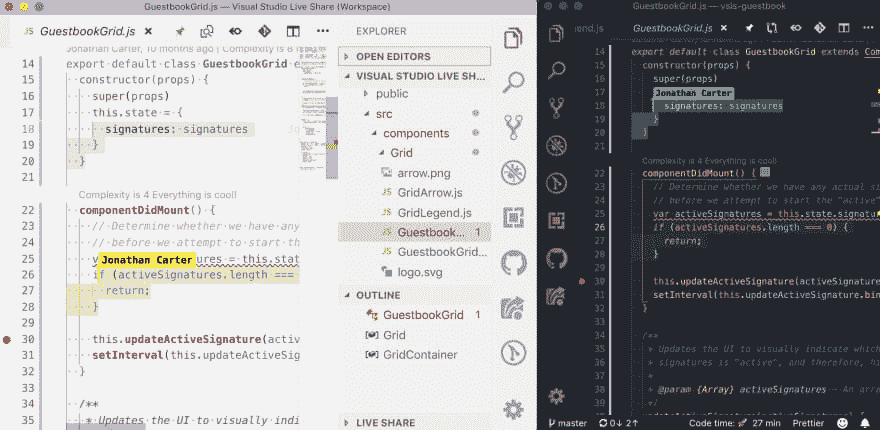
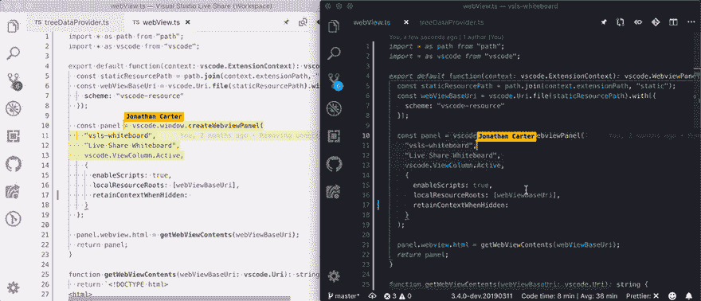
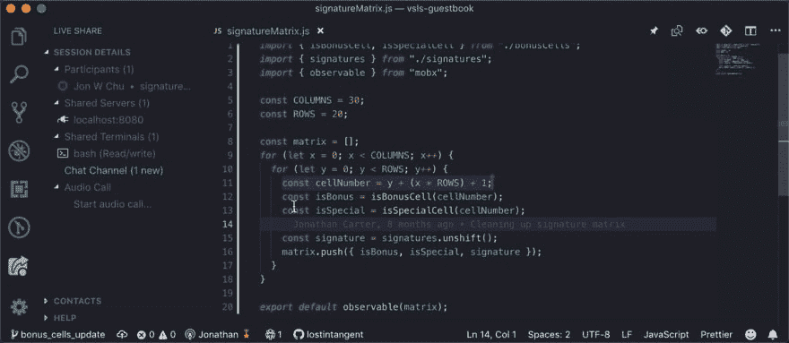
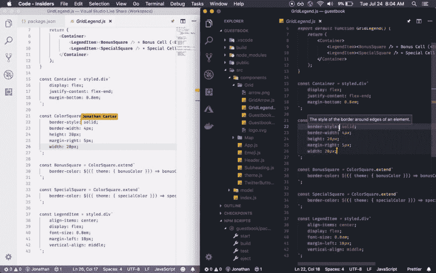
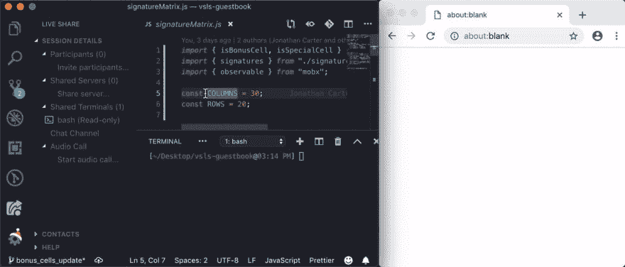
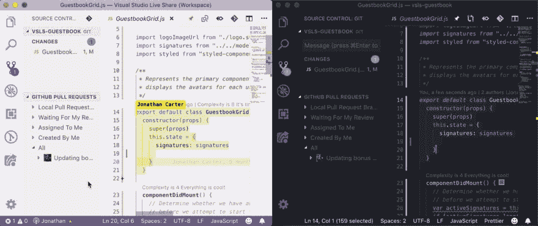
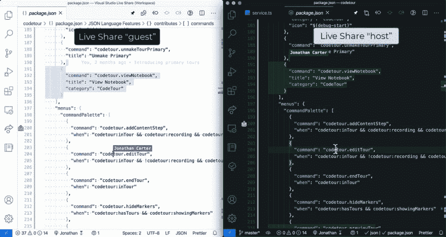
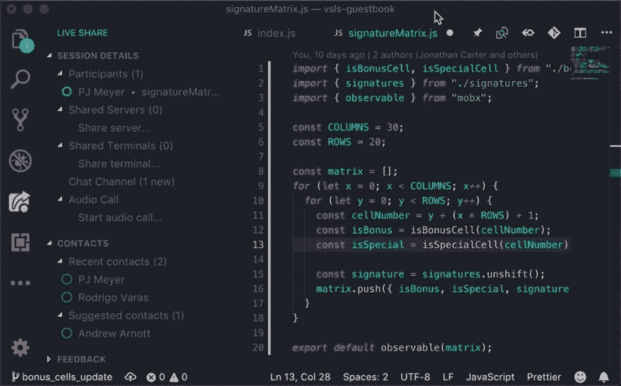
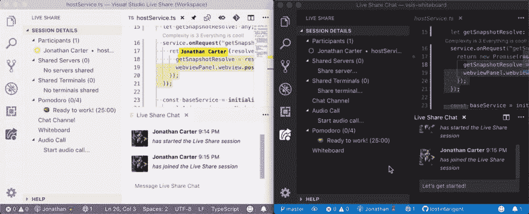
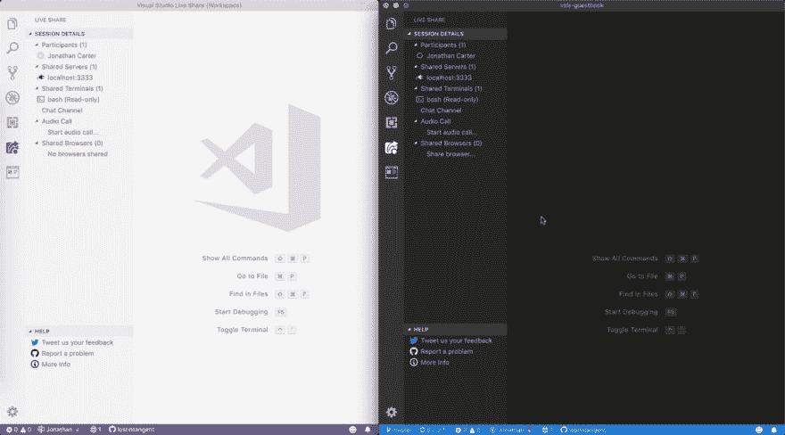

# 追求愉快的开发人员协作

> 原文：<https://dev.to/lostintangent/visual-studio-live-share-in-pursuit-of-enjoyable-developer-collaboration-2nko>

对于任何成功的开发团队来说，协作都是至关重要的。这是一个相当没有争议的观点，也绝对不新颖。无论你是指导某人，提供代码审查，帮助解决一个困难的 bug，或者只是做常规的结对，鼓励持续的知识转移都是很重要的(全方位！)，并支持共享所有权和团队凝聚力的文化。也就是说，有足够多的[的](https://products.office.com/en-us/microsoft-teams/group-chat-software)[现有的](https://ryanlue.com/posts/2018-01-13-pair-programming-over-ssh) [工具](https://en.wikipedia.org/wiki/Virtual_Network_Computing)和[流程](https://en.wikipedia.org/wiki/Pair_programming)来帮助开发者协作，那么为什么还要创建*又一个*？

当我们着手构建 [Visual Studio Live Share](https://aka.ms/vsls) 时，我们了解到团队以[非常多样的方式](https://aka.ms/vsls)进行协作，对于如何最有效地为他们工作有着独特而有意义的观点(例如，协作的频率、会话持续时间、是临时进行还是按计划进行)。我们不打算要求团队改变他们已经工作的方式，但是我们对补充它的*感兴趣。特别是，我们发现了一些方法，开发人员的协作可能会变得更加**愉快**，并最终变得更加**高效**，无论您的团队是完全远程的、部分分布式的还是完全协同定位的。让我们看看我的意思！*

## 共享上下文，而不是屏幕

作为开发人员，我们花费了无数的时间来定制我们的环境，调整它使之更符合人体工程学和视觉吸引力。从您的操作系统首选项、默认外壳、编辑器主题、按键绑定、窗口布局和字体大小，一切都有助于让您的工作流程感觉“恰到好处”。所以牺牲(或施加)的想法😊)这些个性化，为了做一些像合作这样基本的事情，看起来...有点傻。

通过实时共享，参与者可以实时协作编辑和调试共享的代码库，同时**保留他们各自的机器设置**(来自 Visual Studio 或 Visual Studio 代码)。喜欢浅色主题，而团队中的其他人都喜欢深色？太好了！你的搭档使用 Vim 键绑定吗...不是吗？没问题！你更喜欢在 ide 的右侧对齐文件浏览器，增加字体大小，隐藏状态栏，渲染空白和/或显示小地图(以及其他许多决定)？继续做！并且让你团队的其他成员也保留他们所有的偏好。每个人都赢了👍

<figure>

<figcaption>Two very different VS Code configurations, comfortably collaborating together</figcaption>

</figure>

这种体验是可行的，因为 Live Share 只是同步项目上下文(例如文件、编辑、调试状态、本地主机服务器)和用户位置(例如光标、突出显示)，而其他所有内容都保持不变。协作会话中的每个“客人”都在利用共享的开发人员的运行时环境，但是**是通过他们自己的世界**的镜头来看的。起初，这似乎是一个微妙的胜利，但当协作每天或每周发生时，它会很快累积起来。

> pvila@ paulovila用过的 [@VisualStudio](https://twitter.com/VisualStudio) 第一次和同事现场分享，mine 在黑暗模式，his 在光明模式。令人惊讶的是，每个人都有自己的设置，并且仍然在同一个项目中工作。
> 2020 年 6 月 23 日下午 17:09

除了**分离屏幕**之外，Live Share 还使会议中的每个人都可以拥有完全不同的键盘布局，这对于地理上分散的团队来说非常重要。因此，你可以与开发者合作，使用 [QWERTZ](https://en.m.wikipedia.org/wiki/QWERTZ) 、 [QWERTY](https://en.m.wikipedia.org/wiki/QWERTY) 和/或 [AZERTY](https://en.m.wikipedia.org/wiki/AZERTY) 键盘的组合，每个人都可以自由编辑，没有任何意外行为。这是因为每个人实际上都在本地编辑(不像屏幕共享)，这使得他们的击键在与群组同步之前得到正确处理。

编辑发生在本地这一事实的另一个主要好处是，你不会经历任何与屏幕共享相关的延迟。由于编辑是我们执行的对延迟最敏感的操作，因此拥有针对此进行优化的协作工具对于工作效率和长期满意度都至关重要。

> 彼得·希玛@ ptea Sima[@ notwaldorf](https://twitter.com/notwaldorf)[@ stroughtonsmith](https://twitter.com/stroughtonsmith)这就是我作为 codementor 的生活样子，编码超过变焦遥控器。修复错别字很有趣，你习惯于计算你按了多少次退格键。2019 年 8 月 18 日下午 19:14

## 一起协作，但[想的不同](https://en.wikipedia.org/wiki/Think_different)

两个(或更多！)因为不同的观点可以帮助更快地分解问题，并产生更好的结果(例如，不太“聪明”的抽象)。通过共享屏幕/投影仪进行协作的好处是让每个人都专注于完全相同的事情(例如，方法实现)，但它也有一个潜在的缺点:它限制了参与者在不干扰整个团队的情况下探索独立想法的能力。即使你使用的是支持多光标的解决方案，每个人仍然基本上被锁定在同一个屏幕上，因此，限制了他们自己思考的能力。

> 科迪科维@ ccovey 14[@ Kyle Welch](https://twitter.com/kylewelch)肯定同意。我不喜欢结对的唯一一点是，我总是想开车，而放手是我很纠结的一件事。2019 年 2 月 16 日上午 04:12

通过 Live Share，参与者可以在共享的代码库和运行时环境中进行协作，但是能够在关注完全相同的事情的[和独立工作的](https://docs.microsoft.com/en-us/visualstudio/liveshare/use/vscode#following)之间无缝转换。此外，Live Share 甚至支持混合模式，在这种模式下，您可以临时编辑单独的文件(或同一文件的各个部分)，同时继续观察彼此。

<figure>

<figcaption>Two developers, editing separate files, while being able to passively observe each, and re-focus their attention when needed</figcaption>

</figure>

无论您是想要并行化一项任务(例如，您编写一个测试，您的搭档编写相关代码)，还是在调试时查看不同的堆栈框架，或者只是查看您不熟悉的方法的定义，Live Share 都支持一种不是**心理序列化**的协作形式。你可以选择是集中在一起，分而治之，还是介于两者之间。哪种模式最有效取决于您和您的团队，而 Live Share 就是为了实现这一点👍

> emanuele . decup . is[@ balanza](https://dev.to/balanza)[@ LostInTangent](https://twitter.com/LostInTangent)[@ mob _ _ mentary](https://twitter.com/mob__mentality)[@ mtliendo](https://twitter.com/mtliendo)我用 LS 进行远程配对，感觉现在比经典的真人版更有效率。两脑四手，角色切换真的很流畅，效力很高。谢谢你能来。2020 年 3 月 22 日 21 点 28 分

> 查看[这篇文章](https://aka.ms/vsls-modality)了解更多关于多模态协作的细节。

## 以代码为中心的交流

有很多很棒的聊天工具，而 Live Share 是为了赞美你和你的团队已经在使用的工具而建立的。然而，这些工具中的大部分是为了方便电话会议和演示而构建的，而不是为了使关于代码的**有效讨论成为可能。因此，尽管它们能很好地让您的整个组织保持联系，但它们不能提供一种为不受干扰的开发人员“流”而优化的体验。**

通过实时共享，您可以简单地共享您当前的工作区，并开始使用集成的文本和语音支持与您的客人聊天。不需要协调单独服务的使用，也不需要在不同应用程序之间进行上下文切换。只要留在你的编辑器中，开始必要的交流和合作！

> <video loop="" controls=""><source src="https://video.twimg.com/tweet_video/Duu2W5eUwAAvNUH.mp4" type="video/mp4"></video>乔纳森·卡特[@ lostintangent](https://dev.to/lostintangent)📣实时分享会议最好与实时聊天一起进行。如果你想简单地开始合作，你可以获得 Live Share 扩展包([aka.ms/vsls-pack](https://t.co/6jpLIkLi0w))并获得集成的文本和音频聊天，无需任何额外的工具或登录🙌22:28PM-2018 年 12 月 18 日

此外，当您进行协作时，您或其他人可能会对特定的代码部分有疑问。为了让**谈论代码**更容易，Live Share 允许你点击共享项目中的任何一行，并添加丰富的、支持降价的评论。这样，你可以在所有细节层次上有效地沟通，而不需要解释或重新创建你的编辑已经提供的上下文。

> 查看[这篇文章](https://dev.to/lostintangent/you-can-t-spell-collaboration-without-communication-2a3o)了解 Live Share 集成通信支持的更多详情。

## 实时编辑，超越！

开发人员经常将 Visual Studio Live Share 称为“Google Docs for Code ”,这是可以理解的，因为它提供了实时协作编辑体验，共享光标和高亮显示。然而，为了支持开发人员协作，这可以从最简单的情况(例如快速代码审查)扩展到最复杂的情况(例如团队调试站点事件)，我们发现我们需要支持比简单的文件和编辑更多的协作上下文。我们需要实现真正的**端到端**的协作，而不需要开发人员转向另一种工具或服务来推进协作会话。

通过实时共享，开发人员可以从共享他们的整个项目环境开始(只需点击`Live Share`按钮！).这使得参与者可以访问整个代码库，而不需要来回交换代码片段(这是一种痛苦的协作方式！).这样，您就可以根据需要共享尽可能多或尽可能少的内容，以满足特定协作会话的需求。这样简单的情况就简单了，复杂的情况也简单了...也很简单。当我通过一系列推文来说明这一点时，请给我点幽默:

*   需要通过一些代码进行调试？酷！只要按 F5，每个人都会自动连接到一个[共享调试会话](https://docs.microsoft.com/en-us/visualstudio/liveshare/use/vscode#co-debugging)(运行在主机上！).

*   需要说明失败的测试或运行诊断命令吗？太好了！[打开一个共享终端](https://docs.microsoft.com/en-us/visualstudio/liveshare/use/vscode#share-a-terminal)，会话中的所有人都会自动看到。

> <video loop="" controls=""><source src="https://video.twimg.com/tweet_video/Di5D15QVAAAkEss.mp4" type="video/mp4"></video>乔纳森·卡特[@ lostintangent](https://dev.to/lostintangent)如果您正在运行您的构建、测试等。通过 VS 代码工作区任务，这些任务的输出现在将自动与您的实时共享会话中的所有来宾共享。这样，当自动化常见的开发操作时，每个人都可以保持一致🔥 🎉2018 年 7 月 24 日下午 18:50

*   游客是否需要看到正在运行的 web 应用程序才能了解错误或验证修复？只需[在您的机器上共享本地主机服务器](https://docs.microsoft.com/en-us/visualstudio/liveshare/use/vscode#share-a-server)，每个人都可以使用 Live Share 已经建立的安全 SSH 通道立即访问它。

> <video loop="" controls=""><source src="https://video.twimg.com/tweet_video/DvXFCy9UcAE9fpR.mp4" type="video/mp4"></video>乔纳森·卡特[@ lostintangent](https://dev.to/lostintangent)在一个 web 前端上协作时，让每个人实际看到应用程序是很重要的。现在，通过 Live Share 共享本地主机服务器就像从 [@code](https://twitter.com/code) 终端启动它们一样简单。只需运行“npm 启动”、“烧瓶运行”等。客人将自动获得安全访问！2018 年 12 月 26 日下午 17:49

*   想要进行代码审查，但是是实时的？来宾可以访问 [Git repo](https://code.visualstudio.com/Docs/editor/versioncontrol#_git-support) 的状态，如果您正在使用 [GitLens](https://marketplace.visualstudio.com/items?itemName=eamodio.gitlens) 和/或 [GitHub Pull Request](https://marketplace.visualstudio.com/items?itemName=GitHub.vscode-pull-request-github) 扩展，它们也是完全共享的！

> <video loop="" controls=""><source src="https://video.twimg.com/tweet_video/Dy57uG8UwAYjdex.mp4" type="video/mp4"></video>乔纳森·卡特[@ lostintangent](https://dev.to/lostintangent)📣想在 [@code](https://twitter.com/code) 里面做一个 GitHub PR 的实时代码审核？现在，您可以使用 GitHub Pull Request 扩展来检查 PR，开始实时共享会话，并完全协作地获取同行反馈(包括共同编辑、调试、共享服务器等)。)🔥🥳2019 年 2 月 08 日下午 19:11

*   想形象地解释一些东西？查看[协作白板](https://marketplace.visualstudio.com/items?itemName=lostintangent.vsls-whiteboard)并开始一起画画。

> <video loop="" controls=""><source src="https://video.twimg.com/tweet_video/DvxdVbOVAAAHUWC.mp4" type="video/mp4"></video>乔纳森·卡特[@ lostintangent](https://dev.to/lostintangent)假期的时候，我想探索一下 Live Share API 的有趣用途，于是我为 [@code](https://twitter.com/code) 创建了一个实验性的协作白板。只需分享，点击“白板”，然后使用集成画布画画！可能对指导/面试/等有用。🤔[aka.ms/vsls-whiteboard](https://t.co/XXUHaxi71R)2018 年 12 月 31 日 21 点 06 分

*   我想提供一个代码库的引导式演练，使用一个预先准备好的“游览”(几乎像一个开发人员优化的 PowerPoint！)?查看 [CodeTour](https://aka.ms/codetour) 扩展，并开始分享您的知识！

> <video loop="" controls=""><source src="https://video.twimg.com/tweet_video/EeX5MeuUwAA6LB8.mp4" type="video/mp4"></video>乔纳森·卡特[@ lostintangent](https://dev.to/lostintangent)我终于将 CodeTour 与 Live Share 整合，让实时协作在 [@code](https://twitter.com/code) 中更加丰富。我设想这可以改善让某人加入代码库、运行交互式“午餐&学习”、甚至主持引导式代码评审/演示/流的体验🔥2020 年 08 月 02 日上午 00:00

*   想要确保与你合作的每个人都获得正确的 Git 属性吗？Live Share 将自动生成您提交的[消息预告片](https://help.github.com/en/articles/creating-a-commit-with-multiple-authors)。

> <video loop="" controls=""><source src="https://video.twimg.com/tweet_video/Dt7PEVrU0AAN2Ur.mp4" type="video/mp4"></video>乔纳森·卡特[@ lostintangent](https://dev.to/lostintangent)当你与某人配对时，重要的是后续的行为要有恰当的归属。不仅仅是为了准确的版本历史，也是为了支持协作文化。现在，当您使用 Live Share + [@code](https://twitter.com/code) 进行配对时，Git 合作者可以自动填充以使这变得容易🙌2018 年 12 月 08 日 21 点 51 分

*   你是否使用[番茄工作法](https://en.wikipedia.org/wiki/Pomodoro_Technique)进行时间管理，并希望在合作时继续使用？[直播分享番茄](https://aka.ms/vsls-pomodoro)你覆盖了吗👍

    > <video loop="" controls=""><source src="https://video.twimg.com/tweet_video/D3xIWJ5WkAExVFP.mp4" type="video/mp4"></video>乔纳森·卡特[@ lostintangent](https://dev.to/lostintangent)想给你的直播分享会话添加一点时间管理吗？(例如，配对时按计划休息)。我们创造了一个协作式番茄工作法，它允许参与者用完全同步的计时器一起实时编码🍅⏲️👍[aka.ms/vsls-pomodoro](https://t.co/k7GRz74F6S)2019 年 4 月 10 日上午 05:23

*   需要一起浏览文档，比如查找代码示例，或者跟随教程？抓取[浏览器预览](https://marketplace.visualstudio.com/itemdetails?itemName=auchenberg.vscode-browser-preview)扩展，开始一起协作浏览。

    > <video loop="" controls=""><source src="https://video.twimg.com/tweet_video/D34dxhyUcAM1yo6.mp4" type="video/mp4"></video>Kenneth auchenberg@ auchenberg🛰浏览器预览还有一件事🛰
    > 
    > 浏览器预览现在集成了直播分享🎉💥
    > 
    > 你现在可以直接在 [@code](https://twitter.com/code) 中分享、协作和共同浏览预览🤯🤯🤯🤯🤯非常感谢 [@LostInTangent](https://twitter.com/LostInTangent) 的出色工作！
    > 详情
    > 👉[github.com/auchenberg/vsc…](https://t.co/738Eg2qevP)2019 年 4 月 11 日下午 15:29

而这只是冰山一角。虽然 Live Share 自带了一系列现成的功能，但它也是完全可扩展的，并且在其协作平台的基础上建立了一个不断增长的扩展生态系统(例如，[时间跟踪](https://twitter.com/brettmstevens/status/1103809321702313984)，[共享测试运行者](https://marketplace.visualstudio.com/items?itemName=hbenl.vscode-test-explorer-liveshare))。我们一直在寻找参与社区的新机会，因为这是维持协作体验的唯一方式，这种协作体验适应了“现代”开发的移动目标。

> 查看[这篇文章](https://dev.to/lostintangent/building-a-collaborative-development-platform-5c34)了解 Live Share 的可扩展性和生态系统的更多细节。

## 我们才刚刚开始

总之: [Visual Studio Live Share](http://aka.ms/vsls) 使开发人员能够实时协作，使用他们自己的个性化环境，一起工作和/或完全独立地工作，同时能够共享整个项目环境(看在上帝的份上，你可以[白板](https://aka.ms/vsls-whiteboard)！).我们发现这种经验的结合可以形成一种非常有用的协作形式，并且可能实际上减轻一些传统工具和过程中一些开发人员遇到的[挫折](https://dev.to/mortoray/why-im-not-a-fan-of-pair-programming)。

也就是说，我们才刚刚开始，所以我们期待着继续了解更多关于开发人员协作的知识，特别是我们如何才能使其成为更愉快的体验。考虑到协作的重要性，这似乎是一个非常值得追求的目标。

