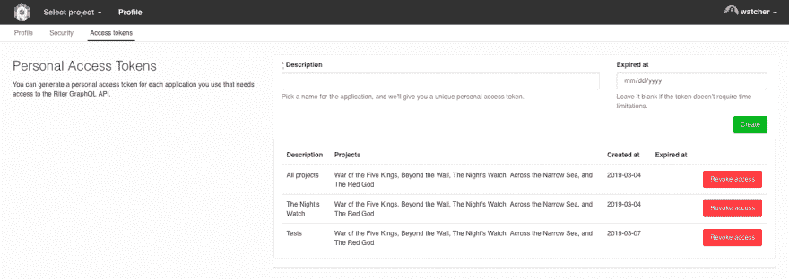

# 将 Gitlab Webhooks 与 GraphQL API 集成的无服务器方法

> 原文：<https://dev.to/riter/serverless-approach-to-integrate-gitlab-webhooks-with-graphql-api-4kgi>

*最初发表于[Riter.co](https://riter.co/blog/serverless-approach-tointegrate-gitlab-webhooks-with-riter-graphql-api)。*

在这篇文章中，我们描述了如何将 Gitlab webhooks 与 Riter API 集成，并使用[云功能](https://cloud.google.com/functions/)在谷歌云平台上部署服务，云功能是一种用于创建事件驱动应用程序的无服务器计算解决方案。云功能让您可以降低基础设施成本，并提供一种相对方便的方式来构建和部署服务。整个代码连同单元和性能测试都可以在 [Github](https://github.com/K-S-A/gcloud-riter-gitlab-integration) 上获得。

## 服务宗旨

如你所知，Riter 是我们团队使用(和开发)的项目管理工具。Gitlab 中创建的每个 pull 请求总是与 Riter 中的某个任务(我们称之为故事)相关联。因此，到目前为止，我们必须在拉请求描述中插入一个任务链接，然后在任务注释中添加一个相应的拉请求链接。因此，很容易看出特定任务包含哪些特定的代码更改，以及某个拉请求与哪个任务相关。另一方面，这种方法导致了一些我们想要避免的“双重工作”。

为此，我们编写了一个简单的服务，使用 Gitlab webhooks 来跟踪和处理合并请求事件和 Riter API——在适当的任务中报告这些事件。在我们的例子中，我们建议每个 Gitlab 存储库对应一个特定的 Riter 项目。我们还建议拉请求描述或源分支名称包含一个 story slug。如果是这样的话，那么每当有人执行一个合并命令时，该服务就会计算出它所属的任务，并在任务注释中添加一个到这个拉请求的链接(带有它的 id、标题和执行的操作)。结果，我们在项目管理工具中获得了自动生成的变更历史。

## 对初始数据的要求

*   **生成 Riter 访问令牌**

所有 Riter 用户都可以完全访问它的 [GraphQL API](https://riter.co/docs/graphql-api) ，它涵盖了所有现有的功能。转到“我的个人资料”设置，并打开“访问令牌”标签。在这里，您可以一次为所有项目生成一个个人访问令牌。然而，在我们的例子中，我们为不同的项目生成几个单独的访问令牌，并将它们保存在适当的环境变量中(见下文)。

[](https://res.cloudinary.com/practicaldev/image/fetch/s--SnC-ogcW--/c_limit%2Cf_auto%2Cfl_progressive%2Cq_auto%2Cw_880/https://vault8.io/80425b7add7447b5af56e98f885b.png/autoorient%2Cresize_fit-1920-1080/image.png%3Fp%3D0aa930d138b25b338ee16fe%26s%3D64e4ce430eabb5fa542aa7d688762a5ec6a2aff6)

此外，我们可以创建一个单独的用户身份(一个机器人)来代表它生成注释。然而，为了方便起见，让我们假设我们只使用一个常规的 Riter 用户帐户来报告所有事件。

*   **设置 Gitlab webhooks**

在 Gitlab 中，进入项目“设置->集成”页面添加一个 webhook。我们选择了“合并请求事件”触发器，以便在创建、更新和合并合并请求时只处理事件。同样，我们可以处理存储库中的任何其他事件。

这里您还需要指定`URL`，它对于每个功能都是唯一的，并且在部署后出现在控制台中。它也可以在谷歌云管理面板中找到。

在我们的例子中，我们为几个 Gitlab 存储库调用同一个函数。但是，最好为每个存储库部署具有不同环境变量的单独实例。

*   **环境变量**

我们使用几个环境变量。我们将只跟踪特定用户的事件，所以`USERS`包含一个用空格分隔的 Gitlab 用户昵称列表。

```
USERS: nickname1 nickname2 
```

此外，我们为不同的项目访问令牌以及完整的 API 端点创建环境变量(“ProjectName_GraphQL_API_URL”)。例如，对于[演示公司](https://demo.riter.co)，即“守夜人”项目，`env.yml`文件可以包含变量:

```
THE_NIGHTS_WATCH_GRAPHQL_API_URL: https://demo.riter.co/the-night_s-watch/graphql?api_token=18dc7... 
```

在我们的例子中，我们使用类似的变量定义为`TRACKER_GRAPHQL_API_URL`、`CLIENT_GRAPHQL_API_URL`和`WEBHOOK_TEST_GRAPHQL_API_URL`。

## 源代码

整个代码有 84 行，是用纯 JavaScript 编写的。也有一个用 Go 编写的相同代码的例子。

我们将所有用户(我们希望跟踪他们的拉取请求)用空格隔开:

```
const users = process.env.USERS.split(' '); 
```

在 GraphQL 中，我们使用变异来执行 POST 请求。因此，我们描述了一个突变来创建一个新的注释(`input`)给 Riter:
中的一个特定故事(由`slug`指定)

```
const query = `
  mutation($input: AnnotationTypeCreateInput!) {
    createAnnotation(input: $input) {
      resource {
        slug
      }
    }
  }
`; 
```

然后我们列出不同项目名称的端点:

```
const projects = {
  'tracker': {
    endpoint: process.env.TRACKER_GRAPHQL_API_URL
  },
  'client': {
    endpoint: process.env.CLIENT_GRAPHQL_API_URL
  },
  'webhook-test': {
    endpoint: process.env.WEBHOOK_TEST_GRAPHQL_API_URL
  }
}; 
```

最后，撰写并发送请求。我们立即响应 webhook 以加快请求处理:

```
 response.status(200).send(); 
```

获取为当前项目指定的端点:

```
 if(req.body.project) {
    project = projects[req.body.project.name];
  } 
```

仅允许特定用户和特定项目的呼叫:

```
 if(!project || !req.body.user || req.body.user && !users.includes(req.body.user.username)) {
    return 1;
  } 
```

然后我们验证内容的存在:到拉请求的 URL、拉请求 id、标题和动作(例如，“打开”或“更新”):

```
 const attributes = req.body.object_attributes; 
```

并尝试从拉取请求描述或相关的源分支:

```
 let storySlug;

  if(attributes.description) {
    [, storySlug] = attributes.description.match(/stories\/([\w-]+)/) || [];
  }

  if(!storySlug && attributes.source_branch) {
    [storySlug] = attributes.source_branch.match(/^[\w-]+/) || [];
  }

  if(!storySlug) {
    return 3;
  } 
```

最后，如果所有数据都正确，我们执行 API 调用:

```
 const { url, iid, title, action } = attributes;
  const { endpoint } = project;

  const variables = {
    input: {
      body: `[Merge request !${iid} - "${title}" (${action})](${url})`,
      storySlug: storySlug
    }
  };

  request(endpoint, query, variables).catch(() => {});
  return 0; 
```

## 部署并运行

README 文件中提供了在 Google 云平台上部署服务所需的所有命令。例如，我们可以这样部署服务:

```
gcloud functions deploy http --env-vars-file .env.yml --trigger-http --runtime nodejs8 
```

我们已经使用[云函数 Node.js 模拟器](https://cloud.google.com/functions/docs/emulator)在本地机器上部署、运行和调试应用程序，然后再将它们部署到生产环境中。我们已经使用了下面的[教程](https://rominirani.com/google-cloud-functions-tutorial-setting-up-a-local-development-environment-8acd394a8b76)来设置本地函数模拟器。

## 表现

事件处理速度似乎相当快。相反，正如我们所预料的那样，内存使用率相当低。这很好，因为您是根据资源消耗(以及对您的函数的请求数量)来收费的。在部署云功能时，您只需指定您的功能所需的内存量，CPU 资源就会按比例分配。以下是谷歌云统计的一些截图:

[](https://res.cloudinary.com/practicaldev/image/fetch/s--eRiABB6y--/c_limit%2Cf_auto%2Cfl_progressive%2Cq_auto%2Cw_880/https://vault8.io/658ce416c081452ca1d07167b87e.png/autoorient%2Cresize_fit-1920-1080/memory_usage.png%3Fp%3D0aa930d138b25b338ee16fe%26s%3D49b456489f2bb8ae4daf8f854998f79437193475) 
*内存的用法*

[](https://res.cloudinary.com/practicaldev/image/fetch/s--Ff_Dda05--/c_limit%2Cf_auto%2Cfl_progressive%2Cq_auto%2Cw_880/https://vault8.io/fde4d3ab5b204240b73df1533498.png/autoorient%2Cresize_fit-1920-1080/execution_time.png%3Fp%3D0aa930d138b25b338ee16fe%26s%3Db6310f28425d492413efddaedcf7d00fa950c68b) 
*请求处理速度*

* * *

通过这种简单的方式，Riter 可以与任何第三方服务快速集成，并且它的功能可以根据您的团队和工作流的具体需求进行扩展。