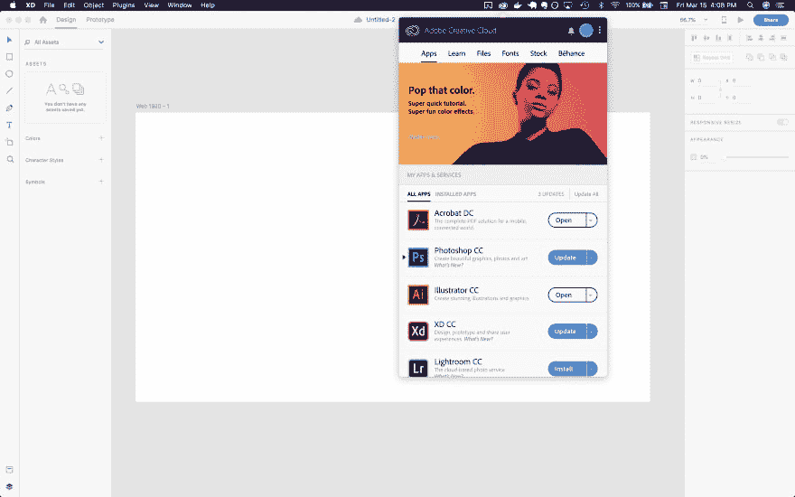
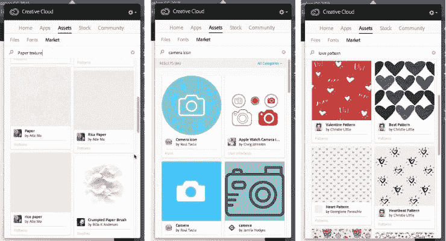

# Adobe 资产的最佳替代品是什么？

> 原文：<https://dev.to/joshhadik/what-are-the-best-alternatives-to-adobe-assets-4nbb>

Adobe 曾经在 Creative Cloud 上有一个非常酷的功能，叫做 Adobe assets，它几乎可以与 Adobe XD 无缝协作。基本上，它提供了一个快速简单的用户界面来下载图标，同时设计一个线框。

因此，如果我正在为一个 iPhone 应用程序绘制布局草图，并且我想在设计中的主页选项卡上添加一个主页图标，我可以轻松地搜索主页图标，下载我最喜欢的图标，将其拖到 XD 文件中，并将其放置在主页选项卡部分。所有这些都可以通过我的 Mac 电脑顶部的工具栏免费完成。

[T6】](https://res.cloudinary.com/practicaldev/image/fetch/s--SlLzL1bp--/c_limit%2Cf_auto%2Cfl_progressive%2Cq_auto%2Cw_880/https://thepracticaldev.s3.amazonaws.com/i/i0xq7le2s5ds4yxz8cte.jpg)

这是一个下载图标并将其添加到线框的完美 UX，它使设计应用程序和网站的任务变得更加简单。

可惜 Adobe 去掉了这个功能。我不知道为什么，我对此肯定不高兴，但出于某种原因，他们认为给他们的产品的用户提供良好的体验已经没有意义了(显然我还没有结束这一点，哈哈)。)

无论如何，现在我需要一种新的方法来下载图标，而我素描线框，我想有什么更好的社区来寻求帮助比开发社区！你们中有谁知道一个好的工具可以完成和 Adobe assets 一样的事情吗？

理想情况下，这将是免费的，虽然我不介意一个产品附带一个小费用。

此外，我正在考虑放弃 Adobe Creative Cloud，因为我真的只在 Adobe XD 上使用过它，现在我觉得整个设计过程的无缝 UX 正在向南发展，我正在考虑其他选择。我尝试过 sketch，但我发现与 Adobe XD 的简单性相比，它很复杂。有人知道其他好的选择吗？