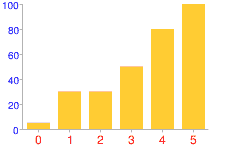
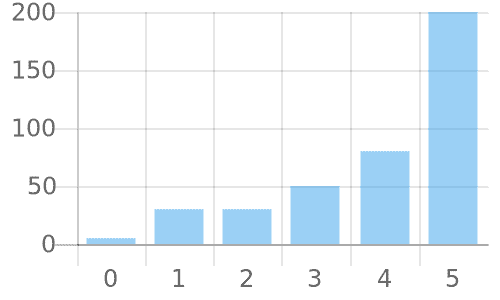
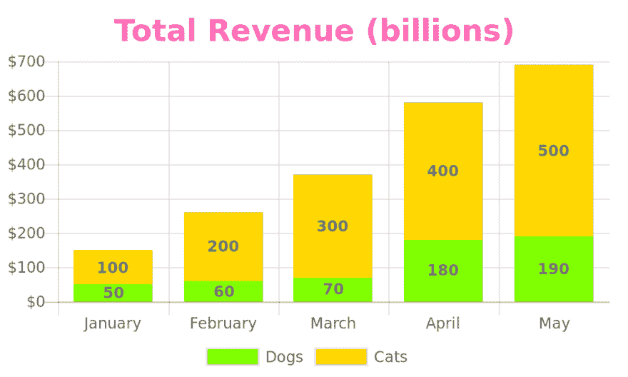
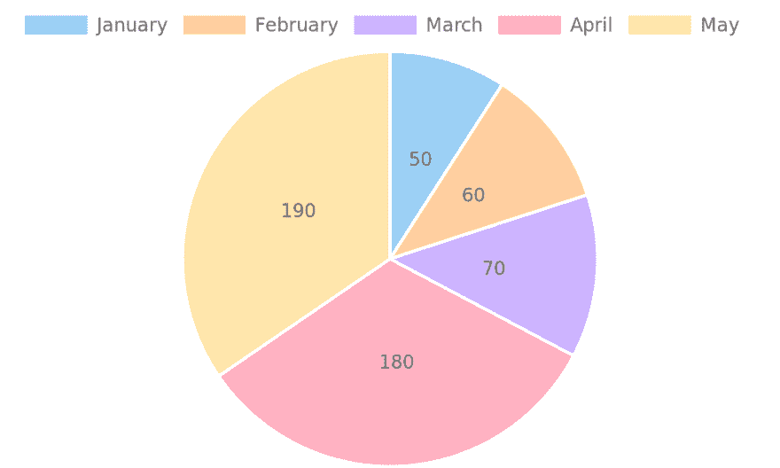

# 构建谷歌图像图表的替代品

> 原文：<https://dev.to/iwebst/building-a-replacement-for-google-image-charts-153e>

几周前，我得知[谷歌图片图表](https://developers.google.com/chart/image/)正在关闭，让许多人陷入困境。尽管 API 已经被弃用了很多年，但许多开发人员并没有做出改变。

为什么*图像图表*很重要？有很多图形库，比如 Chart.js、plotly、d3 等等。不同之处在于，这些库需要 Javascript，但是图像图表对于可嵌入的非 Javascript 环境是必要的，比如电子邮件、SMS 和某些类型的报告。

这篇文章描述了创建一个名为 QuickChart 的开源图像图表的过程。

**如果你不想读完整个东西，跳到最后的结果:[图像图表 web 服务](https://quickchart.io/)(称为 QuickChart)和[源代码](https://github.com/typpo/quickchart)。**

### 第一步:定义图表的最好方法是什么？

旧的 Google Image Charts API 很神秘，是在浏览器不支持长 URL 的时候建立的。

这意味着您必须牺牲可读性，还要学习自定义格式。比如下面这个网址:

```
https://chart.googleapis.com/chart?cht=bvg&chs=250x150&chd=t:5,30,30,50,80,200&chxt=x,y&chxs=0,ff0000,12,0,lt|1,0000ff,10,1,lt 
```

产生这个图形:
[](https://res.cloudinary.com/practicaldev/image/fetch/s--1ZBKPEmC--/c_limit%2Cf_auto%2Cfl_progressive%2Cq_auto%2Cw_880/https://i.imgur.com/Tz1Mstw.png)

从这里开始变得更加复杂。该 API 支持“简单编码格式”，允许用户将 0 到 61 之间的整数值编码为单个字符。字符 a-z 编码整数 0 到 25，A-Z 编码 26 到 51，数字 0-9 编码其余的值到 61。你最终会得到像`?chd=s:BTb19_,Mn5tzb`这样的 URL，它们编码了一些两位数的数字。

有一种包括标点符号的“扩展编码格式”。例如，`-.`相当于数字 4031。很简单，对吧？

我觉得这很糟糕。想象一下，在代码中遇到这个 URL，并试图弄清楚它的意思。想象一下，编写自己的数字编码脚本，却发现数据中包含一个大于 61 的数字，不得不重写编码器。

Image Charts API 构建于 21 世纪初。如今浏览器可以做得更好。为此我决定用 [Chart.js](https://www.chartjs.org/) 作为灵感。Chart.js 非常流行，有明确的定义图表的 API:

```
{
  type: 'bar',
  data: {
    labels: [0,1,2,3,4,5],
    datasets: [{
      data: [5,30,30,50,80,200]
    }]
  }
} 
```

### 第二步:组装

我们使用 Chart.js，但是这个库通过 Javascript 而不是图像动态地生成图表。这是一个很大的阻碍，因为大多数用户希望在电子邮件中嵌入静态图像。

好消息是 Chart.js 用的是 HTML5 Canvas，Canvas 可以转换成图像。

Node 的发明使得在服务器端运行 Javascript 变得更加容易。随后是一个名为 [node-canvas](https://github.com/Automattic/node-canvas) 的服务器端 canvas 实现。我评估了两个使用 node-canvas 来呈现图像的服务器端 Chart.js 包装器，并选定了 [chartjs-node-canvas](https://github.com/SeanSobey/ChartjsNodeCanvas) ，做了一些修改以提高内存效率。

这意味着我可以像上面这样获取一个 Chart.js 配置，并在服务器端呈现它。

### 第三步:构建 web 服务

web 服务相当简单。它只是一个`express`应用程序，挂钩到我打了补丁的`chartjs-node-canvas`库中。

在实现时，我意识到有一些我想应用的默认 Chart.js 选项。例如，默认情况下，折线图和条形图轴应该从 0 开始。我还添加了一个漂亮的调色板和一个 Chart.js 插件，该插件添加了数据标签选项。

**结果是一个端点`https://quickchart.io/chart?c=`，它接受 Chart.js 配置并将其呈现为 PNG 图像。**

让我们将上面的简单图表 JSON 发送到端点:

[https://quickchart.io/chart?c={type:'bar '，数据:{labels:[0，1，2，3，4，5]，数据集:[{data:[5，30，30，50，80，200]} } }](https://quickchart.io/chart?c=%7Btype:'bar',data:%7Blabels:%5B0,1,2,3,4,5%5D,datasets:%5B%7Bdata:%5B5,30,30,50,80,200%5D%7D%5D%7D%7D)

此 URL 加载以下图像:

[](https://res.cloudinary.com/practicaldev/image/fetch/s--YlTBIjeC--/c_limit%2Cf_auto%2Cfl_progressive%2Cq_auto%2Cw_880/https://i.imgur.com/PczlN2E.png)

完美！

### 第四步:变得更有创造力

基于 Chart.js 文档构建定制图表相对简单:

[](https://res.cloudinary.com/practicaldev/image/fetch/s--L8HkWQkk--/c_limit%2Cf_auto%2Cfl_progressive%2Cq_auto%2Cw_880/https://i.imgur.com/6lPTkra.png)

在这一点上，我们只受到 Chart.js API 的限制，它非常灵活。
此图表使用自定义背景颜色、标题样式、图例位置、堆叠系列、轴标签和数据标签:

```
{
  type: 'bar',
  data: {
    labels: ['January', 'February', 'March', 'April', 'May'],
    datasets: [{
      label: 'Dogs',
      backgroundColor: 'chartreuse',
      data: [ 50, 60, 70, 180, 190 ]
    }, {
      label: 'Cats',
      backgroundColor: 'gold',
      data: [ 100, 200, 300, 400, 500 ]
    }]
  },
  options: {
    title: {
      display: true,
      text: 'Total Revenue (billions)',
      fontColor: 'hotpink',
      fontSize: 24,
    },
    legend: {
      position: 'bottom',
    },
    scales: {
      xAxes: [{stacked: true}],
      yAxes: [{stacked: true}],
    },
    plugins: {
      datalabels: {
        display: true,
        font: {
          style: 'bold',
        },
      },
    },
  },
} 
```

这比我们的简单例子要多一点 JSON，但是规范是[有据可查的](https://www.chartjs.org/docs/latest/configuration/)，并且使用了广泛的标准。注意，对于更复杂的配置，我们需要在将 JSON 对象传递给 API 之前对其进行 URL 编码(例如，通过使用 Javascript 的`encodeURIComponent`)。

我们还可以使用 Chart.js 提供的任何图表类型。例如:

[https://quickchart.io/chart?c={type:'pie '，数据:{labels:['一月'，'二月'，'三月'，'四月'，'五月']，数据集:[{data:[50，60，70，180，190]} }](https://quickchart.io/chart?c=%7Btype:'pie',data:%7Blabels:%5B'January','February','March','April',%20'May'%5D,%20datasets:%5B%7Bdata:%5B50,60,70,180,190%5D%7D%5D%7D%7D)

上面的 URL 产生:

[](https://res.cloudinary.com/practicaldev/image/fetch/s--WhDnMVOW--/c_limit%2Cf_auto%2Cfl_progressive%2Cq_auto%2Cw_880/https://quickchart.io/chart%3Fbkg%3Dwhite%26c%3D%257Btype:%2527pie%2527%2Cdata:%257Blabels:%255B%2527January%2527%2C%2527February%2527%2C%2527March%2527%2C%2527April%2527%2C%2520%2527May%2527%255D%2Cdatasets:%255B%257Bdata:%255B50%2C60%2C70%2C180%2C190%255D%257D%255D%257D%257D)

### 第五步:开源

我将这个 web 服务命名为 QuickChart，并在 [QuickChart.io](https://quickchart.io/) 把它放到网上。运行它非常便宜，所以我免费提供了图像图表生成服务，没有任何限制。

另外，我已经在 Github 上开源了这个项目。我欢迎社区其他人的参与和贡献！

以下是一些关于我们如何开展这个项目的想法:

*   创建一个有用的图表模板库
*   创建“短 url”功能，将复杂的配置映射到简单的 URL
*   支持其他类型的图表——甚至可能是地图或其他更高级的可视化

这是灵活可靠的图像图表生成服务的坚实基础。有很多可能性，我很高兴能继续建设下去！