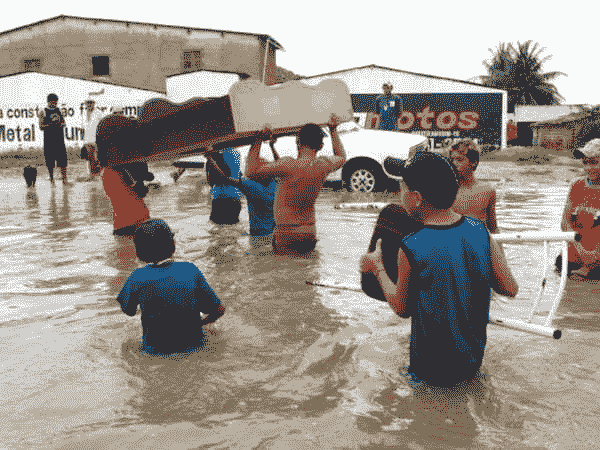
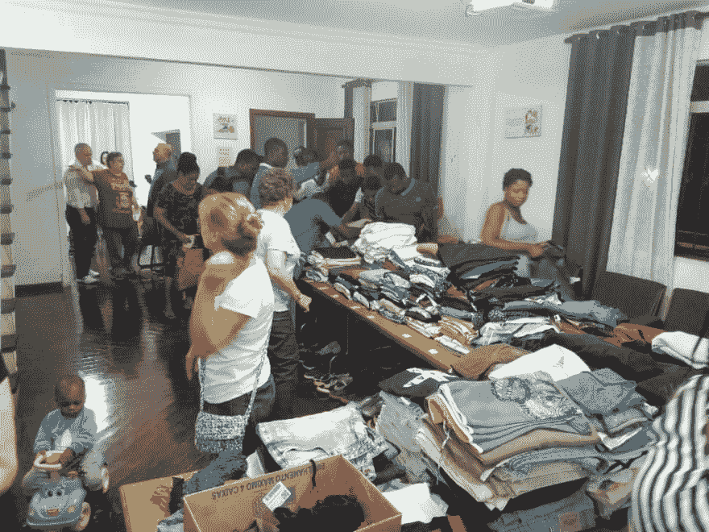
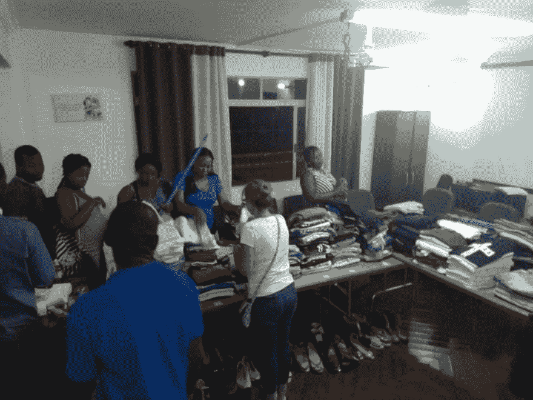
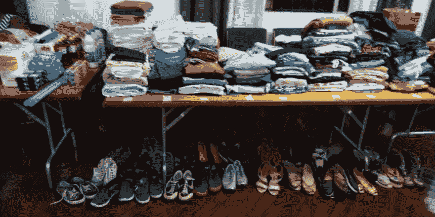

# 谢谢你！

> [https://dev . to/debborference/谢谢-788](https://dev.to/debborafernandess/obrigada-788)

一周前，圣保罗和大圣保罗的许多人经历了一个人所能经历的最糟糕的时刻:看到生活颠倒过来，他们的房子里充满了水，带走了很多和很少的挣扎来建造……

这些人中的许多人突然发现自己没穿衣服，在避难所里，他们几乎没有能力提供我们日常生活中不可或缺的东西:水、卫生用品、衣服、食物……并且指望别人的声援。

收容这些人的地方，开始动员社会来共享能够满足这些基本需求的捐款请求。

因为社区是共同的-团结:为了共同的目的团结起来的人。 ***我们就这样进去了！***

当这种需求来到我身边时，我的第一个动力就是捐赠我拥有的东西，但是，由于需求的规模，我的捐赠不会有什么影响……所以我想起了我和那些已经走过我的道路并且非常接近或者仅仅通过社交网络的优秀的人有着友谊，这是我拥有的最宝贵的财富！

在这一周里，我请了很多人合作，通过 Instagram 上的故事来交谈、发送信息、发送电子邮件……。

我的要求得到了很好的回应！

有一天，我收到的衣服比我能装的还要多，其中一个捐赠站成功地分发了一张汇票和一张汇票给每一个只拿了两天的捐赠就去取的贫困者！

 

<figcaption>星期日至星期三捐赠物品的分配</figcaption>

我还要求帮助我们捐赠清洁卫生用品和食物，以及我从人到人收到的每一份爱心的表示——“t1”，都让我相信社会没有病不:英雄们躲起来只是等待激活的号召。

我忘记了我的眼睛曾经多少次因我发现的慷慨而充满欢乐和爱…

我想让你知道我第一次单独行动的动力比我给你写信时增加了 15 倍多亏了你这样的人当有人求救时你成了英雄。

感谢你和我在一起，因为你是一个‘t0’人’整个字，对于那些只关心做好事的人来说，即使是对于不认识的人来说，你也不知道自己到底在哪里或处于什么样的境地！

> 我想告诉你，这是多么的成功，有你这样的朋友和家人的巨大自豪！
> 
> 我和你(和大家一样)是更美好世界的支柱=)

战斗还没结束，人们正在一点一点地回来收拾自己的家庭，重新充饱自己的世界。因为有很多人，所以我们仍然非常欢迎您的帮助！

而且我只能告诉你:**谢谢**！