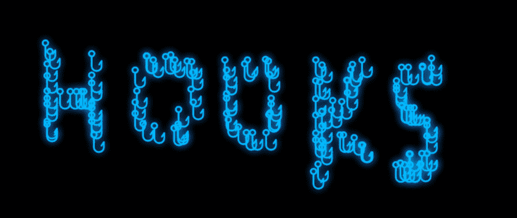

# 对画布使用 React 挂钩

> 原文：<https://dev.to/vnglst/using-react-hooks-with-canvas-gn8>

[](https://res.cloudinary.com/practicaldev/image/fetch/s--mscVdS3y--/c_limit%2Cf_auto%2Cfl_progressive%2Cq_auto%2Cw_880/https://blog.koenvangilst.nl/static/e89cbdada082f09ff410cfedcc5584f0/f743c/hooks.png)

在本教程中，我将使用 React 钩子创建一个 html 画布绘图网站。我将使用 *Create React App* 初学者工具包从零开始。[生成的应用](https://han-hooks.netlify.com/)提供了`Clear`、`Undo`等基本功能，并使用本地存储保存图纸。

在本教程中，我将向您展示钩子如何使用*自定义钩子*使有状态逻辑的组合和重用成为可能。

这是一个交叉帖子。文章 [**使用 React 钩子与画布**](https://blog.koenvangilst.nl/react-hooks-with-canvas/) 最早出现在我自己的个人博客上。

## 基本设置

我们将从使用`create-react-app`创建一个新的 React 应用程序开始。

```
$ npx create-react-app canvas-and-hooks
$ cd canvas-and-hooks/
$ yarn start 
```

Enter fullscreen mode Exit fullscreen mode

您的浏览器应该会打开`http://localhost:3000/`，您应该会看到一个旋转的 React 徽标。您现在可以开始了！

## 1st hook: useRef

在您最喜欢的编辑器中打开文件`src/App.js`，并用以下代码替换其中的内容:

```
import React from 'react'

function App() {
  return (
    <canvas
      width={window.innerWidth}
      height={window.innerHeight}
      onClick={e => {
        alert(e.clientX)
      }}
    />
  )
}

export default App 
```

Enter fullscreen mode Exit fullscreen mode

在打开的浏览器窗口中单击某处，现在应该会显示一个弹出警告，告诉您鼠标单击的 x 坐标。

太好了，成功了！

现在让我们画点东西。为此，我们需要一个`ref`到 canvas 元素，我们的第一个钩子`useRef`将帮助我们。

```
import React from 'react'

function App() {
  const canvasRef = React.useRef(null)

  return (
    <canvas
      ref={canvasRef}
      width={window.innerWidth}
      height={window.innerHeight}
      onClick={e => {
        const canvas = canvasRef.current
        const ctx = canvas.getContext('2d')
        // implement draw on ctx here
      }}
    />
  )
}

export default App 
```

Enter fullscreen mode Exit fullscreen mode

通常在 React 中你不需要`ref`来更新一些东西，但是 canvas 不像其他 DOM 元素。大多数 DOM 元素都有一个类似于`value`的属性，可以直接更新。画布与允许你画东西的上下文(在我们的应用中是`ctx`)一起工作。为此，我们必须使用一个`ref`，它是对实际 canvas DOM 元素的引用。

现在我们有了画布背景，是时候画点什么了。为此，我将复制粘贴绘制 SVG 挂钩的代码。和钩子没什么关系，不完全理解也不用担心。

```
import React from 'react'

const HOOK_SVG =
  'm129.03125 63.3125c0-34.914062-28.941406-63.3125-64.519531-63.3125-35.574219 0-64.511719 28.398438-64.511719 63.3125 0 29.488281 20.671875 54.246094 48.511719 61.261719v162.898437c0 53.222656 44.222656 96.527344 98.585937 96.527344h10.316406c54.363282 0 98.585938-43.304688 98.585938-96.527344v-95.640625c0-7.070312-4.640625-13.304687-11.414062-15.328125-6.769532-2.015625-14.082032.625-17.960938 6.535156l-42.328125 64.425782c-4.847656 7.390625-2.800781 17.3125 4.582031 22.167968 7.386719 4.832032 17.304688 2.792969 22.160156-4.585937l12.960938-19.71875v42.144531c0 35.582032-29.863281 64.527344-66.585938 64.527344h-10.316406c-36.714844 0-66.585937-28.945312-66.585937-64.527344v-162.898437c27.847656-7.015625 48.519531-31.773438 48.519531-61.261719zm-97.03125 0c0-17.265625 14.585938-31.3125 32.511719-31.3125 17.929687 0 32.511719 14.046875 32.511719 31.3125 0 17.261719-14.582032 31.3125-32.511719 31.3125-17.925781 0-32.511719-14.050781-32.511719-31.3125zm0 0'
const HOOK_PATH = new Path2D(HOOK_SVG)
const SCALE = 0.3
const OFFSET = 80

function draw(ctx, location) {
  ctx.fillStyle = 'deepskyblue'
  ctx.shadowColor = 'dodgerblue'
  ctx.shadowBlur = 20
  ctx.save()
  ctx.scale(SCALE, SCALE)
  ctx.translate(location.x / SCALE - OFFSET, location.y / SCALE - OFFSET)
  ctx.fill(HOOK_PATH)
  ctx.restore()
}

function App() {
  const canvasRef = React.useRef(null)

  return (
    <canvas
      ref={canvasRef}
      width={window.innerWidth}
      height={window.innerHeight}
      onClick={e => {
        const canvas = canvasRef.current
        const ctx = canvas.getContext('2d')
        draw(ctx, { x: e.clientX, y: e.clientY })
      }}
    />
  )
}

export default App 
```

Enter fullscreen mode Exit fullscreen mode

这只是画一个 SVG 形状(一个鱼钩！)在位置`x`和`y`上。由于它与本教程无关，我将从现在开始省略它。

试试看，看是否有效！

## 第二挂钩:使用状态

我们想添加的下一个功能是`Clean`和`Undo`按钮。为此，我们需要跟踪用户与`useState`钩子的交互。

```
import React from 'react'

// ...
// canvas draw function
// ...

function App() {
  const [locations, setLocations] = React.useState([])
  const canvasRef = React.useRef(null)

  return (
    <canvas
      ref={canvasRef}
      width={window.innerWidth}
      height={window.innerHeight}
      onClick={e => {
        const canvas = canvasRef.current
        const ctx = canvas.getContext('2d')
        const newLocation = { x: e.clientX, y: e.clientY }
        setLocations([...locations, newLocation])
        draw(ctx, newLocation)
      }}
    />
  )
}

export default App 
```

Enter fullscreen mode Exit fullscreen mode

那里！我们在应用程序中添加了状态。您可以通过在`return`上方添加一个`console.log(locations)`来验证这一点。在控制台中，您应该会看到越来越多的用户点击。

## 第三次挂钩:使用效果

目前我们没有对那个州做任何事情。我们就像以前一样画钩子。让我们看看如何用`useEffect`钩子来解决这个问题。

```
import React from 'react'

// ...
// canvas draw function
// ...

function App() {
  const [locations, setLocations] = React.useState([])
  const canvasRef = React.useRef(null)

  React.useEffect(() => {
    const canvas = canvasRef.current
    const ctx = canvas.getContext('2d')
    ctx.clearRect(0, 0, window.innerHeight, window.innerWidth)
    locations.forEach(location => draw(ctx, location))
  })

  return (
    <canvas
      ref={canvasRef}
      width={window.innerWidth}
      height={window.innerHeight}
      onClick={e => {
        const newLocation = { x: e.clientX, y: e.clientY }
        setLocations([...locations, newLocation])
      }}
    />
  )
}

export default App 
```

Enter fullscreen mode Exit fullscreen mode

这里发生了很多事情，让我们来分析一下。我们已经将绘图功能从 onClick 处理程序转移到了`useEffect`回调函数中。这很重要，因为在画布上绘图是由应用程序状态决定的副作用。稍后我们将使用 localStorage 添加持久性，这也是状态更新的副作用。

我还对画布上的实际绘图做了一些修改。在当前的实现中，每次渲染首先清除画布，然后绘制所有位置。我们可以比这更聪明，但为了简单起见，我将把它留给读者来进一步优化。

我们已经完成了所有的艰苦工作，现在添加新功能应该很容易了。让我们创建`Clear`按钮。

```
import React from 'react'

// ...
// canvas draw function
// ...

function App() {
  const [locations, setLocations] = React.useState([])
  const canvasRef = React.useRef(null)

  React.useEffect(() => {
    const canvas = canvasRef.current
    const ctx = canvas.getContext('2d')
    ctx.clearRect(0, 0, window.innerHeight, window.innerWidth)
    locations.forEach(location => draw(ctx, location))
  })

  function handleCanvasClick(e) {
    const newLocation = { x: e.clientX, y: e.clientY }
    setLocations([...locations, newLocation])
  }

  function handleClear() {
    setLocations([])
  }

  return (
    <>
      <button onClick={handleClear}>Clear</button>
      <canvas
        ref={canvasRef}
        width={window.innerWidth}
        height={window.innerHeight}
        onClick={handleCanvasClick}
      />
    </>
  )
}

export default App 
```

Enter fullscreen mode Exit fullscreen mode

Clear 特性只是一个简单的状态更新:我们通过将状态设置为空数组`[]`来清除状态。很简单，对吧？

我还利用这个机会清理了一下，将 canvas `onClick`处理程序移动到一个单独的函数中。

让我们做另一个特性:`Undo`按钮。同样的原理，尽管这个状态更新有点复杂。

```
import React from 'react'

// ...
// canvas draw function
// ...

function App() {
  const [locations, setLocations] = React.useState([])
  const canvasRef = React.useRef(null)

  React.useEffect(() => {
    const canvas = canvasRef.current
    const ctx = canvas.getContext('2d')
    ctx.clearRect(0, 0, window.innerHeight, window.innerWidth)
    locations.forEach(location => draw(ctx, location))
  })

  function handleCanvasClick(e) {
    const newLocation = { x: e.clientX, y: e.clientY }
    setLocations([...locations, newLocation])
  }

  function handleClear() {
    setLocations([])
  }

  function handleUndo() {
    setLocations(locations.slice(0, -1))
  }

  return (
    <>
      <button onClick={handleClear}>Clear</button>
      <button onClick={handleUndo}>Undo</button>
      <canvas
        ref={canvasRef}
        width={window.innerWidth}
        height={window.innerHeight}
        onClick={handleCanvasClick}
      />
    </>
  )
}

export default App 
```

Enter fullscreen mode Exit fullscreen mode

因为 React 中的任何状态更新都必须是不可修改的，所以我们不能使用类似于`locations.pop()`的东西从数组中删除最近的条目。我们必须在不改变原始`locations`数组的情况下完成。方法是用`slice`，也就是把所有的元素切掉直到最后一个。你可以用`locations.slice(0, locations.length - 1)`来做这件事，但是`slice`足够聪明地将`-1`解释为数组中的最后一项。

在我们继续之前，让我们清理 html 并添加一些 css。在按钮周围添加以下`div`:

```
import React from 'react'

import './App.css'

// ...
// canvas draw function
// ...

function App() {
  // ...

  return (
    <>
      <div className="controls">
        <button onClick={handleClear}>Clear</button>
        <button onClick={handleUndo}>Undo</button>
      </div>
      <canvas
        ref={canvasRef}
        width={window.innerWidth}
        height={window.innerHeight}
        onClick={handleCanvasClick}
      />
    </>
  )
}

export default App 
```

Enter fullscreen mode Exit fullscreen mode

并将`App.css`中的 css 替换为以下内容:

```
*,
*:before,
*:after {
  box-sizing: border-box;
}

body {
  background-color: black;
}

.controls {
  position: absolute;
  top: 0;
  left: 0;
}

button {
  height: 3em;
  width: 6em;
  margin: 1em;
  font-weight: bold;
  font-size: 0.5em;
  text-transform: uppercase;
  cursor: pointer;
  color: white;
  border: 1px solid white;
  background-color: black;
}

button:hover {
  color: black;
  background-color: #00baff;
}

button:focus {
  border: 1px solid #00baff;
}

button:active {
  background-color: #1f1f1f;
  color: white;
} 
```

Enter fullscreen mode Exit fullscreen mode

看起来不错，让我们开始下一个功能:坚持！

## 添加本地存储

如前所述，我们也希望我们的图纸被保存到`localStorage`。由于这是另一个副作用，我们将添加另一个`useEffect`。

```
import React from 'react'

import './App.css'

// ...draw function

function App() {
  const [locations, setLocations] = React.useState(
    JSON.parse(localStorage.getItem('draw-app')) || []
  )
  const canvasRef = React.useRef(null)

  React.useEffect(() => {
    const canvas = canvasRef.current
    const ctx = canvas.getContext('2d')
    ctx.clearRect(0, 0, window.innerHeight, window.innerWidth)
    locations.forEach(location => draw(ctx, location))
  })

  React.useEffect(() => {
    localStorage.setItem('draw-app', JSON.stringify(locations))
  })

  function handleCanvasClick(e) {
    const newLocation = { x: e.clientX, y: e.clientY }
    setLocations([...locations, newLocation])
  }

  function handleClear() {
    setLocations([])
  }

  function handleUndo() {
    setLocations(locations.slice(0, -1))
  }

  return (
    <>
      <div className="controls">
        <button onClick={handleClear}>Clear</button>
        <button onClick={handleUndo}>Undo</button>
      </div>
      <canvas
        ref={canvasRef}
        width={window.innerWidth}
        height={window.innerHeight}
        onClick={handleCanvasClick}
      />
    </>
  )
}

export default App 
```

Enter fullscreen mode Exit fullscreen mode

我们现在已经完成了我们计划构建的所有特性，但是我们还没有完成。关于钩子最酷的事情之一是你可以使用现有的钩子来组成新的定制钩子。让我通过创建一个定制的`usePersistentState`钩子来演示一下。

## 第一个自定义钩子:usePersistentState

```
import React from 'react'

import './App.css'

// ...draw function

// our first custom hook!
function usePersistentState(init) {
  const [value, setValue] = React.useState(
    JSON.parse(localStorage.getItem('draw-app')) || init
  )

  React.useEffect(() => {
    localStorage.setItem('draw-app', JSON.stringify(value))
  })

  return [value, setValue]
}

function App() {
  const [locations, setLocations] = usePersistentState([])
  const canvasRef = React.useRef(null)

  React.useEffect(() => {
    const canvas = canvasRef.current
    const ctx = canvas.getContext('2d')
    ctx.clearRect(0, 0, window.innerHeight, window.innerWidth)
    locations.forEach(location => draw(ctx, location))
  })

  function handleCanvasClick(e) {
    const newLocation = { x: e.clientX, y: e.clientY }
    setLocations([...locations, newLocation])
  }

  function handleClear() {
    setLocations([])
  }

  function handleUndo() {
    setLocations(locations.slice(0, -1))
  }

  return (
    // ...
  )
}

export default App 
```

Enter fullscreen mode Exit fullscreen mode

那里！我们已经创建了第一个定制钩子，所有与保存和从 *localStorage* 获取状态相关的逻辑都是从 *App* 组件中提取的。我们这样做是为了让钩子`usePersistentState`可以被其他组件重用。这里没有任何特定于这个组件的内容。

让我们为与画布相关的逻辑重复这个技巧。

## 第二个自定义挂钩:usePersistentCanvas

```
import React from 'react'

import './App.css'

// ...draw function

// our first custom hook
function usePersistentState(init) {
  const [value, setValue] = React.useState(
    JSON.parse(localStorage.getItem('draw-app')) || init
  )

  React.useEffect(() => {
    localStorage.setItem('draw-app', JSON.stringify(value))
  })

  return [value, setValue]
}

// our second custom hook: a composition of the first custom hook and React's useEffect + useRef
function usePersistentCanvas() {
  const [locations, setLocations] = usePersistentState([])
  const canvasRef = React.useRef(null)

  React.useEffect(() => {
    const canvas = canvasRef.current
    const ctx = canvas.getContext('2d')
    ctx.clearRect(0, 0, window.innerWidth, window.innerHeight)
    locations.forEach(location => draw(ctx, location))
  })

  return [locations, setLocations, canvasRef]
}

function App() {
  const [locations, setLocations, canvasRef] = usePersistentCanvas()

  function handleCanvasClick(e) {
    const newLocation = { x: e.clientX, y: e.clientY }
    setLocations([...locations, newLocation])
  }

  function handleClear() {
    setLocations([])
  }

  function handleUndo() {
    setLocations(locations.slice(0, -1))
  }

  return (
    <>
      <div className="controls">
        <button onClick={handleClear}>Clear</button>
        <button onClick={handleUndo}>Undo</button>
      </div>
      <canvas
        ref={canvasRef}
        width={window.innerWidth}
        height={window.innerHeight}
        onClick={handleCanvasClick}
      />
    </>
  )
}

export default App 
```

Enter fullscreen mode Exit fullscreen mode

如你所见，我们的*应用*组件变得非常小。所有与在 localStorage 中存储状态和在画布上绘图相关的逻辑都被提取到自定义钩子中。您可以通过将钩子移动到一个*钩子*文件中来进一步清理这个文件。这样，其他组件就可以重用这个逻辑，比如组成更好的钩子。

## 结论

如果将钩子与生命周期方法(如`componentDidMount`、`componentDidUpdate`)相比，是什么让它们如此特别？看上面的例子:

*   钩子允许你在不同的组件中重用生命周期逻辑
*   使用钩子，你可以使用**组合**来创建更丰富的定制钩子，就像你可以使用组合来创建更丰富的 UI 组件一样
*   钩子变得更短更干净——不再臃肿，有时甚至令人困惑，生命周期方法

现在判断钩子是否真的能解决所有这些问题还为时过早——以及由此可能产生的新的不良实践——但是看着上面的内容，我对 React 的未来感到非常兴奋和乐观！

让我知道你的想法！你可以在推特上用 [@vnglst](https://twitter.com/vnglst) 联系我。

[https://codesandbox.io/embed/9l0zkp5wro](https://codesandbox.io/embed/9l0zkp5wro)

Github 上也有源代码。