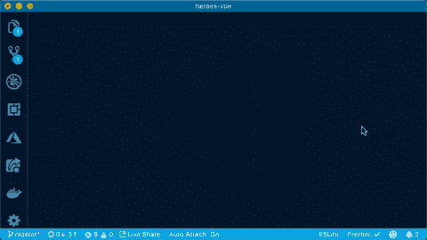

# 在 VS 代码中关联文件类型

> 原文：<https://dev.to/azure/associate-file-types-in-vs-code-4142>

我喜欢好的编辑。所有伟大的工具，智能感知，自动完成和所有的好处和效率。智能工具是我们生活乐趣的重要组成部分。你不同意吗？

例如，当我打开 [Visual Studio 代码](https://code.visualstudio.com/?wt.mc_id=devto-blog-jopapa)(又名 VS 代码)并且它识别出我正在编辑的文件类型时，它会显示所有相关的工具特性。Typescript、JavaScript、docker 文件、Vue 文件……一切都很棒！有时我们必须加载一个扩展来点亮其中的一些(例如扩展名为[Vetur](https://marketplace.visualstudio.com/items?itemName=octref.vetur&wt.mc_id=devto-blog-jopapa)的 Vue 文件)。

所以你可以理解，当我打开一个文件，却从工具中得不到任何帮助时，我很难过。没有关键字的颜色编码，没有格式，没有智能感知，什么都没有！这种情况很少发生，但一旦发生，有一个简单的解决方法。一个例子是。vuerc 文件。

<figure>[](https://i.giphy.com/media/TFdR29C9lm4RDzzZES/giphy.gif) 

<figcaption>按类型关联文件，在 Visual Studio 中代码</figcaption>

</figure>

### 关联文件

这里有一个例子。当用 Vue 编码时，有时我们想查看或编辑。vuerc 文件。这是 Vue 存储我们保存的所有 Vue CLI 预设的地方。如果我们打开文件(存储在我的计算机上的~/。在 VS 代码中，我们看到一个没有特殊工具帮助的文件。默认情况下，VS 代码不能决定如何处理这个点文件。

幸运的是，有一个简单的解决方案。打开您的设置(在 Mac 上为 CMD +，在 Windows 上为 CTRL +)并输入文件关联。我们可以通过设置 UI 或设置 JSON 来实现，两者都是编辑设置的选项。

然后输入文件关联。vuerc 文件，这样 VS 代码就知道它应该包含 JSON。

```
"files.associations": {
 ".vuerc": "json"
} 
```

上面的代码将这个文件与 JSON 相关联。如果我们想要关联所有匹配特定命名模式的文件，我们还可以添加模式匹配。

你可以从 VS 代码文档中的这个链接了解更多关于语言标识符的特性。

现在我们知道如何为我们所有的文件获得优秀的工具特性！

<figure>[](https://res.cloudinary.com/practicaldev/image/fetch/s--bvauRl4m--/c_limit%2Cf_auto%2Cfl_progressive%2Cq_auto%2Cw_880/https://cdn-images-1.medium.com/max/1024/1%2AqLO8W8xWxPfjgP5R1I6fLg.png) 

<figcaption>VS 代号</figcaption>

</figure>