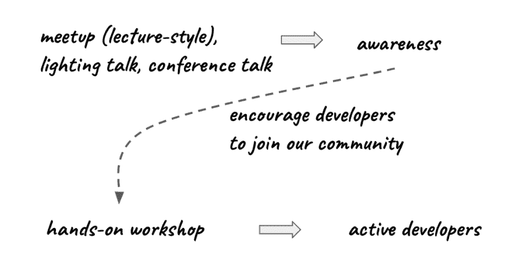

# 活跃的开发者与认知事件，这是我们正在尝试的方法

> 原文：<https://dev.to/ibmdeveloper/active-developers-vs-awareness-events-an-approach-we-are-trying-2m4f>

如果你在开发者关系领域，那么在活动中主持和演讲可能是你工作的一大部分。

开发人员会参加各种各样的活动:聚会、研讨会、会议、在线聚会/网络研讨会、[午餐、&学习活动、](https://dev.to/ibmdeveloper/why-you-should-consider-hosting-lunch--learn-events-as-part-of-your-developer-relations-program-523n)小组讨论会等等。

度量是开发者关系中的圣杯。许多公司跟踪的一种指标是他们平台上活跃开发者的数量。类似的指标可以是创建的应用数量、创建的服务数量等。

我们的一个衡量标准是 IBM 云平台上活跃的开发人员数量。可以想象，这是 IBM 和全公司范围内更大的开发人员倡导组织的标准。所以我们得到了很多帮助。

什么是积极的开发者？每个公司可以对其进行不同的定义，但通常是开发者注册了云帐户并创建了服务(也有开发者必须活跃的时间窗口)。

去年执行了大量的活动后，今年我们正在尝试一些新的东西。我们正试图将活动分成两类，一类是我们能获得新的活跃开发者的活动，另一类是我们能获得更多关注的活动。让我解释一下。

首先，我们实际上如何跟踪活跃的开发者？这很简单，我猜大多数其他组织也使用类似的方法。我们使用一个特殊的跟踪信息链接。

我们认为我们可以从我们所做的大多数活动中获得活跃的开发者。我们可以从会议谈话、聚会谈话(讲座式)、在线聚会或闪电谈话中获得活跃的开发者。

这并不是说你找不到活跃的开发者。你仍然可以从这些活动中吸引活跃的开发者，但是我们意识到这个数字可能有点小。

所以我们正在更新我们的方法。像会议谈话、聚会谈话(讲座式)、在线聚会或闪电谈话这样的活动，我们现在认为是认知活动。在这些活动中，开发人员将了解技术和解决方案。我们总是分享资源如何开始，开发人员可以在哪里了解更多，以及如何联系我们寻求帮助。例如， [IBM 开发人员](http://developer.ibm.com)有一个[代码模式](https://developer.ibm.com/patterns/)的宝库。代码模式是底层解决方案的 360 度视图，包括架构图、GitHub 上的代码、教程和视频。

我知道一些公司使用一个特殊的代码/促销代码，他们可以跟踪到一个特定的事件，并以这种方式跟踪活跃的开发者。这当然是一个好方法。也有可能开发者会注册一项服务，但不使用代码。在参加了一个会议的许多讲座后，开发人员很容易忘记使用讲座中给出的特殊链接。您仍然有一个活跃的开发人员(这显然是一个好想法)，但是您将无法跟踪它到一个特定的事件。

对于活跃的开发人员，我们举办实践研讨会。在这些活动中，我们要求开发人员带上他们的笔记本电脑，一起编写解决方案。在我们的实践研讨会中，开发人员将使用 IBM Cloud 上的许多服务构建一个解决方案。我相信这是最好的学习方法之一。我们帮助开发者起步。如果他们喜欢他们所看到的，并且它解决了一个问题，他们可以把它带回到他们的工作中并继续工作。

意识的重要性不亚于积极的开发者。我们鼓励开发人员加入我们的 meetup，参加我们的实践研讨会，在那里他们可以获得高质量的实践开发人员教育。

这种方法也有助于预期。以前，我们预计会有大量来自认知类型活动的活跃开发人员。我们仍然会有一些新的活跃的开发者，但这个数字可能会很小。这很好——我们不会期待一个很大的数字。例如，如果我们举办一个 80 人的在线会议，并跟踪一位数的活跃开发者，这将是意料之中的。

另一方面，当我们举办一个实践研讨会时，我们可以期待更多的活跃开发者。我们可以期待几乎每个人都成为积极的开发者。

这样做没有对错之分——就像开发者关系领域的几乎所有事情一样。这是我们正在尝试的方法。很想听听你的想法。一旦我们有了更多的数据，我会发布这篇博文的更新。