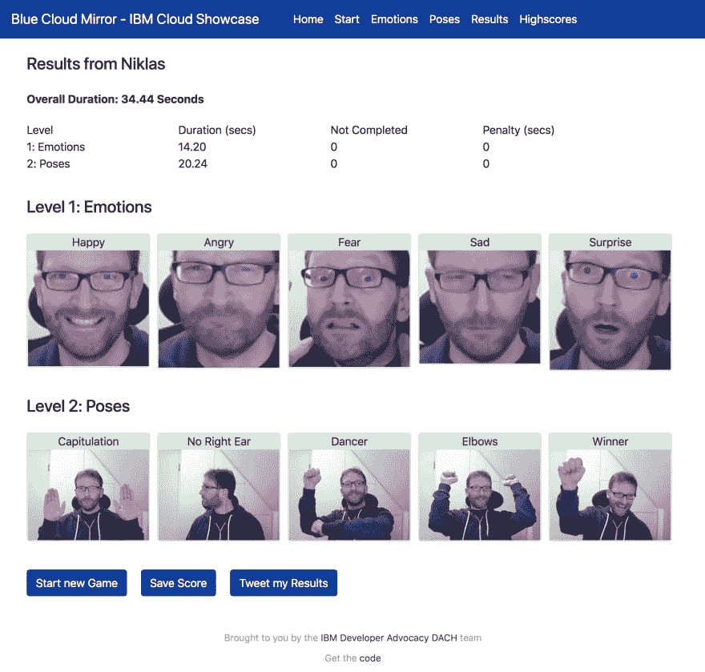
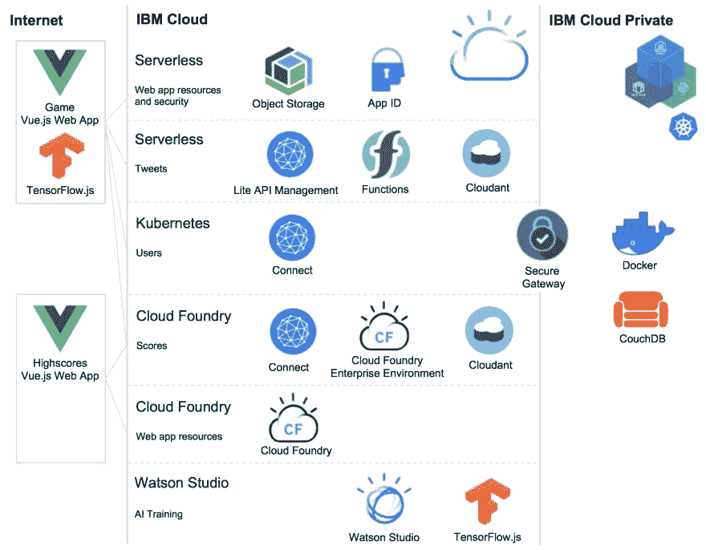

# 介绍有趣的云展示#BlueCloudMirror

> 原文：<https://dev.to/nheidloff/introducing-the-fun-cloud-showcase-bluecloudmirror-5425>

蓝云镜是一款游戏，玩家需要表现出五种特定的情绪，在两个关卡中做五种特定的姿势。越快越好。

[玩游戏。](https://blue-cloud-mirror.mybluemix.net/emotions)只需要一分钟。你只需要一个网络摄像头和一个 Chrome 浏览器。

[从 GitHub 获取代码。](https://github.com/ibm/blue-cloud-mirror)

以下是我的结果:

[](https://thepracticaldev.s3.amazonaws.com/i/4x1pkckl44aq5bq19zmw.png)

游戏使用了 IBM 云的关键技术，有三个主要部分:

*   核心游戏:实现为无服务器的网络应用程序，并通过云功能，因为它不是全天候访问
*   用户服务:通过 IBM Cloud Private 实现，以避免将个人数据放在公共云中
*   分数服务:通过 Cloud Foundry 企业版实施，以展示开发人员的工作效率

下图显示了关键组件:

[](https://thepracticaldev.s3.amazonaws.com/i/toex6teumglq85958xbq.png)

我和我的同事们一起建造了蓝云镜。查看我们关于此事的[系列博客文章](https://github.com/ibm/blue-cloud-mirror#documentation-and-articles)。

您也可以在本地运行应用程序。设置时间不应超过五分钟:

```
$ npm install -g @vue/cli
$ git clone https://github.com/IBM/blue-cloud-mirror.git
$ cd blue-cloud-mirror/game
$ yarn install
$ yarn run serve 
```

试试这个游戏吧！