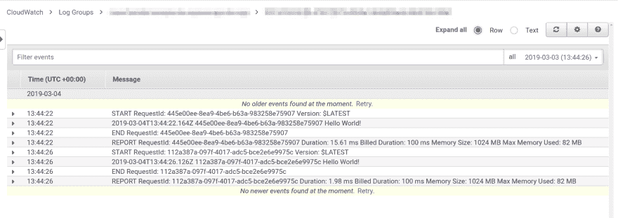
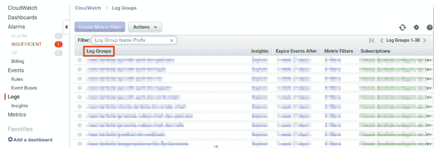
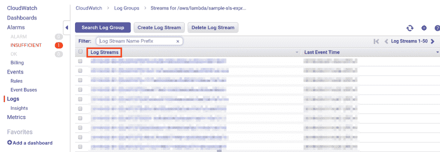
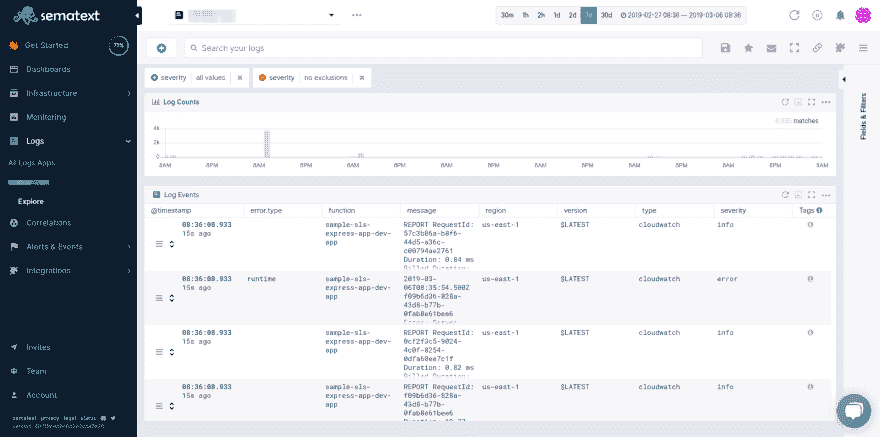
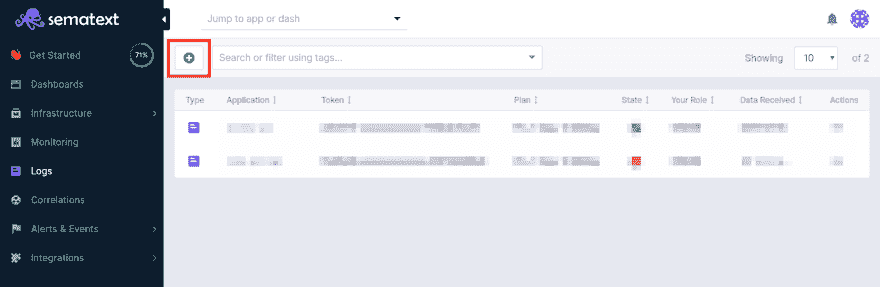
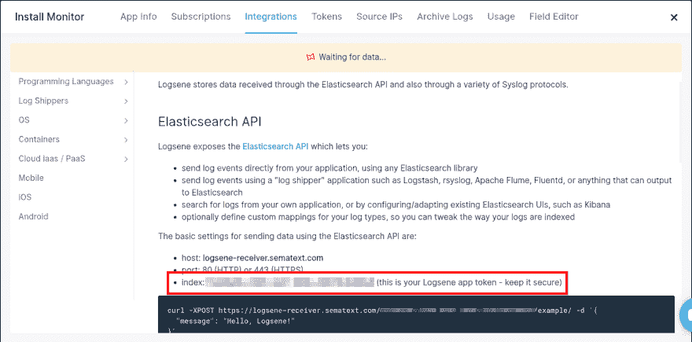

# AWS 无服务器速成班:使用 Kinesis 和 Lambda 进行集中日志记录

> 原文：<https://dev.to/sematext/a-crash-course-on-serverless-with-aws-centralized-logging-with-kinesis-and-lambda-ik7>

当 API 失败而你完全不知道原因时，你难道不讨厌它吗？现在，假设您无法访问运行软件的虚拟机、集群或容器。想让我继续这个噩梦吗？

是的，这就是调试 AWS Lambda 函数的趋势。一场可怕的噩梦，不知道发生了什么，也不知道事情失败的原因。本文将向您展示一种记录函数调用的方法。让您可以跟踪和监控故障和错误，同时还为您提供了一个很好的记录信息和调试日志的结构，以便在您需要对行为进行故障排除时使用。

关键是将所有日志发送到一个中心位置，在那里您可以对它们进行分组、过滤和理解。 [Sematext](https://sematext.com/cloud/) 是针对整个软件堆栈的全堆栈可观察性解决方案。这意味着您可以在任何现有的基础设施上实现函数日志，比如 Kubernetes 集群和容器。

准备好了吗？我们开始吧！

## 使用 CloudWatch 获取日志

[CloudWatch](https://aws.amazon.com/cloudwatch/) 是显示 AWS Lambda 日志的默认解决方案。

> CloudWatch 以日志、指标和事件的形式收集监控和操作数据，为您提供运行在 AWS 和本地服务器上的 AWS 资源、应用程序和服务的统一视图。
> 
> — AWS 文档

通俗地说，这是一个 AWS 服务，用于显示所有 AWS 服务的日志。我们想知道它是如何处理 AWS Lambda 日志的。当一个 Lambda 函数执行时，无论你向控制台写什么，Go 中的一个`fmt.printf()`或者 Node.js 中的一个`console.log()`，都会在后台异步发送到 CloudWatch。幸运的是，它不会增加函数执行时间的任何开销。

在函数运行时使用日志代理会增加执行开销，并增加不必要的延迟。我们希望避免这种情况，并在日志被添加到 CloudWatch 后对其进行处理。下面你可以看到由一个普通的 *Hello World* 函数生成的日志事件示例。

[](https://res.cloudinary.com/practicaldev/image/fetch/s--o_Cenjk8--/c_limit%2Cf_auto%2Cfl_progressive%2Cq_auto%2Cw_880/https://github.com/adnanrahic/cdn/raw/master/centralized-logging-with-kinesis-lambda/cloudwatch-log.png) 让我们退一步，看看更大的图景。每个函数都会在 CloudWatch 中创建一个叫做**日志组**的东西。单击特定的日志组。

[](https://res.cloudinary.com/practicaldev/image/fetch/s--p4J50zEF--/c_limit%2Cf_auto%2Cfl_progressive%2Cq_auto%2Cw_880/https://github.com/adnanrahic/cdn/raw/master/centralized-logging-with-kinesis-lambda/cloudwatch-log-groups.png)

这些日志组将包含**日志流**，这些日志流在字面上等同于来自特定功能实例的日志事件。

[](https://res.cloudinary.com/practicaldev/image/fetch/s--llyVdWtN--/c_limit%2Cf_auto%2Cfl_progressive%2Cq_auto%2Cw_880/https://github.com/adnanrahic/cdn/raw/master/centralized-logging-with-kinesis-lambda/cloudwatch-log-streams.png)

对于系统洞察力和对你的软件正在做什么有一个适当的概述来说，这几乎不是一个足够好的解决方案。由于其结构，很难看到和区分日志。将日志放在一个中心位置更有意义。您可以使用自己的 Elasticsearch 或托管设置。Sematext 为您的基础设施的每个部分提供了全栈可观察性，并公开了一个 [Elasticsearch API](https://sematext.com/docs/logs/) 。让我向您展示创建 AWS Lambda 函数的 CloudWatch 日志处理并将其传输到 Sematext [日志应用程序](https://sematext.com/logsene/)是多么容易。

## 创建集中式日志记录解决方案

通过使用 CloudWatch 日志组订阅和 Kinesis，你可以将所有的 Lambda 日志集中到一个专门的函数，这个函数会将它们发送到 Sematext 的 Elasticsearch API。在那里，您有一个存放所有日志的中心位置。您可以搜索和过滤所有函数的日志，并轻松洞察函数的行为和健康状况。

我将演示**如何构建一个您可以自己使用的单命令部署解决方案**。它是用[无服务器框架](https://serverless.com/framework/)和 Node.js 构建的。但是，你可以随意使用 [AWS SAM](https://aws.amazon.com/serverless/sam/) 或 [Terraform](https://www.terraform.io/) ，以及任何你想要的编程语言。这个概念将保持不变。

这是最后的样子。

[](https://res.cloudinary.com/practicaldev/image/fetch/s--PC4lqzdW--/c_limit%2Cf_auto%2Cfl_progressive%2Cq_auto%2Cw_880/https://github.com/adnanrahic/cdn/raw/master/centralized-logging-with-kinesis-lambda/sematext-logsene-shipped.png)

比 CloudWatch 漂亮多了，而且实际上可以找到你要找的东西！

### 设置无服务器项目

首先安装无服务器框架，配置您的 IAM 用户，并创建一个新项目。完整指南可以在  [这里找到](https://hackernoon.com/a-crash-course-on-serverless-with-node-js-632b37d58b44#422a)。

```
$ npm install -g serverless 
$ sls config credentials \
    --provider aws \
    --key xxxxxxxxxxxxxx \
    --secret xxxxxxxxxxxxxx 
$ sls create --template aws-nodejs --path lambda-cwlogs-to-logsene 
$ cd lambda-cwlogs-to-logsene 
$ npm init -y 
$ npm i logsene-js zlib serverless-iam-roles-per-function 
```

Enter fullscreen mode Exit fullscreen mode

太棒了。现在转到 serverless.yml。

### 配置资源

在代码编辑器中打开 **lambda-cwlogs-to-logsene** 目录，并检查 serverless.yml。可以随意删除所有内容并粘贴进来。

```
# serverless.yml
service: lambda-cwlogs-to-logsene

plugins:
  - serverless-iam-roles-per-function

custom:
  stage: ${opt:stage, self:provider.stage}
  secrets: ${file(secrets.json)}

provider:
  name: aws
  runtime: nodejs8.10
  stage: dev
  region: ${self:custom.secrets.REGION, 'us-east-1'}
  versionFunctions: false

functions:
  shipper:
    handler: shipper.handler
    description: Sends CloudWatch logs from Kinesis to Sematext Elastic Search API
    memorySize: 128
    timeout: 3
    events:
      - stream:
          type: kinesis
          arn:
            Fn::GetAtt:
              - LogsKinesisStream
              - Arn
          batchSize: ${self:custom.secrets.BATCH_SIZE}
          startingPosition: LATEST
          enabled: true
    environment:
      LOGS_TOKEN: ${self:custom.secrets.LOGS_TOKEN}
      LOGS_BULK_SIZE: 100
      LOG_INTERVAL: 2000

  subscriber:
    handler: subscriber.handler
    description: Subscribe all CloudWatch log groups to Kinesis
    memorySize: 128
    timeout: 30
    events:
      - http:
          path: subscribe
          method: get
      - cloudwatchEvent:
          event:
            source:
              - aws.logs
            detail-type:
              - AWS API Call via CloudTrail
            detail:
              eventSource:
                - logs.amazonaws.com
              eventName:
                - CreateLogGroup
      - schedule:
          rate: rate(60 minutes)
    iamRoleStatements:
      - Effect: "Allow"
        Action:
          - "iam:PassRole"
          - "sts:AssumeRole"
          - "logs:PutSubscriptionFilter"
          - "logs:DeleteSubscriptionFilter"
          - "logs:DescribeSubscriptionFilters"
          - "logs:DescribeLogGroups"
          - "logs:PutRetentionPolicy"
        Resource: "*"
    environment:
      filterName: ${self:custom.stage}-${self:provider.region}
      region: ${self:provider.region}
      shipperFunctionName: "shipper"
      subscriberFunctionName: "subscriber"
      prefix: "/aws/lambda"
      retentionDays: ${self:custom.secrets.LOG_GROUP_RETENTION_IN_DAYS}
      kinesisArn: 
        Fn::GetAtt:
          - LogsKinesisStream
          - Arn
      roleArn: 
        Fn::GetAtt:
          - CloudWatchLogsRole
          - Arn

resources:
  Resources:
    LogsKinesisStream:
      Type: AWS::Kinesis::Stream
      Properties: 
        Name: ${self:service}-${self:custom.stage}-logs
        ShardCount: ${self:custom.secrets.KINESIS_SHARD_COUNT}
        RetentionPeriodHours: ${self:custom.secrets.KINESIS_RETENTION_IN_HOURS}

    CloudWatchLogsRole:
      Type: AWS::IAM::Role
      Properties: 
        AssumeRolePolicyDocument:
          Version: "2012-10-17"
          Statement: 
            - Effect: Allow
              Principal: 
                Service: 
                  - logs.amazonaws.com
              Action: 
                - sts:AssumeRole
        Policies:
          - PolicyName: root
            PolicyDocument: 
              Version: "2012-10-17"
              Statement: 
                - Effect: Allow
                  Action: 
                    - kinesis:PutRecords
                    - kinesis:PutRecord
                  Resource:
                    Fn::GetAtt:
                      - LogsKinesisStream
                      - Arn
        RoleName: ${self:service}-${self:custom.stage}-cloudwatchrole 
```

Enter fullscreen mode Exit fullscreen mode

让我们一点一点地分解它。shipper 函数将由 Kinesis 流触发，它有一些用于配置 [Sematext 日志](https://sematext.com/logsene/)的环境变量。Kinesis 流本身在底部的资源部分定义，并通过使用其 ARN 在函数事件中引用。

继续讨论订户功能。它有三种触发方式。由你选择。如果您有许多现有的日志组，那么您可能希望点击 HTTP 端点来初始订阅它们。否则，让它每隔一段时间触发一次，或者只在创建新的日志组时触发，就可以了。

LogsKinesisStream 是我们订阅日志组的 Kinesis 流，CloudWatchLogsRole 是 IAM 角色，它允许 CloudWatch 将记录放入 Kinesis。

这样一来，您现在可以看到我们缺少了一个 secrets.json 文件。但是，在我们继续之前，跳到 [Sematext](https://sematext.com/) ，[登录](https://apps.sematext.com/ui/login)并创建一个[日志应用](https://apps.sematext.com/ui/logs)。按下绿色小按钮来添加日志应用程序。

[](https://res.cloudinary.com/practicaldev/image/fetch/s--MyCjnLcE--/c_limit%2Cf_auto%2Cfl_progressive%2Cq_auto%2Cw_880/https://github.com/adnanrahic/cdn/raw/master/centralized-logging-with-kinesis-lambda/sematext-logsene.png)

添加应用程序名称和一些基本信息后，您会看到一个*等待数据*屏幕弹出。按下**集成向导**并复制您的令牌。

[](https://res.cloudinary.com/practicaldev/image/fetch/s--FTlE9JT9--/c_limit%2Cf_auto%2Cfl_progressive%2Cq_auto%2Cw_880/https://github.com/adnanrahic/cdn/raw/master/centralized-logging-with-kinesis-lambda/sematext-token.png)

现在您可以将令牌粘贴到`secrets.json`文件中。

```
{  "LOGS_TOKEN":  "your-token",  "REGION":  "us-east-1",  "BATCH_SIZE":  1000,  "LOG_GROUP_RETENTION_IN_DAYS":  1,  "KINESIS_RETENTION_IN_HOURS":  24,  "KINESIS_SHARD_COUNT":  1  } 
```

Enter fullscreen mode Exit fullscreen mode

### 添加订户功能

我喜欢说 Kinesis 是卡夫卡的简化版。它基本上是一个管道。您订阅要发送到其中的数据，并告诉它一旦满足某个批量大小，就触发一个 Lambda 函数作为事件。

拥有订阅者功能的目的是为所有日志组订阅一个 Kinesis 流。理想情况下，它们应该在创建时就被订阅，当然，最初当你想订阅所有现有的日志组到一个新的 Kinesis 流时。作为备用方案，我也喜欢在想要手动触发订阅者时使用 HTTP 端点。

在代码编辑器中，创建一个新文件，并将其命名为 subscriber.js。

```
// subscriber.js

const AWS = require('aws-sdk')
AWS.config.region = process.env.region
const cloudWatchLogs = new AWS.CloudWatchLogs()
const prefix = process.env.prefix
const kinesisArn = process.env.kinesisArn
const roleArn = process.env.roleArn
const filterName = process.env.filterName
const retentionDays = process.env.retentionDays
const shipperFunctionName = process.env.shipperFunctionName
const filterPattern = ''

const setRetentionPolicy = async (logGroupName) => {
  const params = {
    logGroupName: logGroupName,
    retentionInDays: retentionDays
  }
  await cloudWatchLogs.putRetentionPolicy(params).promise()
}

const listLogGroups = async (acc, nextToken) => {
  const req = {
    limit: 50,
    logGroupNamePrefix: prefix,
    nextToken: nextToken
  }
  const res = await cloudWatchLogs.describeLogGroups(req).promise()

  const newAcc = acc.concat(res.logGroups.map(logGroup => logGroup.logGroupName))
  if (res.nextToken) {
    return listLogGroups(newAcc, res.nextToken)
  } else {
    return newAcc
  }
}

const upsertSubscriptionFilter = async (options) => {
  console.log('UPSERTING...')
  const { subscriptionFilters } = await cloudWatchLogs.describeSubscriptionFilters({ logGroupName: options.logGroupName }).promise()
  const { filterName, filterPattern } = subscriptionFilters[0]

  if (filterName !== options.filterName || filterPattern !== options.filterPattern) {
    await cloudWatchLogs.deleteSubscriptionFilter({
      filterName: filterName,
      logGroupName: options.logGroupName
    }).promise()
    await cloudWatchLogs.putSubscriptionFilter(options).promise()
  }
}

const subscribe = async (logGroupName) => {
  const options = {
    destinationArn: kinesisArn,
    logGroupName: logGroupName,
    filterName: filterName,
    filterPattern: filterPattern,
    roleArn: roleArn,
    distribution: 'ByLogStream'
  }

  try {
    await cloudWatchLogs.putSubscriptionFilter(options).promise()
  } catch (err) {
    console.log(`FAILED TO SUBSCRIBE [${logGroupName}]`)
    console.error(JSON.stringify(err))
    await upsertSubscriptionFilter(options)
  }
}

const subscribeAll = async (logGroups) => {
  await Promise.all(
    logGroups.map(async logGroupName => {
      if (logGroupName.endsWith(shipperFunctionName)) {
        console.log(`SKIPPING [${logGroupName}] BECAUSE IT WILL CREATE CYCLIC EVENTS FROM IT'S OWN LOGS`)
        return
      }

      console.log(`SUBSCRIBING [${logGroupName}]`)
      await subscribe(logGroupName)

      console.log(`UPDATING RETENTION POLICY TO [${retentionDays} DAYS] FOR [${logGroupName}]`)
      await setRetentionPolicy(logGroupName)
    })
  )
}

const processAll = async () => {
  const logGroups = await listLogGroups([])
  await subscribeAll(logGroups)
}

exports.handler = async () => {
  console.log('subscriber start')
  await processAll()
  console.log('subscriber done')
  return {
    statusCode: 200,
    body: JSON.stringify({ message: `Subscription successful!` })
  }
} 
```

Enter fullscreen mode Exit fullscreen mode

检查`processAll()`功能。它将从 CloudWatch 中抓取所有匹配前缀的**日志组**，并将它们放入一个易于访问的数组中。然后你将把它们传递给一个`subscribeAll()`函数，该函数将通过它们进行映射，同时将它们订阅到你在 **serverless.yml** 中定义的 Kinesis 流。

另一件很酷的事情是将保留策略设置为 7 天。你很少需要比这更多的东西，这将减少在你的 AWS 账户中保存日志的成本。

请记住，您还可以编辑获取日志的`filterPattern`。现在，我选择保持空白，不过滤任何东西。但是，根据你的需要，你可以根据你选择的记录器创建的模式来匹配它。

太好了，做完这些，让我们继续运送一些原木吧！

### 添加发货人功能

在 Kinesis 流从 CloudWatch 接收到日志后，它将触发一个 Lambda 函数，专门将日志发送到 Elasticsearch 端点。对于这个例子，我们将使用 [LogseneJS](https://github.com/sematext/logsene-js) 作为日志发送器。如果你分解它，它是相当简单的。一批记录将在事件参数中发送给 shipper 函数。您解析日志，给它们您想要的结构，并将它们发送给 Sematext。这是它的样子。创建一个新文件，将其命名为 shipper.js，并粘贴以下代码。

```
// shipper.js
const Zlib = require('zlib')
const Logsene = require('logsene-js')
const logger = new Logsene(process.env.LOGS_TOKEN)
const errorPatterns = [
  'error'
]
const configurationErrorPatterns = [
  'module initialization error',
  'unable to import module'
]
const timeoutErrorPatterns = [
  'task timed out',
  'process exited before completing'
]
/**
 * Sample of a structured log
 * ***************************************************************************
 * Timestamp                RequestId                            Message
 * 2019-03-08T15:58:45.736Z 53499d7f-60f1-476a-adc8-1e6c6125a67c Hello World!
 * ***************************************************************************
 */
const structuredLogPattern = '[0-9]{4}-(0[1-9]|1[0-2])-(0[1-9]|[1-2][0-9]|3[0-1])T(2[0-3]|[01][0-9]):[0-5][0-9]:[0-5][0-9].[0-9][0-9][0-9]Z([ \t])[a-zA-Z0-9]{8}-[a-zA-Z0-9]{4}-[a-zA-Z0-9]{4}-[a-zA-Z0-9]{4}-[a-zA-Z0-9]{12}([ \t])(.*)'
const regexError = new RegExp(errorPatterns.join('|'), 'gi')
const regexConfigurationError = new RegExp(configurationErrorPatterns.join('|'), 'gi')
const regexTimeoutError = new RegExp(timeoutErrorPatterns.join('|'), 'gi')
const regexStructuredLog = new RegExp(structuredLogPattern)
const lambdaVersion = (logStream) => logStream.substring(logStream.indexOf('[') + 1, logStream.indexOf(']'))
const lambdaName = (logGroup) => logGroup.split('/').reverse()[0]
const checkLogError = (log) => {
  if (log.message.match(regexError)) {
    log.severity = 'error'
    log.error = {
      type: 'runtime'
    }
  } else if (log.message.match(regexConfigurationError)) {
    log.severity = 'error'
    log.error = {
      type: 'configuration'
    }
  } else if (log.message.match(regexTimeoutError)) {
    log.severity = 'error'
    log.error = {
      type: 'timeout'
    }
  }
  return log
}
const splitStructuredLog = (message) => {
  const parts = message.split('\t', 3)
  return {
    timestamp: parts[0],
    requestId: parts[1],
    msg: parts[2]
  }
}

/**
 * Create payload for Logsene API
 */
const parseLog = (functionName, functionVersion, message, awsRegion) => {
  if (
    message.startsWith('START RequestId') ||
    message.startsWith('END RequestId') ||
    message.startsWith('REPORT RequestId')
  ) {
    return
  }

  // if log is structured
  if (message.match(regexStructuredLog)) {
    const { timestamp, requestId, msg } = splitStructuredLog(message)
    return checkLogError({
      message: msg,
      function: functionName,
      version: functionVersion,
      region: awsRegion,
      type: 'lambda',
      severity: 'debug',
      timestamp: timestamp,
      requestId: requestId
    })
  } else { // when log is NOT structured
    return checkLogError({
      message: message,
      function: functionName,
      version: functionVersion,
      region: awsRegion,
      type: 'lambda',
      severity: 'debug'
    })
  }
}

const parseLogs = (event) => {
  const logs = []

  event.Records.forEach(record => {
    const payload = Buffer.from(record.kinesis.data, 'base64')
    const json = (Zlib.gunzipSync(payload)).toString('utf8')
    const data = JSON.parse(json)
    if (data.messageType === 'CONTROL_MESSAGE') { return }

    const functionName = lambdaName(data.logGroup)
    const functionVersion = lambdaVersion(data.logStream)
    const awsRegion = record.awsRegion

    data.logEvents.forEach(logEvent => {
      const log = parseLog(functionName, functionVersion, logEvent.message, awsRegion)
      if (!log) { return }
      logs.push(log)
    })
  })

  return logs
}

const shipLogs = async (logs) => {
  return new Promise((resolve) => {
    if (!logs.length) { return resolve('No logs to ship.') }
    logs.forEach(log => logger.log(log.severity, 'LogseneJS', log))
    logger.send(() => resolve('Logs shipped successfully!'))
  })
}

exports.handler = async (event) => {
  try {
    const res = await shipLogs(parseLogs(event))
    console.log(res)
  } catch (err) {
    console.log(err)
    return err
  }
  return 'shipper done'
} 
```

Enter fullscreen mode Exit fullscreen mode

shipper Lambda 的核心在于`parseLogs()`和`shipLogs()`函数。前者将接受事件参数，提取所有日志事件，解析它们，将它们添加到一个数组中，并返回该数组。而后者将采用相同的日志数组，将每个日志事件添加到 [LogseneJS](https://github.com/sematext/logsene-js) 缓冲区，并一次性发送它们。该位置是您在上面创建的日志应用程序。

您还记得本文开头的图片吗？在该图片中，您看到了典型函数调用的日志事件。您可以看到它生成了 4 种不同类型的日志事件。

```
START RequestId 
... 
END RequestId 
REPORT RequestId 
```

Enter fullscreen mode Exit fullscreen mode

它们可以以这三种模式中的任何一种开始，其中省略号表示在函数运行时(Node.js 中的`console.log()`)中打印到 stdout 的任何类型的字符串。

`parseLog()`函数将完全跳过开始、结束和报告日志事件，只返回用户定义的调试或错误日志事件，这取决于它们是用户定义的标准输出还是函数运行时、配置或持续时间中的任何类型的错误。

默认情况下，日志消息本身是结构化的，但并不总是如此。默认情况下，在 Node.js 运行时，它的结构如下所示。

```
Timestamp                 RequestId                             Message 
2019-03-08T15:58:45.736Z  53499d7f-60f1-476a-adc8-1e6c6125a67c  Hello World! 
```

Enter fullscreen mode Exit fullscreen mode

shipper 中的代码被配置为与上面的结构一起工作，或者与只有消息部分的结构一起工作。如果您正在使用另一个运行时，我建议您使用结构化日志来为您的日志事件创建一个公共结构。

编码部分完成后，您就可以部署和测试您的定制日志传送程序了。

### 部署并测试您的集中式日志记录解决方案

使用像无服务器框架这样的基础设施作为代码解决方案的好处在于部署是多么简单。你可以用一个命令把所有东西都推到云端。跳回到您的终端，在您的项目运行目录中:

```
$ sls deploy 
```

Enter fullscreen mode Exit fullscreen mode

您将看到输出被打印到控制台。

```
[output]
Serverless: Packaging service...
Serverless: Excluding development dependencies...
Serverless: Uploading CloudFormation file to S3...
Serverless: Uploading artifacts...
Serverless: Uploading service .zip file to S3 (2.15 MB)...
Serverless: Validating template...
Serverless: Updating Stack...
Serverless: Checking Stack update progress...
............
Serverless: Stack update finished...
Service Information
service: lambda-cwlogs-to-logsene
stage: dev
region: us-east-1
stack: lambda-cwlogs-to-logsene-dev
api keys:
  None
endpoints:
  GET - https://.execute-api.us-east-1.amazonaws.com/dev/subscribe
functions:
  shipper: lambda-cwlogs-to-logsene-dev-shipper
  subscriber: lambda-cwlogs-to-logsene-dev-subscriber
layers:
  None
Serverless: Removing old service artifacts from S3… 
```

Enter fullscreen mode Exit fullscreen mode

就是这样。现在，您已经设置好将所有日志从 Lambda 函数发送到 [Sematext Cloud](https://sematext.com/cloud/) 中。确保触发订阅功能，将日志组订阅到 Kinesis 流。触发订阅者后，您将看到订阅者在 Sematext 中生成的日志，您可以放心它是有效的。

[](https://res.cloudinary.com/practicaldev/image/fetch/s--PC4lqzdW--/c_limit%2Cf_auto%2Cfl_progressive%2Cq_auto%2Cw_880/https://github.com/adnanrahic/cdn/raw/master/centralized-logging-with-kinesis-lambda/sematext-logsene-shipped.png)

上面你可以看到我是如何添加严重性过滤的。您可以轻松选择要过滤的值，这为您提供了一种跟踪错误、超时和调试日志的简单方法。

## 成本呢？

在你的 AWS 账户中有这样一个设置的成本是相当便宜的。单个 shard Kinesis 流的固定成本大约为[$ 14/月，加上流数据量的额外成本](https://aws.amazon.com/kinesis/data-streams/pricing/)。单个 shard 的接收能力为 1MB/秒或 1000 条记录/秒，这对大多数用户来说是合适的。

Kinesis 的花费被分成了**碎片时间**和**25KB 大小的有效载荷单位**。一个碎片每天花费 0.36 美元，而一百万个 PUT 有效载荷单元花费 0.014 美元。假设，如果你有一个碎片和每秒 100 个 PUT 有效载荷单位，那么在 30 天的时间里，你**将为碎片花费 10.8 美元，为有效载荷单位花费 3.6288 美元。**

Lambda 函数被配置为使用尽可能少的内存，即 128MB，这意味着在适度使用的情况下，开销通常会停留在空闲层。那是你最不担心的。

## 包装完毕

拥有一个存放日志的中心位置至关重要。尽管 CloudWatch 以其自身的方式很有用，但它缺乏全局观念。通过使用一个中心位置，您不需要切换上下文来调试不同类型的应用程序。Sematext 可以监控你的整个软件栈。将您的 [Kubernetes](https://sematext.com/kubernetes/) 日志、[容器](https://sematext.com/docker/)日志和 Lambda 日志保存在 [Sematext 日志](https://sematext.com/logsene/)中是一个很大的好处，在那里您可以很容易地跟踪一切。

如果你需要再次检查代码，[这是回购](https://github.com/sematext/cloudwatch-sematext-aws-lambda-log-shipper/tree/develop)，如果你想让更多人在 GitHub 上看到它，给它一颗星。您还可以克隆 repo 并立即部署它。不要忘记先添加你的日志应用令牌。

如果你需要一个软件栈的可观察性解决方案，请查看 [Sematext](https://sematext.com/) 。我们正在推动[开源我们的产品](https://github.com/sematext)并产生影响。

希望你们喜欢读这篇文章，就像我喜欢写这篇文章一样。如果你喜欢，点击那个小小的分享按钮，那么更多的人会看到这个教程。下次见，保持好奇，玩得开心。