# MVC 之前的 MXC

> 原文：<https://dev.to/andrious/mxc-before-mvc-589>

AndroidX 之前的颤振框架！

在继续开发我的 MVC 框架包时，我意识到一个必须解决的重要问题出现了。一切都进行得很顺利，但是…

<figure> 

<figcaption>[格雷格佩里其他故事](https://medium.com/@greg.perry)</figcaption>

</figure>

### 接着是安卓克斯

随着 Android 9.0 (API 级别 28)的发布，出现了一个新版本的支持库，名为 [**AndroidX**](https://developer.android.com/jetpack/androidx/) 。这些版本与 Flutter 使用的早期插件和包不兼容，因此也与我即将发布的 MVC 框架包不兼容。因此，为了 Flutter 社区的利益，我决定做一些事情。

### 带 X 的 MVC _ 应用程序

我决定发布一个框架包的“预发布”。一个仍然适用于现在已被弃用但目前使用更广泛的支持文件的文件。虽然标准包 mvc_application 将继续支持最新的和未来的 Android 支持文件，但这个版本将只支持 AndroidX 之前的支持文件。我决定叫它， **mxc_application** 。凭借其微妙的“文字游戏”，这将是“MVC 框架包”的早期版本

[mxc_application | Flutter 包](https://pub.dartlang.org/packages/mxc_application)

### 保留您的版本

因此，除了一个重要的区别之外，这个版本的框架和 MVC 是一样的。这反映在框架的 pubspec.yaml 文件中的版本号列表中。它们都是在移植到 AndroidX 之前运行的插件和软件包的旧版本。

<figure>[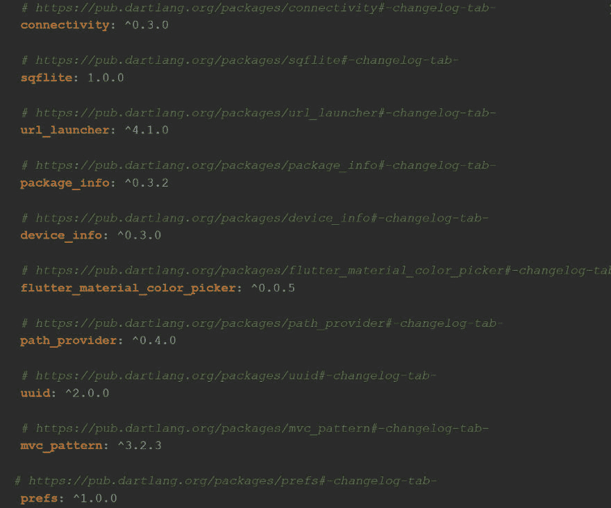](https://res.cloudinary.com/practicaldev/image/fetch/s--mpoIOEhF--/c_limit%2Cf_auto%2Cfl_progressive%2Cq_auto%2Cw_880/https://cdn-images-1.medium.com/max/1024/1%2Aeh4xzy9S_Wihf4i6ck5ToA.png)

<figcaption>pub spec . YAML</figcaption>

</figure>

注意，这个特殊的框架包在开发中不会有任何进展。毕竟，它只对那些使用过时的支持库文件为 Android 平台开发应用程序的人有帮助，这些支持库文件总有一天会消失。

### 快速启动指南

本文将作为该框架主要发行版的初级读本。同样，这里提供的“预发布”将提供与主发布相同的功能和特性。坦率地说，这是一个尚未发布的主版本。在本文中，将使用一个示例应用程序来演示这些功能和特性。我的一个读者在以前的文章中见过这个示例应用程序。这里是它的存储库:[联系 AndroidX 示例](https://github.com/Andrious/contacts_androidx_example/)

一如既往，我更喜欢在我的文章中使用截图而不是 gists 来展示代码。我发现它们更容易使用，也更容易阅读。然而，你可以点击它们来查看代码的要点或在 Github 中。

我们开始吧。

### 补充来源

首先，你可能会发现在这篇文章之前或之后阅读这些文章将有助于理解你如何以及为什么将这个框架包用于你的应用程序。

过去的一篇文章向您介绍了我对 mvc 在 Flutter 自己的框架中的解释，并介绍了 Flutter 包的“核心” [**mvc_pattern**](https://pub.dartlang.org/packages/mvc_pattern) ，它直接在 Flutter 中实现了 MVC:

<figure> 

<figcaption>[终于扑+ MVC 了！](https://dev.to/andrious/flutter--mvc-at-last-2jd3)</figcaption>

</figure>

[扑得更快！](https://medium.com/flutter-community/flutter-faster-db1e0fef57ba)，将更深入地研究 MVC 实现，并向您展示一些在您自己的应用程序中可能有用的方法。无论如何，它会给你一些关于如何使用这个 MVC 框架的背景信息。

请注意，那篇特定文章中涉及的一些框架代码已经发生了变化，现在已经不推荐使用了。这个库包继续发展并得到支持是一个好兆头。不过，还是推荐阅读。

<figure> 

<figcaption>[扑得更快！](https://medium.com/flutter-community/flutter-faster-db1e0fef57ba)</figcaption>

</figure>

### 三样东西

要使用这个框架，您需要做三件事情:

> 1)扩展类 ControllerMVC，然后使用该类包含应用程序的“逻辑和事件处理”
> 
> *2)对于你 app 中的每一个 StatefulWidget，不要使用常规的 State 类，而是扩展类 StateMVC，并使用那个类作为状态对象。
> 
> 3)“添加”控制器到其适当的“StateMVC”状态对象。*

我会用例子和截图解释每一步。但首先，我会退后一步，快速解释“为什么”你会涉及这些元素。

### 为什么是 ControllerMVC？

控制器是 MVC 架构中的三个参与者之一。在许多应用程序中，控制器是源代码的“工作马”,其中大部分包含应用程序的“业务逻辑”或“大脑”。

### 保持不变

注意如果你的变量在你的 StatefulWidgets 中不是 final，编译器会如何抱怨？这是一个警告，你可以逃脱，但这是不好的形式。不变性是一件好事，也许我们会在另一个时间讨论这个问题。现在，我将使用下面截图中传达的 StatefulWidget 来演示警告。

<figure>[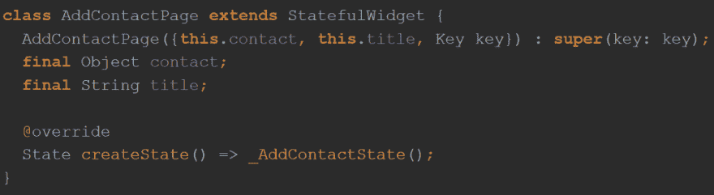](https://github.com/Andrious/contacts_androidx_example/blob/14966d8df7909e8994dc9d9bfeac7bfeb668e47e/lib/src/view/AddContactPage.dart#L51) 

<figcaption>[在 Github 上添加联系人页面](https://github.com/Andrious/contacts_androidx_example/blob/14966d8df7909e8994dc9d9bfeac7bfeb668e47e/lib/src/view/AddContactPage.dart#L51)</figcaption>

</figure>

当我从一个属性变量(或者 Flutter 称之为实例字段)中删除关键字 final 时，我们会得到警告:

[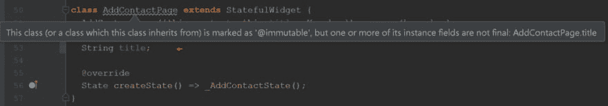](https://res.cloudinary.com/practicaldev/image/fetch/s--FNNAPr0O--/c_limit%2Cf_auto%2Cfl_progressive%2Cq_auto%2Cw_880/https://cdn-images-1.medium.com/max/1024/1%2ACcxj2fR7IFvIrjd_ABiCfg.png)

### 你应该是不可改变的

还是那句话，你可以做，但不应该做。然而，在大多数情况下，会有需要可变的代码。那么你能做什么呢？当然是利用 MVC 架构。根据设计，控制器是可变的，你可以[拥有许多控制器](https://medium.com/flutter-community/flutter-mvc-at-last-275a0dc1e730#1048)。这就是为什么我们有这个类，ControllerMVC。

所以下面，有一些私有变量是可变的。在这个[示例应用](https://github.com/Andrious/contacts_androidx_example/)的“控制器”中可以找到它们，当然，没有警告。

<figure>

<figcaption>[Github 中的类控制器](https://github.com/Andrious/contacts_androidx_example/blob/14966d8df7909e8994dc9d9bfeac7bfeb668e47e/lib/src/controller/Controller.dart#L34)</figcaption>

</figure>

### 为什么是 StateMVC？

在对 MVC 的解释中，我决定在 Flutter 的状态对象中找到的 **build()** 函数将作为模型-视图-控制器架构的“视图”。因此，状态对象包含应用程序的视图。我选择 State 类的另一个原因是，它们也能够“观察”在典型的[小部件的生命周期](https://medium.com/flutter-community/flutter-mvc-at-last-275a0dc1e730#7ebe)中可能发生的许多不同事件。换句话说，有一种方法可以用所谓的观察者来“监听”这种生命周期事件。

### MVC =观察者设计模式

MVC 是一种使用观察者设计模式的架构。它包括“观察者”或“监听器”的实现，当特定事件发生时，它们会得到通知。同样，状态对象能够拥有“监听器”,在这种情况下，监听器将观察小部件的生命周期。一种有用的能力。因此，这就是为什么我们有了类 State MVC——MVC 状态对象。

<figure>[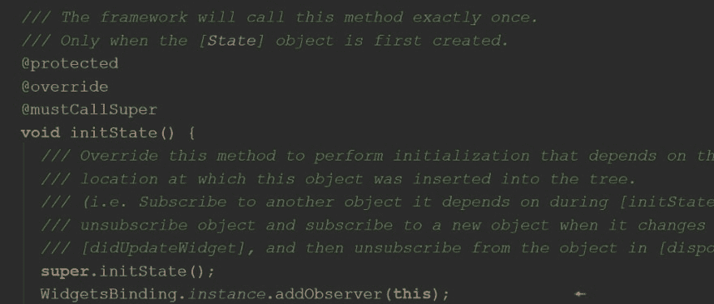](https://github.com/AndriousSolutions/mvc_pattern/blob/f27136c65d9bc1ec0786a78a3fb249f7cd1befc6/lib/mvc_pattern.dart#L385)

<figcaption>[state MVC](https://github.com/AndriousSolutions/mvc_pattern/blob/f27136c65d9bc1ec0786a78a3fb249f7cd1befc6/lib/mvc_pattern.dart#L385)</figcaption>

</figure>

中的 initState()函数

上面的截图片段只是 MVC 状态对象的 **initState()** 函数的前几行。注意最后一行引用了名为 WidgetsBinding 的类。正如其源代码中所描述的，这是“小部件层和 Flutter 引擎之间的粘合剂。”它提供了访问小部件生命周期中可能发生的许多事件的方法。转到[***WidgetsBindingObserver 类***](https://docs.flutter.io/flutter/widgets/WidgetsBindingObserver-class.html) 获取更多细节。

### 最后一步:添加控制器

将控制器分配给包含视图的状态对象使控制器获得了一些重要的能力。同样，查看上面的 **initState()** 函数，我们看到状态对象可以访问小部件的生命周期。但是，如果您要向该状态对象添加或分配控制器，那么该控制器也将有权访问小部件的生命周期。非常有用。

它是 mixin，StateListener，用于“监听”多达 12 个事件(Flutter 的每个新版本都有更多)，这些事件可能在小部件的生命周期中触发。它是这个 MVC 框架中的一个重要元素。

<figure>[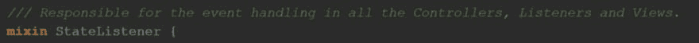](https://github.com/AndriousSolutions/mvc_pattern/blob/f27136c65d9bc1ec0786a78a3fb249f7cd1befc6/lib/mvc_pattern.dart#L164)

<figcaption>[Github 中的 mixin state listener](https://github.com/AndriousSolutions/mvc_pattern/blob/f27136c65d9bc1ec0786a78a3fb249f7cd1befc6/lib/mvc_pattern.dart#L164)</figcaption>

</figure>

您可以在下面看到，控制器(即扩展 ControllerMVC 的类)将通过私有类 _StateObserver 的继承来使用 mixin，StateListener。注意，你也可以单独使用状态监听器。

<figure>[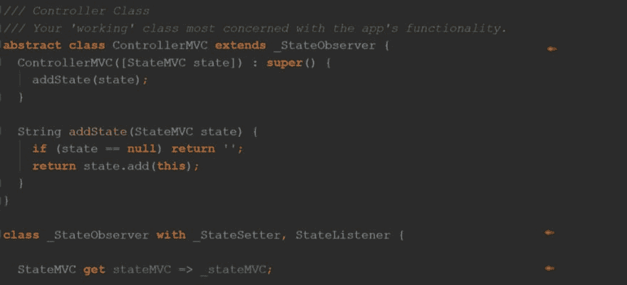](https://github.com/AndriousSolutions/mvc_pattern/blob/f27136c65d9bc1ec0786a78a3fb249f7cd1befc6/lib/mvc_pattern.dart#L62)

<figcaption>[Github](https://github.com/AndriousSolutions/mvc_pattern/blob/f27136c65d9bc1ec0786a78a3fb249f7cd1befc6/lib/mvc_pattern.dart#L62)</figcaption>

</figure>

中的类控制器

请注意，抽象类 ControllerMVC 中的函数 **addState()** 意味着控制器能够在其生命周期中被分配给任意数量的状态对象。另一个重要而有用的能力。

进一步注意，通过类 _StateObserver 将 *getter* 、stateMVC 提供给控制器，控制器以及随后的开发者可以直接访问最后分配给控制器的状态对象。很好。

### 国家也听

事实上，状态对象本身“实现”了 StateListener。因此需要抽象类 StateMVC 来实现 StateListener mixin 包含的 12 个(或更多)事件函数。

<figure>[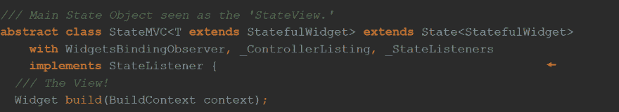](https://github.com/AndriousSolutions/mvc_pattern/blob/f27136c65d9bc1ec0786a78a3fb249f7cd1befc6/lib/mvc_pattern.dart#L301)

<figcaption>[Github 中的类 state MVC](https://github.com/AndriousSolutions/mvc_pattern/blob/f27136c65d9bc1ec0786a78a3fb249f7cd1befc6/lib/mvc_pattern.dart#L301)</figcaption>

</figure>

注意，这里没有实现 **build()** 函数，它被标记为视图。这就是 StateMVC 是一个抽象类的原因。它必须被子类化，并且它的“视图”被实现。

### 在回顾

所以，回顾一下，要实现这个 MVC 框架，你需要做三件事。[示例应用](https://github.com/Andrious/contacts_androidx_example/)用下面的三个截图演示了这些步骤。他们详细描述每一步的标题。

<figure>[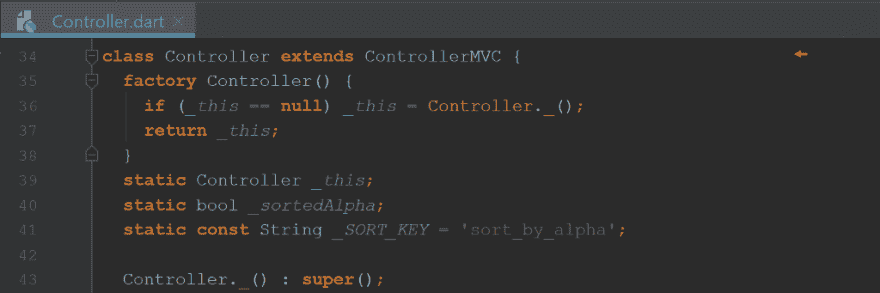](https://github.com/Andrious/contacts_androidx_example/blob/14966d8df7909e8994dc9d9bfeac7bfeb668e47e/lib/src/controller/Controller.dart#L34) 

<figcaption>[创建一个扩展类的类，ControllerMVC](https://github.com/Andrious/contacts_androidx_example/blob/14966d8df7909e8994dc9d9bfeac7bfeb668e47e/lib/src/controller/Controller.dart#L34)</figcaption>

</figure>

<figure>[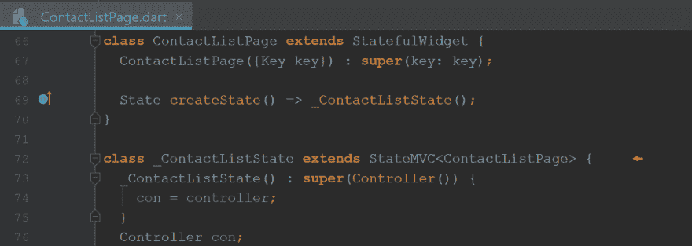](https://github.com/Andrious/contacts_androidx_example/blob/14966d8df7909e8994dc9d9bfeac7bfeb668e47e/lib/src/view/ContactListPage.dart#L66) 

<figcaption>[创建一个类，该类扩展了 StateMVC，以作为状态对象。](https://github.com/Andrious/contacts_androidx_example/blob/14966d8df7909e8994dc9d9bfeac7bfeb668e47e/lib/src/view/ContactListPage.dart#L66)</figcaption>

</figure>

<figure>[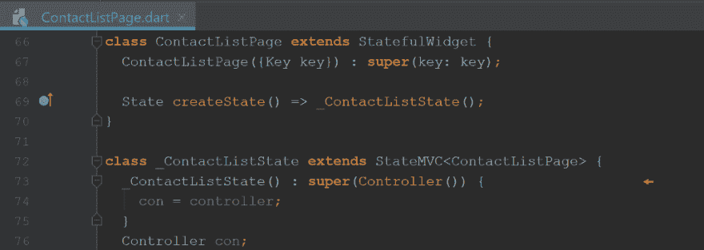](https://github.com/Andrious/contacts_androidx_example/blob/14966d8df7909e8994dc9d9bfeac7bfeb668e47e/lib/src/view/ContactListPage.dart#L73) 

<figcaption>[将控制器分配给那个状态对象。](https://github.com/Andrious/contacts_androidx_example/blob/14966d8df7909e8994dc9d9bfeac7bfeb668e47e/lib/src/view/ContactListPage.dart#L73)</figcaption>

</figure>

### MVC 框架

我已经实现了 MVC 方法，并由 Flutter 包 [**、mvc_pattern**](https://pub.dartlang.org/packages/mvc_pattern) 提供，但是还有更多工作要做。即使是一个简单的移动应用程序也有很多内容，我在工作中编写了简单和复杂的应用程序。当这些应用程序启动时，需要执行许多相同的流程和任务。它们都有许多相同的功能和特征。对于我开发的每一个新应用程序，反复编写这些常见的任务和功能是非常低效的，甚至是愚蠢的。我需要一个框架。所以我做了一个，这就是我们今天要回顾。

### 如何开始这一切？

那么，你如何启动这个框架呢？你当然有选择。函数 **main()** 通过其对函数 **runApp()** 的传统调用，可以接受 MVC 类或 App 类。两者都有一个重要的区别。在 App 类中，你有“应用控制器”选项，而在 MVC 类中，你没有。我很快会解释的。同时，下面是两个截图，展示了启动示例应用程序的两种方式。

<figure>[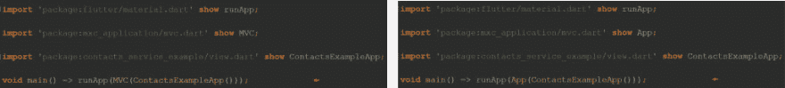](https://res.cloudinary.com/practicaldev/image/fetch/s--UwrXWNvz--/c_limit%2Cf_auto%2Cfl_progressive%2Cq_auto%2Cw_880/https://cdn-images-1.medium.com/max/1024/1%2AoAUrY-qh6oIafCOi2YzWPQ.png) 

<figcaption>文件， [main.dart](https://github.com/Andrious/contacts_androidx_example/blob/14966d8df7909e8994dc9d9bfeac7bfeb668e47e/lib/main.dart) ，用两种不同的方法启动</figcaption>

</figure>

### 框架自身的模型-视图-控制器

像 Flutter 包一样， **mvc_pattern** ，使用它的 mvc 架构，这个框架也处理模型、视图和控制器。在示例应用程序中，ContactsExampleApp 类是该移动应用程序的“视图”。分别查看下面的 MVC 类和 App 类，可以看到这两种情况下的“View”参数都是 AppView 类型，并且是一个必需的参数。

<figure>[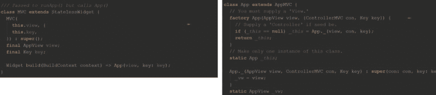](https://res.cloudinary.com/practicaldev/image/fetch/s--3ma0rpgp--/c_limit%2Cf_auto%2Cfl_progressive%2Cq_auto%2Cw_880/https://cdn-images-1.medium.com/max/1024/1%2AbWuCIE0p86V5wLdwxLzXUQ.png) 

<figcaption>[类 MVC](https://github.com/AndriousSolutions/mvc_application/blob/896f101785a67edad31d8ef1115a341449bcff8f/lib/mvc.dart#L53) 和[类 App](https://github.com/AndriousSolutions/mvc_application/blob/896f101785a67edad31d8ef1115a341449bcff8f/lib/src/controller/app.dart#L121)</figcaption>

</figure>

结果是 MVC 类将简单地实例化 App 类。但是，请注意，当实例化类 App 时，ControllerMVC 类型的第二个参数 con 在类 MVC 中被完全忽略。

顺便说一下，看看 MVC 这个类，你很容易看到 App 这个类是在函数 **build()** 中实例化的。当然，这告诉你 App 类是某种类型的小部件。然而，这是合理的，因为类 App 也可以直接传递给函数 **runApp()** 。

### 选项！选项！你有选择！

正如您在下面的截图中看到的，这个特定的示例应用程序为“应用程序视图”提供了三个选项。在大多数情况下，这三个选项是最常用的。然而，正如你在下面的另一个类截图 ViewMVC 中看到的，至少有 23 个选项可供你选择。当你熟悉这个框架时，你会发现所有这些选项都与应用程序的总体行为和外观有关。

<figure>[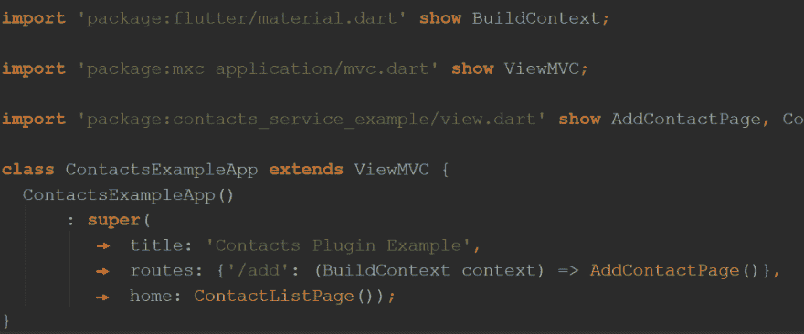](https://github.com/Andrious/contacts_androidx_example/blob/14966d8df7909e8994dc9d9bfeac7bfeb668e47e/lib/src/view/ContractsExampleApp.dart#L24) 

<figcaption>[类联系人 Github 上的 sample app](https://github.com/Andrious/contacts_androidx_example/blob/14966d8df7909e8994dc9d9bfeac7bfeb668e47e/lib/src/view/ContractsExampleApp.dart#L24)</figcaption>

</figure>

### 跟随你的观点

让我们在这一点上进行更深入的探讨，以便更好地理解这个 MVC 框架。从一开始，在 main.dart 文件中，我们再次看到“应用视图”类 ContactsExampleApp 被实例化并传递到框架中。

<figure>[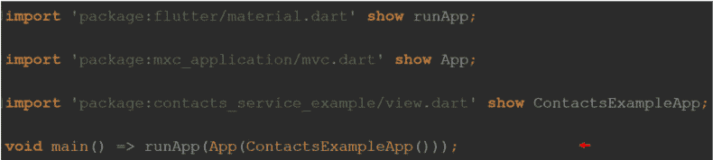](https://github.com/Andrious/contacts_androidx_example/blob/14966d8df7909e8994dc9d9bfeac7bfeb668e47e/lib/main.dart)

<figcaption>[main . dart on Github](https://github.com/Andrious/contacts_androidx_example/blob/14966d8df7909e8994dc9d9bfeac7bfeb668e47e/lib/main.dart)</figcaption>

</figure>

从那里，我们到达类，应用程序。在那里，框架执行许多准备启动的任务。仔细观察，您会发现这些东西都是通过调用字面上叫做 **init()** 的函数来初始化的。

<figure>[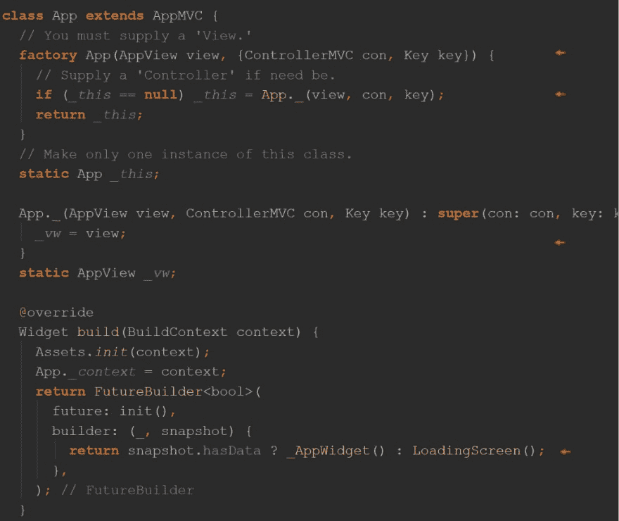](https://github.com/AndriousSolutions/mvc_application/blob/896f101785a67edad31d8ef1115a341449bcff8f/lib/src/controller/app.dart#L121)

<figcaption>[Github 上的类 App](https://github.com/AndriousSolutions/mvc_application/blob/896f101785a67edad31d8ef1115a341449bcff8f/lib/src/controller/app.dart#L121)</figcaption>

</figure>

这里用了一个 **FutureBuilder()** 。在一切都已初始化并准备就绪之前，会显示一个“加载屏幕”(在屏幕中间旋转的圆形图案)。然而，当有数据时，应用程序就准备好了，然后小部件类 _AppWidget 被实例化。

### 其贵之态

现在进入这个小部件类 _AppWidget，我们看到它的类型是 StatefulWidget，事实上，我们的“应用程序视图”显然是一个状态对象。它由 **createState()** 函数返回。下面列出的是 AppView 类。

<figure>[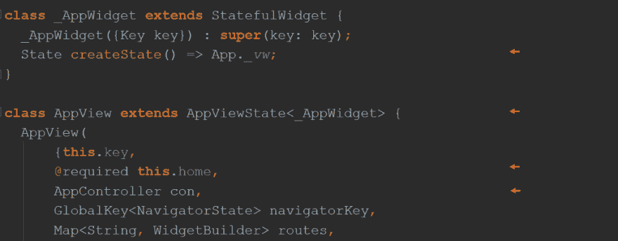](https://github.com/AndriousSolutions/mvc_application/blob/896f101785a67edad31d8ef1115a341449bcff8f/lib/src/controller/app.dart#L365)

<figcaption>[Github 上的类 AppView](https://github.com/AndriousSolutions/mvc_application/blob/896f101785a67edad31d8ef1115a341449bcff8f/lib/src/controller/app.dart#L365)</figcaption>

</figure>

### 查看材料

在 AppView 类中，我们看到 **build()** 函数返回 MaterialApp 类。事实上，正是在这个类中，前面提到的 23 个选项中的许多被传递到 MaterialApp 对象中。

<figure>[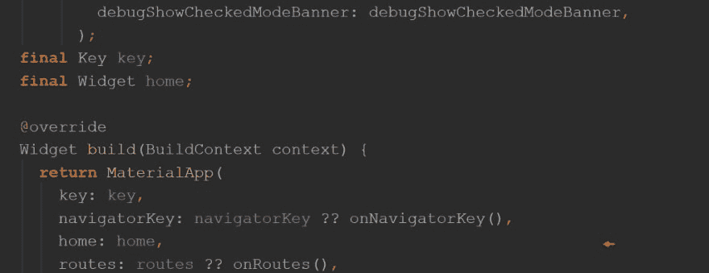](https://github.com/AndriousSolutions/mvc_application/blob/896f101785a67edad31d8ef1115a341449bcff8f/lib/src/controller/app.dart#L425)

<figcaption>[AppView 的 build()函数中的类 material app](https://github.com/AndriousSolutions/mvc_application/blob/896f101785a67edad31d8ef1115a341449bcff8f/lib/src/controller/app.dart#L425)</figcaption>

</figure>

### 一切都来了

请注意，如果您进一步深入这个“应用程序视图”的类层次结构，并到达它的父类 AppViewState，您会看到它又扩展了基本的 MVC 状态类 StateMVC。看看事情是如何回到 MVC 架构中使用的三个组件的？

<figure>

<figcaption>[Github 中的 AppViewState 类](https://github.com/AndriousSolutions/mvc_application/blob/896f101785a67edad31d8ef1115a341449bcff8f/lib/src/controller/app.dart#L492)</figcaption>

</figure>

### 返回 MVC 为 App 控制器

请注意，回到类 AppView(见下文)，传递给它的“控制器”不是 ControllerMVC 类型，而是 AppController 类型。合情合理。它毕竟是“应用程序控制器”。让我们看看这会把我们带到哪里。

<figure>[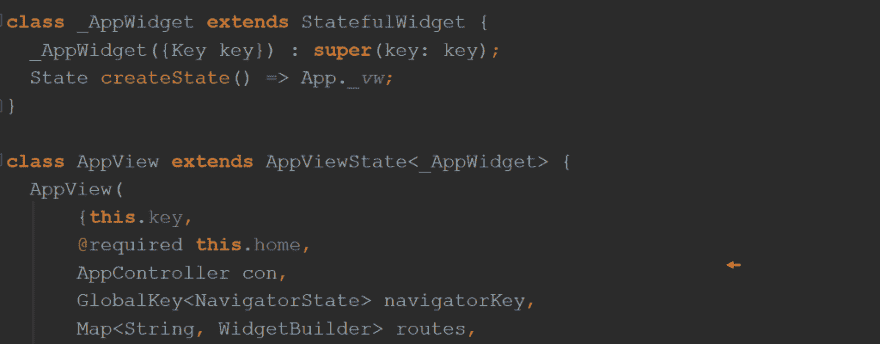](https://github.com/AndriousSolutions/mvc_application/blob/896f101785a67edad31d8ef1115a341449bcff8f/lib/src/controller/app.dart#L365)

<figcaption>[Github 上的类 AppView](https://github.com/AndriousSolutions/mvc_application/blob/896f101785a67edad31d8ef1115a341449bcff8f/lib/src/controller/app.dart#L365)</figcaption>

</figure>

### App 控制器准备 App

正如您已经猜到的，AppController 类扩展了 ControllerMVC 类。它的长度很短，但却很重要。下面是 AppController 类的屏幕截图，您可以看到它负责启动时准备典型移动应用程序所涉及的许多常见任务——其中许多任务位于其 **init()** 函数中。

<figure>[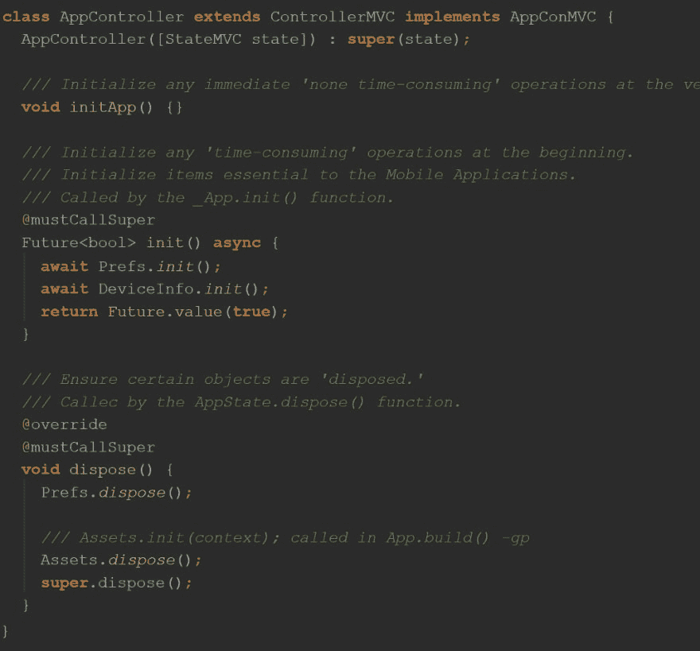](https://github.com/AndriousSolutions/mvc_application/blob/896f101785a67edad31d8ef1115a341449bcff8f/lib/src/controller/app.dart#L580)

<figcaption>[Github 上的类 app controller](https://github.com/AndriousSolutions/mvc_application/blob/896f101785a67edad31d8ef1115a341449bcff8f/lib/src/controller/app.dart#L580)</figcaption>

</figure>

它正在初始化 Prefs 库，负责存储和检索应用程序的首选项。它初始化 DeviceInfo 类。该类负责提供多达 32 个关于手机硬件和软件的独立信息，然后在必要时供应用程序本身使用。

### 清理完自身

在它的 **dispose()** 函数中，你可以看到当应用程序关闭和终止时,“应用程序控制器”也负责“清理”。

### 你的 App 内的 App

所以我们设置了应用程序，现在我们准备向用户显示“主页”屏幕。下面是示例应用程序的“应用程序视图”的屏幕截图，其中提供了三个常用选项。是应用中的应用。我们现在来看这个主屏幕，它有自己的 StatefulWidget，因此也有自己的 StateMVC 对象(视图)，自己的 ControllerMVC 对象(控制器)，甚至还有自己的模型。您会发现这里再次实现了 MVC 方法。

<figure>[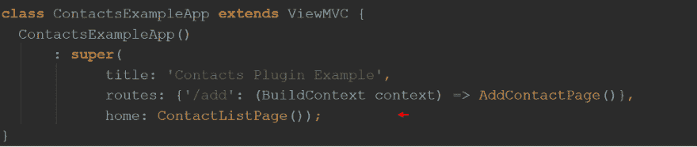](https://github.com/Andrious/contacts_androidx_example/blob/14966d8df7909e8994dc9d9bfeac7bfeb668e47e/lib/src/view/ContractsExampleApp.dart#L31) 

<figcaption>[类联系人 Github 上的 sample app](https://github.com/Andrious/contacts_androidx_example/blob/14966d8df7909e8994dc9d9bfeac7bfeb668e47e/lib/src/view/ContractsExampleApp.dart#L31)</figcaption>

</figure>

### 我们回家吧

所以，我们又来了。下面是一个屏幕截图，显示了小部件及其包含 **build()** 函数的状态对象——该示例应用程序的“视图”。开始状态对象的代码 _ContactListState 列出了大多数参与的玩家。有一个控制器没有想象力地命名为 Controller，有一个状态对象本身扩展 StateMVC，然后控制器被分配给那个状态对象。有了它，我们就可以上路了。接下来，应用程序的核心——**build()**函数。

<figure>[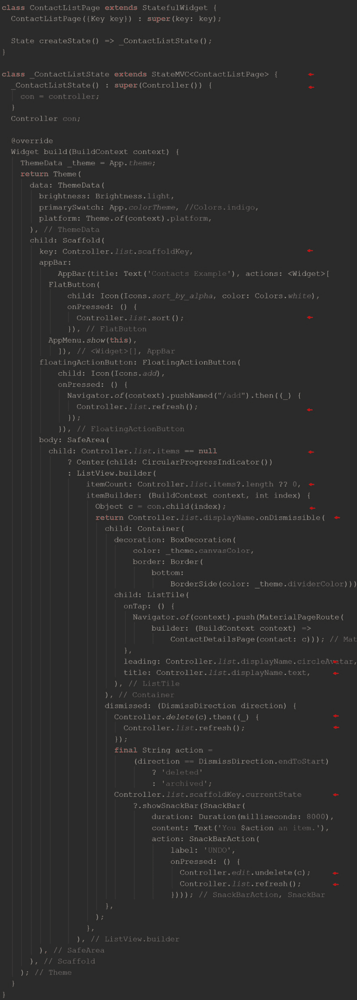](https://github.com/Andrious/contacts_androidx_example/blob/14966d8df7909e8994dc9d9bfeac7bfeb668e47e/lib/src/view/ContactListPage.dart#L66)

<figcaption>[Github 上的 class ContractListPage](https://github.com/Andrious/contacts_androidx_example/blob/14966d8df7909e8994dc9d9bfeac7bfeb668e47e/lib/src/view/ContactListPage.dart#L66)</figcaption>

</figure>

您可以看到 **build()** 函数典型地穿插了对控制器的引用——用红色箭头突出显示。在这些地方,“控制器”向“视图”提供数据或响应事件，或者在某些情况下，插入显示数据和/或响应事件的附加部件。干净利落。

### 参考控制

请注意，一旦状态对象接受了对控制器的引用，您就可以选择检索它。在 MVC 状态对象中有一个名为 controller 的 ControllerMVC 类型的字段实例。下面，它被分配给 Controller 类型的变量 con。这样，您就真正引用了具有自己的字段属性和功能的控制器。很好。

<figure>[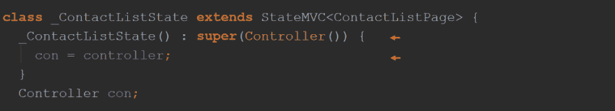](https://github.com/Andrious/contacts_androidx_example/blob/14966d8df7909e8994dc9d9bfeac7bfeb668e47e/lib/src/view/ContactListPage.dart#L72)

<figcaption>[class _ contact liststate on Github](https://github.com/Andrious/contacts_androidx_example/blob/14966d8df7909e8994dc9d9bfeac7bfeb668e47e/lib/src/view/ContactListPage.dart#L72)</figcaption>

</figure>

注意，在这个示例应用程序中真的不需要它，因为正如您所推断的，这个控制器类通过静态字段和静态函数来呈现它的所有数据和小部件，但是同样，您有这个选项。例如，查看下面的屏幕截图，您会看到在一个地方使用了该引用，以列出该示例应用程序的联系人:

<figure>[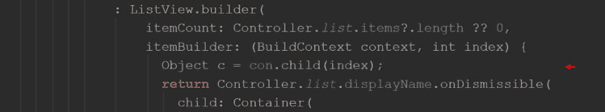](https://github.com/Andrious/contacts_androidx_example/blob/14966d8df7909e8994dc9d9bfeac7bfeb668e47e/lib/src/view/ContactListPage.dart#L107)

<figcaption>T5】listview . builder()in _ contact liststate on Github</figcaption>

</figure>

### 这一切到底从哪里开始？

以下是该框架的“应用状态”。它是一个 MVC 状态对象，当这个框架启动时，它就是启动过程开始的地方。所以你可以看到，像一个标准的 Flutter 应用程序一样，初始化过程从一个状态对象的 **initState()** 函数开始。

<figure>[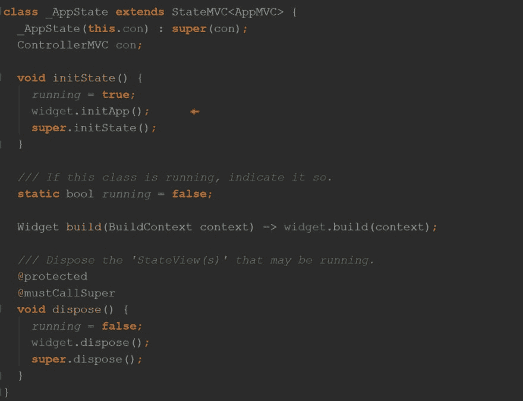](https://github.com/AndriousSolutions/mvc_pattern/blob/f27136c65d9bc1ec0786a78a3fb249f7cd1befc6/lib/mvc_pattern.dart#L1173)

<figcaption>[class _ AppState on Github](https://github.com/AndriousSolutions/mvc_pattern/blob/f27136c65d9bc1ec0786a78a3fb249f7cd1befc6/lib/mvc_pattern.dart#L1173)</figcaption>

</figure>

如果我们进入函数调用， **widget.initApp()** ，我们到达类 App。下面，你可以看到类的第一部分，App，它是刚刚被调用的 **initApp()** 函数。你可以看到一个“应用视图”对象有字段属性 con。如果你猜这是“应用控制器”，那你就猜对了。

<figure>[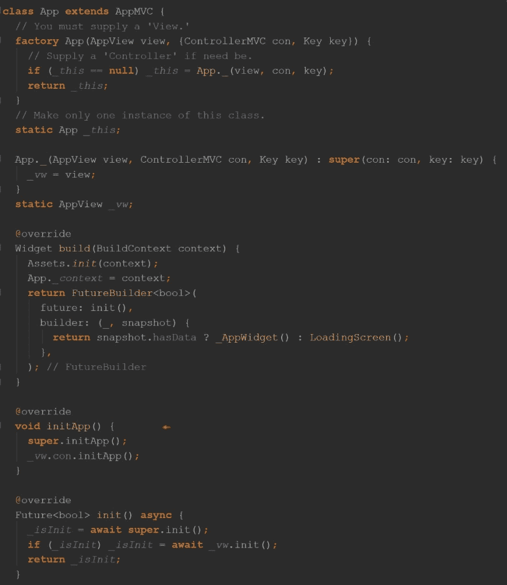](https://github.com/AndriousSolutions/mvc_application/blob/896f101785a67edad31d8ef1115a341449bcff8f/lib/src/controller/app.dart#L121)

<figcaption>[Github 上的 AppMVC 类](https://github.com/AndriousSolutions/mvc_application/blob/896f101785a67edad31d8ef1115a341449bcff8f/lib/src/controller/app.dart#L121)</figcaption>

</figure>

### 但首先是一个 App AppController

但是，请注意，首先调用父类的 **initApp()** 函数。父类是 AppMVC 类。在相应的 **initApp()** 函数中，该类的开头列在 displayin 下面。如果你记得的话，它也有自己的控制器。main.dart 文件中被 MVC 类忽略的那个。

但是，如果您在 main.dart 文件中使用 App 类，您可以选择传入另一个控制器。一个是初始化框架时实际运行的第一个控制器。出于什么目的？为什么，出于任何目的，你都是根据你所处的环境来做梦的。

<figure>[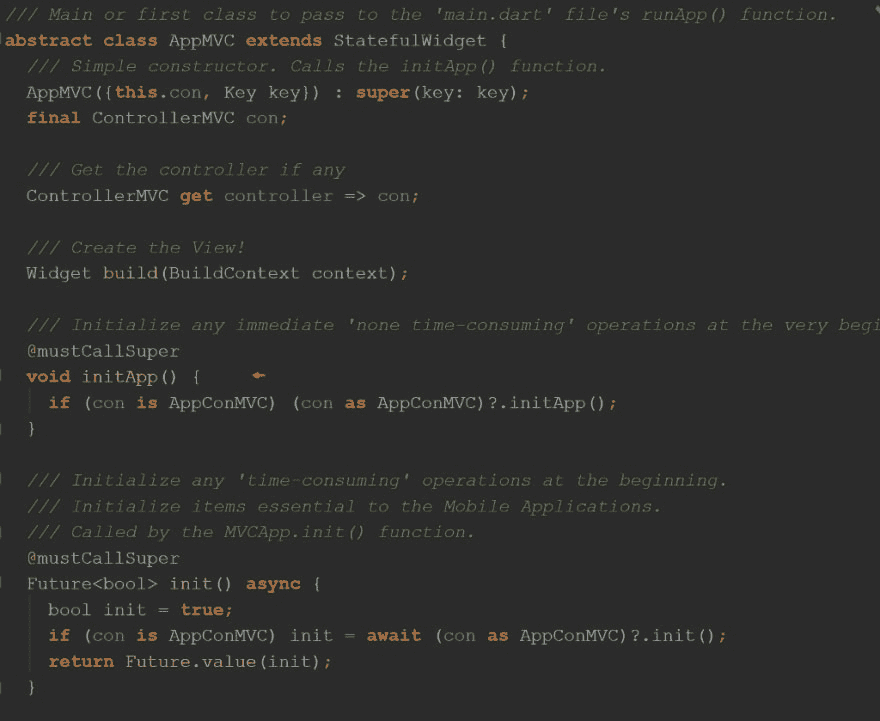](https://github.com/AndriousSolutions/mvc_pattern/blob/f27136c65d9bc1ec0786a78a3fb249f7cd1befc6/lib/mvc_pattern.dart#L1084)

<figcaption>[Github 上的 AppMVC 类](https://github.com/AndriousSolutions/mvc_pattern/blob/f27136c65d9bc1ec0786a78a3fb249f7cd1befc6/lib/mvc_pattern.dart#L1084)</figcaption>

</figure>

### 带初始化的控制器

AppController 类实现 AppConMVC 类。这将安装两个“初始化”函数， **initApp()** 和 **init()** 。如下所示， **init()** 函数在启动过程中被充分利用，调用了类、Prefs 和 DeviceInfo。但是，上面列出的类 AppMVC 的**initApp() *函数中调用的函数 i* *nitApp()* *为空。这是供开发人员在需要初始化“小型同步”操作时使用的。*

<figure>[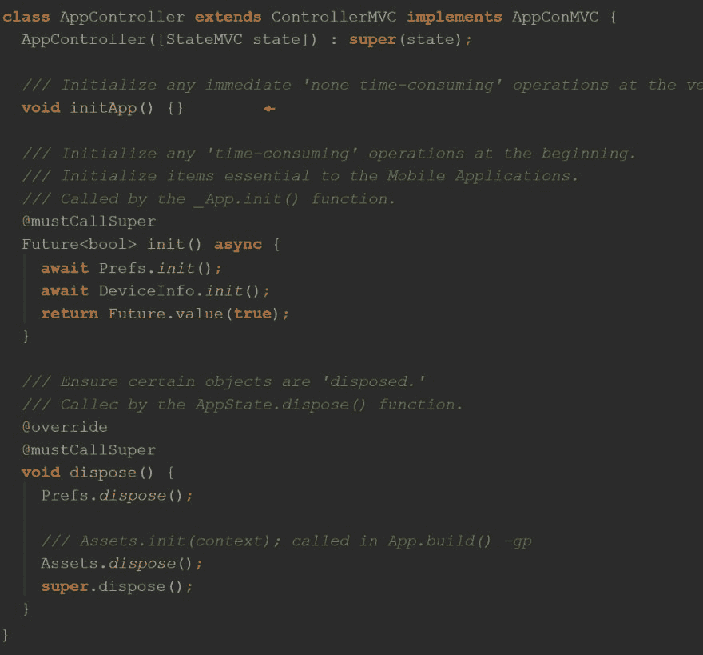](https://github.com/AndriousSolutions/mvc_application/blob/896f101785a67edad31d8ef1115a341449bcff8f/lib/src/controller/app.dart#L580)

<figcaption>[app controller on Github](https://github.com/AndriousSolutions/mvc_application/blob/896f101785a67edad31d8ef1115a341449bcff8f/lib/src/controller/app.dart#L580)</figcaption>

</figure>

### 初始化未来

所以从状态对象的 **initState()** 函数开始调用 AppController 的 **initApp()** 函数。其中，init()函数及其“Prefs”和“DeviceInfo”被调用。在那个**里面叫**，记得吗？

见下图，在类 App 中，它的 **build()** 函数返回一个 **FutureBuilder** 。那个 **FutureBuilder** 有一个命名参数，叫做 future。惊喜惊喜。那里的函数 init()必须返回一个“Future”布尔值。换句话说，在所有东西初始化之前，没有快照数据可用，只显示加载屏幕。清楚了吗？

<figure>[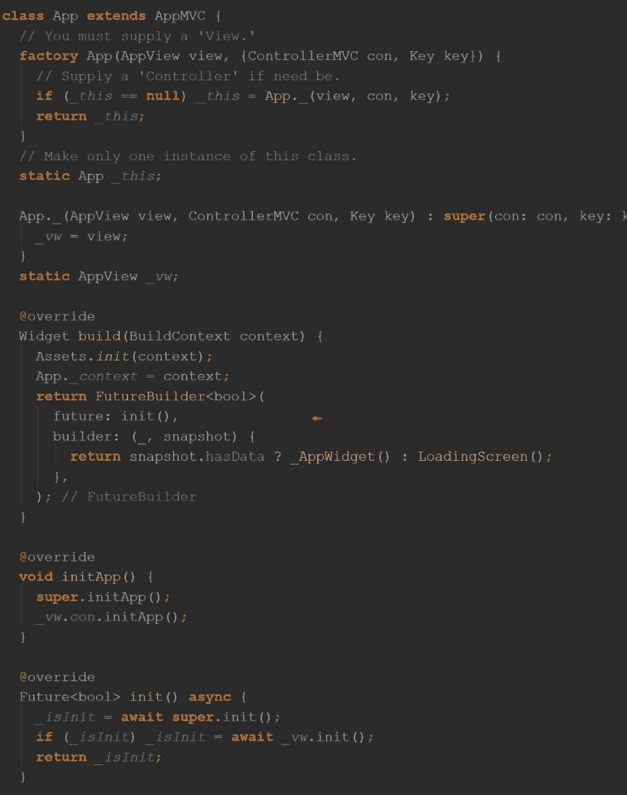](https://github.com/AndriousSolutions/mvc_application/blob/896f101785a67edad31d8ef1115a341449bcff8f/lib/src/controller/app.dart#L121)

<figcaption>[Github 上的类 App](https://github.com/AndriousSolutions/mvc_application/blob/896f101785a67edad31d8ef1115a341449bcff8f/lib/src/controller/app.dart#L121)</figcaption>

</figure>

你可以从父类调用相应的 **init()** 上面的 init()，然后(当它准备好的时候)调用‘应用视图’自己的 **init()** 函数。看下面，你会看到什么涉及到'应用程序视图的' **init()** 函数。

<figure>[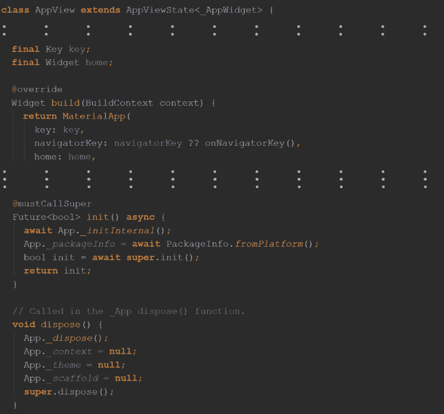](https://github.com/AndriousSolutions/mvc_application/blob/896f101785a67edad31d8ef1115a341449bcff8f/lib/src/controller/app.dart#L365)

<figcaption>[Github 上的类 AppView](https://github.com/AndriousSolutions/mvc_application/blob/896f101785a67edad31d8ef1115a341449bcff8f/lib/src/controller/app.dart#L365)</figcaption>

</figure>

具有讽刺意味的是，它对类 App 本身进行了两次静态函数调用。让我们看看函数 _initInternal()对这个框架做了什么。

<figure>[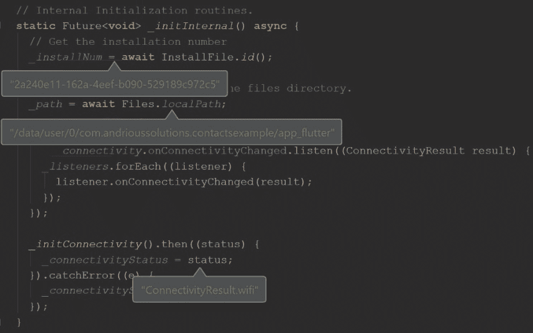](https://github.com/AndriousSolutions/mvc_application/blob/896f101785a67edad31d8ef1115a341449bcff8f/lib/src/controller/app.dart#L321)

<figcaption>[_ initial()在 Github 上的类 App](https://github.com/AndriousSolutions/mvc_application/blob/896f101785a67edad31d8ef1115a341449bcff8f/lib/src/controller/app.dart#L321)</figcaption>

</figure>

同样，这一切的想法是做好准备。它提供了关于手机的所有必要信息，特别是关于这个应用程序本身的安装。在 **_initInternal()** 函数中，我们获取“安装号”。这是一个唯一识别特定应用程序安装的编号。开发人员可以将该值记录在他们的远程数据库中，用于一些营销活动或其他邪恶的计划。

它进一步检索应用程序在手机上的数据库位置，并确定手机当前如何连接到互联网。有什么用——只有需要这些信息的开发者才知道。关键是它是给他们用的。

在 **_initInternal()** 函数之后，有另一个调用来获得进一步的“平台”信息，这些信息将很容易被开发者获得。这是下一个调用，对父类的调用，我现在要展示给你们看。它将我们带到 AppViewState 类及其 **init()** 函数。在那里，我们看到它从接受它的控制器中调用了 **init()** 函数

<figure>[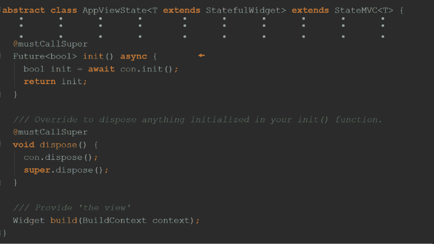](https://github.com/AndriousSolutions/mvc_application/blob/896f101785a67edad31d8ef1115a341449bcff8f/lib/src/controller/app.dart#L492)

<figcaption>[Github 上的类 AppViewState](https://github.com/AndriousSolutions/mvc_application/blob/896f101785a67edad31d8ef1115a341449bcff8f/lib/src/controller/app.dart#L492)</figcaption>

</figure>

### 用一些工具开机！

使用这个库包还会让你拥有一些工具。

<figure> 

<figcaption>[储存并读取你的 App 的喜好](https://medium.com/@greg.perry/store-and-read-your-apps-preferences-4139e836cfe9)</figcaption>

</figure>

<figure> 

<figcaption>[旋舞 SQLite 数据库](https://medium.com/@greg.perry/flutter-and-sqlite-f72878bc5859)</figcaption>

</figure>

### 在你的 App 里添加广告！

在撰写本文时，还有另一个令人不安的软件包 Ads。这个非常有用的软件包可以让你轻松地将广告整合到你自己的 Flutter 应用程序中。请注意，你必须使用谷歌广告，并获得一个“AdMob id”，但随后你就拥有了自己的应用赚钱的方式！

<figure> 

<figcaption>[广告扑包](https://pub.dartlang.org/packages/ads)</figcaption>

</figure>

### 属于自己的一类

还记得 MVC 类如何实例化 App 类，但是完全忽略了 ControllerMVC 类型的第二个参数 con。见下文。因此，如果你愿意，你可以在 main.dart 文件中使用 App 类来提供你自己的“应用控制器”。否则，使用 MVC 类，就会提供一个“默认应用控制器”。在大多数情况下，你会使用后者，但你有选择权。你知道我有多喜欢选择。

<figure> 

<figcaption>[类 MVC](https://github.com/AndriousSolutions/mvc_application/blob/896f101785a67edad31d8ef1115a341449bcff8f/lib/mvc.dart#L53) 和[类 App](https://github.com/AndriousSolutions/mvc_application/blob/896f101785a67edad31d8ef1115a341449bcff8f/lib/src/controller/app.dart#L121)</figcaption>

</figure>

### 现在的 App 控制器如何？

那么如何在 main.dart 文件中使用 MVC 类来实现“默认应用控制器”呢？嗯，没有。它是通过使用 ViewMVC 类来实现的。如您所见，ContactsExampleApp 类扩展了 ViewMVC 类。但是等等？AppView 这个类怎么了？？

<figure>[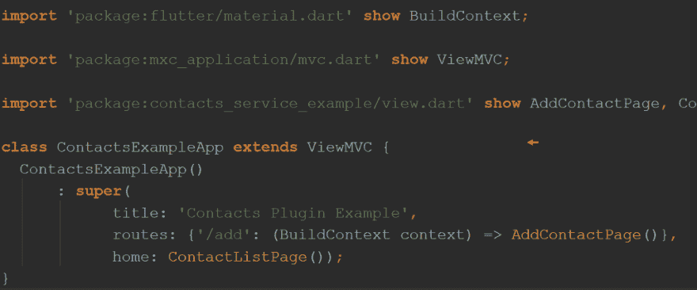](https://github.com/Andrious/contacts_androidx_example/blob/14966d8df7909e8994dc9d9bfeac7bfeb668e47e/lib/src/view/ContractsExampleApp.dart#L31) 

<figcaption>[类联系人 Github 上的 sample app](https://github.com/Andrious/contacts_androidx_example/blob/14966d8df7909e8994dc9d9bfeac7bfeb668e47e/lib/src/view/ContractsExampleApp.dart#L31)</figcaption>

</figure>

下面是类，ViewMVC。正如你很容易看到的，反过来，扩展了 AppView 类。MVC 应用程序的视图，特别是这个示例应用程序的视图，是类 ContactsExampleApp 的父类。正如你在下面看到的，对于这个类，如果没有指定“App Controller ”,默认情况下会提供一个。

<figure>[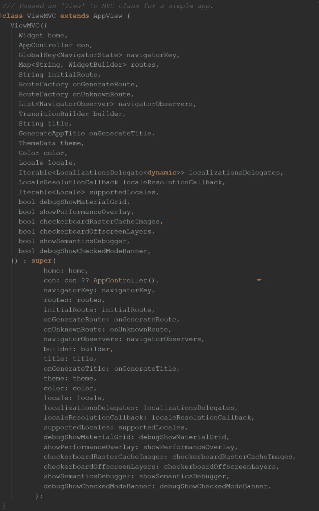](https://github.com/AndriousSolutions/mvc_application/blob/896f101785a67edad31d8ef1115a341449bcff8f/lib/mvc.dart#L97)

<figcaption>[Github 上的类 AppView](https://github.com/AndriousSolutions/mvc_application/blob/896f101785a67edad31d8ef1115a341449bcff8f/lib/mvc.dart#L97)</figcaption>

</figure>

### 准备好自己的控制器

所以，回到用 MVC 框架启动应用程序的两种方式。如果在为用户启动应用程序之前，需要为您的特定应用程序做一些额外的准备工作，有一种方法可以做到这一点。您只需通过扩展 App Controller 类来提供您自己的“应用程序控制器”,覆盖 **initApp()** 函数或 **init()** 函数，这取决于这些是同步操作还是异步操作，然后您就可以开始工作了。

作为一个例子，下面是我自己的一个项目中的一个片段，在这个项目中，我要求制作一个“应用控制器”并将其传递到 MVC 框架中。你可以看到，在这个应用程序中，在应用程序呈现给用户之前，需要执行额外的操作。为此，我使用了函数 **init()** 和标准的状态对象函数 **initState()** 。

<figure>[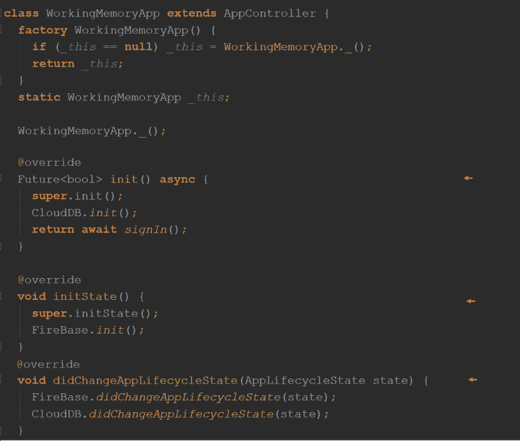](https://github.com/Andrious/workingmemory/blob/0b8e8c81f3c27c1e1f0aea548c774ddb8f6ed20d/lib/src/controller/WorkingMemoryApp.dart)

<figcaption>[Github 上的类 WorkingMemoryApp](https://github.com/Andrious/workingmemory/blob/0b8e8c81f3c27c1e1f0aea548c774ddb8f6ed20d/lib/src/controller/WorkingMemoryApp.dart)</figcaption>

</figure>

### 注意生命周期

如您所见，我进一步利用了应用程序控制器的能力来响应小部件中常见的生命周期事件。我通过使用函数**didchangeapplifecyclsate()**来实现这一点。

### 等待吧

我暂时就此结束。同样，这个版本只针对特定的观众。那些 Android 开发者仍然使用低于 28 的 API 等级。通用 MVC 框架即将到来。碰巧的是，这个版本可能会在一段时间内支持拉请求，如果有需要的话，但我期待的是下一个版本，mvc_application。

干杯。