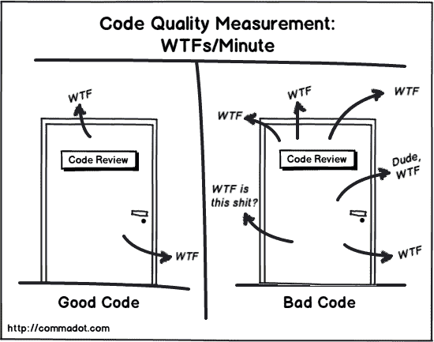

# 一些让我编码更好的技巧。

> 原文：<https://dev.to/lleonardogr/some-tips-that-made-me-code-better-4n67>

作为一名程序员，有一段时间我很难找到一种更好的编码方法，以使我的代码运行良好。就像一个艺术家希望他的艺术被其他人理解和欣赏一样，我们也希望其他程序员理解我的工作，尤其是当我和那些必须使用我的代码来创建新功能的人一起工作时。

### 缺乏标准

我们没有如何编码的手册，此外，每种编程语言都有其特点和建议来构建一个项目，从它的结构到它的编码，所以我们没有很多编码标准，至少在那些年里，我从来没有见过“如何编写系统的哲学”，这变成了我们随着时间推移的经验的责任，但由于每种语言在一生中有不同的经历，我们可以有有效的编码，它们各有优缺点，但又非常不同。

出于这些原因，我决定列出一些让我改进如何创建代码的情况...

## 1。在 GitHub 上查看开源项目

看看伟大的项目是如何完成的，程序员是如何在其中编码的。有些人和理论认为，在一项运动或某项技能上提高自己的一种方法是观察一个在该领域或运动中非常优秀的专业人士如何行动，在编程中几乎是同样的事情。GitHub 在这方面给了我很大帮助，我去找了一些。NET 项目有一个强大的社区，并且是最新的。查看社区项目帮助了我:

*   理解**设计模式**的抽象概念，如实体、CQRS、DDD、TDD、抽象工厂、单体。这些概念甚至帮助我们制作更好、更有凝聚力的代码。
*   帮助我找到了非常通用的现成功能，如发送电子邮件、短信、检索密码。
*   在面向对象的情况下，理解语言范式的重要特征
*   了解我使用的语言资源，我只能通过阅读所有的文档才能找到这些资源。
*   使用 Ubiqua 语言帮助我理解，我强烈推荐这种语言

## 2。创建你的代码，让外行人也能理解。

> The appropriate use of comments is to compensate for our failure to express ourselves through the code
> 
> -罗伯特·塞西尔·马丁，干净的代码

有编码的方式和方法，但要说编码的方式有好有坏。我总是试图想出一些规则来防止别人看着我的代码想“这他妈的是什么，我什么都不懂”。

难怪**代码审查**在编程社区中是一种非常普遍的技术，为了提高你的代码质量，我试着遵循一些规则:

*   用“CamelCase”写我的代码，还有其他选项，但这是我最喜欢的。
*   在我的代码中尽量少用 Ctrl + C / Ctrl + v
*   让我的方法最多嵌套 3 ~ 4 个 if / for / while
*   给每条语句加一条注释，说明我在做什么和做什么，(使用 **Jupyter 笔记本**的项目，很容易理解这一点，GitHub 中有几个)
*   拥有最少的文档，甚至是自述文件

## 3.如果您不知道如何开始创建更好的编码方式，请下载一个程序来帮您完成。

插件市场中有几个选项可以审查您的代码，并为编码提出更好的解决方案，例如:

*   [重磨器](https://www.jetbrains.com/resharper/)
*   [CodeMaid](http://www.codemaid.net/)
*   [电码速](https://www.devexpress.com/products/coderush/)
*   [自由格式器](https://www.freeformatter.com/html-validator.html)
*   [谷歌 Chrome 灯塔](https://developers.google.com/web/tools/lighthouse/)
*   [SQL 分析器](https://www.devart.com/dbforge/sql/studio/sql-analyzer.html)

还有其他选项可以帮助您直接通过 IDE 编写代码，因此追求工具和语言特性可以帮助我们创建更好的代码。

**【结论】:**开发好的编码方式还有其他几种方法，毕竟如果你花了 x 的时间来编写代码，而没有好好思考，有人会花 2x、3x、4x 的时间。..理解你的代码并在必要时修改它，所以好好保护你的代码，你会成为一名优秀的程序员。对你来说，是什么让你编码更好？：