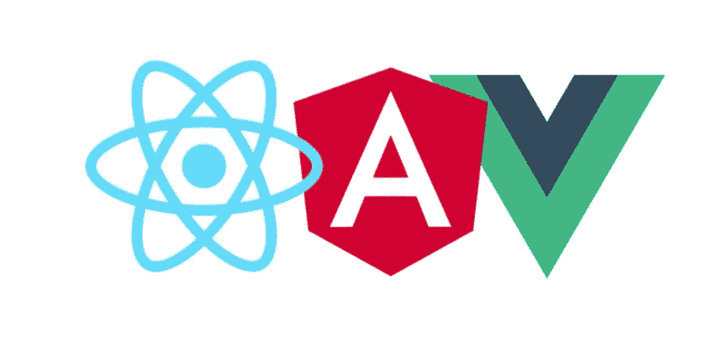

# 我如何学习任何前端框架

> 原文：<https://dev.to/islamuad/how-i-learn-any-front-end-framework-29a2>

# 我如何学习任何前端框架

你决定学习 x 框架，你打开 youtube 或任何你更喜欢的搜索引擎来搜索任何与这个“x”框架相关的教程，突然在 30 个尤敏尖叫“尤里卡”之后，我认为这个框架与我以前的框架相似，你是对的，你不必从头开始学习，在这篇文章中，我将向你展示我学习前端框架的经验，以及这些框架是如何相互封闭的。

每次你决定学习一个前端框架，你一定会反复听到那些
术语(组件、路由和管理状态)
让我们来分解一下。

#### 组件

*   任何框架构建组件的核心都是可重用的。

*   大多数现代框架使用 **JSX** 或 **HTML** 模板引擎，

*   所有的框架都提供了**生命周期挂钩**,这些挂钩提供了组件生命周期时刻的可见性，比如创建、渲染、销毁，以及在它们发生时采取行动的能力。

#### 路由

*   现在大多数现代框架都提供 API 来创建和管理客户端路由。

#### 管理状态

*   所有的 freameworks 都是通过一种方式构建的，组件可以在内部管理它们的状态，而不需要任何外部库或工具。

*   许多框架都是以组件共享相同状态的方式构建的，例如( **Angular** 有一个 **[Service](https://angular.io/guide/architecture-services)** ， **React** 现在有了 **[Context API](https://reactjs.org/docs/context.html)** )。

*   有时候框架解决方案是不够的，特别是当你的状态很大的时候，所以你可以考虑使用像 **[redux](https://redux.js.org/)** 这样的库。

学完基础知识后，让我们动手**建造项目**。

* * *

### 建筑工程

为了理解某些方面，你需要很好地了解它，这种知识不仅仅来自于阅读书籍或观看视频课程，真正的测试来自于现实生活中的实际问题，在这篇文章中，我为你带来了一些涵盖你选择的任何前端框架的许多方面的项目的想法。

#### 备注:

*   本主题中列出的项目在难度上是渐进的，每个项目都增加了前一个项目的难度。
*   从最年轻到最全面的项目顺序。

* * *

### 1。找到&显示(克隆)

常用的第一个应用程序是使用公共 API 克隆任何已知网站，尝试构建一个简单的搜索栏，下拉列表包含来自端点 API 的结果，在显示之前检查返回的数据，如是否有图像要显示。

#### **端点 API 示例:**

*   [Github API](https://developer.github.com/v3/)
*   [OMDb API](http://www.omdbapi.com/)
*   [Spotify Web API](https://developer.spotify.com/web-api/)
*   [地下 API](https://www.wunderground.com/weather/api/)
*   [reddit API](https://www.reddit.com/dev/api/)

#### **你将学到什么:**

*   使用 HTTP 客户端向端点 API 发出请求。
*   例如，使用键盘事件监听器，一旦用户点击 enter 调用端点 API 来获取结果数据。
*   了解如何显示单个数据或一组数据。
*   用插值数据设计你的显示。
*   结构化你的展示。
*   主-详细信息:列出结果将结果中每个项目的链接添加到项目详细信息页面。
*   了解如何将数据从母版页传递到详细页。

* * *

### 2。授权应用程序

我在上一节中提到的一些端点 API 需要一些身份验证，因此在这一节中，请尝试添加或构建另一个具有登录/注册页面的应用程序，如果用户正在登录，请将他或她重定向到用户主页，并阻止访客用户进入需要用户登录的页面。

#### **你将学到什么:**

*   Route guard:有些页面只要求经过*认证的*用户。
*   如何发送和保存 JWT (JSON web token ),以发出需要认证使用的请求。

* * *

### 3。CRUD 应用程序

创建、读取、更新和删除应用程序是此部分中最受欢迎的前端应用程序。您可以使用本地存储或 Firebase 等在线
服务离线构建此应用程序，甚至可以将其与后端框架集成。

#### **项目实例:**

*   书签 app。
*   待办 App。

#### **你将学到什么:**

*   验证用户在表单中的输入，如果用户插入了错误的数据，则显示错误。
*   如何让 put，delete，post 和 get HTTP 请求？
*   将您的应用与任何后端框架集成。
*   尝试为您的后端框架添加身份验证功能。

* * *

### 4。聊天应用

在前面的章节中，所有对后端的请求都是单向的，在这里管理你的应用程序状态没有问题，但是在这一节中，我们尝试使用 web sockets 构建聊天应用程序，它是双向的，我们不能等待响应来更新视图，我们需要另一种方式来管理我们的客户端状态。

#### **你将学到什么:**

*   了解如何使用管理状态解决方案，如 react 的 redux、angular 2+的 ngrx 或 vuejs 的 vuex，以及如何将其与您的客户端应用程序集成。
*   让你的应用更具反应性(监听网络状态，用新消息通知用户)。

* * *