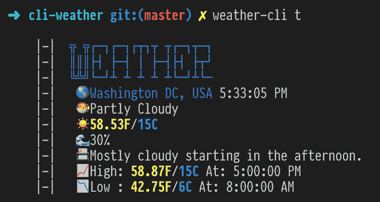
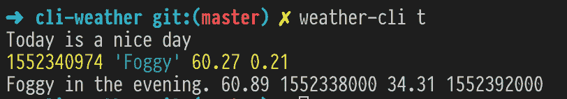

# 构建天气预报 CLI 工具第 2 部分

> 原文：<https://dev.to/vaidotas/building-weather-forecast-cli-tool-part-2-2288>

# 建筑天气预报 CLI 工具第二部分

这是构建 CLI 工具系列的第二部分，将详细介绍如何从命令行调用 DarkSky API 并打印出结果，然后将我们的 CLI 发布到 npm。

只是回顾一下第 1 部分的内容——我们将制作一些看起来和这张图片相似的东西:

[](https://res.cloudinary.com/practicaldev/image/fetch/s--JgGawwp---/c_limit%2Cf_auto%2Cfl_progressive%2Cq_auto%2Cw_880/https://thepracticaldev.s3.amazonaws.com/i/89fopmm9lehlmql0rmem.png)

## A 部分-调用 API 并检索信息

让我们从主条目文件
中调用今天的天气预报

```
// index.ts
program
  .command("today")
  .alias("t")
  .description("Show weather information for today")
  .action(() => {
    weatherActions.today();
  }); 
```

我们的天气 API 逻辑我们将位于一个单独的文件- `weatherActions.ts`中，在这里我们将调用 DarkSky API，将数据标准化并打印出来。调用 API 将通过`axios`包完成，打印到控制台将通过`chalk`完成，请确保在继续之前安装这些。

```
//weatherActions.ts
import chalk from "chalk";
import axios from "axios";
const Configstore = require("configstore");
const log = console.log;
const conf = new Configstore("weather-cli");

exports.today = function() {
  const DARKSKY_API = conf.get("DARKSKYAPIKEY");
  let URL = `https://api.darksky.net/forecast/${DARKSKY_API}/38.889102,-77.050637?exclude=minutely`;
  axios.get(URL).then(response => {
    if (response.status !== 200) {
      return new Error(`DarkSky API error ${response.status}`);
    }
    //deconstruct current weather data
    const {
      time: currentTime,
      summary: currentSummary,
      temperature: currentTemperature,
      humidity: currentHumidity
    } = response.data.currently;

    //deconstruct today's weather data
    const {
      summary: dailySummary,
      temperatureHigh: dailyTempHigh,
      temperatureHighTime: dailyTempHighTime,
      temperatureLow: dailyTempLow,
      apparentTemperatureLowTime: dailyTempLowTime
    } = response.data.daily.data[0];
  });
}; 
```

好了，让我们解开上面文件中的内容。我们正在导入前面提到的依赖项，以及我们在[第 1 部分](https://dev.to/vaidotas/building-weather-forecast-cli-tool-part-1-2mdj)中设置的 API 密匙。
`configstore`有一个简便的方法`.get`来检索你之前设置的任何键。我们将使用它来调用我们的 API 端点。你会注意到，我把经度和纬度硬编码到我的位置，我们可以实现城市搜索作为未来的目标，但现在你可以只输入自己的坐标。

Axios 正常工作，在我们检查响应状态为`200`(意味着一切正常)之后，我们继续从响应有效负载中提取相关数据字段。我们正在使用 ES6 的对象析构和[重命名功能](https://developer.mozilla.org/en-US/docs/Web/JavaScript/Reference/Operators/Destructuring_assignment)。

现在如果我们简单地`console.log`说明收到的信息，结果不会很大，你可能会看到这样的东西:

[](https://res.cloudinary.com/practicaldev/image/fetch/s--EbNTqm73--/c_limit%2Cf_auto%2Cfl_progressive%2Cq_auto%2Cw_880/https://thepracticaldev.s3.amazonaws.com/i/vuzs1xmocadgzmlq2nlo.png)

我们显然需要做一些时间转换，温度调整，以包括摄氏度和华氏度，基本上使它更有吸引力。

## B 部分-请漂亮打印

首先，让我们把这些数据变得可以看得见。

1.  为了方便显示 C 和 f，温度需要转换为摄氏度。
2.  湿度需要用百分比表示
3.  时间指示需要以人类可读的形式显示

```
const currentTemperatureC: string = String(Math.round(((currentTemperature - 32) * 5) / 9));
const dailyTempHighC: string = String(Math.round(((dailyTempHigh - 32) * 5) / 9));
const dailyTempLowC: string = String(Math.round(((dailyTempLow - 32) * 5) / 9));
const currentTimeConverted: string = new Date(currentTime * 1000).toLocaleTimeString();
const humidityPercent: string = String(Math.round(currentHumidity * 100));
const highTime: string = new Date(dailyTempHighTime * 1000).toLocaleTimeString();
const lowTime: string = new Date(dailyTempLowTime * 1000).toLocaleTimeString(); 
```

我们正在用一种简便的`Math.round()`方法进行一些转换和舍入结果。时间转换是通过内置的`new Date()`对象完成的。您可能会注意到变量声明`const currentTemperatureC: string = ...`旁边有些奇怪的东西。那些是打字稿类型。我们指出特定赋值的结果应该总是字符串。在这一点上，这似乎是微不足道的，但是如果我们想要改变我们的程序和我们计算温度的方式，这将帮助我们确保我们不会将类型从`string`改变为`number`。您可能还会问，为什么我们要强制将一些数字转换为需要的带有`String()` - >的字符串，因为为了打印出结果，我们将使用 JavaScript 模板文字([https://developer . Mozilla . org/en-US/docs/Web/JavaScript/Reference/Template _ literals](https://developer.mozilla.org/en-US/docs/Web/JavaScript/Reference/Template_literals))，如果我们试图将`number`传递给这样的字符串文字:
，这将使 TypeScript 对我们大喊大叫

```
const someCalculation: number = 14;
console.log(`Print my calculation ${someCalculation}`); //TS yelling at us here! 
```

我不完全确定为什么会这样，如果你有想法，请在下面的评论中告诉我！👇

这一部分的最后一步是以一种美观的方式打印结果。模块来救援了！

```
log(chalk`
|-|  {blue ╦ ╦┌─┐┌─┐┌┬┐┬ ┬┌─┐┬─┐}
|-|  {blue ║║║├┤ ├─┤ │ ├─┤├┤ ├┬┘}
|-|  {blue ╚╩╝└─┘┴ ┴ ┴ ┴ ┴└─┘┴└─}
|-|   🌎 {blue Washington DC, USA} ${currentTimeConverted} |-|   🐡 ${currentSummary} |-|   ☀️ {yellow.bold ${currentTemperature}F}/{blue.bold ${currentTemperatureC}C}                       
|-|   🌊 ${humidityPercent}%                              
|-|   📇 ${dailySummary} |-|   📈 High: {yellow.bold ${dailyTempHigh}F}/{blue.bold ${dailyTempHighC}C} At: ${highTime} |-|   📉 Low : {yellow.bold ${dailyTempLow}F}/{blue.bold ${dailyTempLowC}C} At: ${lowTime} `);
return; 
```

结果:
[](https://res.cloudinary.com/practicaldev/image/fetch/s--JgGawwp---/c_limit%2Cf_auto%2Cfl_progressive%2Cq_auto%2Cw_880/https://thepracticaldev.s3.amazonaws.com/i/89fopmm9lehlmql0rmem.png)

这里没有魔法，我们只是简单地将变量值注入到模板文本中，我们可以按照自己喜欢的方式来塑造和组织它。我在顶部添加了“天气”字母和一些表情符号来表示各种测量值，如温度、湿度等等。如果一切按计划进行，我们应该会看到类似于本文顶部图片的结果。

有些事情我们可以做，但超出了本文的范围:

*   挂钩谷歌 API 设置任何基于名称的位置
*   执行显示本周预测的`-week`命令
*   引入一些测试来使我们的程序更加健壮

## 丙部分-发布到 NPM

如果我们想让这个程序真正地可重用，并可供其他人通过 npm registry 安装，我们需要发布它。

为了实现这一点，我们需要做几件事来使它“可发布”:

1.  确保名称是唯一的，或者在作用域包下发布(这意味着它将遵循您的用户名/模块名命名约定)。
2.  向应用程序添加版本号。npm 使用[语义版本化](https://docs.npmjs.com/about-semantic-versioning)
3.  因为这个项目是用 TypeScript 编写的，我们需要确保 A)我们没有发送 transpiled javascript 文件夹(在我们的例子中是“lib”文件夹)，将“types”添加到我们的 package.json 并将`"declaration": true`添加到`tsconfig.json`文件。看看下面需要做的更改:

```
//package.json
{
  "name": "@vaidotasp/weather-cli", //-> publishing under our username let's us not worry about unique naming
  "version": "1.0.0", //-> you cannot publish without version number
  "main": "lib/index.js", //-> note that this points to our transpiled .js entry file
  "types": "lib/index.d.ts", //-> that will be generated by TypeScript
  .....
  //other entries are the same as in Part 1
}

//tsconfig.json
{
  "include": ["src/**/*"],
  "exclude": ["node_modules"],
  "compilerOptions": {
    "declaration": true, //-> required step to generate .d.ts file
    "noImplicitAny": true,
    "target": "es5",
    "module": "commonjs",
    "types": ["node"],
    "outDir": "lib",
    "rootDir": "src"
  }
} 
```

一旦准备好发布，确保你有一个 npm 账户，如果有，你可以通过你的终端
登录

```
npm login 
```

剩下的就是运行`npm publish --access=public`命令将这个小程序发布出去，让公众可以访问它。

如果一切顺利，您可以导航到`https://www.npmjs.com/package/@username/module-name`并找到您的模块！

就是这样！

如果你想看一看并比较笔记，这里是代码。我仍然会继续修补它，所以在这篇文章发表的时候，一些功能可能已经被改变了！

[GitHub](https://github.com/vaidotasp/weather-cli-tool)

[NPM](https://www.npmjs.com/package/@vaidotasp/weather-cli)