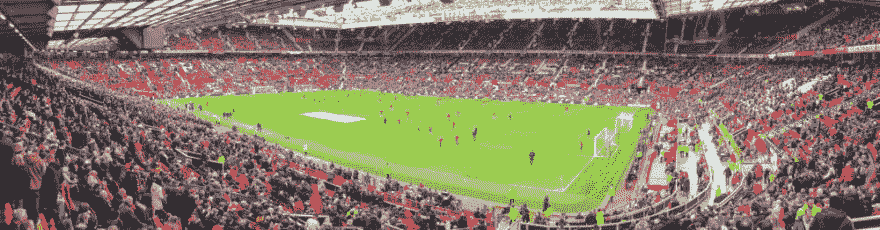
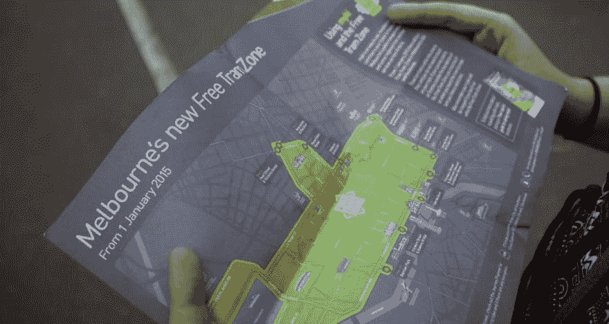
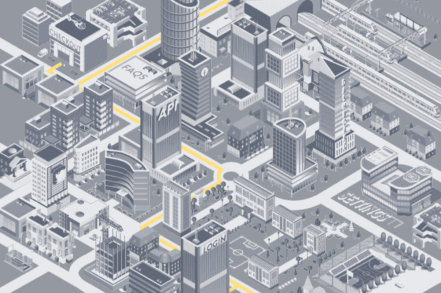

# 您的 web 应用程序应该像城市一样设计。

> 原文：<https://dev.to/steadfast/your-web-applications-should-be-designed-like-cities-4pa2>

最近，Steadfast Collective 的董事总经理 Pete 去看了他第一次支持圣徒队的客场比赛，之后，他学到了关于用户体验的宝贵一课，以及我们如何将它应用到我们的网络应用和数字产品的构建中:

我从事网络应用已经很多年了；项目范围从利基内部数字产品到拥有超过 1100 万用户的全球数字应用。

> 几周前，我在曼彻斯特遇到了现实生活中的 UX 问题，这让我进一步思考我们应该如何构建自己的应用程序。

这是曼彻斯特灰暗的一天，我们刚刚在老特拉福德看了南安普顿 2-3 输给曼联。

当我们离开体育场，我们前往最近的电车站，在那里迎接我们的是两个队列，路标上写着“需要票”和“有票”。

这感觉非常有效，我有点印象深刻。我们进入“需要门票”的队列，耐心地等待着，注意到一些人回头，涉水穿过红色足球球衣的海洋。

当我们最终排到队伍的最前面时，我们发现了原因。只收现金。

我们在英国的第三大城市，去了离他们最大的公共场所最近的电车站，结果排队发现那里只收现金。不仅如此，你还得等上相当长的一段时间，才排到了队伍的前面，发现你的银行卡在这里插不进去。

对所有当地人来说，这不是问题。他们已经习惯了。这种怪癖他们可能会遇到很多次，并提前做好准备。作为一名游客，这是我始料未及的。如果我们在数字世界，谷歌分析会记录这一转换失败。

> Web 应用程序应该设计成接待大量游客的城市。

所有城市都有自己的怪癖:墨尔本有免费的电车系统。在纽约，渡船便宜得令人难以置信。在伦敦，你可以用你的非接触式卡作为地铁票。

*(作为旁注，墨尔本周边的免费电车系统让我想再去一次。在一个你不了解的城市里，免费的交通工具可以将游客的压力降低五倍。)*

我们的网络应用反映了城市生态系统的个性，我们需要更好地为游客提供服务。

### 让我给你举一个现实生活中 web 应用程序怪癖的例子:

Buffer 是一家价值 6000 万美元的社交媒体管理公司，它有一个怪癖，多年来我们一直在与 Steadfast Collective 打交道。LinkedIn 有一个有限的授权期；已经 60 天了。所以每隔 60 天，我们就要重新连接 LinkedIn 账号进行缓冲。

然而，要做到这一点，我必须前往 LinkedIn，从“合作伙伴和服务”设置中删除 Buffer，然后返回 Buffer 重新连接。感觉很疯狂。你可以在这里阅读更多关于这个过程的信息[。](https://faq.buffer.com/article/294-publish-reconnect-social-account#reauthorize-linkedin)

当我们开发一个新的网络应用程序，Social Handler——特许经营的社会管理应用程序时，我们遇到了同样的问题。

我们在 Laravel 和 Vue.js 中构建了这个应用程序，无缝连接到脸书、Twitter 和 LinkedIn，充当特许经营者和加盟商的社交分发平台。我们与 API 合作创建了一个按钮，在 60 天后，用户可以在应用程序中无缝地重新连接到 LinkedIn，从而避免了操作指南和复杂的流程。

当我们把应用程序的用户想成游客时，我们就可以开始做出设计决策，让用户体验对每个人都更好；旧的还是新的。

### 那么实际上，作为设计师和开发者，我们该如何更好地学习做这件事呢？

1.  和用户对话。他们最大的痛点是什么？如何才能简单高效地解决这个问题？
2.  采用“游客至上”的设计方法。以一种通过你的 web 应用程序通知和指导某人的方式来设计和构建。不要让他们填写一张巨大的表格，到头来却发现只有“现金”(或者更可能是贝宝)。
3.  停下来。复习。走吧。当你在一个长期项目上工作时，这个项目正处于第 12 阶段，通常你需要停下来，回顾一下情况，然后离开。

一个小障碍对用户是坚持使用你的应用程序还是离开去其他地方的影响程度是惊人的。带领他们游览你的城市，向他们展示沿途的最佳景点，他们很可能会一次又一次地回来。

#### 如果说我从在曼彻斯特的经历中学到了什么，那就是从简单开始，从局外人的角度考虑一切，然后围绕用户流构建基础设施。

你的网络应用程序应该设计得像城市一样。最早出现在[踏踏实实的集体](https://steadfastcollective.com)。