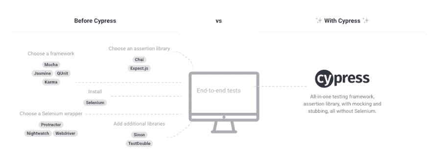
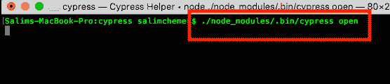
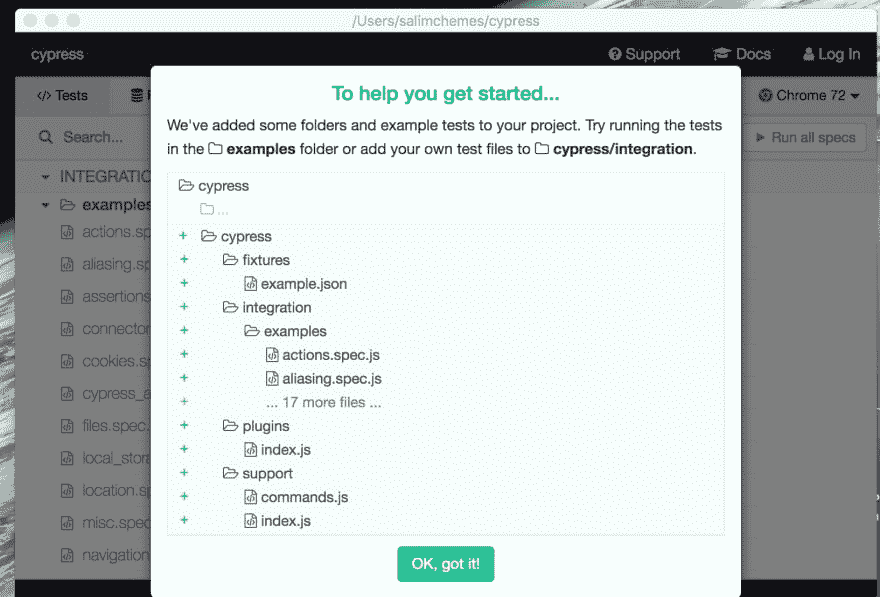
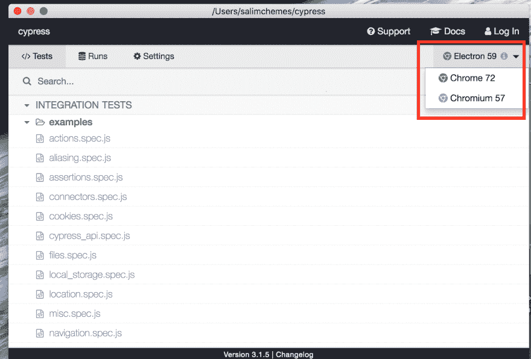
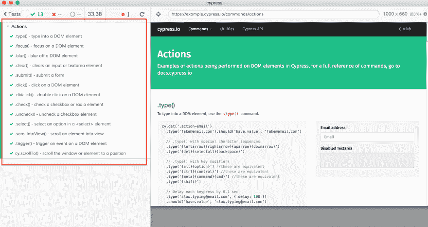
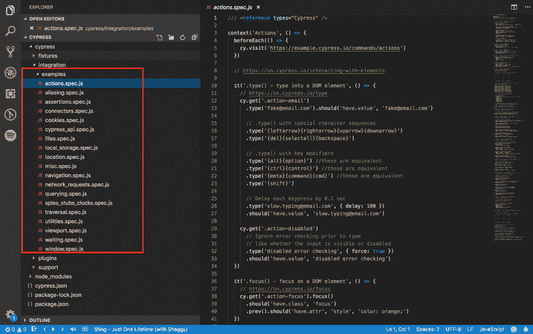
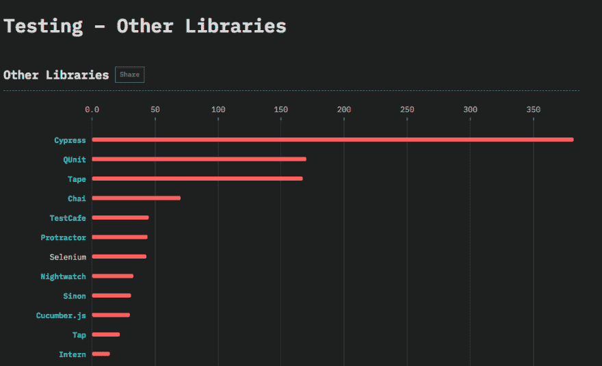

# e2e 使用 cypress.io 的体验

> 原文：<https://dev.to/salimchemes/e2e-experience-with-cypressio-1i75>

我曾经在一个项目中工作，我们必须实现自动化测试。

由于我们验证场景的复杂性(不是简单的 UI)，我们的发布变得非常脆弱，我们遇到了一些生产问题。

为了解决这个问题，我们的团队创建了一个自动化测试计划。基本上，我们列出了最关键的场景。

一旦我们准备好了列表，就该讨论使用哪种技术了。我们决定试试 [cypress.io](https://www.cypress.io/)

Cypress 是一个 javascript 端到端框架测试。它有自己的架构，不使用 Selenium，它有一些我们通常独立使用的现有技术的包装。【cypress 背后是一个 Node.js 服务器进程。Cypress 和 Node.js 进程不断地相互通信、同步和执行任务。

这张图片来自 cypress 网站，很好地解释了它是如何工作的。

[](https://res.cloudinary.com/practicaldev/image/fetch/s--1mSv1wbQ--/c_limit%2Cf_auto%2Cfl_progressive%2Cq_auto%2Cw_880/https://firebasestorage.googleapis.com/v0/b/lawyer-f1b6d.appspot.com/o/Screen%2520Shot%25202019-03-10%2520at%25208.01.53%2520PM.png%3Falt%3Dmedia%26token%3D63946648-fd7e-429e-aa49-4ec81f61179a)

回到我们的故事，我们从 cypress 开始，我们知道它不包括 IE 支持。尽管如此，我们还是试了一下。

Cypress 测试是用 javascript 编写的，也有 jquery 选择器来轻松识别 DOM 元素。这意味着拥有 web 开发人员技能就足以编写测试。

因为它是基于承诺的，所以您不必关心等待、延迟或任何种类的手动实现，您所需要的只是承诺回调(大多数情况下在方法内部处理)

此外，有一个非常酷的电子应用程序来运行测试。文档是最好的部分之一，有很好的例子解释。

所以最后，我们编写了测试计划中定义的所有测试，然后将它们包含到我们的管道(Azure)中。测试非常稳定，我们也能够防止一些生产问题，感谢他们。我们相信我们的测试。

那么，让我们来看看 cypress scaffolding 提供的一个例子
我们需要做的第一件事是**(确保你的项目路径中有一个 package.json 文件)**:

```
cd /your/project/path

npm i cypress --save-dev

./node_modules/.bin/cypress open 
```

Enter fullscreen mode Exit fullscreen mode

[](https://res.cloudinary.com/practicaldev/image/fetch/s--eFRQN_F---/c_limit%2Cf_auto%2Cfl_progressive%2Cq_auto%2Cw_880/https://firebasestorage.googleapis.com/v0/b/lawyer-f1b6d.appspot.com/o/Screen%2520Shot%25202019-03-10%2520at%25206.47.42%2520PM.png%3Falt%3Dmedia%26token%3Dc3e30342-a165-477e-8dac-d5505840a3ec)

电子应用程序将会启动，您将会看到 cypress scaffolding 提供的示例中的所有测试:

[](https://res.cloudinary.com/practicaldev/image/fetch/s--fzciNlmF--/c_limit%2Cf_auto%2Cfl_progressive%2Cq_auto%2Cw_880/https://firebasestorage.googleapis.com/v0/b/lawyer-f1b6d.appspot.com/o/Screen%2520Shot%25202019-03-10%2520at%25206.50.55%2520PM.png%3Falt%3Dmedia%26token%3D2ff71c09-a6ed-48f6-9520-ee26e4d34d29)

您可以选择是否要在铬、铬或电子上运行测试
[](https://res.cloudinary.com/practicaldev/image/fetch/s--NZynYu11--/c_limit%2Cf_auto%2Cfl_progressive%2Cq_auto%2Cw_880/https://firebasestorage.googleapis.com/v0/b/lawyer-f1b6d.appspot.com/o/Screen%2520Shot%25202019-03-10%2520at%25206.52.49%2520PM.png%3Falt%3Dmedia%26token%3D7012fcce-c670-4c31-b0ab-0c15091db6ca)

单击任何测试后，您将在左侧看到日志，在右侧看到经过测试的网站。如果出现问题，您将能够查看日志来识别并修复代码中的问题。点击“运行所有规格”按钮，您可以运行所有测试。此外，您可以作为 headless 运行，并将能够获得一个视频作为测试结果(您可以在 cypress.json 文件上配置它)

[](https://res.cloudinary.com/practicaldev/image/fetch/s--4_SGRley--/c_limit%2Cf_auto%2Cfl_progressive%2Cq_auto%2Cw_880/https://firebasestorage.googleapis.com/v0/b/lawyer-f1b6d.appspot.com/o/Screen%2520Shot%25202019-03-10%2520at%25207.05.38%2520PM.png%3Falt%3Dmedia%26token%3D7a06b957-92fc-4a31-bf51-8653b337c1c6)

这个框架很灵活，你可以做不同的实现，比如创建你自己的 cypress 命令(在 support 文件夹下有一个 command.js 文件来完成这个任务)或者改变视窗大小。看一看作为例子提供的测试，您会发现几个场景。

现在，让我们来看看测试。这些是提供的示例。如果你熟悉 jasmine、mocha、chai 等框架，你将能够快速编写测试。你可以复习这些例子，并和它们一起玩。

[](https://res.cloudinary.com/practicaldev/image/fetch/s--YRGgnubG--/c_limit%2Cf_auto%2Cfl_progressive%2Cq_auto%2Cw_880/https://firebasestorage.googleapis.com/v0/b/lawyer-f1b6d.appspot.com/o/Screen%2520Shot%25202019-03-10%2520at%252010.45.46%2520PM.png%3Falt%3Dmedia%26token%3Dd99a92ef-8e96-4c31-8c36-d9ed854182ba)

一旦你写好了测试，你可以用命令 **cypress run** 以不同的方式运行它们(headless，browser，等等)。点击[这里](https://docs.cypress.io/guides/guides/module-api.html#cypress-run)查看选项

**CI 集成**:我们已经在 Azure devo PS(VSTS 除外)上实现了我们的测试运行，你会在这里[找到你需要的几个例子](https://docs.cypress.io/guides/guides/continuous-integration.html#Examples)

让我们回顾一下赛普拉斯的经历

**精彩部分**

*   基于 100%的 js 和承诺
*   性能非常好
*   web 开发人员易于学习和实现
*   文件是清楚的
*   非常稳定
*   酷电子应用程序运行测试和仪表板

**不太好的部分**

*   只支持 chrome，chromium，canary 和 electronic(他们可能会修复这个问题[查看 ie 的 github 问题](https://github.com/cypress-io/cypress/issues/1564))。**如果你需要支持其他浏览器，在启动前知道这一点很重要**

此外，柏树今天变得非常受欢迎。这是去年 js [调查](https://2018.stateofjs.com/testing/other-libraries/)的一部分(2018 年，2 万名开发人员参与)

[](https://res.cloudinary.com/practicaldev/image/fetch/s--JIAkhtQR--/c_limit%2Cf_auto%2Cfl_progressive%2Cq_auto%2Cw_880/https://firebasestorage.googleapis.com/v0/b/lawyer-f1b6d.appspot.com/o/Screen%2520Shot%25202019-03-10%2520at%25207.37.44%2520PM.png%3Falt%3Dmedia%26token%3D3c7f98ec-5732-4434-8132-843e53caee49)

这是[结论](https://2018.stateofjs.com/testing/conclusion/)的一部分

“测试的未来可能包括更多在浏览器中进行自动化测试的解决方案，像 Cypress 这样的项目可能会被纳入明年的调查，我们可能会看到更多基于木偶师的工具。”

**结论** :
实施 cypress 后，结果是积极的。我们觉得我们可以信任我们的测试，并且我们对我们添加的每一个变化都有更好的覆盖率。
如果你不得不开始一个 e2e 测试实现，我建议试试 cypress。所有的需求都有不同的方面需要分析来做决定，所以至少要记住还有其他的选择要考虑。

参考资料[柏树网站](https://cypress.io)