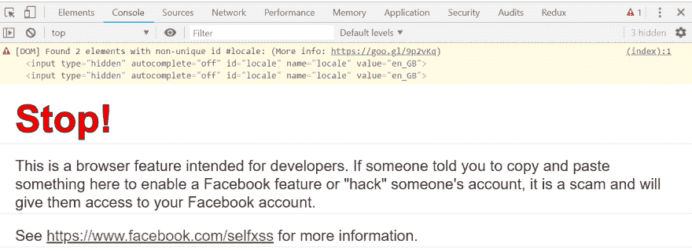
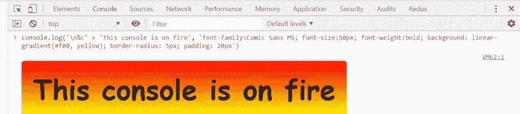

# 漂亮的 JavaScript 控制台消息

> 原文：<https://dev.to/aaronpowell/pretty-javascript-console-3epj>

[](https://res.cloudinary.com/practicaldev/image/fetch/s--csoh0E4P--/c_limit%2Cf_auto%2Cfl_progressive%2Cq_auto%2Cw_880/https://www.aaron-powell.cimg/pretty-javascript-console/facebook.png)

如果你曾经在登录脸书的时候打开过你的浏览器工具，你可能会注意到上面的内容(至少，在我写这篇文章的时候是这样的)。

抛开 DOM 警告不谈，它看起来与您可能生成的大多数`console.log`消息有些不同，不是吗？一大段红色文本和一些稍大的文本。这有点奇怪，不是吗？

因为`console`函数有许多格式选项，所以如果你想显示数字到特定的小数位，你可以像这样使用`%.#f`:

```
console.log('Pi to 5 decimal places: %.5f', Math.PI); 
```

Enter fullscreen mode Exit fullscreen mode

但是这只适用于火狐浏览器。

如果您想指定对象出现在日志消息中的位置，您可以使用`%O` :

```
console.log('We found an object, %O, in the system', { foo: 'bar' }); 
```

Enter fullscreen mode Exit fullscreen mode

不过这样也好，我们怎么做**大红色文字**！

为此，我们将使用`%c`格式化程序在字符串中的某一点应用 CSS:

```
console.log('%cR%ca%ci%cn%cb%co%cw', 'font-size: 20px; color: blue;', 'font-size: 25px; color: lightblue;', 'font-size: 30px; color: lightgreen;', 'font-size: 35px; color: green', 'font-size: 30px; color: yellow;', 'font-size: 25px; color: orange', 'font-size: 20px; color: red') 
```

Enter fullscreen mode Exit fullscreen mode

用`%c`你提供一串 CSS 规则，这些规则将一直应用到记录的消息的末尾*或*找到另一个`%c`。这意味着你可以像上面一样创建可爱的彩虹效果，一路上操纵每个元素。或者，如果你想让**真正具有冒险精神，你可以这样做:**

[](https://res.cloudinary.com/practicaldev/image/fetch/s--q971rZEB--/c_limit%2Cf_auto%2Cfl_progressive%2Cq_auto%2Cw_880/https://www.aaron-powell.cimg/pretty-javascript-console/one-fine-console.png)T3】

```
console.log('%c' + 'This console is on fire', 'font-family:Comic Sans MS; font-size:50px; font-weight:bold; background: linear-gradient(#f00, yellow); border-radius: 5px; padding: 20px') 
```

Enter fullscreen mode Exit fullscreen mode

是的，我们正在为文本设置渐变背景，并添加一些填充和圆角！

现在你不能使用 CSS 的所有方面(例如，我还没能弄清楚你是否能做动画),并且它不是*过度*有用。但是，嘿，这很有趣，不是吗！😉