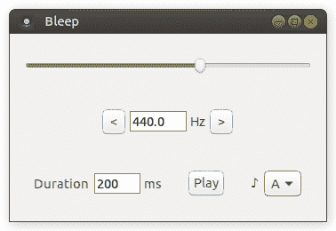
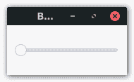

# 通过实例学习球拍:GUI 编程

> 原文：<https://dev.to/goober99/learn-racket-by-example-gui-programming-3epm>

本教程于 2021 年 1 月 10 日更新，使用球拍产生音调，而不是仅仅包装一个控制 PC 扬声器的 Linux 专用命令行程序 beep。现在应该可以在 Racket 支持的任何操作系统上遵循这个教程了。本教程也可以在 [GitHub repo](https://github.com/goober99/lisp-gui-examples/blob/master/examples/racket/tutorial.md) 中找到，并附有示例代码。欢迎提出改进示例和教程的请求。

球拍是 Lisp 的一种类似 Scheme 的方言，它内置了一个强大的跨平台 GUI 库。与其构建另一个计算器，不如让我们构建一个 GUI 来生成音调。

[](https://res.cloudinary.com/practicaldev/image/fetch/s--Gl41naqL--/c_limit%2Cf_auto%2Cfl_progressive%2Cq_auto%2Cw_880/https://raw.githubusercontent.com/goober99/lisp-gui-examples/master/screenshots/racket.png)

当然，你需要安装球拍。它可以在大多数 Linux 发行版的仓库中获得，所以只需从发行版的仓库中安装它。然后你就可以开始了。

```
#lang racket

(require racket/gui) 
```

Enter fullscreen mode Exit fullscreen mode

球拍的优势之一是内置库的数量。我们将使用球拍/图形用户界面库。

```
; Main window
(define frame (new frame% [label "Bleep"]))

; Display GUI
(send frame show #t) 
```

Enter fullscreen mode Exit fullscreen mode

球拍的 GUI 库是面向对象的。通过实例化`frame%`类来创建一个窗口。以百分号结尾的标识符是 Racket 对类的命名约定。您通过调用它的`show`方法来显示窗口。现在让我们在创建窗口和显示窗口之间添加一些额外的小部件。

```
(define slider (new slider% [label #f]
                            [min-value 20]
                            [max-value 20000]
                            [parent frame]
                            [init-value 440]
                            [style '(horizontal plain)]
                            [vert-margin 25]
                            [horiz-margin 10])) 
```

Enter fullscreen mode Exit fullscreen mode

人类可听到的频率范围通常在 20 赫兹到 20 千赫兹之间(随着年龄的增长，我们失去了听到一些更高频率的能力)。中 C 上方的[音符 A](https://en.wikipedia.org/wiki/A440_(pitch_standard))为 440 Hz。由于 A4 是一个通用的调音标准，它似乎是一个明智的默认设置，但如果你在球拍上运行以上，你会看到:

[](https://res.cloudinary.com/practicaldev/image/fetch/s--h_ZF50tD--/c_limit%2Cf_auto%2Cfl_progressive%2Cq_auto%2Cw_880/https://raw.githubusercontent.com/goober99/lisp-gui-examples/master/screenshots/racket-linearslider.png)

20 到 20，000 的比例太大了，440 看起来根本不会移动滑块。理想情况下，440 将落在滑块的中间。为了做到这一点，让我们使用对数标度。

我找到了一个关于如何将滑块映射到对数刻度的[堆栈溢出答案](https://stackoverflow.com/questions/846221/logarithmic-slider/846249#846249)。答案中给出的代码是 JavaScript，但是移植到球拍上很容易。

```
; Scale used by slider
(define *min-position* 0)
(define *max-position* 2000)
; Range of frequencies
(define *min-frequency* 20)
(define *max-frequency* 20000)

; Logarithmic scale for frequency (so middle A [440] falls about in the middle)
; Adapted from https://stackoverflow.com/questions/846221/logarithmic-slider

(define min-freq (log *min-frequency*))
(define max-freq (log *max-frequency*))
(define frequency-scale (/ (- max-freq min-freq) (- *max-position* *min-position*)))
; Convert slider position to frequency
(define (position->frequency position)
  (inexact->exact (round (exp (+ min-freq (* frequency-scale (- position *min-position*)))))))
; Convert frequency to slider position
(define (frequency->position freq)
  (inexact->exact (round (/ (- (log freq) min-freq) (+ frequency-scale *min-position*))))) 
```

Enter fullscreen mode Exit fullscreen mode

我在脚本的顶部添加了一些全局参数。变量名`*min-position*`只是全局参数的 Lisp 命名约定。我通过反复试验得出了 0-2000 的范围。它似乎在滑块的每一步之间取得了最佳平衡，使频率发生显著变化，同时仍允许用户仅通过滑块缩小特定频率。

然后我们创建两个函数:一个获取滑块上的位置并返回频率(`position->frequency`)，另一个获取频率并返回滑块上的位置(`frequency-position`)。现在让我们修改我们的`slider%`，使用`frequency->position`将`init-value`转换为使用对数刻度的滑块位置。

```
(define slider (new slider% [label #f]
                            [min-value *min-position*]
                            [max-value *max-position*]
                            [parent frame]
                            [init-value (frequency->position 440)]
                            [style '(horizontal plain)]
                            [vert-margin 25]
                            [horiz-margin 10])) 
```

Enter fullscreen mode Exit fullscreen mode

滑块下方是显示当前频率的文本栏和将频率增加/降低一个八度的按钮。

```
(define frequency-pane (new horizontal-pane% [parent frame]
                                             [border 10]
                                             [alignment '(center center)]))
(define lower-button (new button% [parent frequency-pane]
                                  [label "<"]))
(define frequency-field (new text-field% [label #f]
                                         [parent frequency-pane]
                                         [init-value "440"]
                                         [min-width 64]
                                         [stretchable-width #f]))
(define frequency-label (new message% [parent frequency-pane] [label "Hz"]))
(define higher-button (new button% [parent frequency-pane]
                                   [label ">"])) 
```

Enter fullscreen mode Exit fullscreen mode

`horizontal-pane%`是一个帮助布局的不可见小部件。在这一点上，我们开始有一个好看的界面，但它没有做任何事情。如果您点按按钮或滑动滑块，什么都不会发生。小部件类接受一个`callback`参数，该参数将小部件连接到一个函数。如果我们向滑块添加一个回调函数，那么每次移动滑块时都会调用这个函数。

```
; Link slider to text field display of frequency
(define (adjust-frequency widget event)
  (send frequency-field set-value
    (~a (position->frequency (send widget get-value)))))
(define (adjust-slider entry event)
  (define new-freq (string->number (send entry get-value)))
  (send slider set-value
    (frequency->position (if new-freq new-freq *min-frequency*)))) 
```

Enter fullscreen mode Exit fullscreen mode

回调函数有两个参数:第一个是调用它的对象的实例，第二个是事件类型。`text-field%`需要一个字符串，所以我们必须将`position->frequency`返回的数字转换成一个带有`~a`的字符串。接下来要做的就是将这些功能绑定到小部件上:

```
(define slider (new slider% [label #f]
                            ...
                            [callback adjust-frequency]
                            ...))
...
(define frequency-field (new text-field% [label #f]
                                         ...
                                         [callback adjust-slider]
                                         ...)) 
```

Enter fullscreen mode Exit fullscreen mode

将按钮连接到名为`decrease-octave`和`increase-octave`的回调函数。一个[八度音程](https://en.wikipedia.org/wiki/Octave)是“一个音高和另一个两倍频率的音高之间的间隔”

```
; Set frequency slider and display
(define (set-frequency freq)
  (send slider set-value (frequency->position freq))
  (send frequency-field set-value (~a freq)))

; Buttons increase and decrease frequency by one octave
(define (adjust-octave modifier)
  (set-frequency (* (string->number (send frequency-field get-value)) modifier)))
(define (decrease-octave button event) (adjust-octave 0.5))
(define (increase-octave button event) (adjust-octave 2)) 
```

Enter fullscreen mode Exit fullscreen mode

如果滑动滑块，文本栏会相应更新。如果您在文本栏中键入一个数字，滑块会相应地更新。一切都好，对吧？如果用户(你知道他们会)输入一个高于 20，000 的数字或一个字母会怎么样？

球拍附带的小部件非常基本，但是我们可以扩展内置小部件的类来创建定制的小部件。让我们扩展`text-field%`类来创建一个新的`number-field%`类。这个类将有两个额外的 init 变量，它们指定了一个`min-value`和`max-value`，并且只允许该范围内的数字。

```
; Extend the text-field% class to validate data when field loses focus. Field
; should contain only numbers within allowed range. Otherwise, set to min.
(define number-field%
  (class text-field%
    ; Add init variables to define allowed range
    (init min-value max-value)
    (define min-allowed min-value)
    (define max-allowed max-value)
    (super-new)
    (define/override (on-focus on?)
      (unless on?
        (define current-value (string->number (send this get-value)))
        (unless (and current-value
                     (>= current-value min-allowed)
                     (<= current-value max-allowed))
          (send this set-value (~a min-allowed))
          ; Also reset slider position to make sure it still matches display
          (send slider set-value (string->number (send frequency-field get-value)))))))) 
```

Enter fullscreen mode Exit fullscreen mode

然后我们可以用一个`number-field%`代替我们的`text-field%`。

```
(define frequency-field (new number-field% [label #f]
                                           [parent frequency-pane]
                                           [min-value *min-frequency*]
                                           [max-value *max-frequency*]
                                           [callback adjust-slider]
                                           [init-value "440"]
                                           [min-width 64]
                                           [stretchable-width #f])) 
```

Enter fullscreen mode Exit fullscreen mode

让我们再次使用这个`number-field%`来创建一个字段，以毫秒为单位指定哔哔声的持续时间:

```
(define control-pane (new horizontal-pane% [parent frame]
                                           [border 25]
                                           [spacing 25]))
(define duration-pane (new horizontal-pane% [parent control-pane]))
(define duration-field (new number-field% [label "Duration "]
                                          [parent duration-pane]
                                          [min-value 1]
                                          [max-value 600000] ; 10 minutes
                                          [init-value "200"]
                                          [min-width 120])) 
```

Enter fullscreen mode Exit fullscreen mode

频率比较抽象。让我们也给用户选择音符的能力。我们可以将 A4-G4 的相应频率存储在哈希表中。

```
; Notes -> frequency (middle A-G [A4-G4])
; http://pages.mtu.edu/~suits/notefreqs.html
(define notes (hash "A" 440.00
                    "B" 493.88
                    "C" 261.63
                    "D" 293.66
                    "E" 329.63
                    "F" 349.23
                    "G" 292.00)) 
```

Enter fullscreen mode Exit fullscreen mode

我们将给用户一个下拉菜单。每当从下拉菜单中选择一个音符时，我们将在散列表中查找频率，并使用我们为八度音阶按钮创建的`set-frequency`辅助函数来设置它。

```
; Set frequency to specific note
(define (set-note choice event)
  (set-frequency (hash-ref notes (send choice get-string-selection))))
(define note (new choice% [label "♪ "]
                          [choices '("A" "B" "C" "D" "E" "F" "G")]
                          [parent control-pane]
                          [callback set-note])) 
```

Enter fullscreen mode Exit fullscreen mode

最后，让我们制造一些噪音。

```
(require rsound)

; Generate a tone using RSound
; Explicitly set RSound sample rate in case differs by platform/version
(default-sample-rate 44100)
(define (generate-tone button event)
  (play (make-tone (string->number (send frequency-field get-value))
                   0.5
                   ; Duration in samples at sample rate of 44.1 kHz
                   (inexact->exact (* 44.1 (string->number (send duration-field get-value))))))) 
```

Enter fullscreen mode Exit fullscreen mode

我们将使用球拍[声音](https://docs.racket-lang.org/rsound/index.html)包来产生音调。这个包没有和球拍捆绑在一起，但是你可以用球拍自带的`raco`工具(`raco pkg install rsound`)来安装。将它连接到持续时间和音符选择器之间的一个按钮上，你就可以制造一些噪音了。

```
(define play-button (new button% [parent control-pane]
                                 [label "Play"]
                                 [callback generate-tone])) 
```

Enter fullscreen mode Exit fullscreen mode

你可以在 GitHub 上查看整个例子。这开始是一个个人学习项目，探索 Lisp 中 GUI 编程的状态，现在已经成为一系列关于用各种 Lisp 方言构建 GUI 的教程。