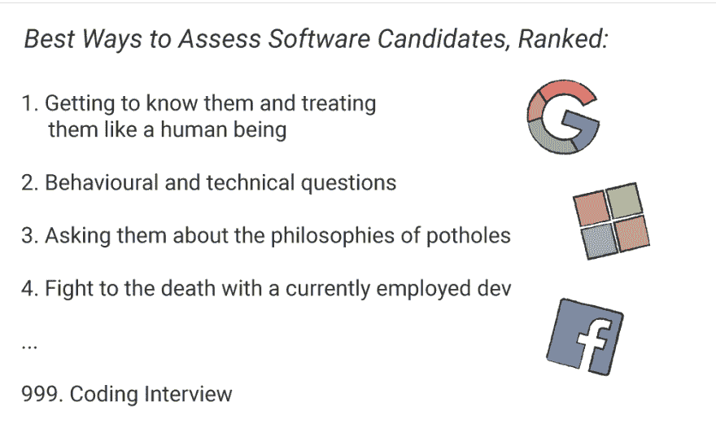
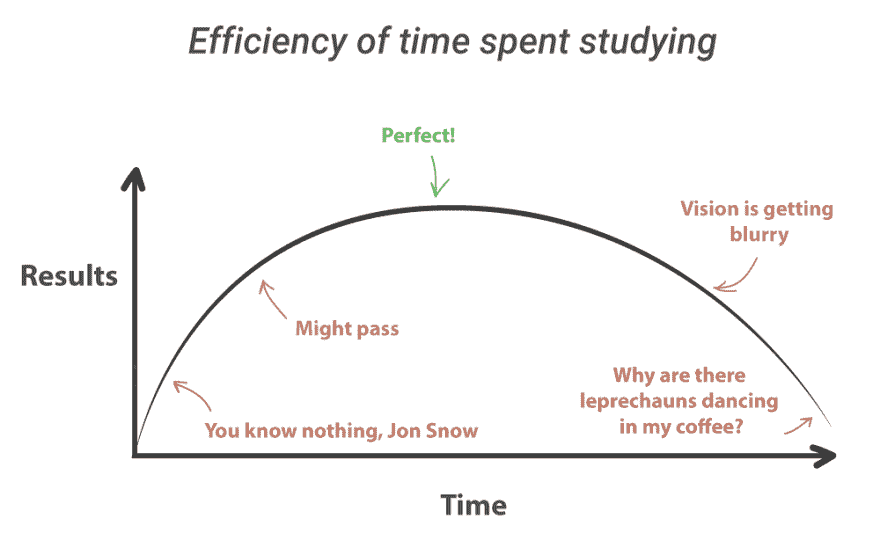
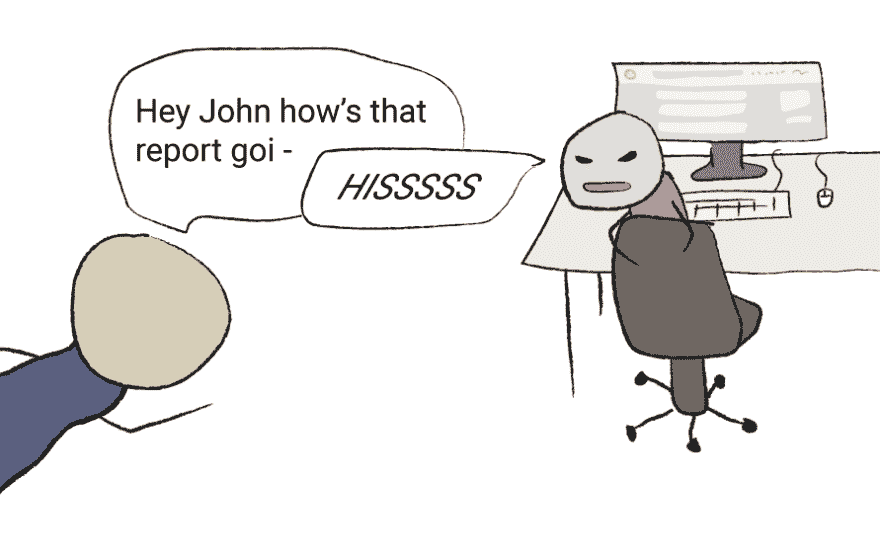

# 编写面试代码的快速技巧

> 原文：<https://dev.to/ctrlshifti/quick-tips-for-coding-interviews-jhb>

编码面试烂透了。我经历了很多，包括微软的一些，我可以自信地说:我讨厌它们，我认为它们是个糟糕的主意。不幸的是，他们不会很快离开，如果你在这里，你可能很快就会有一个。以下是如何生存下来！

#### 1 -做好准备

请务必复习第一年的所有 compsci 知识。许多编码面试，特别是以我的经验来看，微软的面试，都希望看到你展示排序算法、二叉树操作、递归、链表等方面的知识。你知道-所有那些你几年前讲过然后又忘了的无聊的东西。

上 [HackerRank](https://www.hackerrank.com/) 开始做一些挑战，并确保你选择一种语言作为重点，这样你就不会在面试中弄乱你的语法。我使用 Python，因为它很容易写，大多数面试官应该会接受它。

除此之外，仔细阅读理论概念，如[大 O 复杂性](http://bigocheatsheet.com/)，因为面试官经常会问这方面的问题。
T3】

#### 2 -不要准备过度

是的——这是可能的，而且和准备不足一样糟糕。我把这定义为一周花超过 40 小时学习，但是 YMMV。有三个关键原因让你不应该过度准备编码面试。

**原因 1:长时间过于刻苦学习效率低下**。研究表明，你的大脑需要休息来促进记忆的保持。在某个点上，学习不再对你有帮助，它看起来有点像这样:

而不是为你的编码面试而死记硬背(如果还不算太晚的话！)每天练几个小时就行了，大概提前一周左右。你会学得更好，而且这也不再是一件苦差事。

**原因二:你冒着迷惑自己或惊慌失措的风险中途提问**。如果你脑子里塞满了太多的信息，你会发现很难在你最需要的时候找出真正重要的东西。更糟糕的是，你准备得越多，你就越会在心里建立起这将会很困难的预期。你会给自己压力，如果你和我一样，你会在面试中更加恐慌。

**原因三:你会看起来很假，你会觉得很假**。当你为面试准备过度时，经理会看出来。如果你的答案过于排练，他们会知道你已经记住了答案，他们就不太可能信任你。同样的，你也会觉得自己是假的。你将从编码中吸取乐趣(记住你为什么要这样做！)你会对自己和自己的能力失去信心。编码面试糟透了——不要在准备过程中过度折磨自己，让面试变得更糟。
T13】

#### 3 -人际交往能力仍然很重要！

你不能逃避它。即使在编码面试中，经理们也希望看到你有良好的沟通技巧，并且你有能力在团队中工作。你可以成为世界上最好的程序员，但是如果与他人互动的想法让你退缩到你的 Vim 设置中——你不会在面试中做得很好。

不幸的是，改善这一点需要经验。经常参加社交活动和公司面试会让你走上正轨。去像 Meetup.com 这样的地方参加社交活动，在那里你可以练习在专业环境中交流。
T3】

#### 4 -记住你有价值

这是一个重要但经常被忽视的提示。记住，不仅仅是公司在面试你，你也在面试他们。从现在开始，每天直到面试——告诉自己*你正在面试他们*。在面试过程中，每当你感到焦虑的时候，记住这句话。

你会有一种更随意、更自信的态度，这会让你从其他候选人中脱颖而出。这需要一些时间，但这是让我从绝望地乞求公司给我工作，到得到多个邀请并选择我想和谁一起工作的主要原因。这需要练习，刚开始可能会觉得奇怪，但是试一试，看看它有没有回报！

*此文最初发表于[explainhownow.com](https://www.explainhownow.com)T3】*