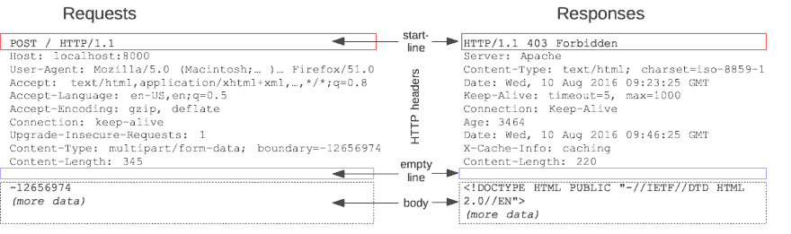

# 用 WebSockets 踢屁股和取名字(教程)

> 原文：<https://dev.to/healeycodes/kicking-butt-and-taking-names-with-websockets-javascript-tutorial-171a>

六个多月前，我完成了关于 WebSocket 服务器性能的论文。我有机会在(全球)生产中使用它们，让我告诉你，这项技术太棒了！

#### 过去

互联网的模式是请求->响应。你通过在你的 URL 栏中键入一个地址来发送一个页面请求->然后一个 web 服务器用数据来响应。你发送的信息，和你接收的信息，有一个所谓的*头*，其余的(你在页面上看到的)被称为主体。

[](https://res.cloudinary.com/practicaldev/image/fetch/s--1EmEUSG---/c_limit%2Cf_auto%2Cfl_progressive%2Cq_auto%2Cw_880/https://thepracticaldev.s3.amazonaws.com/i/ca5fgy3kstxsuprsyt04.png)

这些报头包含关于数据传输的关键信息。然而，正如我们将在后面看到的，当我们想要实时处理事情时，这些头和这个请求/响应循环可能会有问题。

#### 当下

我们一直在讨论 HTTP 协议。 *WebSockets* 是指 [WebSocket 协议](https://tools.ietf.org/html/rfc6455)。像`http://`和`https://`一样，我们有`ws://`和`wss://`用于 WebSockets。( *S* 代表安全)。WebSockets 是双向的。这意味着消息可以双向发送。不需要有请求，消息也不需要有响应。一旦建立了连接，您就可以随心所欲地传输数据。(在引擎盖下，这里我们说的是[数据帧](https://developer.mozilla.org/en-US/docs/Web/API/WebSockets_API/Writing_WebSocket_servers#Exchanging_Data_Frames))。

一切都从握手开始。当您在开发人员控制台中键入时，

```
 new WebSocket('ws://example.com:3000'); 
```

发送一个特殊的 HTTP/S 请求。它的特别之处在于，[在其他怪癖](https://developer.mozilla.org/en-US/docs/Web/API/WebSockets_API/Writing_WebSocket_servers#The_WebSocket_Handshake)中，头部包含`Upgrade: WebSocket`和`Connection: Upgrade`。如果服务器接受你的双向婚姻，它会发送回一个带有类似报头的响应，该报头具有相同的两个报头键/值。此时，您将使用的安全性已经协商好了。双方都在说好吧，我们开始吧。

在客户端，打开一个 WebSocket 连接如下所示。

```
const socket = new WebSocket('ws://example.com:3000');

// Print incoming messages to the page
socket.onmessage = (msg) => document.body.innerText += msg;

socket.onclose = (event) => alert('uh oh'); 
```

在服务器上，我们需要监听这些连接。我们将使用 Node.js 的非官方标准 WebSockets 库，简称为 [websockets/ws](https://github.com/websockets/ws) 或 *ws* 。

```
// Include the library
const WebSocket = require('ws');

// Listen 👂
const wss = new WebSocket.Server({ port: 8080 });

// Every time we get a new connection
wss.on('connection', (ws) => {

  // Add a listener to it, log any messages
  ws.on('message', (msg) => {
    console.log('received: %s', msg);
  });

  // After the handshake, say Hi!
  ws.send('howdy');
}); 
```

这项技术为什么有用？这似乎是一种很复杂的传递信息的方式。假设一个金融网站想要显示每两秒钟更新一次的股票行情。在 WebSockets 之前，你必须使用*轮询*。这意味着每 X 秒请求一次新信息，即使信息自上次更新后没有改变。如果不进行频繁的检查，就不可能保持同步。

客户端看起来是这样的。

```
const poller = (time) => {

// Make a request for some JSON (Instead of Fetch, we used to use `XML HttpRequest`!)
fetch('http://example.com/stocks.json')

  // A response will come
  .then((response) => {

    // Parse the data, continue down the chain
    return response.json();
  })
  .then((stockData) => {

    // Pass the fresh data to another function
    updateStocks(stockData);

    // Now, start it all over again - begin polling
    poller(time);
  });
} 
```

这被称为短轮询。还有一种称为长轮询的替代方法，在这种方法中，请求在服务器上保持暂停状态，直到有新数据可用或者请求即将超时，在这种情况下，将发送一个空白响应，然后重新开始循环。对于长轮询，数据以低延迟发送回来，使用的带宽更少——尽管设置起来有点复杂。

对于轮询，每个请求和响应都要消耗处理、内存和带宽——想想每个周期厚厚的报头部分吧！使用 WebSockets，您可以执行握手并等待新信息——这对双方来说使用的处理、内存和带宽都大大减少了！然而，来回传送数据的底层 [TCP](https://en.wikipedia.org/wiki/Transmission_Control_Protocol) 管道并没有完全闲置，这是有原因的。WebSocket 协议允许 pings 和 pongs。这些是心跳，或者说，保活消息。微小的数据帧穿过海底计算机间的黑暗管道，向*问好！我还在这里*。

服务器发出 ping，客户机用 pong 响应(根据规范，尽快地)。Websockets/ws 内置了这一点。连接完成后，您可以随时调用`ws.ping()`。端点返回触发了`pong`事件。你的浏览器的`WebSocket class`会自动这样做。

#### 未来

下次你看到 Twitter 上有新的帖子，想想那些辛勤工作的套接字——以及它们小小的心跳——它们给你带来了这些信息，并向❤️说声谢谢

[@healeycodes](https://twitter.com/healeycodes) 更多科技🖲️的人格化

<sub>【感谢 [PyCon Au](https://2018.pycon-au.org/talks/45211-a-beginners-guide-to-websockets/) 的 logo。]</sub>

* * *

加入我的关于编程和个人成长的[时事通讯](https://buttondown.email/healeycodes)的 150 多人注册！

我发关于科技的微博。